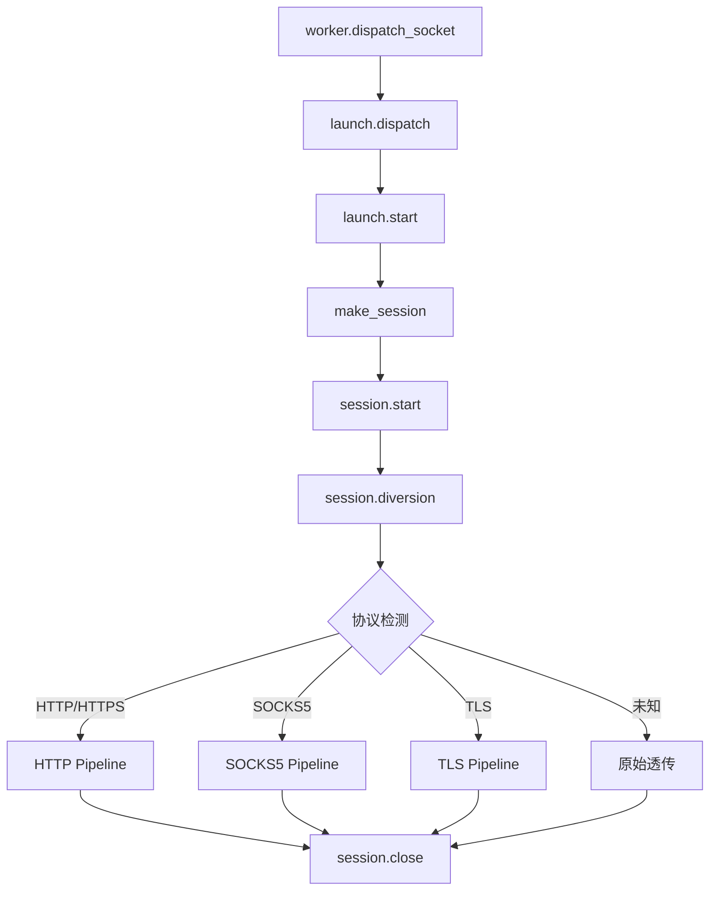

# session 模块

## 源码位置

`I:/code/Prism/include/prism/agent/session/session.hpp`

## 模块职责

连接会话编排模块，负责单个入站连接的完整生命周期管理。会话对象持有入站传输层，执行协议检测后分派到对应管道入口，若无匹配的专用处理路径则回退到原始透传模式。通过 `shared_from_this` 实现异步生命周期管理，确保协程执行期间对象不会被提前销毁。

## 主要组件

### 全局会话 ID 生成

```cpp
namespace detail {
    inline std::atomic<std::uint64_t> session_id_counter{0};
    [[nodiscard]] inline std::uint64_t generate_session_id() noexcept;
}
```

- **session_id_counter**: 全局原子计数器，线程安全
- **generate_session_id()**: 生成新的唯一会话 ID

### session_params 结构体

会话初始化参数集合，封装创建会话所需的所有外部依赖。

| 成员 | 类型 | 说明 |
|------|------|------|
| `server` | `server_context&` | 服务器全局上下文引用 |
| `worker` | `worker_context&` | 工作线程上下文引用 |
| `inbound` | `shared_transmission` | 入站传输层所有权 |

### session 类

代理连接会话管理器，管理单个代理连接的完整生命周期。

#### 状态枚举 (state)

| 值 | 说明 |
|----|------|
| `active` | 活跃状态，正常处理中 |
| `closing` | 正在关闭，已取消底层连接 |
| `closed` | 已关闭，资源已释放 |

#### 核心方法

| 方法 | 说明 |
|------|------|
| `session(params)` | 构造函数，初始化所有核心组件 |
| `~session()` | 析构函数，自动关闭所有关联传输层 |
| `start()` | 启动异步处理流程（协议检测 + 转发） |
| `close()` | 关闭会话并释放资源（幂等） |
| `set_outbound_proxy(proxy)` | 设置出站代理 |
| `set_credential_verifier(verifier)` | 设置用户凭证验证回调 |
| `set_account_directory(directory)` | 设置账户注册表指针（限制连接数） |
| `set_on_closed(callback)` | 设置会话关闭回调 |
| `id()` | 获取会话唯一标识符 |

#### 私有方法

| 方法 | 说明 |
|------|------|
| `diversion()` | 协议分流处理，预读 24 字节识别协议 |
| `release_resources()` | 释放所有资源 |

#### 成员变量

| 变量 | 类型 | 说明 |
|------|------|------|
| `id_` | `std::uint64_t` | 会话唯一标识符 |
| `frame_arena_` | `memory::frame_arena` | 帧内存池 |
| `state_` | `state` | 会话状态 |
| `on_closed_` | `std::function<void()>` | 关闭回调 |
| `ctx_` | `session_context` | 会话上下文 |

### 工厂函数

```cpp
std::shared_ptr<session> make_session(session_params &&params);
```

创建会话对象的工厂函数，确保会话对象始终通过 `shared_ptr` 管理。

## 调用链



## 生命周期管理

采用"先停、再收"模型：

1. `close()` 只负责标记关闭状态、取消底层连接
2. 资源释放在主处理协程退出后或析构时统一进行
3. 避免异步操作访问已释放对象

## 相关文档

- [[core/agent/context|上下文模块]]
- [[core/agent/worker/worker|Worker 模块]]
- [[core/agent/worker/launch|启动模块]]
- [[core/agent/worker/stats|统计模块]]