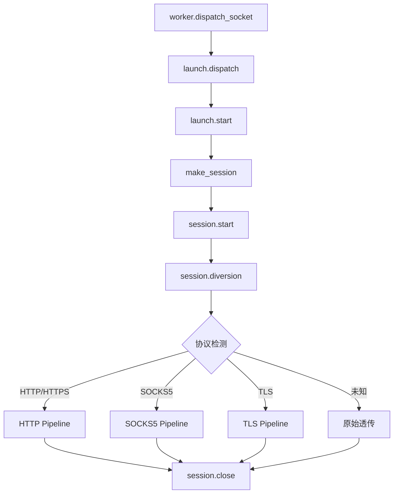

# session 模块

## 源码位置

`I:/code/Prism/include/prism/agent/session/session.hpp`

## 模块职责

连接会话编排模块，负责单个入站连接的完整生命周期管理。会话对象持有入站传输层，执行协议检测后分派到对应管道入口，若无匹配的专用处理路径则回退到原始透传模式。通过 `shared_from_this` 实现异步生命周期管理，确保协程执行期间对象不会被提前销毁。

## 主要组件

### 全局会话 ID 生成

```cpp
namespace detail {
    inline std::atomic<std::uint64_t> session_id_counter{0};
    [[nodiscard]] inline std::uint64_t generate_session_id() noexcept;
}
```

- **session_id_counter**: 全局原子计数器，线程安全
- **generate_session_id()**: 生成新的唯一会话 ID

### session_params 结构体

会话初始化参数集合，封装创建会话所需的所有外部依赖。

| 成员 | 类型 | 说明 |
|------|------|------|
| `server` | `server_context&` | 服务器全局上下文引用 |
| `worker` | `worker_context&` | 工作线程上下文引用 |
| `inbound` | `shared_transmission` | 入站传输层所有权 |

### session 类

代理连接会话管理器，管理单个代理连接的完整生命周期。

#### 状态枚举 (state)

| 值 | 说明 |
|----|------|
| `active` | 活跃状态，正常处理中 |
| `closing` | 正在关闭，已取消底层连接 |
| `closed` | 已关闭，资源已释放 |

#### 核心方法

| 方法 | 说明 |
|------|------|
| `session(params)` | 构造函数，初始化所有核心组件 |
| `~session()` | 析构函数，自动关闭所有关联传输层 |
| `start()` | 启动异步处理流程（协议检测 + 转发） |
| `close()` | 关闭会话并释放资源（幂等） |
| `set_outbound_proxy(proxy)` | 设置出站代理 |
| `set_credential_verifier(verifier)` | 设置用户凭证验证回调 |
| `set_account_directory(directory)` | 设置账户注册表指针（限制连接数） |
| `set_on_closed(callback)` | 设置会话关闭回调 |
| `id()` | 获取会话唯一标识符 |

#### 私有方法

| 方法 | 说明 |
|------|------|
| `diversion()` | 协议分流处理，预读 24 字节识别协议 |
| `release_resources()` | 释放所有资源 |

#### 成员变量

| 变量 | 类型 | 说明 |
|------|------|------|
| `id_` | `std::uint64_t` | 会话唯一标识符 |
| `frame_arena_` | `memory::frame_arena` | 帧内存池 |
| `state_` | `state` | 会话状态 |
| `on_closed_` | `std::function<void()>` | 关闭回调 |
| `ctx_` | `session_context` | 会话上下文 |

### 工厂函数

```cpp
std::shared_ptr<session> make_session(session_params &&params);
```

创建会话对象的工厂函数，确保会话对象始终通过 `shared_ptr` 管理。

## 调用链



## 生命周期管理

采用"先停、再收"模型：

1. `close()` 只负责标记关闭状态、取消底层连接
2. 资源释放在主处理协程退出后或析构时统一进行
3. 避免异步操作访问已释放对象

## 相关文档

- [[core/agent/context|上下文模块]]
- [[core/agent/worker/worker|Worker 模块]]
- [[core/agent/worker/launch|启动模块]]
- [[core/agent/worker/stats|统计模块]]

---

## 生命周期状态机

Session 对象的生命周期由三态状态机驱动，通过原子状态转换确保异步操作期间的安全性。

### 状态转换图

```
                    ┌─────────────────────────────────────────┐
                    │                                         │
                    │    ┌──────────┐                         │
         start() ──►│    │  active  │                         │
                    │    │  活跃处理 │◄────────────────┐      │
                    │    └────┬─────┘                 │      │
                    │         │                        │      │
                    │         │ close() / 异常 / 远端断开│      │
                    │         ▼                        │      │
                    │    ┌──────────┐                 │      │
                    │    │ closing  │                 │      │
                    │    │ 正在关闭  │                 │      │
                    │    └────┬─────┘                 │      │
                    │         │                        │      │
                    │         │ 协程退出 + 资源释放完成 │      │
                    │         ▼                        │      │
                    │    ┌──────────┐                 │      │
                    │    │  closed  │                 │      │
                    │    │ 已关闭   │                 │      │
                    │    └──────────┘                 │      │
                    │                                 │      │
                    └─────────────────────────────────┘      │
```

### 状态转换表

| 从状态 | 到状态 | 触发条件 | 转换动作 | 幂等性 |
|--------|--------|----------|----------|--------|
| `active` | `closing` | 调用 `close()` | 标记状态、调用 `inbound.cancel()` 取消底层 I/O | 是 |
| `active` | `closing` | 入站传输读/写异常 | 异常捕获后自动调用 `close()` | 是 |
| `active` | `closing` | 远端连接关闭（EOF） | 检测到 EOF 后调用 `close()` | 是 |
| `closing` | `closed` | 主处理协程退出 | `diversion()` 协程返回，触发 `release_resources()` | 否 |
| `active` | `closed` | 析构函数直接触发（罕见） | `~session()` 中调用 `close()` 后释放 | 是 |

### 状态转换细节

#### active → closing

```cpp
void close() noexcept {
    // CAS 原子比较交换，仅 active → closing
    state expected = state::active;
    if (!state_.compare_exchange_strong(expected, state::closing)) {
        return; // 已经是 closing 或 closed，幂等返回
    }
    // 取消底层传输层的异步操作
    if (ctx_.inbound) {
        ctx_.inbound->cancel();
    }
}
```

**关键点**：
- `compare_exchange_strong` 确保只有一次线程能成功转换状态
- `cancel()` 使所有挂起的 `async_read`/`async_write` 立即完成（返回 `error::operation_aborted`）
- 不直接释放资源，资源由协程退出后统一释放

#### closing → closed

```cpp
~session() {
    close(); // 确保已进入 closing
    release_resources(); // 释放所有资源
    if (on_closed_) on_closed_(); // 触发关闭回调
}
```

转换路径：`close()` 标记 `closing` → 协程检测到取消信号退出 → 析构函数触发 → `release_resources()` → `on_closed_` 回调

### 并发安全保证

`shared_from_this` 机制确保协程执行期间 session 对象存活：

```
dispatch() ──co_spawn──► 协程持有 shared_ptr<session>
                              │
                              ├── async_read ──► 回调持有 shared_ptr
                              ├── async_write ──► 回调持有 shared_ptr
                              │
                              └── 协程退出 ──► 最后一个 shared_ptr 释放
                                                   │
                                                   ▼
                                              引用计数归零 → ~session()
```

外部调用 `close()` 只标记状态，不持有强引用。协程是最后一个 `shared_ptr` 持有者。

---

## 协程绑定流程

### 协程创建路径

Session 的启动通过 `co_spawn` 将 `diversion()` 协程绑定到 worker 的 `io_context`：

```
worker.dispatch_socket(socket)
    │
    ▼
io_context.post([=]() {          // 任务进入 worker 事件循环
    launch::start(...)
        │
        ▼
    make_session(params)         // 创建 shared_ptr<session>
        │
        ▼
    session.start()
        │
        ▼
    net::co_spawn(               // 协程绑定
        ctx_.worker.io_context,  // executor: worker 的事件循环
        diversion(),             // awaitable: 协议检测协程
        net::detached            // 启动模式: 分离式（无需等待结果）
    )
})
```

### co_spawn 绑定详解

```cpp
void session::start() {
    // 通过 shared_from_this() 确保协程持有 session 强引用
    auto self = shared_from_this();
    net::co_spawn(
        ctx_.worker.io_context,
        [self]() -> net::awaitable<void> {
            co_await self->diversion();
        },
        net::detached
    );
}
```

**绑定要素**：

| 要素 | 值 | 作用 |
|------|-----|------|
| executor | `ctx_.worker.io_context` | 协程的所有异步操作调度到 worker 线程 |
| awaitable | `diversion()` 协程 | 协议检测 + 管道分发的主体逻辑 |
| completion token | `net::detached` | 分离模式：不返回 `awaitable` 句柄，协程自动管理生命周期 |
| capture | `shared_from_this()` | 闭包持有 `shared_ptr<session>`，防止协程执行期间对象销毁 |

### 调度语义

`co_spawn` 的执行流程：

1. 将 `diversion()` 协程包装为一个 `awaitable` 对象
2. 通过 `io_context.post()` 将协程首次恢复任务入队
3. Worker 线程在 `io_context::run()` 循环中取出任务
4. 协程首次执行，进入 `diversion()` 体
5. 遇到 `co_await`（如 `async_read_some`）时，协程挂起，注册完成回调
6. I/O 完成时，回调将协程再次恢复任务入队
7. Worker 线程继续执行，直到协程最终 `co_return` 或被取消

### 启动模式选择

Prism 使用 `net::detached` 而非 `net::use_awaitable` 的原因：

| 模式 | 返回值 | 适用场景 | Prism 选择 |
|------|--------|----------|------------|
| `net::detached` | 无 | 后台任务，不等待结果 | **是** |
| `net::use_awaitable` | `awaitable<void>` | 需要 `co_await` 等待完成 | 否 |
| 回调模式 | 无 | 传统 Asio 回调 | 否 |

选择 `detached` 的理由：
- Session 是独立后台任务，不需要等待其完成
- 生命周期由 `shared_ptr` + 状态机自动管理
- 避免外部持有额外的 `awaitable` 句柄增加复杂度

---

## 协议检测与管道分发流程

### diversion() 协程完整链路

`diversion()` 是 session 的核心协程，负责从入站数据中识别协议类型并分发到对应处理管道。

```
diversion() 协程
    │
    ├── Step 1: 预读 24 字节探针数据
    │       buf = co_await ctx_.inbound->async_read_some(24 bytes)
    │       │
    │       ├── 成功：得到探针数据
    │       └── 失败（EOF/异常）→ close() → 协程退出
    │
    ├── Step 2: 协议特征分析
    │       analyze_probe(buf)
    │       │
    │       ├── HTTP 检测:
    │       │   检查 buf 前缀是否匹配 GET/POST/PUT/DELETE/OPTIONS/HEAD/CONNECT
    │       │   或 HTTP/1.x 响应前缀
    │       │
    │       ├── TLS 检测:
    │       │   检查 buf[0] == 0x16 (TLS Content Type: Handshake)
    │       │   && buf[1] == 0x03 (SSLv3/TLS major version)
    │       │   && buf[2] ∈ {0x00, 0x01, 0x02, 0x03} (minor version)
    │       │
    │       ├── SOCKS5 检测:
    │       │   检查 buf[0] == 0x05 (SOCKS5 version)
    │       │   && buf[1] > 0 (认证方法数 > 0)
    │       │
    │       └── 未知协议:
    │           以上均不匹配 → 原始透传模式
    │
    ├── Step 3: 管道分发
    │       match_protocol_and_dispatch(buf)
    │       │
    │       ├── HTTP → 创建 HTTP pipeline，注入探针数据，进入 HTTP 处理循环
    │       ├── TLS → 创建 TLS pipeline，注入探针数据，进入 TLS 握手 + 处理循环
    │       ├── SOCKS5 → 创建 SOCKS5 pipeline，注入探针数据，进入 SOCKS5 认证循环
    │       └── 未知 → 创建透传 pipeline，注入探针数据，双向转发
    │
    └── Step 4: 管道接管
            pipeline 接管 inbound 传输层
            session.diversion() 协程退出
            pipeline 协程接管后续生命周期
```

### 协议特征检测规则

| 协议 | 检测条件 | 探针偏移 | 典型特征 |
|------|----------|----------|----------|
| HTTP 请求 | `buf[0..3] ∈ {"GET ", "POST", "PUT ", "DELE", "HEAD", "OPTI", "CONN", "PATC"}` | 0 | ASCII 方法名 + 空格 |
| HTTP 响应 | `buf[0..4] == "HTTP/"` | 0 | `HTTP/1.1 200` |
| HTTPS/TLS | `buf[0] == 0x16 && buf[1] == 0x03` | 0 | TLS Handshake Record |
| SOCKS5 | `buf[0] == 0x05 && buf[1] >= 1` | 0 | `0x05 0x01 0x00` |
| 未知 | 以上均不匹配 | - | 原始字节流 |

### 24 字节探针的设计考量

选择 24 字节的原因：

- **HTTP 方法名最长 7 字节**（`OPTIONS`）+ 空格 = 8 字节即可识别
- **TLS 记录头 5 字节**（1 字节类型 + 2 字节版本 + 2 字节长度）
- **SOCKS5 版本 + 方法数 2 字节**
- **24 字节留有余量**，覆盖后续可能的协议特征，同时保持最小预读开销
- 24 字节通常小于 TCP MSS（1460 字节），一次网络读取即可获取

### 管道分发后的资源交接

协议检测完成后，session 不再直接处理数据流：

```
session::diversion() 协程退出
    │
    ▼
pipeline 协程接管:
    ├── 获取 ctx_.inbound 传输层所有权
    ├── 注入预读的 24 字节探针数据（通过缓冲读取器）
    ├── 进入协议特定的处理循环
    │       ├── HTTP: 解析请求 → 路由 → 转发 → 响应
    │       ├── TLS: 握手 → 解密 → 协议检测 → 转发
    │       ├── SOCKS5: 认证 → 地址解析 → 连接 → 转发
    │       └── 透传: 双向 read/write 循环
    └── 连接结束时触发 session.close()
```

---

## 资源释放时序

### 释放顺序（逆初始化顺序）

Session 的资源释放遵循严格的 LIFO（后进先出）顺序，确保依赖关系安全：

```
~session() 析构触发
    │
    ├── Phase 1: 传输层关闭
    │       ctx_.inbound->cancel()     // 取消入站异步操作
    │       ctx_.outbound->cancel()    // 取消出站异步操作（如果有）
    │       │
    │       └── 效果: 所有挂起的 async_read/async_write 返回 operation_aborted
    │
    ├── Phase 2: 协程取消等待
    │       // diversion() 协程检测到 cancel 后退出
    │       // 等待协程自然退出（不强制终止）
    │       │
    │       └── 效果: 协程栈展开，局部变量析构
    │
    ├── Phase 3: 账户租约释放
    │       ctx_.account_lease.~lease()  // 归还连接配额
    │       │
    │       └── 效果: account_directory 的活跃连接计数递减
    │
    ├── Phase 4: 帧内存池回收
    │       frame_arena_.~frame_arena()  // 回收所有帧分配
    │       │
    │       └── 效果: 内存归还到 PMR 内存池
    │
    └── Phase 5: 回调触发
            on_closed_()                 // 通知外部 session 已销毁
            │
            └── 效果: worker.metrics_.session_close() 被调用
```

### 关键时序保证

```
时间线:
    T0: close() 被调用（外部触发或内部异常）
        │
        ├── state_ CAS: active → closing
        └── inbound.cancel() ──► 挂起 I/O 操作立即完成（error = operation_aborted）

    T1: diversion() 协程恢复
        │
        ├── 检测到 cancel 错误码
        │   或 I/O 返回 0 字节（EOF）
        │
        └── 协程正常退出（co_return）
            │
            └── shared_ptr<session> 引用计数递减

    T2: 引用计数归零
        │
        └── ~session() 执行
            ├── release_resources()
            └── on_closed_()
                └── metrics_.session_close()  // 递减活跃会话计数

    T3: 资源完全释放
```

### 安全边界

| 风险 | 防护机制 |
|------|----------|
| 协程访问已关闭的传输层 | 协程在 `co_await` 后检查 `state_ == closing` |
| 双重 close 导致重复释放 | CAS 状态转换保证只有一次成功 |
| 关闭回调中抛出异常 | `on_closed_` 调用被 try-catch 包裹 |
| PMR 池在会话结束前被销毁 | `frame_arena` 持有池引用，生命周期由池管理 |

---

## 错误处理路径

### 各阶段错误处理矩阵

| 阶段 | 错误类型 | 处理策略 | 回退路径 |
|------|----------|----------|----------|
| **协程启动** | `co_spawn` 异常 | 调用 `session_close()`，递减活跃会话计数 | 连接直接关闭 |
| **预读探针** | 读超时 / 连接重置 | 记录日志，调用 `close()` | 连接关闭，不进入协议检测 |
| **预读探针** | EOF（0 字节） | 静默关闭（正常关闭场景） | 连接关闭 |
| **协议检测** | 探针数据不足以识别 | 归入"未知协议"，走原始透传 | 透传管道接管 |
| **管道创建** | 内存分配失败 | 捕获异常，调用 `close()` | 连接关闭 |
| **管道运行** | 传输层 I/O 错误 | 管道内部捕获，最终触发 `session.close()` | 会话关闭 |
| **传输层 cancel** | cancel 本身失败（罕见） | 忽略，继续释放流程 | 不影响后续释放 |

### 预读失败回退

```cpp
// diversion() 协程内部
try {
    auto probe = co_await ctx_.inbound->async_read_some(24);
    if (probe.empty()) {
        // EOF: 客户端在发送数据前关闭了连接
        close();
        co_return;
    }
    // 正常: 进入协议检测
    dispatch_protocol(probe);
} catch (const boost::system::system_error& e) {
    if (e.code() == boost::asio::error::operation_aborted) {
        // 外部 close() 触发的 cancel: 正常关闭路径
        close();
    } else {
        // 网络错误: 连接重置、超时等
        log_error(e);
        close();
    }
    co_return;
}
```

### 管道创建失败回退

```cpp
// 协议检测后，创建对应管道时
try {
    auto pipeline = make_protocol_pipeline(protocol, probe, ctx_);
    // 管道接管，协程退出
    co_return;
} catch (const std::bad_alloc&) {
    // 内存不足: 无法创建管道
    log_error("OOM during pipeline creation");
    close();
    co_return;
} catch (const exception::protocol& e) {
    // 协议参数不合法: 回退到透传
    log_error("Protocol setup failed, fallback to passthrough");
    auto pipeline = make_passthrough_pipeline(probe, ctx_);
    co_return;
}
```

### 全局异常安全保证

Session 设计遵循强异常安全保证（Strong Exception Safety Guarantee）：

- 协程退出时，所有局部变量自动析构
- `shared_ptr` 引用计数归零时，析构函数确保完全清理
- 即使管道创建失败，也不会泄漏传输层或内存
- 账户租约在 `session_context` 析构时自动归还

## 故障模式

### 无 idle timeout

Session 对象没有空闲超时机制。恶意或异常连接可以无限期保持，不会自动释放资源。

**影响**：长期运行后 fd 累积，最终导致系统 fd 耗尽（EMFILE）。

**诊断**：`lsof -p <pid> | wc -l` 检查 fd 增长趋势。

### 无优雅关闭

`ioc_.run()` 永远不返回（pool 和 metrics 协程持有定时器保持 io_context 有工作），无法通过信号触发安全停止。

**影响**：只能通过 kill/终止进程停止，活跃连接被强制中断。

详见 [[dev/debugging/deep-dive/system-risks|系统级风险与资源耗尽分析]]
