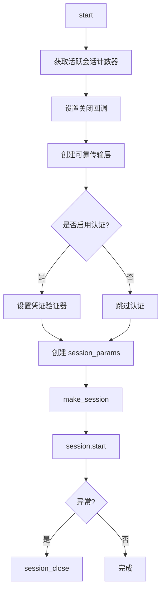
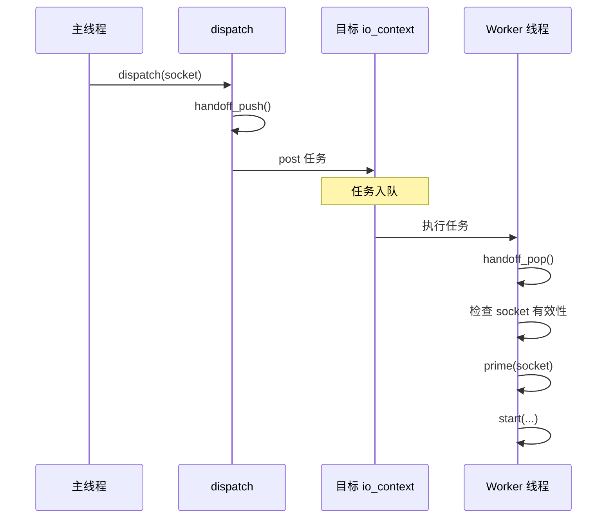
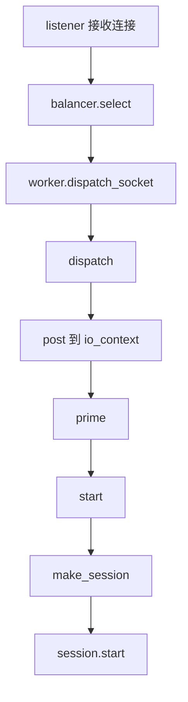

# launch 模块

## 源码位置

`I:/code/Prism/include/prism/agent/worker/launch.hpp`

## 模块职责

会话启动与连接分发模块，提供新连接的预处理和会话启动功能。当 acceptor 接收新连接后，通过本模块完成 socket 预配置、会话创建和认证设置等初始化工作。分发函数支持跨线程将 socket 投递到目标 worker 的事件循环中执行，实现负载均衡的连接分发机制。

## 主要函数

### migrate_executor

```cpp
[[nodiscard]] std::optional<tcp::socket> migrate_executor(
    tcp::socket &sock,
    net::io_context &target_ioc
) noexcept;
```

将 socket 的 executor 从当前 io_context 迁移到目标 io_context。

**问题背景**: socket 被 move 后 executor 不会改变，导致后续异步操作仍在原线程上执行。

**解决方案**: 通过释放原生句柄并重新绑定到目标 io_context。

**参数**:
| 参数 | 说明 |
|------|------|
| `sock` | 待迁移的 socket，迁移后变为空壳 |
| `target_ioc` | 目标 io_context |

**返回值**: 迁移后的新 socket，失败时为空

### prime

```cpp
void prime(tcp::socket &socket, std::uint32_t buffer_size) noexcept;
```

预配置 TCP socket 参数，对新接收的 socket 进行性能优化配置。

**配置项**:
| 配置 | 说明 |
|------|------|
| TCP_NODELAY | 禁用 Nagle 算法，降低小包延迟 |
| 接收缓冲区 | 匹配应用层吞吐需求 |
| 发送缓冲区 | 优化数据发送效率 |

**注意**: 所有操作均忽略错误，socket 配置失败不应阻断连接处理。

### start

```cpp
void start(
    server_context &server,
    worker_context &worker,
    stats::state &metrics,
    tcp::socket socket
);
```

在 worker 线程中创建并启动一个完整的会话对象。

**处理流程**:



**参数**:
| 参数 | 说明 |
|------|------|
| `server` | 服务端全局上下文 |
| `worker` | 当前 worker 的线程局部上下文 |
| `metrics` | 当前 worker 的统计状态对象 |
| `socket` | 已连接的 TCP socket |

### dispatch

```cpp
void dispatch(
    net::io_context &ioc,
    server_context &server,
    worker_context &worker,
    stats::state &metrics,
    tcp::socket socket
);
```

将 socket 分发到目标 worker 的事件循环，实现跨线程连接分发机制。

**分发流程**:



**特点**:
- 分发过程会先递增待处理计数
- 投递成功后立即递减待处理计数
- 负载均衡器可以感知各 worker 的排队压力
- 所有异常都会被捕获并记录日志

## 调用链



## 相关文档

- [[core/agent/worker/worker|Worker 模块]]
- [[core/agent/worker/stats|统计模块]]
- [[core/agent/session/session|会话模块]]
- [[core/agent/context|上下文模块]]