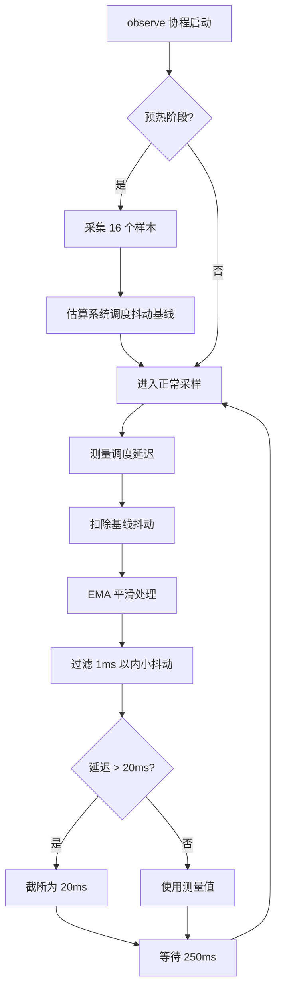
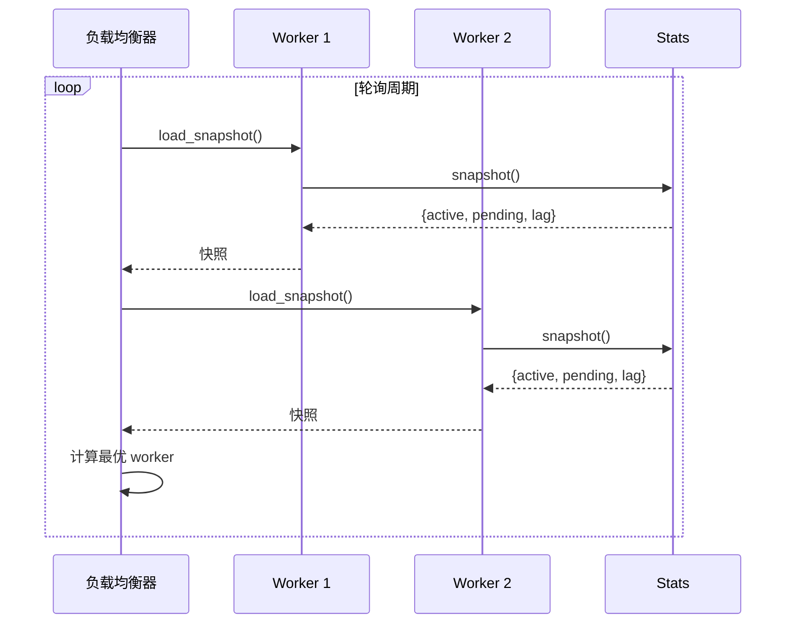
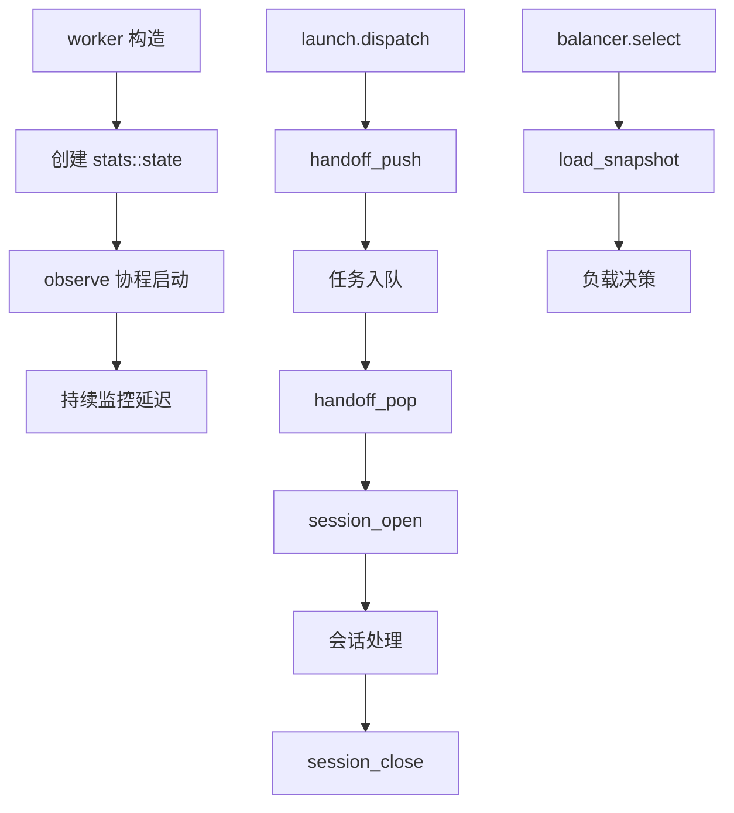

# stats 模块

## 源码位置

`I:/code/Prism/include/prism/agent/worker/stats.hpp`

## 模块职责

Worker 负载统计模块，提供单个 worker 线程的运行状态统计功能。统计数据包括活跃会话数、待处理连接数和事件循环延迟三项核心指标。这些指标被负载均衡器用于决策新连接应该分发到哪个 worker，实现基于实际负载的动态调度。

## 主要组件

### state 类

单个 worker 的运行负载统计状态，维护三项核心指标。

#### 核心指标

| 指标 | 说明 |
|------|------|
| 活跃会话数 | 当前正在处理的连接数量 |
| 待处理连接数 | 已投递但尚未开始处理的连接数量 |
| 事件循环延迟 | 反映 worker 的处理压力 |

#### 公共方法

| 方法 | 说明 |
|------|------|
| `state()` | 创建空的统计状态 |
| `session_open()` | 会话开始时调用，递增活跃会话计数器 |
| `session_close()` | 会话结束时调用，递减活跃会话计数器 |
| `handoff_push()` | 有新 socket 等待投递时调用 |
| `handoff_pop()` | 等待投递的 socket 被消费后调用 |
| `session_counter()` | 获取活跃会话计数器共享指针 |
| `snapshot()` | 读取当前负载快照 |
| `observe(ioc)` | 周期性采样事件循环延迟（协程） |

#### 成员变量

| 变量 | 类型 | 说明 |
|------|------|------|
| `active_sessions_` | `shared_ptr<atomic<uint32_t>>` | 活跃会话数，共享指针包装支持跨线程访问 |
| `pending_handoffs_` | `atomic<uint32_t>` | 等待投递到 worker 的 socket 数 |
| `event_loop_lag_us_` | `atomic<uint64_t>` | 平滑后的事件循环延迟（微秒） |

## 延迟测量机制

### observe 协程

周期性采样事件循环延迟，在 worker 事件循环中持续运行。

**采样周期**: 250 毫秒

**测量流程**:



### EMA 平滑算法

使用指数移动平均过滤短期抖动，提供稳定的负载评估依据。

**特点**:
- 过滤 1ms 以内的小抖动
- 延迟上限 20ms，防止单次异常值污染统计数据
- 使用 relaxed 内存序，负载均衡器仅需要近似值

## 负载均衡集成



### 快照结构

```cpp
struct worker_load_snapshot {
    std::uint32_t active_sessions;  // 活跃会话数
    std::uint32_t pending_handoffs;  // 待处理连接数
    std::uint64_t event_loop_lag_us; // 事件循环延迟（微秒）
};
```

## 线程安全

所有计数器均使用原子操作，支持无锁并发访问。

| 方法 | 线程安全 |
|------|----------|
| `session_open()` | 是 |
| `session_close()` | 是 |
| `handoff_push()` | 是 |
| `handoff_pop()` | 是 |
| `session_counter()` | 是 |
| `snapshot()` | 是 |
| `observe()` | 否，必须在 worker 事件循环中运行 |

## 调用链



## 相关文档

- [[core/agent/worker/worker|Worker 模块]]
- [[core/agent/worker/launch|启动模块]]
- [[core/agent/front/balancer|负载均衡器]]