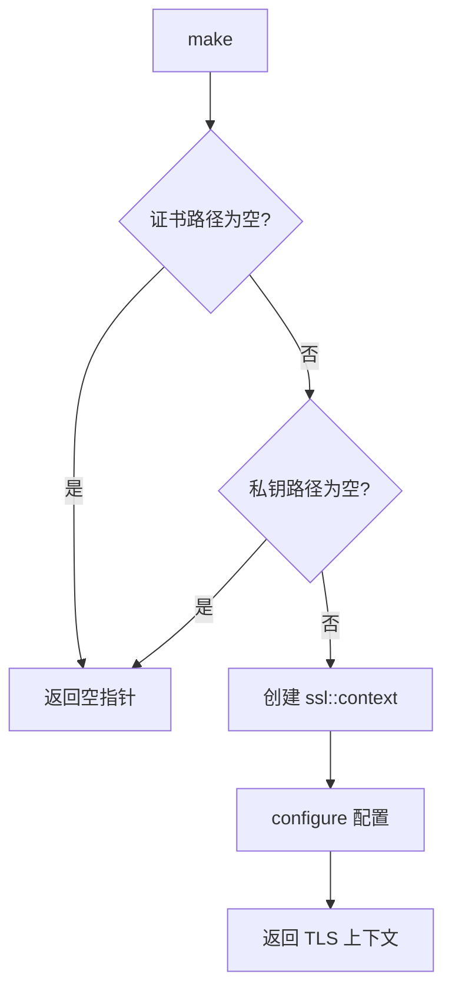
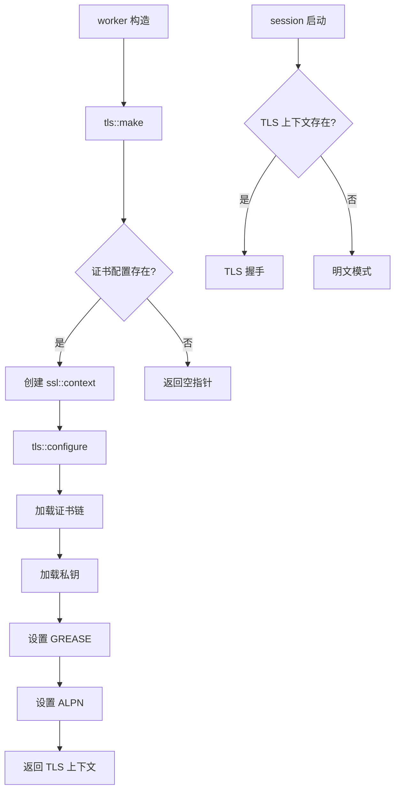

# tls 模块

## 源码位置

`I:/code/Prism/include/prism/agent/worker/tls.hpp`

## 模块职责

TLS 上下文初始化模块，提供 TLS/SSL 上下文的创建和配置功能。根据服务配置加载证书链和私钥，设置 GREASE 扩展和 ALPN 协议协商参数。如果未提供证书或私钥，则返回空指针表示运行明文模式。

**调用时机**: Worker 初始化阶段，每个 Worker 创建一次 TLS 上下文。

## 类型定义

```cpp
using shared_context = std::shared_ptr<ssl::context>;
```

TLS 上下文共享指针类型别名。

## 主要函数

### configure

```cpp
void configure(
    ssl::context &ctx,
    std::string_view cert,
    std::string_view key
);
```

对给定的 TLS 上下文进行初始化配置。

**配置项**:

| 配置项 | 说明 |
|--------|------|
| 证书链 | 加载证书链文件，用于服务端身份验证 |
| 私钥 | 加载私钥文件，用于密钥交换 |
| GREASE 扩展 | 增加 TLS 指纹随机性，提升安全性 |
| ALPN 协议 | 支持 HTTP/2 和 HTTP/1.1 协议协商 |

**参数**:
| 参数 | 说明 |
|------|------|
| `ctx` | 待配置的 TLS 上下文引用 |
| `cert` | 证书链文件路径 |
| `key` | 私钥文件路径 |

**异常**: 证书或私钥文件加载失败时抛出 `exception::protocol`

### make

```cpp
[[nodiscard]] auto make(const agent::config &cfg)
    -> shared_context;
```

根据服务配置创建 TLS 上下文。

**处理流程**:



**参数**:
| 参数 | 说明 |
|------|------|
| `cfg` | 代理服务配置，包含证书和私钥路径 |

**返回值**: TLS 上下文共享指针，如果未配置证书则返回空指针

**异常**:
- `exception::protocol`: 证书或私钥加载失败
- `std::exception`: 其他初始化异常

## 配置详情

### GREASE 扩展

GREASE (Generate Random Extensions And Sustain Extensibility) 是一种防止 TLS 指纹识别的技术，通过在扩展中填充随机值来增加指纹的随机性。

### ALPN 协议协商

支持以下协议优先级:
1. `h2` - HTTP/2
2. `http/1.1` - HTTP/1.1

## 调用链



## 明文模式

当 TLS 上下文为空指针时，worker 仅处理明文 HTTP 流量:

```cpp
if (ssl_ctx_) {
    // TLS 模式
} else {
    // 明文模式
}
```

## 相关文档

- [[core/agent/worker/worker|Worker 模块]]
- [[core/agent/config|配置模块]]
- [[core/crypto/tls|TLS 加密]]