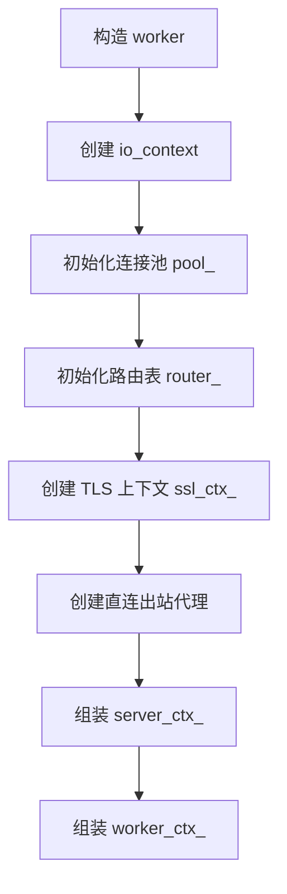
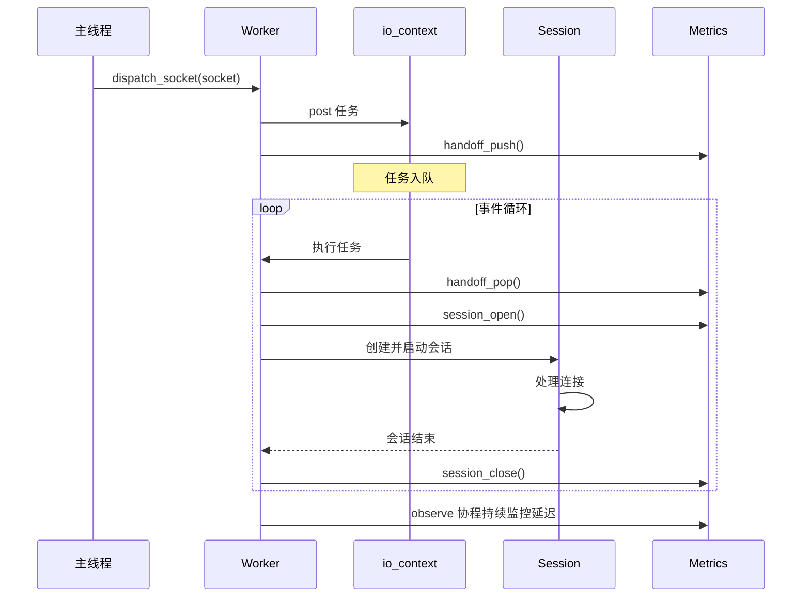
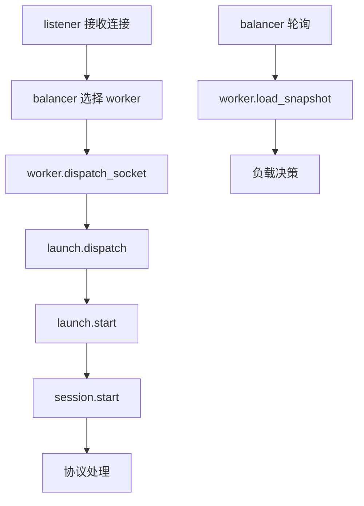

# worker 模块

## 源码位置

`I:/code/Prism/include/prism/agent/worker/worker.hpp`

## 模块职责

Worker 线程核心实现，是代理服务的工作线程核心组件。每个 worker 拥有独立的 `io_context` 事件循环、连接池、路由表和统计状态。worker 从主线程接收分发过来的 socket，创建会话并处理数据转发，通过负载快照向负载均衡器报告当前负载情况。

## 主要组件

### worker 类

代理服务工作线程核心类，封装了事件循环、连接池、路由表、TLS 上下文和统计状态等完整资源。

#### 核心方法

| 方法 | 说明 |
|------|------|
| `worker(cfg, account_store)` | 构造函数，初始化所有核心组件 |
| `run()` | 启动 worker 事件循环，阻塞运行直到停止 |
| `dispatch_socket(socket)` | 将 socket 分发到 worker 事件循环（线程安全） |
| `load_snapshot()` | 获取当前负载快照（线程安全） |

#### 成员变量

| 变量 | 类型 | 说明 |
|------|------|------|
| `ioc_` | `net::io_context` | 事件循环上下文，单线程运行 |
| `pool_` | `connection_pool` | 连接池，管理到后端的连接复用 |
| `router_` | `resolve::router` | 路由表，决定请求转发目标 |
| `ssl_ctx_` | `shared_ptr<ssl::context>` | TLS 上下文，为空表示明文模式 |
| `outbound_direct_` | `unique_ptr<outbound::direct>` | 直连出站代理 |
| `metrics_` | `stats::state` | 统计状态，记录负载指标 |
| `server_ctx_` | `server_context` | 服务端全局上下文 |
| `worker_ctx_` | `worker_context` | worker 线程局部上下文 |

## 构造流程



### 初始化详情

1. **io_context 创建**: 作为事件循环引擎
2. **连接池初始化**: 管理到后端的连接复用
3. **路由表解析**: 解析反向代理路由规则，将主机名映射到后端端点
4. **TLS 上下文**: 根据证书配置创建，如果未配置则为空（明文模式）
5. **上下文组装**: 创建服务端全局上下文和 worker 线程局部上下文

## 运行时流程



## 线程安全

| 方法 | 线程安全 |
|------|----------|
| `run()` | 否，必须在 worker 线程调用 |
| `dispatch_socket()` | 是，可从任何线程调用 |
| `load_snapshot()` | 是，可从任何线程调用 |

## 调用链



## 相关文档

- [[core/agent/context|上下文模块]]
- [[core/agent/session/session|会话模块]]
- [[core/agent/worker/launch|启动模块]]
- [[core/agent/worker/stats|统计模块]]
- [[core/agent/worker/tls|TLS 模块]]
- [[core/agent/front/balancer|负载均衡器]]
- [[core/resolve/router|路由模块]]

---

## 事件循环运行机制

### io_context::run 核心循环

Worker 的 `run()` 方法封装了 Boost.Asio 事件循环的完整运行逻辑：

```cpp
void worker::run() {
    // 启动延迟观测协程（在事件循环内部）
    net::co_spawn(ioc_, metrics_.observe(ioc_), net::detached);

    // 阻塞运行事件循环
    ioc_.run();
}
```

`io_context::run()` 的内部循环行为：

```
while (true) {
    // 1. 从内部任务队列取出一个 handler
    handler = dequeue_handler();
    if (no handler) {
        // 队列为空
        if (outstanding_work > 0) {
            // 还有未完成的工作，阻塞等待
            wait_for_event();
            continue;
        } else {
            // 没有工作也没有 handler，退出循环
            break;
        }
    }

    // 2. 执行 handler
    try {
        handler();  // 同步执行，阻塞当前线程
    } catch (...) {
        // Asio 捕获异常，记录并继续
    }

    // 3. 回到循环顶部
}
```

**关键特性**：

| 特性 | 说明 |
|------|------|
| 单线程 | `ioc_(1)` 构造函数确保只有一个线程运行 `run()` |
| 无锁 handler 执行 | handler 在同一线程顺序执行，不需要互斥锁 |
| 自动退出 | 当无 outstanding work 且队列为空时自动返回 |
| 异常安全 | handler 抛出的异常被 Asio 内部捕获 |

### 任务调度模型

Worker 中的任务通过 `post()` 进入 `io_context` 内部队列：

```
外部线程                          Worker 线程
    │                               │
    │  dispatch_socket(socket)      │
    │  ──────────────────────────►  │
    │       ioc_.post([=]() {      │
    │           launch::start(...)  │
    │       })                      │
    │                               │
    │                    [任务入队] │ ◄── internal queue
    │                               │
    │                    handler()  │ ◄── io_context::run 取出执行
    │                               │
    │                    co_spawn   │ ◄── 创建协程，首次恢复入队
    │                               │
    │                    [协程挂起] │ ◄── 等待 I/O 完成
    │                               │
    │                    [I/O 完成] │ ◄── 回调触发协程恢复
    │                               │
    │                    [协程退出] │ ◄── co_return
```

### 定时器集成

Worker 内部的定时器由同一个 `io_context` 驱动：

```cpp
// 延迟观测协程中的定时器
steady_timer timer{ctx_.worker.io_context};
timer.expires_after(250ms);
co_await timer.async_wait();  // 挂起协程，定时器到期时恢复
```

定时器在 `io_context::run()` 中的行为：
- 定时器到期时，Asio 将完成回调作为 handler 入队
- 如果队列为空，`run()` 会阻塞等待最近的定时器到期
- 定时器精度取决于操作系统调度（通常 1ms 级别）

### Work Guard 机制

为防止 `io_context` 在无任务时提前退出，Prism 使用 `executor_work_guard`：

```cpp
net::executor_work_guard<net::io_context::executor_type> work_guard_;
// 构造时创建，析构时释放
```

**作用**：
- 只要 `work_guard_` 存活，`ioc_.run()` 就不会退出
- 即使队列为空且无 pending I/O 操作，循环仍然阻塞等待
- Worker 停止时显式释放 `work_guard_`，允许 `run()` 返回

---

## 调度策略

### 协程排队执行

所有进入 worker 的连接请求通过 `post()` 统一排队：

```
dispatch_socket(socket)
    │
    ▼
ioc_.post([socket = std::move(socket)]() mutable {
    // ===== 阶段 1: 预处理 =====
    metrics_.handoff_pop();    // 递减待处理计数
    prime(socket, buf_size);   // 优化 socket 参数

    // ===== 阶段 2: 会话创建 =====
    try {
        launch::start(server_ctx_, worker_ctx_, metrics_, std::move(socket));
        metrics_.session_open(); // 递增活跃会话计数
    } catch (...) {
        metrics_.session_close(); // 异常: 立即递减
        log_error("session launch failed");
    }
})
```

### 公平性保证

Prism 的调度公平性由以下机制保证：

| 机制 | 保证 |
|------|------|
| FIFO 队列 | `io_context` 内部队列是 FIFO，先到的任务先执行 |
| 无优先级 | 所有 `post()` 的任务平等对待，无优先级区分 |
| 短任务优先退出 | 协程遇到 `co_await` 时挂起，不会阻塞后续任务 |
| 无饿死 | 每个任务最终都会被执行，除非 `io_context` 停止 |

### 协程挂起与恢复的调度影响

```
时间线:
    T0: Task A 入队 (session 创建)
    T1: Task A 执行, co_spawn diversion() 协程
    T2: 协程执行到 co_await async_read_some → 挂起
    T3: Task A 的 handler 退出
    T4: Task B 入队 (新连接 dispatch)
    T5: Task B 执行
    ...
    Tn: async_read_some 完成 → 协程恢复 handler 入队
    Tn+1: 协程恢复执行
```

**关键约束**：
- 协程挂起期间不占用 CPU，不影响其他任务
- 协程恢复时作为新 handler 入队，遵守 FIFO 顺序
- 单个协程在一次恢复中执行的时间越短，系统吞吐量越高

---

## 负载均衡交互

### 负载快照报告机制

Worker 通过 `load_snapshot()` 向 balancer 提供实时负载信息：

```cpp
auto worker::load_snapshot() const noexcept -> worker_load_snapshot {
    return metrics_.snapshot();
}
```

快照获取路径：

```
balancer.select(affinity)
    │
    ├── for each worker binding:
    │       snapshot = bindings_[i].snapshot()  // 调用 worker.load_snapshot()
    │           │
    │           ▼
    │       stats::state::snapshot()
    │           │
    │           ├── active_sessions = active_sessions_->load()    // 原子读取
    │           ├── pending_handoffs = pending_handoffs_.load()   // 原子读取
    │           └── event_loop_lag_us = event_loop_lag_us_.load() // 原子读取
    │           │
    │           └── 返回 worker_load_snapshot 结构体
    │
    └── score(snapshot) → 选择最优 worker
```

### 快照消费方：Balancer 评分

Balancer 使用快照的三维度进行评分：

```
worker_load_snapshot {
    active_sessions: 312    → session_ratio = 312/1024 = 0.305
    pending_handoffs: 5     → pending_ratio = 5/256 = 0.020
    event_loop_lag_us: 1200 → lag_ratio = 1200/5000 = 0.240
}

score = 0.305 × 0.60 + 0.020 × 0.10 + 0.240 × 0.30
      = 0.183 + 0.002 + 0.072
      = 0.257  ← 负载评分（0 = 空闲, 越高越忙）
```

### 负载指标更新时机

| 事件 | 指标变化 | 调用位置 |
|------|----------|----------|
| 新连接 dispatch | `pending_handoffs++` | `dispatch()` 中 `handoff_push()` |
| dispatch 任务执行 | `pending_handoffs--` | `launch::start` 前 `handoff_pop()` |
| 会话开始处理 | `active_sessions++` | `launch::start` 成功后的 `session_open()` |
| 会话结束 | `active_sessions--` | session 关闭回调中的 `session_close()` |
| 延迟采样（250ms 周期） | `event_loop_lag_us` 更新 | `observe()` 协程 EMA 计算 |

### 延迟观测与负载决策的闭环

```
observe 协程 (250ms 周期)
    │
    ▼
测量实际调度延迟
    │
    ▼
EMA 平滑 → event_loop_lag_us_
    │
    ▼
balancer 读取快照 → score() 计算
    │
    ├── score < 0.80: worker 正常，可接收新连接
    ├── 0.80 ≤ score < 0.90: 滞后区，状态不变
    └── score ≥ 0.90: worker 过载，标记为不可用
                        │
                        ▼
                    balancer 选择 secondary 或触发背压
```

---

## 线程局部资源管理

### 资源隔离架构

每个 worker 拥有完全独立的资源集合，线程间零共享：

```
Worker A                              Worker B
    │                                     │
    ├── io_context (线程 A)               ├── io_context (线程 B)
    ├── connection_pool                   ├── connection_pool
    ├── router                            ├── router
    ├── ssl_ctx (shared_ptr)              ├── ssl_ctx (shared_ptr)
    ├── outbound::direct                  ├── outbound::direct
    ├── stats::state                      ├── stats::state
    └── PMR memory_pool                   └── PMR memory_pool

    └── server_context (共享) ◄───────────┘ (跨 worker 共享)
            ├── cfg (atomic shared_ptr)
            ├── ssl_ctx (与 worker 的 ssl_ctx_ 同源)
            └── account_store
```

### 连接池隔离

`connection_pool` 在每个 worker 中独立实例化：

```cpp
// worker 构造函数中
pool_(
    ioc_,                                    // 绑定到本 worker 的事件循环
    memory::system::thread_local_pool(),     // 使用线程局部内存池
    cfg.pool                                 // 连接池配置
)
```

**隔离效果**：
- 连接池中的 socket 全部绑定到本 worker 的 `io_context`
- 跨 worker 借用连接需要 socket executor 迁移（昂贵操作）
- 避免锁竞争：每个 pool 仅被单线程访问
- 连接复用仅在同一 worker 内的会话间进行

### 路由表隔离

`resolve::router` 在每个 worker 中独立：

```cpp
router_(
    pool_,                                   // 使用本 worker 的连接池
    ioc_,                                    // 绑定到本 worker 的事件循环
    cfg.dns,                                 // DNS 配置
    memory::system::thread_local_pool()      // 线程局部内存池
)
```

**隔离效果**：
- DNS 查询缓存线程局部，无跨线程同步
- DNS 连接池使用 worker 本地连接池
- 路由表更新（如 DNS 解析结果变更）在各 worker 中独立生效

### TLS 上下文共享

`ssl_ctx_` 是唯一跨 worker 共享的 TLS 资源：

```cpp
// 在 worker 构造前创建（通过 tls::make）
auto ssl_ctx = tls::make(cfg);  // shared_ptr<ssl::context>

// 每个 worker 持有同一个 shared_ptr 的副本
worker_a.ssl_ctx_ = ssl_ctx;
worker_b.ssl_ctx_ = ssl_ctx;
```

**共享原因**：
- `ssl::context` 是只读配置对象，TLS 握手时使用
- 握手后每个连接持有独立的 `ssl::stream`，不共享上下文
- 共享可减少证书重复加载和内存占用

### PMR 内存池线程局部性

```cpp
memory::system::thread_local_pool()
```

返回当前线程的 PMR 内存池引用：

| 特性 | 说明 |
|------|------|
| 线程局部 | 每个 OS 线程有独立的 `memory_pool` |
| 无锁访问 | 同一线程内的所有分配无竞争 |
| 热点路径 | session 中的 `frame_arena` 基于此池分配帧缓冲区 |
| 会话结束回收 | 帧内存在 session 析构时回收，内存归还到线程池 |

### 资源生命周期对照表

| 资源 | 创建时机 | 销毁时机 | 作用域 |
|------|----------|----------|--------|
| `io_context` | worker 构造 | worker 析构 | 整个 worker 生命周期 |
| `connection_pool` | worker 构造 | worker 析构 | 整个 worker 生命周期 |
| `router` | worker 构造 | worker 析构 | 整个 worker 生命周期 |
| `ssl_ctx_` | 启动时（tls::make） | 服务器关闭 | 所有 worker 共享 |
| `stats::state` | worker 构造 | worker 析构 | 整个 worker 生命周期 |
| `frame_arena` | session 构造 | session 析构 | 单个会话 |
| `outbound::direct` | worker 构造 | worker 析构 | 整个 worker 生命周期 |
