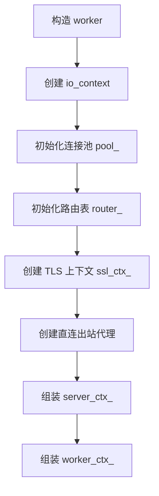
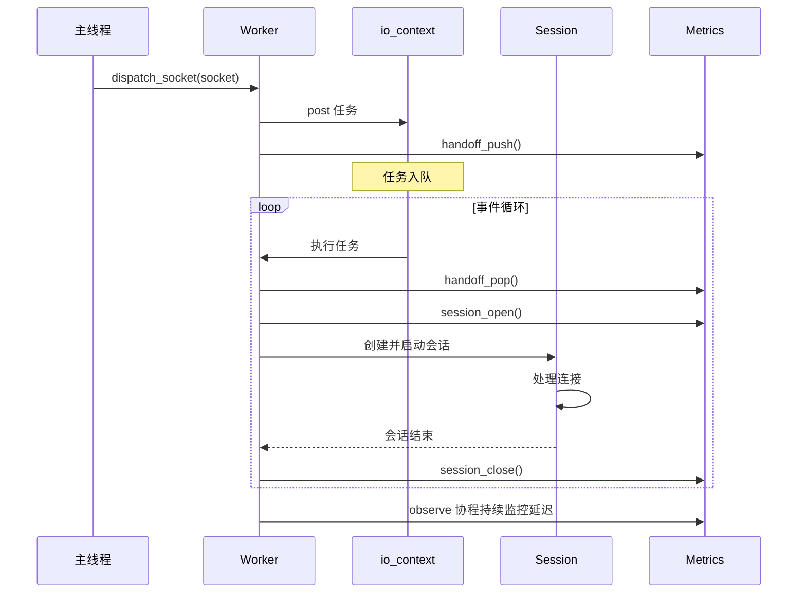
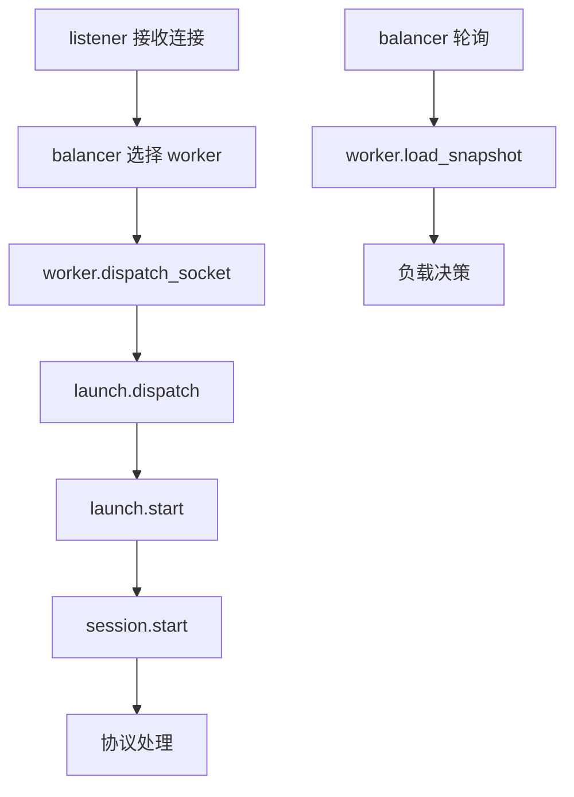

# worker 模块

## 源码位置

`I:/code/Prism/include/prism/agent/worker/worker.hpp`

## 模块职责

Worker 线程核心实现，是代理服务的工作线程核心组件。每个 worker 拥有独立的 `io_context` 事件循环、连接池、路由表和统计状态。worker 从主线程接收分发过来的 socket，创建会话并处理数据转发，通过负载快照向负载均衡器报告当前负载情况。

## 主要组件

### worker 类

代理服务工作线程核心类，封装了事件循环、连接池、路由表、TLS 上下文和统计状态等完整资源。

#### 核心方法

| 方法 | 说明 |
|------|------|
| `worker(cfg, account_store)` | 构造函数，初始化所有核心组件 |
| `run()` | 启动 worker 事件循环，阻塞运行直到停止 |
| `dispatch_socket(socket)` | 将 socket 分发到 worker 事件循环（线程安全） |
| `load_snapshot()` | 获取当前负载快照（线程安全） |

#### 成员变量

| 变量 | 类型 | 说明 |
|------|------|------|
| `ioc_` | `net::io_context` | 事件循环上下文，单线程运行 |
| `pool_` | `connection_pool` | 连接池，管理到后端的连接复用 |
| `router_` | `resolve::router` | 路由表，决定请求转发目标 |
| `ssl_ctx_` | `shared_ptr<ssl::context>` | TLS 上下文，为空表示明文模式 |
| `outbound_direct_` | `unique_ptr<outbound::direct>` | 直连出站代理 |
| `metrics_` | `stats::state` | 统计状态，记录负载指标 |
| `server_ctx_` | `server_context` | 服务端全局上下文 |
| `worker_ctx_` | `worker_context` | worker 线程局部上下文 |

## 构造流程

### 初始化详情

1. **io_context 创建**: 作为事件循环引擎
2. **连接池初始化**: 管理到后端的连接复用
3. **路由表解析**: 解析反向代理路由规则，将主机名映射到后端端点
4. **TLS 上下文**: 根据证书配置创建，如果未配置则为空（明文模式）
5. **上下文组装**: 创建服务端全局上下文和 worker 线程局部上下文

## 运行时流程

## 线程安全

| 方法 | 线程安全 |
|------|----------|
| `run()` | 否，必须在 worker 线程调用 |
| `dispatch_socket()` | 是，可从任何线程调用 |
| `load_snapshot()` | 是，可从任何线程调用 |

## 调用链

## 相关文档

- [[core/agent/context|上下文模块]]
- [[core/agent/session/session|会话模块]]
- [[core/agent/worker/launch|启动模块]]
- [[core/agent/worker/stats|统计模块]]
- [[core/agent/worker/tls|TLS 模块]]
- [[core/agent/front/balancer|负载均衡器]]
- [[core/resolve/router|路由模块]]