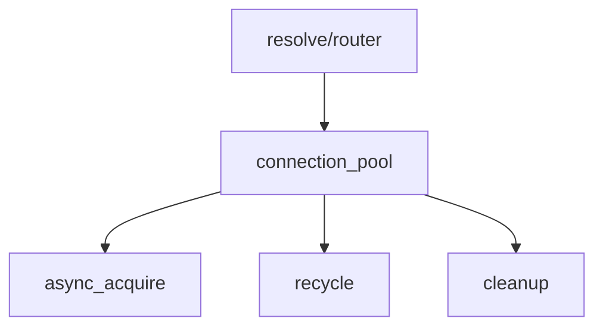

# connection_pool

TCP 连接池，管理复用 TCP 连接以减少握手开销。

## 概述

`connection_pool` 维护到目标服务器的 TCP 连接池，支持连接复用。核心机制包括：

- **LIFO 栈式缓存**：后进先出，优先复用最近使用的连接
- **僵尸检测**：归还时检测连接健康状态
- **线程隔离**：设计为线程局部使用，不支持跨线程共享
- **后台定时清理**：周期性移除过期空闲连接

## 主要结构

### endpoint_key

端点键，用于唯一标识一个 TCP 端点（IP + 端口），是连接池缓存的 Key。

```cpp
struct endpoint_key
{
    std::uint16_t port = 0;                  // 端口号
    std::uint8_t family = 0;                 // 协议族：4 表示 IPv4，6 表示 IPv6
    std::array<unsigned char, 16> address{}; // IP 地址，IPv4 使用前 4 字节
};
```

### config

连接池配置结构体，控制连接池的行为参数。

| 字段 | 默认值 | 说明 |
|------|--------|------|
| `max_cache_per_endpoint` | 32 | 单个目标端点最大缓存连接数 |
| `connect_timeout_ms` | 300 | 连接超时（毫秒） |
| `max_idle_seconds` | 30 | 空闲连接最大存活时间（秒） |
| `cleanup_interval_sec` | 10 | 后台清理间隔（秒） |
| `recv_buffer_size` | 65536 | 接收缓冲区大小（字节） |
| `send_buffer_size` | 65536 | 发送缓冲区大小（字节） |
| `tcp_nodelay` | true | 是否启用 TCP_NODELAY |
| `keep_alive` | true | 是否启用 SO_KEEPALIVE |
| `cache_ipv6` | false | 是否缓存 IPv6 连接 |

### pooled_connection

连接池连接的 RAII 包装器。内联存储 pool 指针、socket 指针和 endpoint，零堆分配。析构时自动归还连接到连接池。

```cpp
class pooled_connection
{
public:
    pooled_connection() = default;
    pooled_connection(connection_pool *pool, tcp::socket *socket, tcp::endpoint endpoint);
    ~pooled_connection();  // 自动调用 reset() 归还或关闭连接

    // 移动语义
    pooled_connection(pooled_connection &&other) noexcept;
    pooled_connection &operator=(pooled_connection &&other) noexcept;

    // 禁止拷贝
    pooled_connection(const pooled_connection &) = delete;
    pooled_connection &operator=(const pooled_connection &) = delete;

    // 访问器
    [[nodiscard]] tcp::socket *get() const noexcept;
    [[nodiscard]] tcp::socket &operator*() const noexcept;
    [[nodiscard]] tcp::socket *operator->() const noexcept;
    [[nodiscard]] bool valid() const noexcept;
    [[nodiscard]] explicit operator bool() const noexcept;

    // 所有权操作
    [[nodiscard]] tcp::socket *release() noexcept;  // 释放所有权，不归还池
    void reset();  // 归还或关闭连接
};
```

### pool_stats

连接池统计信息，用于监控和诊断。

| 字段 | 说明 |
|------|------|
| `idle_count` | 当前空闲连接数（实时计算） |
| `endpoint_count` | 有缓存的端点数（实时计算） |
| `total_acquires` | 总获取次数 |
| `total_hits` | 缓存命中次数 |
| `total_creates` | 新建连接次数 |
| `total_recycles` | 归还次数 |
| `total_evictions` | 驱逐次数（容量满/不健康/过期） |

## 核心方法

### connection_pool::async_acquire

```cpp
[[nodiscard]] auto async_acquire(tcp::endpoint endpoint)
    -> net::awaitable<std::pair<fault::code, pooled_connection>>;
```

获取一个 TCP 连接。

**流程解析：**

1. **缓存查找**：优先从缓存中复用 LIFO 栈顶连接
2. **过期检查**：检查连接是否超过 `max_idle_seconds`
3. **健康检测**：通过 `socket.is_open()` 检测连接状态
4. **新建连接**：缓存未命中时通过 `co_spawn + timer` 方案创建新连接
5. **超时控制**：由 `config::connect_timeout_ms` 控制
6. **选项设置**：新建连接成功后自动设置 `TCP_NODELAY`、`SO_KEEPALIVE` 等

**返回值：**
- 成功：`fault::code::success` + 有效连接
- 超时：`fault::code::timeout`
- 连接失败：`fault::code::bad_gateway`

### connection_pool::recycle

```cpp
void recycle(tcp::socket *s, const tcp::endpoint &endpoint);
```

归还连接（内部接口，由 `pooled_connection` 析构时调用）。

**归还逻辑：**

1. **IPv6 过滤**：如果 `cache_ipv6 == false` 且为 IPv6 地址，直接关闭
2. **健康检测**：检查 `socket.is_open()`
3. **容量检查**：检查是否超过 `max_cache_per_endpoint`
4. **入栈缓存**：满足条件的连接入栈等待复用
5. **直接关闭**：不满足条件的连接被直接关闭

### connection_pool::start

```cpp
void start();
```

启动后台清理协程。投递一个协程到 `io_context`，按 `config::cleanup_interval_sec` 指定的间隔周期性调用 `cleanup()` 移除过期连接。

> [!warning]
> 必须在 `io_context` 运行前调用，否则清理协程不会启动。

### connection_pool::cleanup

后台清理：移除过期连接。

遍历缓存中所有端点的连接栈，移除超过 `max_idle_seconds` 的过期连接。使用原地压缩算法，避免不必要的内存分配。空栈的端点条目会被一并移除。

## 内部实现

### 缓存结构

```cpp
memory::unordered_map<endpoint_key, memory::vector<idle_item>, endpoint_hash> cache_;

struct idle_item
{
    tcp::socket *socket = nullptr;
    std::chrono::steady_clock::time_point last_used;
};
```

每个端点使用 LIFO 栈（`memory::vector`）存储空闲连接，栈顶是最近归还的连接。

### 哈希函数

`endpoint_hash` 使用 FNV-1a 变体算法，一次性处理 port、family 和 address 所有字段。

## 调用链



被 [[core/resolve/router]] 使用，用于管理到上游服务器的 TCP 连接复用。

## 注意事项

1. **线程安全**：连接池设计为线程局部使用，不支持跨线程共享
2. **生命周期**：必须确保 `io_context` 在连接池生命周期内保持运行
3. **内存管理**：设置过大的 `max_cache_per_endpoint` 可能导致内存压力
4. **RAII 模式**：`pooled_connection` 必须在 socket 不再需要前析构或显式 `reset/release`，否则连接不会被归还到池中