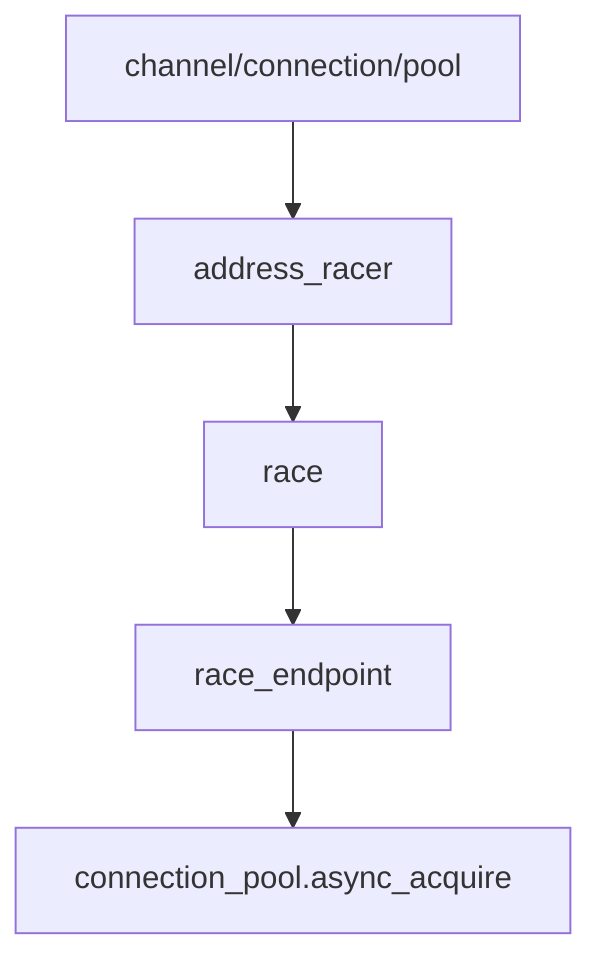

# address_racer

Happy Eyeballs (RFC 8305) 并发竞速连接器，实现多地址并发连接尝试。

## 概述

`address_racer` 实现 RFC 8305 的地址竞速算法，当 DNS 返回多个 IP 地址时并发尝试连接，第一个成功的连接 wins。该算法可有效降低连接延迟并保持 IPv6 优先。

### RFC 8305 核心机制

```
时间线:
  0ms    : 尝试连接 IP1 (IPv6 优先)
  250ms  : 尝试连接 IP2
  500ms  : 尝试连接 IP3
  ...
  
第一个成功的连接被返回，其他连接尝试被取消。
```

## 类定义

```cpp
class address_racer
{
public:
    explicit address_racer(connection_pool &pool);

    [[nodiscard]] auto race(std::span<const tcp::endpoint> endpoints)
        -> net::awaitable<pooled_connection>;

private:
    struct race_context;  // 竞速共享状态

    connection_pool &pool_;  // 连接池引用

    static constexpr auto secondary_delay = std::chrono::milliseconds(250);

    auto race_endpoint(tcp::endpoint ep, std::chrono::milliseconds delay, 
                       std::shared_ptr<race_context> ctx)
        -> net::awaitable<void>;
};
```

## 核心方法

### address_racer::race

```cpp
[[nodiscard]] auto race(std::span<const tcp::endpoint> endpoints)
    -> net::awaitable<pooled_connection>;
```

并发竞速连接多个端点。

**算法流程：**

1. **空列表检查**：如果 `endpoints` 为空，返回空连接
2. **单端点优化**：只有一个端点时直接调用 `pool_.async_acquire()`
3. **多端点竞速**：
   - 第一个端点立即开始连接（延迟 0ms）
   - 后续端点按 250ms 间隔依次启动
   - 第一个成功的连接被返回
   - 其他连接尝试被取消

**参数：**
- `endpoints`：候选端点列表，通常按优先级排序（IPv6 优先）

**返回值：**
- 成功连接，或空连接（全部失败时）

### race_endpoint（私有方法）

```cpp
auto race_endpoint(tcp::endpoint ep, std::chrono::milliseconds delay, 
                   std::shared_ptr<race_context> ctx)
    -> net::awaitable<void>;
```

单端点竞速协程。

**执行流程：**

1. **延迟启动**：等待指定的 `delay` 时间
2. **连接尝试**：调用 `pool_.async_acquire(ep)` 获取连接
3. **设置 winner**：连接成功且为首个成功者，设置 `winner`
4. **取消其他**：设置 winner 后取消其他正在进行的连接尝试

## 竞速上下文

`race_context` 结构体（定义在 racer.cpp）包含：

- `winner`：首个成功的连接
- `cancellation`：取消信号，用于取消其他竞速者
- 同步原语：确保 winner 写入的原子性

> [!note]
> 单线程 `io_context` 上 winner 写入与 timer cancel 之间无挂起点，不需要互斥锁。

## 调用链



被 [[core/connect/pool/pool]] 使用，在 `async_acquire` 中处理多地址竞速连接。

## 使用示例

```cpp
// 在 connection_pool 或上层调用
address_racer racer(pool);

std::vector<tcp::endpoint> endpoints = {
    tcp::endpoint(ip::make_address("2001:db8::1"), 443),  // IPv6 优先
    tcp::endpoint(ip::make_address("192.0.2.1"), 443),   // IPv4 备选
};

auto conn = co_await racer.race(endpoints);
if (conn.valid()) {
    // 连接成功，使用 conn
} else {
    // 所有地址连接失败
}
```

## 设计要点

### 为什么是 250ms？

RFC 8305 建议 250ms 的延迟间隔，这是基于以下考虑：

1. **IPv6 优先**：给 IPv6 一个先发优势，鼓励 IPv6 使用
2. **快速回退**：如果 IPv6 不可达，250ms 后尝试 IPv4
3. **避免振荡**：防止连接失败后的快速重试导致网络拥塞

### 为什么不需要互斥锁？

协程在单线程 `io_context` 上执行，winner 写入与 timer cancel 之间没有挂起点（co_await），因此不存在竞态条件。

> [!warning]
> 子协程直接捕获连接池引用而非 this，因为 racer 可能是局部变量。

## 注意事项

1. **生命周期**：调用方需确保连接池的生命周期覆盖竞速操作的整个周期
2. **单线程**：该类不是线程安全的，应在单个 strand 中使用
3. **内存**：可能抛出 `std::bad_alloc` 如果内存分配失败