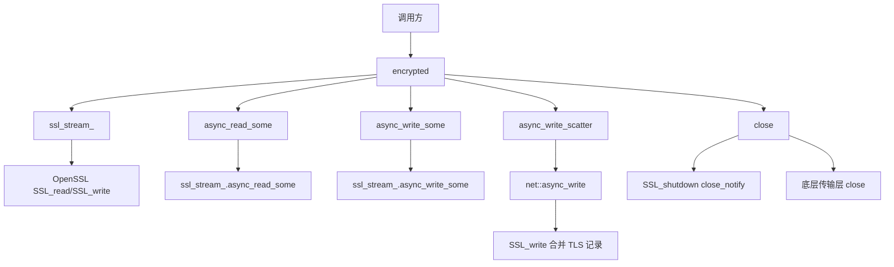

# encrypted

加密传输层实现，将 `ssl::stream` 适配为 [[core/channel/transport/transmission|transmission]] 接口，供协议装饰器使用。

## 概述

`encrypted` 类继承自 [[core/channel/transport/transmission|transmission]]，封装 TLS 流，使协议装饰器（如 trojan::stream）能够装饰 TLS 加密流。该类持有 `ssl::stream` 的共享所有权，确保在协议处理期间流对象有效。

### 核心特性

- **传输抽象**: 继承 `transmission` 接口实现 TLS 传输层
- **协程设计**: 所有异步操作返回 `net::awaitable` 简化调用
- **错误码映射**: 自动映射 Boost.System 错误码到项目错误码
- **TLS 优化**: `async_write_scatter` 将帧头和载荷合并为单次 TLS 记录

## 类定义

```cpp
class encrypted : public transmission
{
public:
    using connector_type = psm::channel::connector;
    using stream_type = ssl::stream<connector_type>;
    using shared_stream = std::shared_ptr<stream_type>;

    // 构造函数
    explicit encrypted(shared_stream ssl_stream);

    // 接口实现
    [[nodiscard]] bool is_reliable() const noexcept override;
    [[nodiscard]] executor_type executor() const override;
    auto async_read_some(std::span<std::byte> buffer, std::error_code &ec)
        -> net::awaitable<std::size_t> override;
    auto async_write_some(std::span<const std::byte> buffer, std::error_code &ec)
        -> net::awaitable<std::size_t> override;
    auto async_write_scatter(const std::span<const std::byte> *buffers, std::size_t count, std::error_code &ec)
        -> net::awaitable<std::size_t> override;
    void close() override;
    void cancel() override;

    // TLS 流访问
    [[nodiscard]] stream_type &stream() noexcept;
    [[nodiscard]] const stream_type &stream() const noexcept;
    shared_stream release();

private:
    shared_stream ssl_stream_;  // TLS 流的共享指针
};
```

## 类型定义

### connector_type

```cpp
using connector_type = psm::channel::connector;
```

底层连接器类型，封装 socket 和传输层。

### stream_type

```cpp
using stream_type = ssl::stream<connector_type>;
```

TLS 流类型，基于 OpenSSL 的 SSL 流。

### shared_stream

```cpp
using shared_stream = std::shared_ptr<stream_type>;
```

TLS 流的共享指针，持有流的所有权。

## 构造函数详解

```cpp
explicit encrypted(shared_stream ssl_stream)
    : ssl_stream_(std::move(ssl_stream))
{
}
```

使用已建立的 TLS 流创建加密传输层。TLS 流必须已完成握手。

**参数**:
- `ssl_stream`: TLS 流的共享指针

## 主要方法详解

### is_reliable()

```cpp
[[nodiscard]] bool is_reliable() const noexcept override
{
    return true;
}
```

TLS 基于 TCP，始终返回 `true`，表示可靠传输。

---

### executor()

```cpp
[[nodiscard]] executor_type executor() const override
{
    return const_cast<stream_type &>(*ssl_stream_).get_executor();
}
```

返回底层 TLS 流关联的执行器，用于调度异步操作。

---

### async_read_some() 逐行解析

```cpp
auto async_read_some(std::span<std::byte> buffer, std::error_code &ec)
    -> net::awaitable<std::size_t> override
{
    boost::system::error_code sys_ec;                       // 1. 创建 Boost 错误码
    auto token = net::redirect_error(net::use_awaitable, sys_ec); // 2. 创建协程令牌
    const auto n = co_await ssl_stream_->async_read_some(
        net::buffer(buffer.data(), buffer.size()), token);  // 3. 调用 TLS 流异步读取
    ec = psm::fault::make_error_code(psm::fault::to_code(sys_ec)); // 4. 转换错误码
    co_return n;                                            // 5. 返回读取字节数
}
```

**设计要点**:
- 调用底层 TLS 流的 `async_read_some` 实现异步读取
- 返回实际读取的字节数，错误通过 `ec` 返回
- 错误码映射：Boost.System → 项目错误码

---

### async_write_some() 逐行解析

```cpp
auto async_write_some(std::span<const std::byte> buffer, std::error_code &ec)
    -> net::awaitable<std::size_t> override
{
    boost::system::error_code sys_ec;                       // 1. 创建 Boost 错误码
    auto token = net::redirect_error(net::use_awaitable, sys_ec); // 2. 创建协程令牌
    const auto n = co_await ssl_stream_->async_write_some(
        net::buffer(buffer.data(), buffer.size()), token);  // 3. 调用 TLS 流异步写入
    ec = psm::fault::make_error_code(psm::fault::to_code(sys_ec)); // 4. 转换错误码
    co_return n;                                            // 5. 返回写入字节数
}
```

---

### async_write_scatter() 逐行解析

```cpp
auto async_write_scatter(const std::span<const std::byte> *buffers, std::size_t count, std::error_code &ec)
    -> net::awaitable<std::size_t> override
{
    if (count == 0)                                         // 1. 空缓冲区快速返回
    {
        ec.clear();
        co_return 0;
    }

    boost::system::error_code sys_ec;
    auto token = net::redirect_error(net::use_awaitable, sys_ec);
    std::size_t total = 0;

    if (count == 2) [[likely]]                              // 2. 两个缓冲区（帧头+载荷）优化
    {
        const std::array<net::const_buffer, 2> bufs{{       // 3. 构造 buffer 序列
            net::const_buffer(buffers[0].data(), buffers[0].size()),
            net::const_buffer(buffers[1].data(), buffers[1].size())
        }};
        total = co_await net::async_write(*ssl_stream_, bufs, token); // 4. 单次 TLS 写入
    }
    else
    {
        for (std::size_t i = 0; i < count; ++i)             // 5. 多个缓冲区逐个写入
        {
            const auto n = co_await async_write(buffers[i], ec);
            total += n;
            if (ec)
            {
                co_return total;
            }
        }
        co_return total;
    }

    ec = psm::fault::make_error_code(psm::fault::to_code(sys_ec));
    co_return total;
}
```

**TLS 优化设计**:
- 将多个缓冲区合并为单次 `async_write` 写入
- 底层 `SSL_write` 将帧头和载荷合并为一条 TLS 记录
- 避免两次加密操作和额外的 TLS 帧头开销
- `[[likely]]` 优化帧头+载荷场景

---

### close() 逐行解析

```cpp
void close() override
{
    // best-effort SSL_shutdown：发送 close_notify 通知对端
    // 非阻塞模式下立即返回，不等待对端响应
    ::SSL_shutdown(ssl_stream_->native_handle());           // 1. 发送 TLS close_notify
    ssl_stream_->lowest_layer().transmission().close();    // 2. 关闭底层传输层
}
```

**关闭流程**:
1. 调用 `SSL_shutdown` 发送 TLS `close_notify` 通知对端
2. 关闭底层传输层（TCP socket）

**注意事项**:
- `SSL_shutdown` 在非阻塞模式下立即返回，不等待对端响应
- 这是 best-effort 行为，不保证对端收到通知

---

### cancel()

```cpp
void cancel() override
{
    ssl_stream_->lowest_layer().transmission().cancel();
}
```

取消底层传输层当前所有挂起的异步读写操作。被取消的操作将返回 `operation_canceled` 错误。

---

### stream()

```cpp
[[nodiscard]] stream_type &stream() noexcept
{
    return *ssl_stream_;
}

[[nodiscard]] const stream_type &stream() const noexcept
{
    return *ssl_stream_;
}
```

返回内部 TLS 流的引用，用于直接操作 TLS 层。

---

### release()

```cpp
shared_stream release()
{
    return std::move(ssl_stream_);
}
```

将内部持有的 TLS 流共享指针移动返回，调用后对象不再持有流。

## 工厂函数

```cpp
inline shared_transmission make_encrypted(encrypted::shared_stream ssl_stream)
{
    return std::make_shared<encrypted>(std::move(ssl_stream));
}
```

使用已建立的 TLS 流创建加密传输层实例。TLS 流必须已完成握手。

**参数**:
- `ssl_stream`: TLS 流的共享指针

**返回值**: 传输层指针

## 调用链



## 继承关系

- 继承自 [[core/channel/transport/transmission|transmission]] 传输层抽象接口
- 底层使用 [[core/channel/transport/reliable|reliable]] TCP 传输

## 使用示例

```cpp
// 创建 TLS 上下文
net::ssl::context ctx(net::ssl::context::tlsv13);
ctx.use_certificate_chain_file("server.crt");
ctx.use_private_key_file("server.key", net::ssl::context::pem);

// 创建 TLS 流
auto ssl_stream = std::make_shared<ssl::stream<connector>>(std::move(sock), ctx);
ssl_stream->handshake(ssl::stream_base::server);

// 创建加密传输层
auto trans = make_encrypted(ssl_stream);

// 异步读取
std::array<std::byte, 1024> buffer;
std::error_code ec;
auto n = co_await trans->async_read_some(buffer, ec);

// Scatter-gather 写入（优化 TLS 记录）
std::array<std::span<const std::byte>, 2> bufs{{header, payload}};
auto written = co_await trans->async_write_scatter(bufs.data(), 2, ec);

// 关闭连接
trans->close();

// 获取底层 TLS 流
auto &ssl = trans->stream();
```

## 设计原则

1. **传输抽象**: 继承 `transmission` 接口实现 TLS 传输层
2. **协程设计**: 异步操作返回协程，简化调用
3. **共享所有权**: 持有 TLS 流的共享指针，确保协议处理期间流对象有效
4. **TLS 优化**: `async_write_scatter` 合并帧头和载荷为单条 TLS 记录