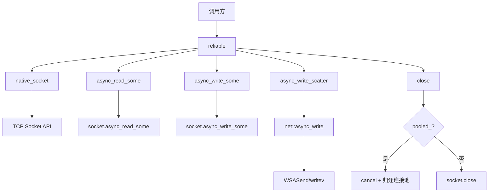

# reliable

可靠的流式传输实现（TCP），封装 `boost::asio::ip::tcp::socket`，提供基于 TCP 的可靠流式传输。

## 概述

`reliable` 类继承自 [[core/channel/transport/transmission|transmission]]，是分层流式架构中的具体传输层实现。所有异步操作返回 `net::awaitable`，简化异步操作调用。

### 核心特性

- **可靠传输**: TCP 保证数据有序送达、不丢失、不重复
- **流式语义**: 提供流式读写接口，支持部分读写
- **原生访问**: 提供 `native_socket` 方法直接访问底层 socket
- **连接池复用**: 支持从连接池获取连接，`close()` 时自动归还

## 类定义

```cpp
class reliable : public transmission, public std::enable_shared_from_this<reliable>
{
public:
    using socket_type = net::ip::tcp::socket;

    // 构造函数
    explicit reliable(net::any_io_executor executor);
    explicit reliable(socket_type socket);
    explicit reliable(psm::channel::pooled_connection pooled);

    // 接口实现
    executor_type executor() const override;
    auto async_read_some(std::span<std::byte> buffer, std::error_code &ec)
        -> net::awaitable<std::size_t> override;
    auto async_write_some(std::span<const std::byte> buffer, std::error_code &ec)
        -> net::awaitable<std::size_t> override;
    auto async_write_scatter(const std::span<const std::byte> *buffers, std::size_t count, std::error_code &ec)
        -> net::awaitable<std::size_t> override;
    void shutdown_write() override;
    void close() override;
    void cancel() override;
    [[nodiscard]] bool is_reliable() const noexcept override;

    // 原生访问
    socket_type &native_socket() noexcept;
    const socket_type &native_socket() const noexcept;

private:
    std::optional<socket_type> socket_;      // 非池连接的 socket 存储
    psm::channel::pooled_connection pooled_; // 池连接，RAII 包装器
};
```

## 构造函数详解

### 执行器构造

```cpp
explicit reliable(net::any_io_executor executor)
    : socket_(executor)
{
}
```

使用执行器初始化 TCP socket。Socket 在构造时不打开，需要在后续调用 `open` 或 `accept` 后才能使用。

**参数**:
- `executor`: 执行器，用于初始化 socket

---

### Socket 构造

```cpp
explicit reliable(socket_type socket)
    : socket_(std::move(socket))
{
}
```

使用已构造的 TCP socket 初始化传输层。Socket 必须已打开并连接。

**参数**:
- `socket`: 已构造的 TCP socket

---

### 连接池构造

```cpp
explicit reliable(psm::channel::pooled_connection pooled)
    : pooled_(std::move(pooled))
{
}
```

从连接池获取的连接创建传输层。析构或 `close()` 时 socket 将被归还到连接池而非直接关闭，实现连接复用。

**参数**:
- `pooled`: 来自连接池的连接

## 主要方法详解

### async_read_some() 逐行解析

```cpp
auto async_read_some(std::span<std::byte> buffer, std::error_code &ec)
    -> net::awaitable<std::size_t> override
{
    boost::system::error_code sys_ec;                       // 1. 创建 Boost 错误码
    auto token = net::redirect_error(net::use_awaitable, sys_ec); // 2. 创建协程令牌
    const auto n = co_await native_socket().async_read_some(
        net::buffer(buffer.data(), buffer.size()), token);  // 3. 调用 socket 异步读取
    ec = psm::fault::make_error_code(psm::fault::to_code(sys_ec)); // 4. 转换错误码
    co_return n;                                            // 5. 返回读取字节数
}
```

**设计要点**:
- 调用底层 socket 的 `async_read_some` 实现异步读取
- 返回实际读取的字节数，错误通过 `ec` 返回
- 错误码映射：Boost.System → 项目错误码

---

### async_write_some() 逐行解析

```cpp
auto async_write_some(std::span<const std::byte> buffer, std::error_code &ec)
    -> net::awaitable<std::size_t> override
{
    boost::system::error_code sys_ec;                       // 1. 创建 Boost 错误码
    auto token = net::redirect_error(net::use_awaitable, sys_ec); // 2. 创建协程令牌
    const auto n = co_await native_socket().async_write_some(
        net::buffer(buffer.data(), buffer.size()), token);  // 3. 调用 socket 异步写入
    ec = psm::fault::make_error_code(psm::fault::to_code(sys_ec)); // 4. 转换错误码
    co_return n;                                            // 5. 返回写入字节数
}
```

---

### async_write_scatter() 逐行解析

```cpp
auto async_write_scatter(const std::span<const std::byte> *buffers, std::size_t count, std::error_code &ec)
    -> net::awaitable<std::size_t> override
{
    if (count == 0)                                         // 1. 空缓冲区快速返回
    {
        ec.clear();
        co_return 0;
    }

    boost::system::error_code sys_ec;
    auto token = net::redirect_error(net::use_awaitable, sys_ec);
    std::size_t total = 0;

    if (count == 2) [[likely]]                              // 2. 两个缓冲区（帧头+载荷）优化
    {
        const std::array<net::const_buffer, 2> bufs{{       // 3. 构造 buffer 序列
            net::const_buffer(buffers[0].data(), buffers[0].size()),
            net::const_buffer(buffers[1].data(), buffers[1].size())
        }};
        total = co_await net::async_write(native_socket(), bufs, token); // 4. 单次系统调用
    }
    else
    {
        for (std::size_t i = 0; i < count; ++i)             // 5. 多个缓冲区逐个写入
        {
            const auto n = co_await async_write(buffers[i], ec);
            total += n;
            if (ec)
            {
                co_return total;
            }
        }
        co_return total;
    }

    ec = psm::fault::make_error_code(psm::fault::to_code(sys_ec));
    co_return total;
}
```

**设计要点**:
- 两个缓冲区时使用 `[[likely]]` 优化（帧头+载荷场景）
- 底层 `async_write` 携带完整 `ConstBufferSequence` 可映射为单次 `WSASend`/`writev` 系统调用
- 避免帧头与载荷分两次写入导致的额外系统调用和 TLS 记录开销

---

### close() 逐行解析

```cpp
void close() override
{
    if (pooled_.valid())                                    // 1. 检查是否为连接池连接
    {
        // 取消挂起的异步操作，但不关闭 socket
        boost::system::error_code ec;
        if (auto *sock = pooled_.get())
        {
            sock->cancel(ec);                               // 2. 仅取消操作
        }
        return;                                            // 3. 保持 socket 打开，析构时归还连接池
    }
    if (socket_)                                            // 4. 非连接池连接
    {
        boost::system::error_code ec;
        socket_->close(ec);                                 // 5. 直接关闭 socket
    }
}
```

**连接池复用逻辑**:
- 连接池连接调用 `close()` 时仅取消操作，不关闭 socket
- 保持 socket 打开状态，让析构函数通过 `pooled_.reset()` → `recycle()` 归还连接池
- `recycle()` 会通过 `healthy_fast()` 检测 socket 健康状态

---

### shutdown_write()

```cpp
void shutdown_write() override
{
    boost::system::error_code ec;
    native_socket().shutdown(net::ip::tcp::socket::shutdown_send, ec);
}
```

调用 socket 的 `shutdown_send`，通知对端不再发送数据。实现 TCP 半关闭。

---

### native_socket()

```cpp
socket_type &native_socket() noexcept
{
    if (pooled_.valid())
    {
        return *pooled_.get();                              // 连接池连接
    }
    return *socket_;                                        // 普通 socket
}
```

返回底层 TCP socket 的引用，用于直接操作 socket（如设置 `TCP_NODELAY`）。

## 工厂函数

### 从执行器创建

```cpp
inline shared_transmission make_reliable(net::any_io_executor executor)
{
    return std::make_shared<reliable>(executor);
}
```

Socket 在构造时不打开，需要在后续调用 `open` 或 `accept` 后才能使用。

---

### 从 Socket 创建

```cpp
inline shared_transmission make_reliable(net::ip::tcp::socket socket)
{
    return std::make_shared<reliable>(std::move(socket));
}
```

Socket 必须已打开并连接。

---

### 从连接池创建

```cpp
inline shared_transmission make_reliable(psm::channel::pooled_connection pooled)
{
    return std::make_shared<reliable>(std::move(pooled));
}
```

`pooled_connection` 是 RAII 包装器，在 `close()` 时将自动归还到连接池。

## 调用链



## 继承关系

- 继承自 [[core/channel/transport/transmission|transmission]] 传输层抽象接口
- 被 [[core/channel/transport/encrypted|encrypted]] TLS 加密传输层使用

## 使用示例

```cpp
// 从执行器创建
auto trans = make_reliable(executor);

// 从已连接的 socket 创建
net::ip::tcp::socket sock = /* ... */;
auto trans = make_reliable(std::move(sock));

// 从连接池获取
auto pooled = pool.acquire();
auto trans = make_reliable(std::move(pooled));

// 异步读取
std::array<std::byte, 1024> buffer;
std::error_code ec;
auto n = co_await trans->async_read_some(buffer, ec);

// 检查可靠性
if (trans->is_reliable()) {
    // TCP 可靠传输
}

// 设置 socket 选项
trans->native_socket().set_option(net::ip::tcp::no_delay(true));

// 关闭连接
trans->close();
```

## 设计原则

1. **可靠传输**: TCP 保证数据有序送达不丢失不重复
2. **流式语义**: 提供流式读写接口支持部分读写
3. **连接池友好**: 支持连接池复用，减少连接建立开销
4. **原生访问**: 提供 `native_socket` 方法直接访问底层 socket