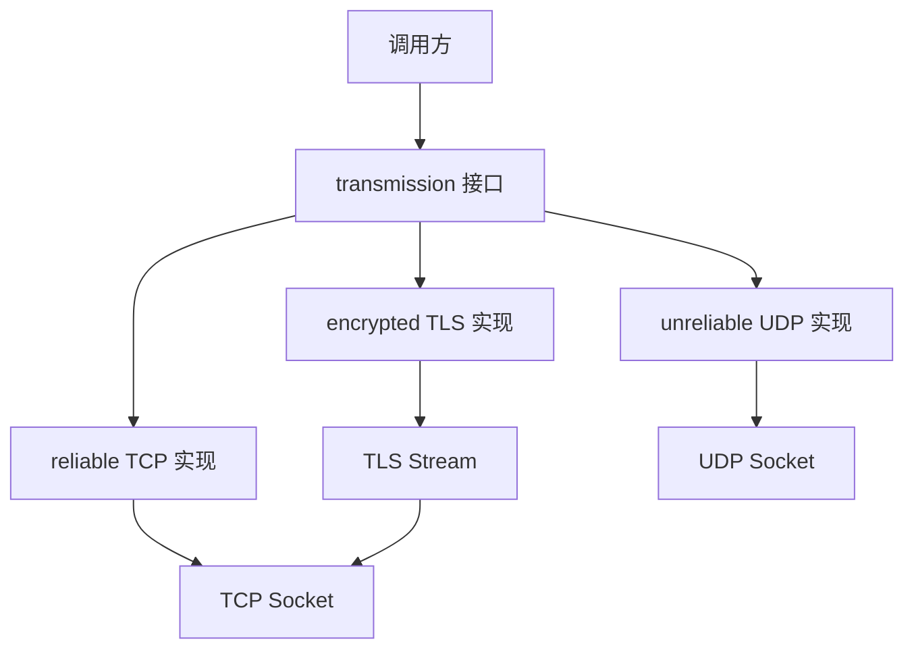

# transmission

传输层抽象接口，定义了通用的流式传输接口，支持 TCP、UDP 以及协议装饰器。

## 概述

`transmission` 是传输层的核心抽象基类，采用纯协程设计，使用 `net::awaitable` 作为异步操作返回类型。所有具体的传输实现（如 TCP、UDP）和协议装饰器（如 Trojan）都应继承此接口。

### 核心特性

- **分层架构**: 支持 TCP、UDP 和协议装饰器的分层设计
- **协程设计**: 所有异步操作返回 `net::awaitable`，简化异步调用
- **错误码返回**: 通过 `std::error_code&` 参数返回错误，避免异常开销
- **概念适配**: 提供 `get_executor` 方法，兼容 Boost.Asio 的执行器概念

## 类定义

```cpp
class transmission
{
public:
    using executor_type = net::any_io_executor;

    virtual ~transmission() = default;

    // 可靠性标识
    [[nodiscard]] virtual bool is_reliable() const noexcept { return false; }

    // 执行器管理
    [[nodiscard]] virtual executor_type executor() const = 0;
    [[nodiscard]] executor_type get_executor() const;

    // 异步读写
    virtual auto async_read_some(std::span<std::byte> buffer, std::error_code &ec)
        -> net::awaitable<std::size_t> = 0;
    virtual auto async_write_some(std::span<const std::byte> buffer, std::error_code &ec)
        -> net::awaitable<std::size_t> = 0;

    // 完整读写
    virtual auto async_read(std::span<std::byte> buffer, std::error_code &ec)
        -> net::awaitable<std::size_t>;
    virtual auto async_write(std::span<const std::byte> buffer, std::error_code &ec)
        -> net::awaitable<std::size_t>;
    virtual auto async_write_scatter(const std::span<const std::byte> *buffers, std::size_t count, std::error_code &ec)
        -> net::awaitable<std::size_t>;

    // 连接管理
    virtual void shutdown_write();
    virtual void close() = 0;
    virtual void cancel() = 0;
};
```

## 主要方法详解

### is_reliable()

```cpp
[[nodiscard]] virtual bool is_reliable() const noexcept { return false; }
```

用于标识传输层是否可靠。可靠传输（TCP）保证数据有序送达，不可靠传输（UDP）不保证数据送达和顺序。默认返回 `false`，可靠传输层应重写此方法。

**返回值**:
- `true`: 可靠传输（如 TCP）
- `false`: 不可靠传输（如 UDP）

---

### async_read_some()

```cpp
virtual auto async_read_some(std::span<std::byte> buffer, std::error_code &ec)
    -> net::awaitable<std::size_t> = 0;
```

从传输层读取一些数据到缓冲区。这是纯虚函数，必须由子类实现。

**参数**:
- `buffer`: 接收缓冲区
- `ec`: 错误码输出参数

**返回值**: 异步操作，完成后返回读取的字节数

**特性**:
- 非阻塞：异步操作，不会阻塞调用线程
- 协程返回：返回 `net::awaitable`，可在协程中使用 `co_await` 等待
- 部分读取：可能读取比请求更少的数据

---

### async_write_some()

```cpp
virtual auto async_write_some(std::span<const std::byte> buffer, std::error_code &ec)
    -> net::awaitable<std::size_t> = 0;
```

将缓冲区中的数据写入传输层。这是纯虚函数，必须由子类实现。

**参数**:
- `buffer`: 发送缓冲区
- `ec`: 错误码输出参数

**返回值**: 异步操作，完成后返回写入的字节数

---

### async_write() 逐行解析

```cpp
virtual auto async_write(std::span<const std::byte> buffer, std::error_code &ec)
    -> net::awaitable<std::size_t>
{
    std::size_t total_written = 0;                          // 1. 初始化已写入计数器
    while (total_written < buffer.size())                   // 2. 循环直到所有数据写入
    {
        const auto remaining = buffer.subspan(total_written); // 3. 获取剩余未写入部分
        const auto n = co_await async_write_some(remaining, ec); // 4. 写入剩余数据
        if (ec || n == 0)                                   // 5. 检查错误或连接关闭
        {
            co_return total_written;                        // 6. 返回已写入的字节数
        }
        total_written += n;                                 // 7. 更新计数器
    }
    co_return total_written;                                // 8. 返回总写入字节数
}
```

**设计要点**:
- 解决单次 `async_write_some` 可能只发送部分数据的问题
- 循环调用直到所有数据发送完毕
- 子类（如 UDP）可重写此方法优化

---

### async_read() 逐行解析

```cpp
virtual auto async_read(std::span<std::byte> buffer, std::error_code &ec)
    -> net::awaitable<std::size_t>
{
    std::size_t total_read = 0;                             // 1. 初始化已读取计数器
    while (total_read < buffer.size())                      // 2. 循环直到缓冲区填满
    {
        const auto remaining = buffer.subspan(total_read);  // 3. 获取剩余空间
        const auto n = co_await async_read_some(remaining, ec); // 4. 读取数据
        if (ec || n == 0)                                   // 5. 检查错误或 EOF
        {
            co_return total_read;                           // 6. 返回已读取的字节数
        }
        total_read += n;                                    // 7. 更新计数器
    }
    co_return total_read;                                   // 8. 返回总读取字节数
}
```

**设计要点**:
- 解决单次 `async_read_some` 可能只读取部分数据的问题
- 循环调用直到缓冲区填满或发生错误

---

### async_write_scatter() 逐行解析

```cpp
virtual auto async_write_scatter(const std::span<const std::byte> *buffers, std::size_t count, std::error_code &ec)
    -> net::awaitable<std::size_t>
{
    std::size_t total = 0;                                  // 1. 初始化总写入计数器
    for (std::size_t i = 0; i < count; ++i)                 // 2. 遍历所有缓冲区
    {
        const auto n = co_await async_write(buffers[i], ec); // 3. 写入单个缓冲区
        total += n;                                         // 4. 累加写入字节数
        if (ec)                                             // 5. 检查错误
        {
            co_return total;                                // 6. 出错时返回已写入总量
        }
    }
    co_return total;                                        // 7. 返回总写入字节数
}
```

**设计要点**:
- 将多个缓冲区按顺序完整写入
- 减少系统调用次数
- 子类可重写以使用原生 scatter-gather I/O

## 辅助函数

### async_read_some() 包装函数逐行解析

```cpp
template <typename MutableBufferSequence, typename CompletionToken>
auto async_read_some(std::shared_ptr<transmission> trans, const MutableBufferSequence &buffers, CompletionToken &&token)
{
    auto first = net::buffer_sequence_begin(buffers);       // 1. 获取缓冲区迭代器
    std::span<std::byte> span(reinterpret_cast<std::byte *>(first->data()), first->size()); // 2. 转换为 span

    auto impl = [trans = std::move(trans), span]() -> net::awaitable<std::pair<std::size_t, std::error_code>>
    {
        std::error_code ec;
        const auto n = co_await trans->async_read_some(span, ec); // 3. 调用底层读取
        co_return std::make_pair(n, ec);                    // 4. 返回结果对
    };

    auto init = [impl = std::move(impl)](auto &&handler) mutable
    {
        auto executor = net::get_associated_executor(handler); // 5. 获取执行器
        auto work = [impl = std::move(impl), handler = std::forward<decltype(handler)>(handler)]() mutable -> net::awaitable<void>
        {
            auto [n, ec] = co_await impl();                 // 6. 执行协程

            boost::system::error_code b_ec;
            if (ec)
            {
                if (ec.category() == psm::fault::category()) // 7. 错误码转换
                {
                    b_ec = boost::system::error_code(ec.value(), boost::system::category());
                }
                else
                {
                    b_ec = boost::system::error_code(ec.value(), boost::system::generic_category());
                }
            }

            handler(b_ec, n);                               // 8. 调用完成处理器
        };
        net::co_spawn(executor, std::move(work), net::detached); // 9. 启动协程
    };

    return net::async_initiate<CompletionToken, void(boost::system::error_code, std::size_t)>(std::move(init), token);
}
```

**设计要点**:
- 将 Boost.Asio 的异步读取接口适配到传输层接口
- 支持任意完成令牌（协程、回调等）
- 通过 `async_initiate` 桥接

## 类型定义

```cpp
using shared_transmission = std::shared_ptr<transmission>;
```

智能指针类型，用于管理传输层对象的生命周期。

## 调用链



## 继承关系

- [[core/channel/transport/reliable|reliable]] - TCP 可靠传输实现
- [[core/channel/transport/encrypted|encrypted]] - TLS 加密传输实现
- [[core/channel/transport/unreliable|unreliable]] - UDP 不可靠传输实现

## 使用示例

```cpp
// 创建 TCP 传输层
auto trans = make_reliable(executor);

// 异步读取
std::array<std::byte, 1024> buffer;
std::error_code ec;
auto n = co_await trans->async_read_some(buffer, ec);

// 完整写入
auto written = co_await trans->async_write(data, ec);

// 关闭连接
trans->close();
```

## 设计原则

1. **纯虚接口**: 所有核心方法都是纯虚函数，强制子类实现
2. **协程优先**: 异步操作返回协程，避免回调地狱
3. **错误码返回**: 通过参数返回错误码，避免异常开销
4. **概念兼容**: 提供 `get_executor` 方法，兼容 Boost.Asio 概念