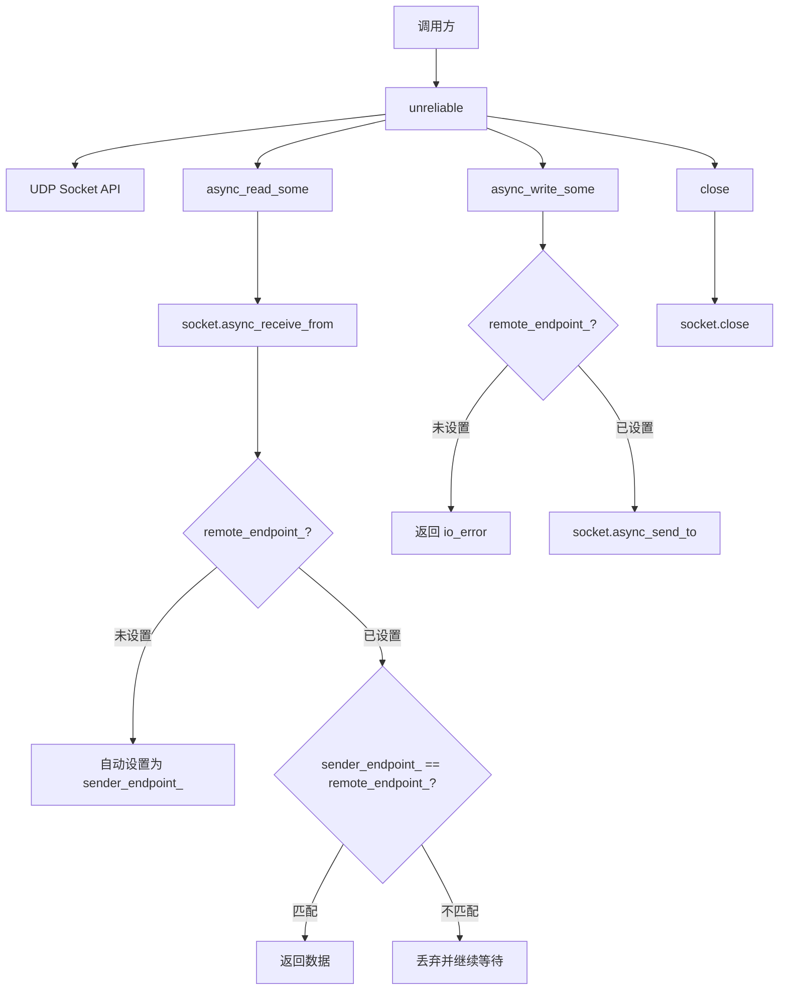

# unreliable

不可靠的数据报传输实现（UDP），封装 `boost::asio::ip::udp::socket`，提供基于 UDP 的数据报传输。

## 概述

`unreliable` 类继承自 [[core/channel/transport/transmission|transmission]]，实现基于 UDP 的数据报传输。由于 UDP 是无连接的，该类内部维护一个远程端点（remote endpoint），所有发送操作都指向该端点，接收操作则验证来源是否匹配。

### 核心特性

- **数据报语义**: UDP 不保证数据送达、顺序或去重
- **连接模拟**: 通过记录远程端点实现类似 TCP 的连接式操作
- **来源过滤**: 接收时自动过滤非远程端点的数据报

## 类定义

```cpp
class unreliable : public transmission, public std::enable_shared_from_this<unreliable>
{
public:
    using socket_type = net::ip::udp::socket;
    using endpoint_type = net::ip::udp::endpoint;

    // 构造函数
    explicit unreliable(net::any_io_executor executor, std::optional<endpoint_type> remote_endpoint = std::nullopt);
    explicit unreliable(socket_type socket, std::optional<endpoint_type> remote_endpoint = std::nullopt);

    // 接口实现
    executor_type executor() const override;
    auto async_read_some(std::span<std::byte> buffer, std::error_code &ec)
        -> net::awaitable<std::size_t> override;
    auto async_write_some(std::span<const std::byte> buffer, std::error_code &ec)
        -> net::awaitable<std::size_t> override;
    auto async_write(std::span<const std::byte> buffer, std::error_code &ec)
        -> net::awaitable<std::size_t> override;
    void close() override;
    void cancel() override;

    // 端点管理
    void set_remote_endpoint(const endpoint_type &endpoint);
    std::optional<endpoint_type> remote_endpoint() const noexcept;

    // 原生访问
    socket_type &native_socket() noexcept;
    const socket_type &native_socket() const noexcept;

private:
    socket_type socket_;                           // UDP socket
    std::optional<endpoint_type> remote_endpoint_; // 远程端点
    endpoint_type sender_endpoint_;                // 最近接收数据报的来源端点
};
```

## 构造函数详解

### 执行器构造

```cpp
explicit unreliable(net::any_io_executor executor, std::optional<endpoint_type> remote_endpoint = std::nullopt)
    : socket_(executor), remote_endpoint_(std::move(remote_endpoint))
{
}
```

使用执行器初始化 UDP socket。Socket 在构造时不打开，需要在后续调用 `open` 或 `bind` 后才能使用。

**参数**:
- `executor`: 执行器，用于初始化 socket
- `remote_endpoint`: 远程端点（可选，可在后续设置）

---

### Socket 构造

```cpp
explicit unreliable(socket_type socket, std::optional<endpoint_type> remote_endpoint = std::nullopt)
    : socket_(std::move(socket)), remote_endpoint_(std::move(remote_endpoint))
{
}
```

使用已构造的 UDP socket 初始化传输层。Socket 必须已打开。远程端点可选。

**参数**:
- `socket`: 已构造的 UDP socket
- `remote_endpoint`: 远程端点（可选）

## 主要方法详解

### set_remote_endpoint()

```cpp
void set_remote_endpoint(const endpoint_type &endpoint)
{
    remote_endpoint_ = endpoint;
}
```

设置发送操作的目标端点。设置后所有发送操作都指向该端点，接收操作验证来源是否匹配该端点，不匹配则丢弃。

**参数**:
- `endpoint`: 远程端点

---

### remote_endpoint()

```cpp
std::optional<endpoint_type> remote_endpoint() const noexcept
{
    return remote_endpoint_;
}
```

返回当前设置的远程端点。如果未设置则返回空。

---

### async_read_some() 逐行解析

```cpp
auto async_read_some(std::span<std::byte> buffer, std::error_code &ec)
    -> net::awaitable<std::size_t> override
{
    boost::system::error_code sys_ec;
    auto token = net::redirect_error(net::use_awaitable, sys_ec);
    while (true)
    {
        sys_ec.clear();
        std::size_t n = co_await socket_.async_receive_from(
            net::buffer(buffer.data(), buffer.size()),
            sender_endpoint_, token);                        // 1. 接收数据报并记录来源
        
        if (sys_ec)                                         // 2. 检查错误
        {
            ec = psm::fault::make_error_code(psm::fault::to_code(sys_ec));
            co_return 0;
        }
        
        if (!remote_endpoint_)                              // 3. 未设置远程端点时自动设置
        {
            remote_endpoint_ = sender_endpoint_;
            ec = psm::fault::make_error_code(psm::fault::code::success);
            co_return n;
        }
        else if (sender_endpoint_ == *remote_endpoint_)    // 4. 来源匹配时返回数据
        {
            ec = psm::fault::make_error_code(psm::fault::code::success);
            co_return n;
        }
        // 5. 来源不匹配时丢弃并继续等待
    }
}
```

**设计要点**:
- 调用底层 socket 的 `async_receive_from` 实现异步读取
- 接收时自动过滤非远程端点的数据报，不匹配则丢弃并继续等待
- 如果尚未设置远程端点，首次接收的数据报来源将自动设为远程端点

---

### async_write_some() 逐行解析

```cpp
auto async_write_some(std::span<const std::byte> buffer, std::error_code &ec)
    -> net::awaitable<std::size_t> override
{
    if (!remote_endpoint_)                                  // 1. 检查是否设置远程端点
    {
        ec = psm::fault::make_error_code(psm::fault::code::io_error);
        co_return 0;
    }
    
    boost::system::error_code sys_ec;
    auto token = net::redirect_error(net::use_awaitable, sys_ec);
    const auto n = co_await socket_.async_send_to(
        net::buffer(buffer.data(), buffer.size()), *remote_endpoint_, token); // 2. 发送数据报到远程端点
    ec = psm::fault::make_error_code(psm::fault::to_code(sys_ec));
    co_return n;
}
```

**设计要点**:
- 调用底层 socket 的 `async_send_to` 实现异步写入
- 如果未设置远程端点则返回 `io_error` 错误

---

### async_write()

```cpp
auto async_write(std::span<const std::byte> buffer, std::error_code &ec)
    -> net::awaitable<std::size_t> override
{
    co_return co_await async_write_some(buffer, ec);
}
```

UDP 数据报一次发送完成，无需循环。直接委托给 `async_write_some`。

---

### close()

```cpp
void close() override
{
    boost::system::error_code ec;
    socket_.close(ec);
}
```

关闭底层 UDP socket。关闭后所有未完成的异步操作将被取消，传输层对象不再可用。

---

### cancel()

```cpp
void cancel() override
{
    boost::system::error_code ec;
    socket_.cancel(ec);
}
```

取消当前所有挂起的异步读写操作。被取消的操作将返回 `operation_canceled` 错误。

---

### native_socket()

```cpp
socket_type &native_socket() noexcept
{
    return socket_;
}

const socket_type &native_socket() const noexcept
{
    return socket_;
}
```

返回底层 UDP socket 的引用，用于直接操作 socket。

## 工厂函数

### 从执行器创建

```cpp
inline auto make_unreliable(net::any_io_executor executor, std::optional<net::ip::udp::endpoint> remote_endpoint = std::nullopt)
    -> shared_transmission
{
    return std::make_shared<unreliable>(executor, std::move(remote_endpoint));
}
```

Socket 在构造时不打开，需要在后续调用 `open` 或 `bind` 后才能使用。

---

### 从 Socket 创建

```cpp
inline auto make_unreliable(net::ip::udp::socket socket, std::optional<net::ip::udp::endpoint> remote_endpoint = std::nullopt)
    -> shared_transmission
{
    return std::make_shared<unreliable>(std::move(socket), std::move(remote_endpoint));
}
```

Socket 必须已打开。远程端点可选。

## 调用链



## 继承关系

- 继承自 [[core/channel/transport/transmission|transmission]] 传输层抽象接口
- 与 [[core/channel/transport/reliable|reliable]] TCP 可靠传输对应

## UDP 特性说明

### 数据报语义

UDP 具有以下特性：
- **不保证送达**: 数据报可能在网络中丢失
- **不保证顺序**: 数据报可能乱序到达
- **不保证去重**: 相同数据报可能多次到达
- **有消息边界**: 每次发送/接收都是一个完整的数据报

### 连接模拟

`unreliable` 通过以下方式模拟连接式操作：

```cpp
// 设置远程端点后，发送操作自动指向该端点
trans->set_remote_endpoint(endpoint);

// 接收时自动过滤非远程端点的数据报
auto n = co_await trans->async_read_some(buffer, ec);

// 首次接收时自动设置远程端点
// 如果 remote_endpoint_ 未设置，首次接收的数据报来源将成为远程端点
```

## 使用示例

```cpp
// 创建 UDP 传输层
auto trans = make_unreliable(executor);

// 绑定本地端口
trans->native_socket().open(net::ip::udp::v4());
trans->native_socket().bind(net::ip::udp::endpoint(net::ip::udp::v4(), 12345));

// 设置远程端点
net::ip::udp::endpoint remote(net::ip::make_address("192.168.1.1"), 8080);
trans->set_remote_endpoint(remote);

// 发送数据
std::array<std::byte, 1024> send_buf;
std::error_code ec;
auto sent = co_await trans->async_write_some(send_buf, ec);

// 接收数据（自动过滤非远程端点的数据报）
std::array<std::byte, 1024> recv_buf;
auto received = co_await trans->async_read_some(recv_buf, ec);

// 关闭
trans->close();
```

## 设计原则

1. **数据报语义**: UDP 不保证数据送达、顺序或去重
2. **连接模拟**: 通过记录远程端点实现类似 TCP 的连接式操作
3. **来源过滤**: 接收时自动过滤非远程端点的数据报
4. **自动端点学习**: 首次接收时自动设置远程端点