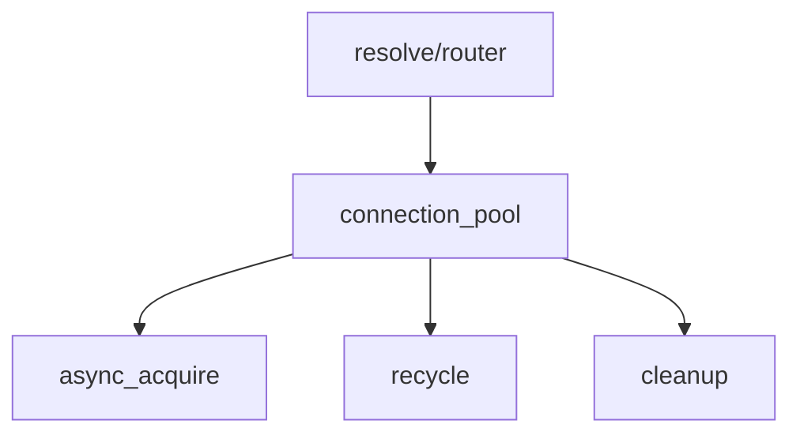

# connection_pool

TCP 连接池，管理复用 TCP 连接以减少握手开销。

## 概述

`connection_pool` 维护到目标服务器的 TCP 连接池，支持连接复用。核心机制包括：

- **LIFO 栈式缓存**：后进先出，优先复用最近使用的连接
- **僵尸检测**：归还时检测连接健康状态
- **线程隔离**：设计为线程局部使用，不支持跨线程共享
- **后台定时清理**：周期性移除过期空闲连接

## 主要结构

### endpoint_key

端点键，用于唯一标识一个 TCP 端点（IP + 端口），是连接池缓存的 Key。

```cpp
struct endpoint_key
{
    std::uint16_t port = 0;                  // 端口号
    std::uint8_t family = 0;                 // 协议族：4 表示 IPv4，6 表示 IPv6
    std::array<unsigned char, 16> address{}; // IP 地址，IPv4 使用前 4 字节
};
```

### config

连接池配置结构体，控制连接池的行为参数。

| 字段 | 默认值 | 说明 |
|------|--------|------|
| `max_cache_per_endpoint` | 32 | 单个目标端点最大缓存连接数 |
| `connect_timeout_ms` | 300 | 连接超时（毫秒） |
| `max_idle_seconds` | 30 | 空闲连接最大存活时间（秒） |
| `cleanup_interval_sec` | 10 | 后台清理间隔（秒） |
| `recv_buffer_size` | 65536 | 接收缓冲区大小（字节） |
| `send_buffer_size` | 65536 | 发送缓冲区大小（字节） |
| `tcp_nodelay` | true | 是否启用 TCP_NODELAY |
| `keep_alive` | true | 是否启用 SO_KEEPALIVE |
| `cache_ipv6` | false | 是否缓存 IPv6 连接 |

### pooled_connection

连接池连接的 RAII 包装器。析构时自动调用 `reset()` 归还或关闭连接。移动语义转移所有权后源对象无效。禁止拷贝。

| 方法 | 说明 |
|------|------|
| `valid()` / `operator bool()` | socket 指针非空 |
| `get()` / `operator*()` / `operator->()` | 访问 socket |
| `release()` | 释放所有权，不归还池（调用方负责关闭 socket） |
| `reset()` | 归还到池或关闭连接 |

> [!warning]
> `release()` 后调用方必须关闭返回的 socket，否则连接泄漏。`reset()` 内部调用 `recycle()` 执行健康检测和容量检查。

### pool_stats

连接池统计信息，用于监控和诊断。

| 字段 | 说明 |
|------|------|
| `idle_count` | 当前空闲连接数（实时计算） |
| `endpoint_count` | 有缓存的端点数（实时计算） |
| `total_acquires` | 总获取次数 |
| `total_hits` | 缓存命中次数 |
| `total_creates` | 新建连接次数 |
| `total_recycles` | 归还次数 |
| `total_evictions` | 驱逐次数（容量满/不健康/过期） |

## 核心方法

### connection_pool::async_acquire

```cpp
[[nodiscard]] auto async_acquire(tcp::endpoint endpoint)
    -> net::awaitable<std::pair<fault::code, pooled_connection>>;
```

获取一个 TCP 连接。

**流程解析：**

1. **缓存查找**：优先从缓存中复用 LIFO 栈顶连接
2. **过期检查**：检查连接是否超过 `max_idle_seconds`
3. **健康检测**：通过 `socket.is_open()` 检测连接状态
4. **新建连接**：缓存未命中时通过 `co_spawn + timer` 方案创建新连接
5. **超时控制**：由 `config::connect_timeout_ms` 控制
6. **选项设置**：新建连接成功后自动设置 `TCP_NODELAY`、`SO_KEEPALIVE` 等

**返回值：**
- 成功：`fault::code::success` + 有效连接
- 超时：`fault::code::timeout`
- 连接失败：`fault::code::bad_gateway`

### connection_pool::recycle

```cpp
void recycle(tcp::socket *s, const tcp::endpoint &endpoint);
```

归还连接（内部接口，由 `pooled_connection` 析构时调用）。

**归还逻辑：**

1. **IPv6 过滤**：如果 `cache_ipv6 == false` 且为 IPv6 地址，直接关闭
2. **健康检测**：检查 `socket.is_open()`
3. **容量检查**：检查是否超过 `max_cache_per_endpoint`
4. **入栈缓存**：满足条件的连接入栈等待复用
5. **直接关闭**：不满足条件的连接被直接关闭

### connection_pool::start

```cpp
void start();
```

启动后台清理协程。投递一个协程到 `io_context`，按 `config::cleanup_interval_sec` 指定的间隔周期性调用 `cleanup()` 移除过期连接。

> [!warning]
> 必须在 `io_context` 运行前调用，否则清理协程不会启动。

### connection_pool::cleanup

后台清理：移除过期连接。

遍历缓存中所有端点的连接栈，移除超过 `max_idle_seconds` 的过期连接。使用原地压缩算法，避免不必要的内存分配。空栈的端点条目会被一并移除。

## 内部实现

### 缓存结构

```cpp
memory::unordered_map<endpoint_key, memory::vector<idle_item>, endpoint_hash> cache_;

struct idle_item
{
    tcp::socket *socket = nullptr;
    std::chrono::steady_clock::time_point last_used;
};
```

每个端点使用 LIFO 栈（`memory::vector`）存储空闲连接，栈顶是最近归还的连接。

### 哈希函数

`endpoint_hash` 使用 FNV-1a 变体算法，一次性处理 port、family 和 address 所有字段。

## 调用链



被 [[core/resolve/router]] 使用，用于管理到上游服务器的 TCP 连接复用。

## 约束

### start() 必须在 io_context 运行前调用

**类型**: 调用顺序

**规则**: `start()` 必须在 `io_context::run()` 之前调用，否则后台清理协程不会启动。

**违反后果**: 过期连接永远不会被清理，池无限增长。最终可能耗尽文件描述符。

**源码依据**: `pool.hpp:288-289`

### pooled_connection 必须析构或 reset

**类型**: 资源管理

**规则**: `pooled_connection` 必须在 socket 不再需要前析构或显式 `reset()`/`release()`。

**违反后果**: 连接泄漏。池中可用连接逐渐耗尽，后续请求被迫新建连接。

**源码依据**: `pool.hpp:269-270`

### 单线程使用

**类型**: 线程安全

**规则**: 连接池设计为线程局部使用，每个 worker 拥有独立的 pool 实例。不支持跨线程共享。

**违反后果**: `cache_` 并发读写导致数据竞争，未定义行为。

**源码依据**: `pool.hpp:222`

### io_context 生命周期

**类型**: 生命周期

**规则**: `io_context` 必须在连接池生命周期内保持运行。

**违反后果**: 后台清理协程和异步连接操作引用已停止的 `io_context`，未定义行为。

**源码依据**: `pool.hpp:223`

## 设计决策

### 为什么使用 LIFO 栈式缓存？

LIFO 保证最近归还的连接最先被复用。最近使用的连接最可能仍处于健康状态（对端未关闭），减少僵尸连接命中概率。同时 LIFO 使得长时间空闲的连接自然沉底，在 cleanup 时优先被淘汰。

**后果**: 高并发场景下，同一连接可能被反复复用，而较早归还的连接可能过期。

### 为什么 pooled_connection 内联存储而非 shared_ptr？

`pooled_connection` 只有 3 个成员（pool 指针、socket 指针、endpoint），总计约 40 字节。使用 `shared_ptr` 需要额外的控制块分配（16 字节），对每个连接增加一次堆分配。内联存储配合移动语义，零堆分配传递连接。

**后果**: `pooled_connection` 不可拷贝，只能移动。

## 故障场景

### 连接池耗尽

**触发条件**: 上游服务器响应慢，所有连接被占用且未归还。或 `max_cache_per_endpoint` 设过小。

**传播路径**: `async_acquire()` 缓存未命中 → 新建连接 → 达到系统 fd 上限或超时 → 返回 `timeout`/`bad_gateway` → `dial()` 返回错误 → 客户端连接失败。

**外部表现**: 批量客户端连接超时。统计中 `total_creates` 持续增长但 `total_hits` 不增。

**恢复机制**: 自动。活跃连接关闭后通过 `recycle()` 归还池中。可调高 `max_cache_per_endpoint` 缓解。

**日志关键字**: `timeout` + `bad_gateway`

### 缓存中僵尸连接

**触发条件**: 上游服务器关闭 TCP 连接（发送 FIN），但客户端尚未检测到。`socket.is_open()` 返回 true（socket 本地端仍"打开"），但实际已不可用。

**传播路径**: `async_acquire()` 命中缓存 → 复用僵尸连接 → 写入时发现 RST → 协议处理器报错 → 重新拨号。

**外部表现**: 间歇性连接失败，通常在第一次 I/O 时暴露。后续重试通常成功（使用新建连接）。

**恢复机制**: 部分自动。`recycle()` 检查 `is_open()` 但无法检测 FIN。[[core/connect/pool/health]] 的 `check()` 通过 `peek` 检测 FIN，但仅在连接归还时可选执行。

**日志关键字**: 连接断开后重试成功