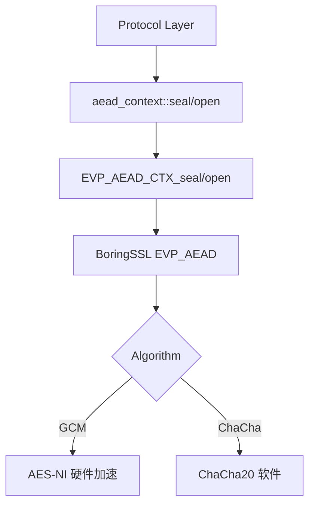

# AEAD 认证加密

AEAD（Authenticated Encryption with Associated Data）提供同时保证机密性和完整性的加密方式。本模块封装 BoringSSL 的 EVP_AEAD API，支持四种主流 AEAD 算法。

## 源码位置

- 头文件：`I:/code/Prism/include/prism/crypto/aead.hpp`
- 实现：`I:/code/Prism/src/prism/crypto/aead.cpp`

## 支持的算法

```cpp
enum class aead_cipher : std::uint8_t
{
    aes_128_gcm,         // AES-128-GCM：16 字节密钥，12 字节 nonce
    aes_256_gcm,         // AES-256-GCM：32 字节密钥，12 字节 nonce
    chacha20_poly1305,   // ChaCha20-Poly1305：32 字节密钥，12 字节 nonce
    xchacha20_poly1305   // XChaCha20-Poly1305：32 字节密钥，24 字节 nonce
};
```

## 核心类

### aead_context

```cpp
class aead_context
{
public:
    // 构造与析构
    explicit aead_context(aead_cipher cipher, std::span<const std::uint8_t> key);
    ~aead_context();

    // 禁止拷贝
    aead_context(const aead_context&) = delete;
    auto operator=(const aead_context&) -> aead_context& = delete;

    // 允许移动
    aead_context(aead_context&& other) noexcept;
    auto operator=(aead_context&& other) noexcept -> aead_context&;

    // 加解密操作
    auto seal(std::span<std::uint8_t> out,
              std::span<const std::uint8_t> plaintext,
              std::span<const std::uint8_t> ad = {}) -> fault::code;

    auto open(std::span<std::uint8_t> out,
              std::span<const std::uint8_t> ciphertext,
              std::span<const std::uint8_t> ad = {}) -> fault::code;

    // 显式 nonce 版本（不修改内部状态）
    auto seal(std::span<std::uint8_t> out,
              std::span<const std::uint8_t> plaintext,
              std::span<const std::uint8_t> nonce,
              std::span<const std::uint8_t> ad) -> fault::code;

    auto open(std::span<std::uint8_t> out,
              std::span<const std::uint8_t> ciphertext,
              std::span<const std::uint8_t> nonce,
              std::span<const std::uint8_t> ad) -> fault::code;

    // 属性访问
    static constexpr auto tag_length() noexcept -> std::size_t;
    auto nonce_length() const noexcept -> std::size_t;
    auto nonce() const noexcept -> const std::array<std::uint8_t, 24>&;

    // 缓冲区大小计算
    static constexpr auto seal_output_size(std::size_t plaintext_len) noexcept -> std::size_t;
    static constexpr auto open_output_size(std::size_t ciphertext_len) noexcept -> std::size_t;
};
```

## 函数详解

### 构造函数

```cpp
explicit aead_context(aead_cipher cipher, std::span<const std::uint8_t> key);
```

根据算法类型初始化 BoringSSL EVP_AEAD_CTX，nonce 初始化为零值。

**参数**：
- `cipher`：加密算法枚举
- `key`：密钥（长度必须与算法匹配）

**密钥长度要求**：
| 算法 | 密钥长度 |
|------|----------|
| `aes_128_gcm` | 16 字节 |
| `aes_256_gcm` | 32 字节 |
| `chacha20_poly1305` | 32 字节 |
| `xchacha20_poly1305` | 32 字节 |

### seal（自动 nonce 递增）

```cpp
auto seal(std::span<std::uint8_t> out,
          std::span<const std::uint8_t> plaintext,
          std::span<const std::uint8_t> ad = {}) -> fault::code;
```

使用内部 nonce 加密明文，成功后 nonce 按小端序递增。

**参数**：
- `out`：输出缓冲区（大小 = `plaintext.size() + tag_length()`）
- `plaintext`：明文数据
- `ad`：附加数据（Additional Authenticated Data，可选）

**返回值**：
- `fault::code::success`：加密成功
- `fault::code::crypto_error`：加密失败

**输出格式**：
```
┌─────────────────────────────────────────┐
│              Ciphertext                  │
├─────────────────────────────────────────┤
│              Auth Tag (16 bytes)         │
└─────────────────────────────────────────┘
```

### open（自动 nonce 递增）

```cpp
auto open(std::span<std::uint8_t> out,
          std::span<const std::uint8_t> ciphertext,
          std::span<const std::uint8_t> ad = {}) -> fault::code;
```

使用内部 nonce 解密密文，成功后 nonce 按小端序递增。

**参数**：
- `out`：输出缓冲区（大小 = `ciphertext.size() - tag_length()`）
- `ciphertext`：密文 + 认证标签
- `ad`：附加数据（必须与加密时一致）

**返回值**：
- `fault::code::success`：解密成功
- `fault::code::crypto_error`：解密失败（认证失败或密钥错误）

### seal（显式 nonce）

```cpp
auto seal(std::span<std::uint8_t> out,
          std::span<const std::uint8_t> plaintext,
          std::span<const std::uint8_t> nonce,
          std::span<const std::uint8_t> ad) -> fault::code;
```

使用显式 nonce 加密，不修改内部 nonce 状态。适用于 UDP 逐包加密等无状态场景。

**参数**：
- `out`：输出缓冲区
- `plaintext`：明文数据
- `nonce`：显式 nonce（长度必须匹配算法要求）
- `ad`：附加数据

### open（显式 nonce）

```cpp
auto open(std::span<std::uint8_t> out,
          std::span<const std::uint8_t> ciphertext,
          std::span<const std::uint8_t> nonce,
          std::span<const std::uint8_t> ad) -> fault::code;
```

使用显式 nonce 解密，不修改内部 nonce 状态。

## 内部实现

### nonce 递增逻辑

```cpp
void aead_context::increment_nonce()
{
    for (std::size_t i = 0; i < nonce_len_; ++i)
    {
        nonce_[i]++;
        if (nonce_[i] != 0)
        {
            break;  // 无进位，结束
        }
        // 有进位，继续处理下一个字节
    }
}
```

按 SS2022 规范要求，以小端序递增 nonce（从低位字节开始加 1）。

### 资源管理

```cpp
// 使用 unique_ptr + 函数指针删除器管理 BoringSSL 上下文
std::unique_ptr<evp_aead_ctx_st, void (*)(evp_aead_ctx_st*) noexcept> ctx_;

// 删除器实现
void aead_context::delete_aead_ctx(evp_aead_ctx_st* ctx) noexcept
{
    if (ctx)
    {
        EVP_AEAD_CTX_cleanup(ctx);
        delete ctx;
    }
}
```

## 使用示例

### TCP 流量加密

```cpp
// 初始化加密上下文
std::array<std::uint8_t, 32> key = /* 密钥 */;
aead_context ctx(aead_cipher::aes_256_gcm, key);

// 加密
std::vector<std::uint8_t> plaintext = { /* 数据 */ };
std::vector<std::uint8_t> ciphertext(plaintext.size() + aead_context::tag_length());

if (ctx.seal(ciphertext, plaintext) != fault::code::success) {
    // 处理错误
}

// 解密（对端使用相同初始 nonce）
std::vector<std::uint8_t> decrypted(ciphertext.size() - aead_context::tag_length());
if (ctx.open(decrypted, ciphertext) != fault::code::success) {
    // 处理错误
}
```

### UDP 逐包加密

```cpp
// 初始化加密上下文
aead_context ctx(aead_cipher::xchacha20_poly1305, key);

// 每个数据包使用独立 nonce
std::array<std::uint8_t, 24> packet_nonce = /* 从数据包头部解析 */;
std::vector<std::uint8_t> plaintext = { /* 数据 */ };
std::vector<std::uint8_t> ciphertext(plaintext.size() + aead_context::tag_length());

ctx.seal(ciphertext, plaintext, packet_nonce, {});  // 不修改内部 nonce
```

## 算法选择建议

| 场景 | 推荐算法 | 原因 |
|------|----------|------|
| TLS 1.3 | AES-256-GCM / ChaCha20-Poly1305 | 硬件加速或纯软件优化 |
| SS2022 TCP | AES-256-GCM | 12 字节 nonce 足够 |
| SS2022 UDP | XChaCha20-Poly1305 | 24 字节 nonce 避免重放 |

## 调用链



## 相关文档

- [[hkdf]] - HKDF 密钥派生（生成 AEAD 密钥）
- [[blake3]] - BLAKE3 密钥派生（SS2022 子密钥）
- [[block]] - AES-ECB 单块加密（SS2022 UDP）