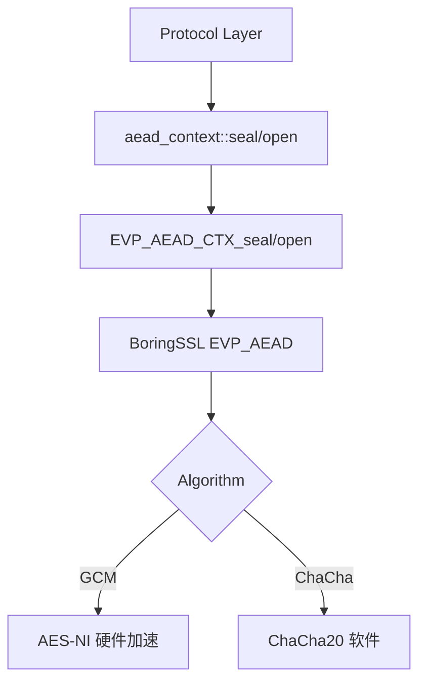

# AEAD 认证加密

AEAD（Authenticated Encryption with Associated Data）提供同时保证机密性和完整性的加密方式。本模块封装 BoringSSL 的 EVP_AEAD API，支持四种主流 AEAD 算法。

## 设计决策

### 为什么自动递增 nonce？

SS2022 (SIP022) TCP 流量加密要求连续数据包使用递增 nonce。将 nonce 递增内置于 `seal`/`open`（无显式 nonce 的重载），调用方无需手动管理计数器状态，降低 nonce 碰撞风险。

**后果**: 隐式 nonce 版本不是线程安全的——并发 `seal`/`open` 会导致 nonce 竞态。SS2022 连接中 `aead_context` 由单连接单线程使用，不构成问题。

### 为什么提供隐式/显式两个版本？

隐式版本（无显式 nonce 参数）适用于 TCP 流量——按序递增，简单可靠。显式版本（接受 `seal_input`/`open_input` 结构体）适用于 UDP 逐包加密——每个包携带独立 nonce，无序到达，不能依赖内部状态。

**后果**: 显式版本不修改内部 nonce 状态，适合无状态场景；隐式版本每次调用后 nonce 递增，适合有序流场景。

### 为什么用 unique_ptr + 函数指针删除器管理 BoringSSL 上下文？

`EVP_AEAD_CTX` 是 BoringSSL 的不透明结构体，析构需调用 `EVP_AEAD_CTX_cleanup` 再 `delete`。`std::unique_ptr<evp_aead_ctx_st, void(*)(evp_aead_ctx_st*)>` 避免手写析构函数，同时保持异常安全的资源释放。

**后果**: 构造函数中 `new EVP_AEAD_CTX` 是唯一堆分配点，之后所有 `seal`/`open` 调用零堆分配。

## 约束

### nonce 溢出

**类型**: 资源上限

**规则**: nonce 最大值为 `2^(nonce_len*8) - 1`，AES-GCM/ChaCha20 为 `2^96 - 1`，XChaCha20 为 `2^192 - 1`

**违反后果**: `increment_nonce()` 返回 `false`，`seal`/`open` 返回 `fault::code::crypto_error`，日志输出 `"seal nonce 溢出"` 或 `"open nonce 溢出"`

**源码依据**: `aead.cpp:115-119`，`aead.cpp:145-149`

### 输出缓冲区大小

**类型**: 状态前置

**规则**: `seal` 的 `out` 必须 >= `plaintext.size() + 16`，`open` 的 `out` 必须 >= `ciphertext.size() - 16`

**违反后果**: BoringSSL 内部写入越界，未定义行为

**源码依据**: `aead.hpp:134`，`aead.hpp:146`

### 密钥长度匹配

**类型**: 调用顺序

**规则**: 构造时 `key` 长度必须与 `aead_cipher` 枚举匹配（AES-128=16, AES-256=32, ChaCha20=32, XChaCha20=32）

**违反后果**: `EVP_AEAD_CTX_init` 失败，`ctx_` 为 nullptr，后续所有 `seal`/`open` 返回 `crypto_error`

**源码依据**: `aead.cpp:58`

### 非线程安全

**类型**: 线程安全

**规则**: 同一个 `aead_context` 实例的隐式 nonce 版本 `seal`/`open` 不可并发调用

**违反后果**: nonce 竞态导致 nonce 碰撞，产生可被重放的密文

**源码依据**: `aead.hpp:76-77`

## 源码位置

- 头文件：`include/prism/crypto/aead.hpp`
- 实现：`src/prism/crypto/aead.cpp`

## 支持的算法

```cpp
enum class aead_cipher : std::uint8_t
{
    aes_128_gcm,         // AES-128-GCM：16 字节密钥，12 字节 nonce
    aes_256_gcm,         // AES-256-GCM：32 字节密钥，12 字节 nonce
    chacha20_poly1305,   // ChaCha20-Poly1305：32 字节密钥，12 字节 nonce
    xchacha20_poly1305   // XChaCha20-Poly1305：32 字节密钥，24 字节 nonce
};
```

## 核心类

### aead_context

```cpp
class aead_context
{
public:
    // 构造与析构
    explicit aead_context(aead_cipher cipher, std::span<const std::uint8_t> key);
    ~aead_context();

    // 禁止拷贝
    aead_context(const aead_context&) = delete;
    auto operator=(const aead_context&) -> aead_context& = delete;

    // 允许移动
    aead_context(aead_context&& other) noexcept;
    auto operator=(aead_context&& other) noexcept -> aead_context&;

    // 加解密操作
    auto seal(std::span<std::uint8_t> out,
              std::span<const std::uint8_t> plaintext,
              std::span<const std::uint8_t> ad = {}) -> fault::code;

    auto open(std::span<std::uint8_t> out,
              std::span<const std::uint8_t> ciphertext,
              std::span<const std::uint8_t> ad = {}) -> fault::code;

    // 显式 nonce 版本（不修改内部状态）
    auto seal(std::span<std::uint8_t> out,
              std::span<const std::uint8_t> plaintext,
              std::span<const std::uint8_t> nonce,
              std::span<const std::uint8_t> ad) -> fault::code;

    auto open(std::span<std::uint8_t> out,
              std::span<const std::uint8_t> ciphertext,
              std::span<const std::uint8_t> nonce,
              std::span<const std::uint8_t> ad) -> fault::code;

    // 属性访问
    static constexpr auto tag_length() noexcept -> std::size_t;
    auto nonce_length() const noexcept -> std::size_t;
    auto nonce() const noexcept -> const std::array<std::uint8_t, 24>&;

    // 缓冲区大小计算
    static constexpr auto seal_output_size(std::size_t plaintext_len) noexcept -> std::size_t;
    static constexpr auto open_output_size(std::size_t ciphertext_len) noexcept -> std::size_t;
};
```

## 函数详解

### 构造函数

```cpp
explicit aead_context(aead_cipher cipher, std::span<const std::uint8_t> key);
```

根据算法类型初始化 BoringSSL EVP_AEAD_CTX，nonce 初始化为零值。

**参数**：
- `cipher`：加密算法枚举
- `key`：密钥（长度必须与算法匹配）

**密钥长度要求**：
| 算法 | 密钥长度 |
|------|----------|
| `aes_128_gcm` | 16 字节 |
| `aes_256_gcm` | 32 字节 |
| `chacha20_poly1305` | 32 字节 |
| `xchacha20_poly1305` | 32 字节 |

### seal（自动 nonce 递增）

```cpp
auto seal(std::span<std::uint8_t> out,
          std::span<const std::uint8_t> plaintext,
          std::span<const std::uint8_t> ad = {}) -> fault::code;
```

使用内部 nonce 加密明文，成功后 nonce 按小端序递增。

**参数**：
- `out`：输出缓冲区（大小 = `plaintext.size() + tag_length()`）
- `plaintext`：明文数据
- `ad`：附加数据（Additional Authenticated Data，可选）

**返回值**：
- `fault::code::success`：加密成功
- `fault::code::crypto_error`：加密失败

**输出格式**：
```
┌─────────────────────────────────────────┐
│              Ciphertext                  │
├─────────────────────────────────────────┤
│              Auth Tag (16 bytes)         │
└─────────────────────────────────────────┘
```

### open（自动 nonce 递增）

```cpp
auto open(std::span<std::uint8_t> out,
          std::span<const std::uint8_t> ciphertext,
          std::span<const std::uint8_t> ad = {}) -> fault::code;
```

使用内部 nonce 解密密文，成功后 nonce 按小端序递增。

**参数**：
- `out`：输出缓冲区（大小 = `ciphertext.size() - tag_length()`）
- `ciphertext`：密文 + 认证标签
- `ad`：附加数据（必须与加密时一致）

**返回值**：
- `fault::code::success`：解密成功
- `fault::code::crypto_error`：解密失败（认证失败或密钥错误）

### seal（显式 nonce）

```cpp
auto seal(std::span<std::uint8_t> out,
          std::span<const std::uint8_t> plaintext,
          std::span<const std::uint8_t> nonce,
          std::span<const std::uint8_t> ad) -> fault::code;
```

使用显式 nonce 加密，不修改内部 nonce 状态。适用于 UDP 逐包加密等无状态场景。

**参数**：
- `out`：输出缓冲区
- `plaintext`：明文数据
- `nonce`：显式 nonce（长度必须匹配算法要求）
- `ad`：附加数据

### open（显式 nonce）

```cpp
auto open(std::span<std::uint8_t> out,
          std::span<const std::uint8_t> ciphertext,
          std::span<const std::uint8_t> nonce,
          std::span<const std::uint8_t> ad) -> fault::code;
```

使用显式 nonce 解密，不修改内部 nonce 状态。

## 内部实现

### nonce 递增逻辑

```cpp
void aead_context::increment_nonce()
{
    for (std::size_t i = 0; i < nonce_len_; ++i)
    {
        nonce_[i]++;
        if (nonce_[i] != 0)
        {
            break;  // 无进位，结束
        }
        // 有进位，继续处理下一个字节
    }
}
```

按 SS2022 规范要求，以小端序递增 nonce（从低位字节开始加 1）。

### 资源管理

```cpp
// 使用 unique_ptr + 函数指针删除器管理 BoringSSL 上下文
std::unique_ptr<evp_aead_ctx_st, void (*)(evp_aead_ctx_st*) noexcept> ctx_;

// 删除器实现
void aead_context::delete_aead_ctx(evp_aead_ctx_st* ctx) noexcept
{
    if (ctx)
    {
        EVP_AEAD_CTX_cleanup(ctx);
        delete ctx;
    }
}
```

## 使用示例

### TCP 流量加密

```cpp
// 初始化加密上下文
std::array<std::uint8_t, 32> key = /* 密钥 */;
aead_context ctx(aead_cipher::aes_256_gcm, key);

// 加密
std::vector<std::uint8_t> plaintext = { /* 数据 */ };
std::vector<std::uint8_t> ciphertext(plaintext.size() + aead_context::tag_length());

if (ctx.seal(ciphertext, plaintext) != fault::code::success) {
    // 处理错误
}

// 解密（对端使用相同初始 nonce）
std::vector<std::uint8_t> decrypted(ciphertext.size() - aead_context::tag_length());
if (ctx.open(decrypted, ciphertext) != fault::code::success) {
    // 处理错误
}
```

### UDP 逐包加密

```cpp
// 初始化加密上下文
aead_context ctx(aead_cipher::xchacha20_poly1305, key);

// 每个数据包使用独立 nonce
std::array<std::uint8_t, 24> packet_nonce = /* 从数据包头部解析 */;
std::vector<std::uint8_t> plaintext = { /* 数据 */ };
std::vector<std::uint8_t> ciphertext(plaintext.size() + aead_context::tag_length());

ctx.seal(ciphertext, plaintext, packet_nonce, {});  // 不修改内部 nonce
```

## 算法选择建议

| 场景 | 推荐算法 | 原因 |
|------|----------|------|
| TLS 1.3 | AES-256-GCM / ChaCha20-Poly1305 | 硬件加速或纯软件优化 |
| SS2022 TCP | AES-256-GCM | 12 字节 nonce 足够 |
| SS2022 UDP | XChaCha20-Poly1305 | 24 字节 nonce 避免重放 |

## 故障场景

### nonce 碰撞

**触发条件**: 同一 `aead_context` 实例上 seal/open 调用次数超过 `2^(nonce_len*8)` 次，或并发调用隐式 nonce 版本导致竞态

**传播路径**: `increment_nonce()` 返回 `false` -> `seal`/`open` 返回 `fault::code::crypto_error` -> 调用方看到 `crypto_error` -> 连接层断开

**外部表现**: 客户端连接突然断开，无数据传输

**恢复机制**: 关闭并重建连接，新连接使用新密钥和从零开始的 nonce

**日志关键字**: `"seal nonce 溢出"` 或 `"open nonce 溢出"`

### tag 验证失败

**触发条件**: 密文被篡改、密钥错误、或 nonce 不匹配

**传播路径**: `EVP_AEAD_CTX_open` 返回 0 -> `open` 返回 `fault::code::crypto_error` -> 协议层检测到解密失败 -> 连接断开

**外部表现**: 客户端连接断开，服务端日志出现 `crypto_error`

**恢复机制**: 无法恢复，必须使用正确密钥重建连接

**日志关键字**: `"[Crypto.AEAD]"` + `crypto_error`

### 上下文构造失败

**触发条件**: 传入未知 `aead_cipher` 枚举值，或密钥长度不匹配，或 BoringSSL 内部初始化失败

**传播路径**: `ctx_` 保持 nullptr -> 后续所有 `seal`/`open` 立即返回 `crypto_error`

**外部表现**: 连接建立后立即断开，所有数据无法加解密

**恢复机制**: 检查配置文件中的加密方法名称和密钥格式

**日志关键字**: `"未知加密算法"` 或 `"EVP_AEAD_CTX_init 失败"`

### 跨模块契约

| 模块 A | 模块 B | 契约内容 |
|--------|--------|---------|
| [[core/protocol/shadowsocks/format\|SS2022 TCP]] | [[core/crypto/aead\|aead]] | 使用隐式 nonce 版本 seal/open，每连接一个 `aead_context`，密钥由 BLAKE3 derive_key 派生 |
| [[core/protocol/shadowsocks/datagram\|SS2022 UDP]] | [[core/crypto/aead\|aead]] | 使用显式 nonce 版本（`seal_input`/`open_input`），nonce 从数据包头解析 |
| [[core/stealth/reality/handshake\|Reality]] | [[core/crypto/aead\|aead]] | 使用 AES-128-GCM，密钥由 HKDF expand_label 派生 |
| [[core/crypto/hkdf\|hkdf]] | [[core/crypto/aead\|aead]] | hkdf 输出的密钥长度必须与 aead_cipher 的密钥长度匹配 |

## 变更敏感度

### 对外影响

| 变更 | 影响范围 | 影响 |
|------|---------|------|
| 修改 `increment_nonce` 递增方向 | 全部隐式 nonce 调用方 | SS2022 TCP 两端 nonce 失同步，连接断开 |
| 修改 `tag_length()` 返回值 | 全部 seal/open 调用方 | 输出缓冲区大小计算错误，内存越界 |
| 修改 `seal_input`/`open_input` 字段 | SS2022 UDP、所有显式 nonce 调用方 | 编译失败 |

### 对内影响

| 上游变更 | 本模块受影响 | 需要检查 |
|---------|------------|---------|
| BoringSSL 升级 | `EVP_AEAD_*` API 签名 | `aead.cpp` 全部 EVP 调用 |
| 新增 AEAD 算法（如 AES-256-SIV） | `aead_cipher` 枚举和构造函数 switch | `aead.cpp:27-48` 的 switch 分支 |

## 调用链



## 相关文档

- [[core/crypto/hkdf|hkdf]] - HKDF 密钥派生（生成 AEAD 密钥）
- [[core/crypto/blake3|blake3]] - BLAKE3 密钥派生（SS2022 子密钥）
- [[core/crypto/block|block]] - AES-ECB 单块加密（SS2022 UDP）