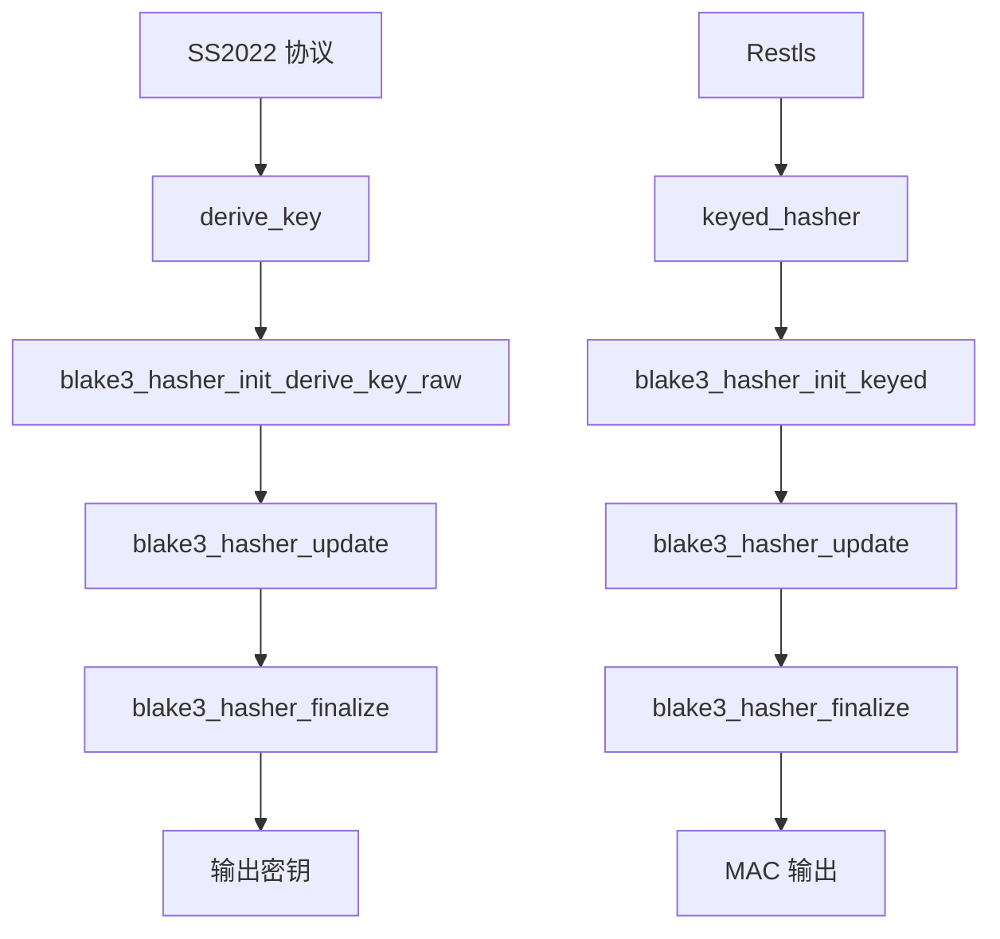

# BLAKE3 密钥派生

BLAKE3 是一种高速密码学哈希函数，基于 BLAKE2 和 Bao 树模式。本模块提供 BLAKE3 的三种工作模式（derive_key、keyed hash、hash），分别用于 SS2022 会话密钥派生、Restls MAC 计算和数据完整性校验。

## 设计决策

### 为什么 SS2022 选 BLAKE3 而非 HKDF？

SS2022 (SIP022) 规范明确规定使用 BLAKE3 derive_key 进行密钥派生，而非 HKDF。BLAKE3 的 derive_key 模式内置域分离（通过 context 字符串），省去了 HKDF 的 Extract 步骤，且性能更高（SIMD 优化约 1.5 GB/s vs SHA-256 约 300 MB/s）。

**后果**: BLAKE3 和 HKDF 在项目中并行存在，分别服务于不同协议。BLAKE3 仅被 SS2022 和 Restls 使用。

### 为什么同时提供 derive_key、keyed_hash 和 hash 三种模式？

- **derive_key**: SS2022 密钥派生（context 域分离 + 任意长度输出）
- **keyed_hash**: Restls 使用 `keyed_hasher` 构造 MAC（密钥化哈希等效 HMAC）
- **hash**: 通用数据完整性校验（无密钥）

三种模式对应 BLAKE3 规范的三种初始化方式，覆盖了 Prism 中所有 BLAKE3 使用场景。

**后果**: `keyed_hasher` 返回 `blake3_hasher` 值类型（约 1912 字节），调用方在栈上持有，适合流式多段 update。

### 为什么函数命名为 `derive_key` 而非 `blake3_derive_key`？

避免与 BLAKE3 C API 的 `blake3_derive_key` 宏/函数名冲突。头文件已包含 `<blake3.h>`，同名会导致编译错误。

**后果**: 在 `psm::crypto` 命名空间内，`derive_key` 足够明确，不会与其他 KDF 混淆。

## 约束

### context 字符串全局唯一

**类型**: 调用顺序

**规则**: 同一主密钥的不同用途必须使用不同的 context 字符串（如 SS2022 使用 `"shadowsocks 2022 session subkey"`、`"shadowsocks 2022 tcp key"` 等）

**违反后果**: 不同用途派生出相同密钥，破坏密钥分离安全性

**源码依据**: `constants.hpp:47`（`kdf_context = "shadowsocks 2022 session subkey"`）

### keyed_hasher 密钥长度

**类型**: 状态前置

**规则**: `keyed_hasher` 和 `keyed_hash` 的 `key` 参数必须恰好 32 字节（`BLAKE3_KEY_LEN`）

**违反后果**: `blake3_hasher_init_keyed` 内部读取越界，未定义行为

**源码依据**: `blake3.hpp:56`（注释 "密钥，必须恰好 32 字节"）

### hasher 生命周期

**类型**: 生命周期

**规则**: `keyed_hasher` 返回的 `blake3_hasher` 是值类型，约 1912 字节。调用方持有期间不可移动到更短生命周期的栈帧

**违反后果**: hasher 析构后使用 update/finalize，未定义行为

**源码依据**: `blake3.hpp:55`（注释 "调用方负责 hasher 的生命周期"）

## 源码位置

- 头文件：`include/prism/crypto/blake3.hpp`

## 函数详解

### derive_key（输出到缓冲区）

```cpp
auto derive_key(std::string_view context,
                std::span<const std::uint8_t> material,
                std::size_t out_len,
                std::span<std::uint8_t> out)
    -> void;
```

使用 BLAKE3 的 derive_key 模式派生密钥。

**参数**：
- `context`：上下文字符串（如 "shadowsocks 2022 session subkey"）
- `material`：输入密钥材料
- `out_len`：输出密钥长度
- `out`：输出缓冲区，必须至少 `out_len` 字节

**返回值**：无（直接写入输出缓冲区）

### derive_key（返回 vector）

```cpp
[[nodiscard]] auto derive_key(std::string_view context,
                              std::span<const std::uint8_t> material,
                              std::size_t out_len)
    -> std::vector<std::uint8_t>;
```

使用 BLAKE3 的 derive_key 模式派生密钥，返回包含派生密钥的 vector。

**参数**：
- `context`：上下文字符串
- `material`：输入密钥材料
- `out_len`：输出密钥长度

**返回值**：派生出的密钥字节

## BLAKE3 原理

### derive_key 模式

BLAKE3 提供 derive_key 模式，专门用于密钥派生：

```
derive_key(context, key_material, length) =
    BLAKE3-Hash(
        context_string || key_material,
        mode=DERIVE_KEY
    )[0..length]
```

**上下文字符串**用于域分离，确保不同用途派生出不同的密钥：

```cpp
// SS2022 会话子密钥派生
derive_key("shadowsocks 2022 session subkey", session_key, 32, out);

// 其他用途使用不同的上下文
derive_key("another purpose", key_material, 16, out);
```

### BLAKE3 特性

| 特性 | 值 |
|------|-----|
| 输出长度 | 可变（理论上无限） |
| 内部状态 | 64 字节 |
| 块大小 | 64 字节 |
| 安全强度 | 256 位 |
| 并行化 | 支持 SIMD 和多线程 |

### 性能对比

| 算法 | 吞吐量（长消息） |
|------|-----------------|
| BLAKE3 | ~1.5 GB/s（单核 SIMD） |
| SHA-256 | ~300 MB/s |
| SHA-512 | ~500 MB/s |
| BLAKE2b | ~1.0 GB/s |

## SS2022 密钥派生

SS2022 (SIP022) 使用 BLAKE3 进行多级密钥派生：

```
                    预共享密钥 (PSK)
                          |
                          v
              derive_key("shadowsocks 2022 identity subkey", PSK, 32)
                          |
                          v
                     身份子密钥
                          |
        +-----------------+-----------------+
        |                                   |
        v                                   v
derive_key("shadowsocks 2022 one-time auth subkey", identity_subkey, 32)
                                         |
                                         v
                               单次认证子密钥

                    会话密钥 (ECDHE)
                          |
                          v
              derive_key("shadowsocks 2022 session subkey", session_key, 32)
                          |
        +-----------------+-----------------+
        |                 |                 |
        v                 v                 v
    加密密钥          认证密钥         其他派生密钥
```

## 使用示例

### SS2022 会话密钥派生

```cpp
// 从 ECDHE 共享密钥派生会话密钥
std::array<std::uint8_t, 32> shared_secret = /* ECDHE 结果 */;
auto session_key = derive_key("shadowsocks 2022 session subkey", shared_secret, 32);

// 从会话密钥派生 AEAD 密钥
auto aead_key = derive_key("shadowsocks 2022 tcp key", session_key, 32);

// 从会话密钥派生 nonce 基值
auto nonce_base = derive_key("shadowsocks 2022 tcp nonce", session_key, 12);

// 初始化 AEAD 上下文
aead_context ctx(aead_cipher::aes_256_gcm, aead_key);
```

### 多用途密钥派生

```cpp
std::array<std::uint8_t, 32> master_key = /* 主密钥 */;

// 派生加密密钥
auto enc_key = derive_key("encryption", master_key, 32);

// 派生认证密钥
auto auth_key = derive_key("authentication", master_key, 32);

// 派生导出密钥
auto export_key = derive_key("export", master_key, 32);
```

## 与 HKDF 比较

| 特性 | BLAKE3 derive_key | HKDF-SHA256 |
|------|-------------------|-------------|
| 输出长度限制 | 无 | 8160 字节 |
| 两步过程 | 否 | 是（Extract + Expand） |
| 性能 | 快 | 中等 |
| 标准 | BLAKE3 规范 | RFC 5869 |
| TLS 支持 | 无 | TLS 1.3 原生 |

## 调用链



## 故障场景

### context 字符串拼错

**触发条件**: context 字符串与 SIP022 规范不一致（如多一个空格、大小写不同）

**传播路径**: `blake3_hasher_init_derive_key_raw` 使用错误 context -> 派生出不同密钥 -> AEAD 解密全部失败

**外部表现**: SS2022 客户端连接后所有数据解密失败，连接立即断开

**恢复机制**: 修正 context 字符串，确保与 `constants.hpp:47` 中定义一致

**日志关键字**: 无直接日志，表现为连续的 `crypto_error`

### 密钥长度不是 32 字节

**触发条件**: 调用 `keyed_hasher` 时传入非 32 字节密钥

**传播路径**: `blake3_hasher_init_keyed` 读取越界 -> 内存损坏或段错误

**外部表现**: 进程崩溃

**恢复机制**: 无法恢复，需修复调用方

**日志关键字**: 无（直接崩溃）

### 跨模块契约

| 模块 A | 模块 B | 契约内容 |
|--------|--------|---------|
| [[core/protocol/shadowsocks/conn\|SS2022 TCP]] | [[core/crypto/blake3\|blake3]] | 使用 `derive_key` + 固定 context 字符串派生每段流量的 AEAD 密钥 |
| [[core/protocol/shadowsocks/tracker\|SS2022 UDP]] | [[core/crypto/blake3\|blake3]] | 使用 `derive_key` 从会话密钥派生 UDP session 子密钥 |
| [[core/stealth/restls/crypto\|Restls]] | [[core/crypto/blake3\|blake3]] | 使用 `keyed_hasher` 构造 MAC（init_keyed + 多段 update + finalize），context 为 `"restls-traffic-key"` |
| [[core/crypto/aead\|aead]] | [[core/crypto/blake3\|blake3]] | blake3 derive_key 输出的密钥长度必须与 aead_cipher 的密钥长度匹配 |

## 变更敏感度

### 对外影响

| 变更 | 影响范围 | 影响 |
|------|---------|------|
| 修改 SS2022 context 字符串 | SS2022 全部连接 | 密钥派生结果不同，与标准客户端/服务端不兼容 |
| 修改 `keyed_hasher` 返回类型 | Restls | Restls MAC 计算编译失败 |
| BLAKE3 库升级 | 全部 BLAKE3 调用方 | `blake3_hasher` 结构体大小可能变化，影响栈布局 |

### 对内影响

| 上游变更 | 本模块受影响 | 需要检查 |
|---------|------------|---------|
| BLAKE3 v1.8.1 -> 新版本 | C API 签名变化 | `blake3_hasher_*` 系列调用 |
| SS2022 SIP022 规范修订 | context 字符串定义 | `constants.hpp` 中的 `kdf_context` |
| Restls 协议扩展 | MAC 构造方式 | `restls/crypto.hpp` 中的 `keyed_hasher` 使用 |

## 相关文档

- [[core/crypto/hkdf|hkdf]] - HKDF 密钥派生（TLS 1.3 使用）
- [[core/crypto/aead|aead]] - AEAD 认证加密
- [[core/crypto/x25519|x25519]] - X25519 密钥交换（生成共享密钥）