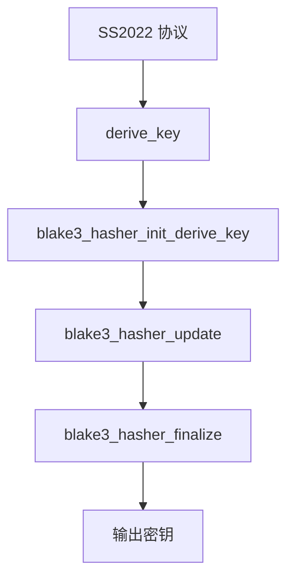

# BLAKE3 密钥派生

BLAKE3 是一种高速密码学哈希函数，基于 BLAKE2 和 Bao 树模式。本模块提供 BLAKE3 的 derive_key 功能，用于 SS2022 (SIP022) 会话密钥派生。

## 源码位置

- 头文件：`I:/code/Prism/include/prism/crypto/blake3.hpp`

## 函数详解

### derive_key（输出到缓冲区）

```cpp
auto derive_key(std::string_view context,
                std::span<const std::uint8_t> material,
                std::size_t out_len,
                std::span<std::uint8_t> out)
    -> void;
```

使用 BLAKE3 的 derive_key 模式派生密钥。

**参数**：
- `context`：上下文字符串（如 "shadowsocks 2022 session subkey"）
- `material`：输入密钥材料
- `out_len`：输出密钥长度
- `out`：输出缓冲区，必须至少 `out_len` 字节

**返回值**：无（直接写入输出缓冲区）

### derive_key（返回 vector）

```cpp
[[nodiscard]] auto derive_key(std::string_view context,
                              std::span<const std::uint8_t> material,
                              std::size_t out_len)
    -> std::vector<std::uint8_t>;
```

使用 BLAKE3 的 derive_key 模式派生密钥，返回包含派生密钥的 vector。

**参数**：
- `context`：上下文字符串
- `material`：输入密钥材料
- `out_len`：输出密钥长度

**返回值**：派生出的密钥字节

## BLAKE3 原理

### derive_key 模式

BLAKE3 提供 derive_key 模式，专门用于密钥派生：

```
derive_key(context, key_material, length) =
    BLAKE3-Hash(
        context_string || key_material,
        mode=DERIVE_KEY
    )[0..length]
```

**上下文字符串**用于域分离，确保不同用途派生出不同的密钥：

```cpp
// SS2022 会话子密钥派生
derive_key("shadowsocks 2022 session subkey", session_key, 32, out);

// 其他用途使用不同的上下文
derive_key("another purpose", key_material, 16, out);
```

### BLAKE3 特性

| 特性 | 值 |
|------|-----|
| 输出长度 | 可变（理论上无限） |
| 内部状态 | 64 字节 |
| 块大小 | 64 字节 |
| 安全强度 | 256 位 |
| 并行化 | 支持 SIMD 和多线程 |

### 性能对比

| 算法 | 吞吐量（长消息） |
|------|-----------------|
| BLAKE3 | ~1.5 GB/s（单核 SIMD） |
| SHA-256 | ~300 MB/s |
| SHA-512 | ~500 MB/s |
| BLAKE2b | ~1.0 GB/s |

## SS2022 密钥派生

SS2022 (SIP022) 使用 BLAKE3 进行多级密钥派生：

```
                    预共享密钥 (PSK)
                          |
                          v
              derive_key("shadowsocks 2022 identity subkey", PSK, 32)
                          |
                          v
                     身份子密钥
                          |
        +-----------------+-----------------+
        |                                   |
        v                                   v
derive_key("shadowsocks 2022 one-time auth subkey", identity_subkey, 32)
                                         |
                                         v
                               单次认证子密钥

                    会话密钥 (ECDHE)
                          |
                          v
              derive_key("shadowsocks 2022 session subkey", session_key, 32)
                          |
        +-----------------+-----------------+
        |                 |                 |
        v                 v                 v
    加密密钥          认证密钥         其他派生密钥
```

## 使用示例

### SS2022 会话密钥派生

```cpp
// 从 ECDHE 共享密钥派生会话密钥
std::array<std::uint8_t, 32> shared_secret = /* ECDHE 结果 */;
auto session_key = derive_key("shadowsocks 2022 session subkey", shared_secret, 32);

// 从会话密钥派生 AEAD 密钥
auto aead_key = derive_key("shadowsocks 2022 tcp key", session_key, 32);

// 从会话密钥派生 nonce 基值
auto nonce_base = derive_key("shadowsocks 2022 tcp nonce", session_key, 12);

// 初始化 AEAD 上下文
aead_context ctx(aead_cipher::aes_256_gcm, aead_key);
```

### 多用途密钥派生

```cpp
std::array<std::uint8_t, 32> master_key = /* 主密钥 */;

// 派生加密密钥
auto enc_key = derive_key("encryption", master_key, 32);

// 派生认证密钥
auto auth_key = derive_key("authentication", master_key, 32);

// 派生导出密钥
auto export_key = derive_key("export", master_key, 32);
```

## 与 HKDF 比较

| 特性 | BLAKE3 derive_key | HKDF-SHA256 |
|------|-------------------|-------------|
| 输出长度限制 | 无 | 8160 字节 |
| 两步过程 | 否 | 是（Extract + Expand） |
| 性能 | 快 | 中等 |
| 标准 | BLAKE3 规范 | RFC 5869 |
| TLS 支持 | 无 | TLS 1.3 原生 |

## 调用链



## 相关文档

- [[core/crypto/hkdf|hkdf]] - HKDF 密钥派生（TLS 1.3 使用）
- [[core/crypto/aead|aead]] - AEAD 认证加密
- [[core/crypto/x25519|x25519]] - X25519 密钥交换（生成共享密钥）