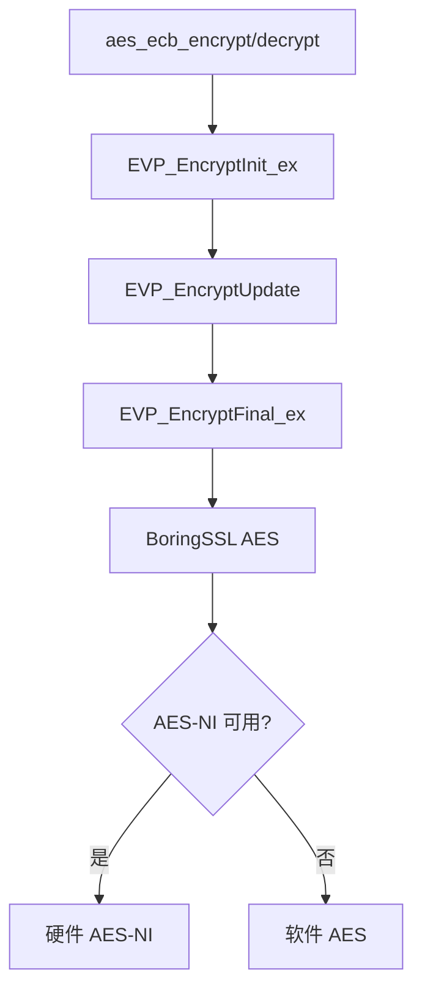

# AES-ECB 单块加密

AES-ECB 单块加密提供对单个 16 字节数据块的 AES 加密和解密。本模块专用于 SS2022 (SIP022) UDP 的 SeparateHeader 加密，**不应用于大量数据加密**（ECB 模式不安全）。

## 源码位置

- 头文件：`I:/code/Prism/include/prism/crypto/block.hpp`

## 函数详解

### aes_ecb_encrypt

```cpp
[[nodiscard]] auto aes_ecb_encrypt(std::span<const std::uint8_t, 16> input,
                                    std::span<const std::uint8_t> key)
    -> std::array<std::uint8_t, 16>;
```

对单个 16 字节块执行 AES-ECB 加密。

**参数**：
- `input`：明文（固定 16 字节）
- `key`：AES 密钥（16 或 32 字节）

**返回值**：密文（16 字节）

**支持的密钥长度**：
| 密钥长度 | 算法 |
|----------|------|
| 16 字节 | AES-128 |
| 32 字节 | AES-256 |

### aes_ecb_decrypt

```cpp
[[nodiscard]] auto aes_ecb_decrypt(std::span<const std::uint8_t, 16> input,
                                    std::span<const std::uint8_t> key)
    -> std::array<std::uint8_t, 16>;
```

对单个 16 字节块执行 AES-ECB 解密。

**参数**：
- `input`：密文（固定 16 字节）
- `key`：AES 密钥（16 或 32 字节）

**返回值**：明文（16 字节）

## 安全警告

### ECB 模式的弱点

**ECB（Electronic Codebook）模式不适用于加密超过一个块的数据**：

```
明文: [Block A][Block A][Block B][Block B]
ECB:  [Enc A  ][Enc A  ][Enc B  ][Enc B  ]
                    ^^^^^^         ^^^^^^
                    相同的明文块产生相同的密文块
```

这导致：
1. **模式泄露**：相同的明文块产生相同的密文块，泄露数据模式
2. **无完整性保护**：攻击者可以重新排列密文块
3. **选择明文攻击**：攻击者可以推断明文内容

### 正确用法

本模块仅用于：
- **SS2022 UDP SeparateHeader 加密**：加密固定 16 字节的头部信息
- **其他固定长度、单块加密场景**

```cpp
// 正确：加密固定 16 字节头部
std::array<std::uint8_t, 16> header = /* ... */;
std::array<std::uint8_t, 16> encrypted_header = aes_ecb_encrypt(header, key);

// 错误：加密多块数据
std::vector<std::uint8_t> data = /* 多于 16 字节 */;
// 不要使用 ECB 模式！应使用 AEAD 模式
```

## SS2022 UDP SeparateHeader

在 SS2022 UDP 协议中，SeparateHeader 使用 AES-ECB 加密头部：

```
┌─────────────────────────────────────┐
│         SeparateHeader (16B)        │
├──────────┬──────────┬───────────────┤
│ Type (1B)│ Pad (1B) │ Session ID (14B)│
└──────────┴──────────┴───────────────┘
              │
              ▼
      AES-ECB-Encrypt(key)
              │
              ▼
┌─────────────────────────────────────┐
│      Encrypted Header (16B)          │
└─────────────────────────────────────┘
```

## 使用示例

### 加密 16 字节块

```cpp
// 准备密钥和明文
std::array<std::uint8_t, 32> key = /* AES-256 密钥 */;
std::array<std::uint8_t, 16> plaintext = /* 16 字节明文 */;

// 加密
auto ciphertext = aes_ecb_encrypt(plaintext, key);

// 解密
auto decrypted = aes_ecb_decrypt(ciphertext, key);

// 验证
assert(plaintext == decrypted);
```

### SS2022 UDP 头部加密

```cpp
// 构造 SeparateHeader
std::array<std::uint8_t, 16> header{};
header[0] = 0x00;  // Type
header[1] = 0x00;  // Padding
// header[2..15] = Session ID

// 加密头部
auto encrypted_header = aes_ecb_encrypt(header, key);

// 发送：[encrypted_header][encrypted_payload]

// 接收端解密头部
auto decrypted_header = aes_ecb_decrypt(encrypted_header, key);
```

## 与 AEAD 比较

| 特性 | AES-ECB 单块 | AEAD (GCM/ChaCha) |
|------|--------------|-------------------|
| 认证 | 无 | 有 |
| 完整性 | 无 | 有 |
| 重放保护 | 无 | 有（通过 nonce） |
| 数据长度 | 固定 16 字节 | 任意长度 |
| 用途 | 特殊场景 | 通用加密 |

## 实现细节

### AES-NI 硬件加速

现代 CPU 提供 AES-NI 指令集，大幅提升 AES 性能：

```
普通软件实现：~100 MB/s
AES-NI 硬件加速：~3 GB/s
```

BoringSSL/OpenSSL 会自动检测并使用 AES-NI 指令。

### 密钥调度

```
AES-128: 10 轮加密
AES-256: 14 轮加密
```

密钥调度在上下文初始化时完成，加密/解密时直接使用预计算的轮密钥。

## 调用链



## 相关文档

- [[core/crypto/aead|aead]] - AEAD 认证加密（推荐用于通用加密）
- [[core/crypto/blake3|blake3]] - BLAKE3 密钥派生