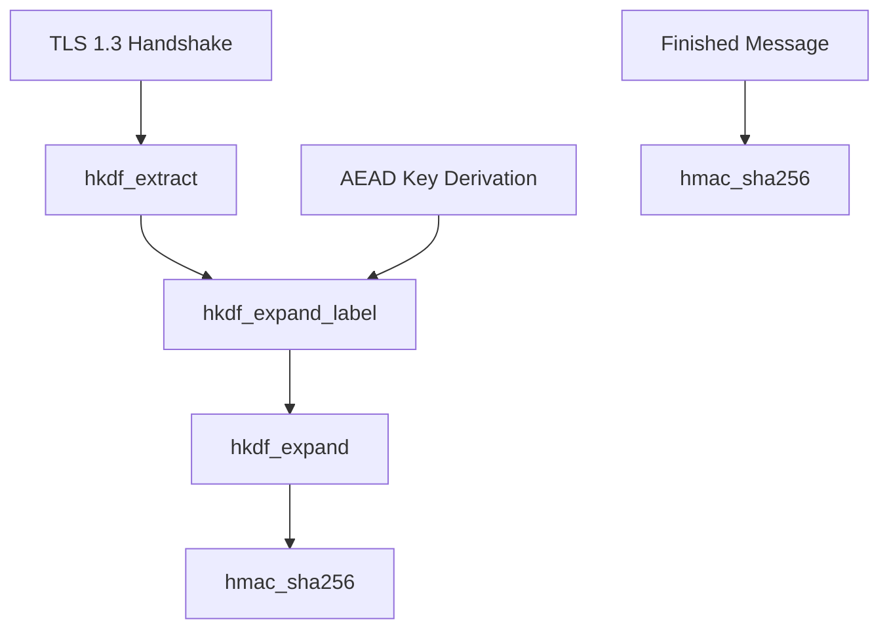

# HKDF 密钥派生

HKDF（HMAC-based Extract-and-Expand Key Derivation Function）是基于 HMAC 的密钥派生函数，用于从共享密钥派生出多个子密钥。本模块提供 TLS 1.3 密钥调度所需的全部原语。

## 源码位置

- 头文件：`I:/code/Prism/include/prism/crypto/hkdf.hpp`

## 常量定义

```cpp
constexpr std::size_t SHA256_LEN = 32;  // SHA-256 输出长度
constexpr std::size_t SHA512_LEN = 64;  // SHA-512 输出长度
```

## 函数详解

### hmac_sha256

```cpp
[[nodiscard]] auto hmac_sha256(std::span<const std::uint8_t> key,
                                std::span<const std::uint8_t> data)
    -> std::array<std::uint8_t, SHA256_LEN>;
```

计算 HMAC-SHA256，用于 HKDF-Extract 和 TLS 1.3 Finished 消息验证。

**参数**：
- `key`：HMAC 密钥
- `data`：输入数据

**返回值**：32 字节 HMAC-SHA256 结果

**内部实现**：
```
HMAC-SHA256(K, M) = H((K ⊕ opad) || H((K ⊕ ipad) || M))
```

### hmac_sha512

```cpp
[[nodiscard]] auto hmac_sha512(std::span<const std::uint8_t> key,
                                std::span<const std::uint8_t> data)
    -> std::array<std::uint8_t, SHA512_LEN>;
```

计算 HMAC-SHA512。

**参数**：
- `key`：HMAC 密钥
- `data`：输入数据

**返回值**：64 字节 HMAC-SHA512 结果

### hkdf_extract

```cpp
[[nodiscard]] auto hkdf_extract(std::span<const std::uint8_t> salt,
                                std::span<const std::uint8_t> ikm)
    -> std::array<std::uint8_t, SHA256_LEN>;
```

HKDF-Extract 步骤，从输入密钥材料提取伪随机密钥。

**参数**：
- `salt`：盐值（可以为空，空时使用 32 字节全零）
- `ikm`：输入密钥材料（Input Key Material）

**返回值**：32 字节伪随机密钥（PRK）

**计算过程**：
```
PRK = HMAC-SHA256(salt, IKM)
```

### hkdf_expand

```cpp
[[nodiscard]] auto hkdf_expand(std::span<const std::uint8_t> prk,
                               std::span<const std::uint8_t> info,
                               std::size_t length)
    -> std::pair<fault::code, std::vector<std::uint8_t>>;
```

HKDF-Expand 步骤，从 PRK 派生指定长度的输出密钥材料。

**参数**：
- `prk`：伪随机密钥（32 字节）
- `info`：上下文信息
- `length`：输出长度（最大 255 * 32 = 8160 字节）

**返回值**：错误码和输出字节的配对

**计算过程**（RFC 5869）：
```
T(0) = empty string (zero length)
T(1) = HMAC-SHA256(PRK, T(0) | info | 0x01)
T(2) = HMAC-SHA256(PRK, T(1) | info | 0x02)
T(n) = HMAC-SHA256(PRK, T(n-1) | info | n)
OKM = T(1) | T(2) | ... | T(n)[前 length 字节]
```

### hkdf_expand_label

```cpp
[[nodiscard]] auto hkdf_expand_label(std::span<const std::uint8_t> secret,
                                      std::string_view label,
                                      std::span<const std::uint8_t> context,
                                      std::size_t length)
    -> std::pair<fault::code, std::vector<std::uint8_t>>;
```

TLS 1.3 HKDF-Expand-Label 函数，用于 TLS 1.3 密钥调度。

**参数**：
- `secret`：输入密钥
- `label`：标签（如 "key", "iv", "finished", "c hs traffic"）
- `context`：上下文数据（通常是 transcript hash）
- `length`：输出长度

**返回值**：错误码和输出字节的配对

**计算过程**（RFC 8446 Section 7.1）：
```
HkdfLabel 结构:
  uint16 length = Length;
  opaque label<7..255> = "tls13 " + Label;
  opaque context<0..255> = Context;

HKDF-Expand-Label(Secret, Label, Context, Length) =
    HKDF-Expand(Secret, HkdfLabel, Length)
```

**TLS 1.3 标签用途**：

| 标签 | 用途 |
|------|------|
| `c e traffic` | 客户端早期流量密钥 |
| `e exp master` | 早期导出主密钥 |
| `c hs traffic` | 客户端握手流量密钥 |
| `s hs traffic` | 服务端握手流量密钥 |
| `derived` | 派生下一阶段密钥 |
| `c ap traffic` | 客户端应用流量密钥 |
| `s ap traffic` | 服务端应用流量密钥 |
| `exp master` | 导出主密钥 |
| `res master` | 恢复主密钥 |
| `key` | AEAD 密钥 |
| `iv` | AEAD nonce 基值 |
| `finished` | Finished 消息密钥 |

### sha256

```cpp
[[nodiscard]] auto sha256(std::span<const std::uint8_t> data)
    -> std::array<std::uint8_t, SHA256_LEN>;

[[nodiscard]] auto sha256(std::span<const std::uint8_t> data1,
                          std::span<const std::uint8_t> data2)
    -> std::array<std::uint8_t, SHA256_LEN>;

[[nodiscard]] auto sha256(std::span<const std::uint8_t> data1,
                          std::span<const std::uint8_t> data2,
                          std::span<const std::uint8_t> data3)
    -> std::array<std::uint8_t, SHA256_LEN>;
```

计算 SHA-256 哈希值。支持 1-3 个数据块的拼接哈希，避免额外的内存分配。

**参数**：
- `data`/`data1`/`data2`/`data3`：输入数据块

**返回值**：32 字节 SHA-256 哈希值

**用途**：计算 TLS 1.3 transcript hash

## TLS 1.3 密钥调度

```
                    0
                    |
                    v
PSK -> HKDF-Extract = Early Secret
                    |
                    +-----> Derive-Secret(., "ext binder" | "res binder", "")
                    |                     = Binder Key
                    |
                    +-----> Derive-Secret(., "c e traffic", ClientHello)
                    |                     = Client Early Traffic Secret
                    |
                    +-----> Derive-Secret(., "e exp master", ClientHello)
                    |                     = Early Exporter Master Secret
                    v
              Derive-Secret(., "derived", "")
                    |
                    v
(EC)DHE -> HKDF-Extract = Handshake Secret
                    |
                    +-----> Derive-Secret(., "c hs traffic", ClientHello...ServerHello)
                    |                     = Client Handshake Traffic Secret
                    |
                    +-----> Derive-Secret(., "s hs traffic", ClientHello...ServerHello)
                    |                     = Server Handshake Traffic Secret
                    v
              Derive-Secret(., "derived", "")
                    |
                    v
0 -> HKDF-Extract = Master Secret
                    |
                    +-----> Derive-Secret(., "c ap traffic", ClientHello...ServerFinished)
                    |                     = Client Application Traffic Secret
                    |
                    +-----> Derive-Secret(., "s ap traffic", ClientHello...ServerFinished)
                    |                     = Server Application Traffic Secret
                    |
                    +-----> Derive-Secret(., "exp master", ClientHello...ServerFinished)
                    |                     = Exporter Master Secret
                    v
              Derive-Secret(., "res master", ClientHello...ClientFinished)
                                         = Resumption Master Secret
```

## 使用示例

### 派生 AEAD 密钥和 IV

```cpp
// 假设已有 handshake_secret 和 transcript_hash
std::array<std::uint8_t, 32> handshake_secret = /* ... */;
std::vector<std::uint8_t> transcript_hash = /* ... */;

// 派生客户端握手流量密钥
auto [code1, c_hs_secret] = hkdf_expand_label(handshake_secret, "c hs traffic", transcript_hash, 32);

// 从流量密钥派生 AEAD 密钥
auto [code2, key] = hkdf_expand_label(c_hs_secret, "key", {}, 16);

// 从流量密钥派生 nonce 基值
auto [code3, iv] = hkdf_expand_label(c_hs_secret, "iv", {}, 12);

// 初始化 AEAD 上下文
aead_context ctx(aead_cipher::aes_128_gcm, key);
```

### 计算 Finished 消息

```cpp
// 从流量密钥派生 finished_key
auto [code, finished_key] = hkdf_expand_label(traffic_secret, "finished", {}, 32);

// 计算 verify_data = HMAC-SHA256(finished_key, transcript_hash)
auto verify_data = hmac_sha256(finished_key, transcript_hash);
```

## 调用链



## 相关文档

- [[core/crypto/aead|aead]] - AEAD 认证加密（使用派生的密钥）
- [[core/crypto/x25519|x25519]] - X25519 密钥交换（生成共享密钥）
- [[core/crypto/blake3|blake3]] - BLAKE3 密钥派生（SS2022 替代方案）