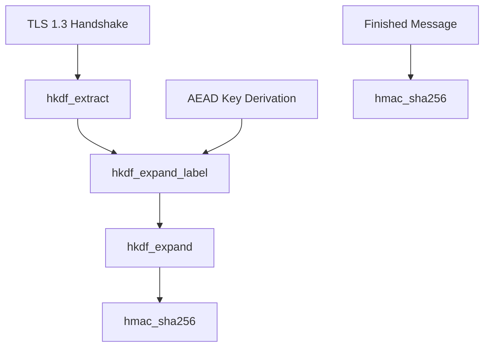

# HKDF 密钥派生

HKDF（HMAC-based Extract-and-Expand Key Derivation Function）是基于 HMAC 的密钥派生函数，用于从共享密钥派生出多个子密钥。本模块提供 TLS 1.3 密钥调度所需的全部原语。

## 设计决策

### 为什么 Extract/Expand 分离而非一步到位？

RFC 5869 将 HKDF 明确分为 Extract（提取伪随机性）和 Expand（扩展到所需长度）两个阶段。在 TLS 1.3 密钥调度中，Extract 在每个阶段调用一次（Early Secret、Handshake Secret、Master Secret），而 Expand 在同阶段内可多次调用以派生不同用途的子密钥（key、iv、finished）。分离设计避免重复计算 Extract。

**后果**: `hkdf_extract` 返回固定 32 字节 PRK，`hkdf_expand` 返回可变长度输出，两者签名不同，不可混用。

### 为什么 HKDF-Expand-Label 使用 struct 参数而非独立参数？

TLS 1.3 的 `HKDF-Expand-Label` 需要 4 个参数（secret、label、context、length）。按 Prism 编码规范 Rule 1（函数参数不超过 3 个），使用 `expand_params` 结构体收敛参数。

**后果**: 调用方需构造 `expand_params` 结构体，但参数含义更清晰，扩展时（如增加 `max_length` 校验）不改变函数签名。

### 为什么 info 用 `std::span` 而非 `std::vector`？

`info` 参数在 `hkdf_expand` 中作为只读输入，调用方可能持有 `std::array`、栈缓冲区或 vector 的数据。`std::span` 是零开销视图，避免不必要的拷贝和堆分配。

**后果**: 调用方必须保证 `span` 指向的内存在 `hkdf_expand` 调用期间有效，但对密码学函数而言这总是成立的（同步调用）。

### 为什么 sha256 提供三个重载而非一个 span 容器？

TLS 1.3 transcript hash 经常需要拼接 2-3 个数据块计算哈希（如 ClientHello...ServerHello）。三个重载使用 `EVP_DigestUpdate` 链式调用，避免拼接分配临时缓冲区。

**后果**: 如果需要拼接超过 3 个数据块，调用方需自行拼接后使用单参数版本。

## 约束

### HKDF-Expand 输出长度上限

**类型**: 资源上限

**规则**: `hkdf_expand` 的 `length` 参数不得超过 `255 * 32 = 8160` 字节（RFC 5869 限制，counter 仅 1 字节）

**违反后果**: 返回 `fault::code::invalid_argument`，空 vector

**源码依据**: `hkdf.cpp:68-71`

### PRK 最小长度

**类型**: 状态前置

**规则**: `hkdf_expand` 的 `prk` 参数不得少于 32 字节（SHA-256 输出长度）

**违反后果**: 返回 `fault::code::invalid_argument`，空 vector

**源码依据**: `hkdf.cpp:74-77`

### Expand-Label 参数长度限制

**类型**: 资源上限

**规则**: label（含 `"tls13 "` 前缀）不得超过 255 字节，context 不得超过 255 字节

**违反后果**: 返回 `fault::code::invalid_argument`，空 vector

**源码依据**: `hkdf.cpp:128-137`

## 源码位置

- 头文件：`I:/code/Prism/include/prism/crypto/hkdf.hpp`

## 常量定义

```cpp
constexpr std::size_t SHA256_LEN = 32;  // SHA-256 输出长度
constexpr std::size_t SHA512_LEN = 64;  // SHA-512 输出长度
```

## 函数详解

### hmac_sha256

```cpp
[[nodiscard]] auto hmac_sha256(std::span<const std::uint8_t> key,
                                std::span<const std::uint8_t> data)
    -> std::array<std::uint8_t, SHA256_LEN>;
```

计算 HMAC-SHA256，用于 HKDF-Extract 和 TLS 1.3 Finished 消息验证。

**参数**：
- `key`：HMAC 密钥
- `data`：输入数据

**返回值**：32 字节 HMAC-SHA256 结果

**内部实现**：
```
HMAC-SHA256(K, M) = H((K ⊕ opad) || H((K ⊕ ipad) || M))
```

### hmac_sha512

```cpp
[[nodiscard]] auto hmac_sha512(std::span<const std::uint8_t> key,
                                std::span<const std::uint8_t> data)
    -> std::array<std::uint8_t, SHA512_LEN>;
```

计算 HMAC-SHA512。

**参数**：
- `key`：HMAC 密钥
- `data`：输入数据

**返回值**：64 字节 HMAC-SHA512 结果

### hkdf_extract

```cpp
[[nodiscard]] auto hkdf_extract(std::span<const std::uint8_t> salt,
                                std::span<const std::uint8_t> ikm)
    -> std::array<std::uint8_t, SHA256_LEN>;
```

HKDF-Extract 步骤，从输入密钥材料提取伪随机密钥。

**参数**：
- `salt`：盐值（可以为空，空时使用 32 字节全零）
- `ikm`：输入密钥材料（Input Key Material）

**返回值**：32 字节伪随机密钥（PRK）

**计算过程**：
```
PRK = HMAC-SHA256(salt, IKM)
```

### hkdf_expand

```cpp
[[nodiscard]] auto hkdf_expand(std::span<const std::uint8_t> prk,
                               std::span<const std::uint8_t> info,
                               std::size_t length)
    -> std::pair<fault::code, std::vector<std::uint8_t>>;
```

HKDF-Expand 步骤，从 PRK 派生指定长度的输出密钥材料。

**参数**：
- `prk`：伪随机密钥（32 字节）
- `info`：上下文信息
- `length`：输出长度（最大 255 * 32 = 8160 字节）

**返回值**：错误码和输出字节的配对

**计算过程**（RFC 5869）：
```
T(0) = empty string (zero length)
T(1) = HMAC-SHA256(PRK, T(0) | info | 0x01)
T(2) = HMAC-SHA256(PRK, T(1) | info | 0x02)
T(n) = HMAC-SHA256(PRK, T(n-1) | info | n)
OKM = T(1) | T(2) | ... | T(n)[前 length 字节]
```

### hkdf_expand_label

```cpp
[[nodiscard]] auto hkdf_expand_label(std::span<const std::uint8_t> secret,
                                      std::string_view label,
                                      std::span<const std::uint8_t> context,
                                      std::size_t length)
    -> std::pair<fault::code, std::vector<std::uint8_t>>;
```

TLS 1.3 HKDF-Expand-Label 函数，用于 TLS 1.3 密钥调度。

**参数**：
- `secret`：输入密钥
- `label`：标签（如 "key", "iv", "finished", "c hs traffic"）
- `context`：上下文数据（通常是 transcript hash）
- `length`：输出长度

**返回值**：错误码和输出字节的配对

**计算过程**（RFC 8446 Section 7.1）：
```
HkdfLabel 结构:
  uint16 length = Length;
  opaque label<7..255> = "tls13 " + Label;
  opaque context<0..255> = Context;

HKDF-Expand-Label(Secret, Label, Context, Length) =
    HKDF-Expand(Secret, HkdfLabel, Length)
```

**TLS 1.3 标签用途**：

| 标签 | 用途 |
|------|------|
| `c e traffic` | 客户端早期流量密钥 |
| `e exp master` | 早期导出主密钥 |
| `c hs traffic` | 客户端握手流量密钥 |
| `s hs traffic` | 服务端握手流量密钥 |
| `derived` | 派生下一阶段密钥 |
| `c ap traffic` | 客户端应用流量密钥 |
| `s ap traffic` | 服务端应用流量密钥 |
| `exp master` | 导出主密钥 |
| `res master` | 恢复主密钥 |
| `key` | AEAD 密钥 |
| `iv` | AEAD nonce 基值 |
| `finished` | Finished 消息密钥 |

### sha256

```cpp
[[nodiscard]] auto sha256(std::span<const std::uint8_t> data)
    -> std::array<std::uint8_t, SHA256_LEN>;

[[nodiscard]] auto sha256(std::span<const std::uint8_t> data1,
                          std::span<const std::uint8_t> data2)
    -> std::array<std::uint8_t, SHA256_LEN>;

[[nodiscard]] auto sha256(std::span<const std::uint8_t> data1,
                          std::span<const std::uint8_t> data2,
                          std::span<const std::uint8_t> data3)
    -> std::array<std::uint8_t, SHA256_LEN>;
```

计算 SHA-256 哈希值。支持 1-3 个数据块的拼接哈希，避免额外的内存分配。

**参数**：
- `data`/`data1`/`data2`/`data3`：输入数据块

**返回值**：32 字节 SHA-256 哈希值

**用途**：计算 TLS 1.3 transcript hash

## TLS 1.3 密钥调度

```
                    0
                    |
                    v
PSK -> HKDF-Extract = Early Secret
                    |
                    +-----> Derive-Secret(., "ext binder" | "res binder", "")
                    |                     = Binder Key
                    |
                    +-----> Derive-Secret(., "c e traffic", ClientHello)
                    |                     = Client Early Traffic Secret
                    |
                    +-----> Derive-Secret(., "e exp master", ClientHello)
                    |                     = Early Exporter Master Secret
                    v
              Derive-Secret(., "derived", "")
                    |
                    v
(EC)DHE -> HKDF-Extract = Handshake Secret
                    |
                    +-----> Derive-Secret(., "c hs traffic", ClientHello...ServerHello)
                    |                     = Client Handshake Traffic Secret
                    |
                    +-----> Derive-Secret(., "s hs traffic", ClientHello...ServerHello)
                    |                     = Server Handshake Traffic Secret
                    v
              Derive-Secret(., "derived", "")
                    |
                    v
0 -> HKDF-Extract = Master Secret
                    |
                    +-----> Derive-Secret(., "c ap traffic", ClientHello...ServerFinished)
                    |                     = Client Application Traffic Secret
                    |
                    +-----> Derive-Secret(., "s ap traffic", ClientHello...ServerFinished)
                    |                     = Server Application Traffic Secret
                    |
                    +-----> Derive-Secret(., "exp master", ClientHello...ServerFinished)
                    |                     = Exporter Master Secret
                    v
              Derive-Secret(., "res master", ClientHello...ClientFinished)
                                         = Resumption Master Secret
```

## 使用示例

### 派生 AEAD 密钥和 IV

```cpp
// 假设已有 handshake_secret 和 transcript_hash
std::array<std::uint8_t, 32> handshake_secret = /* ... */;
std::vector<std::uint8_t> transcript_hash = /* ... */;

// 派生客户端握手流量密钥
auto [code1, c_hs_secret] = hkdf_expand_label(handshake_secret, "c hs traffic", transcript_hash, 32);

// 从流量密钥派生 AEAD 密钥
auto [code2, key] = hkdf_expand_label(c_hs_secret, "key", {}, 16);

// 从流量密钥派生 nonce 基值
auto [code3, iv] = hkdf_expand_label(c_hs_secret, "iv", {}, 12);

// 初始化 AEAD 上下文
aead_context ctx(aead_cipher::aes_128_gcm, key);
```

### 计算 Finished 消息

```cpp
// 从流量密钥派生 finished_key
auto [code, finished_key] = hkdf_expand_label(traffic_secret, "finished", {}, 32);

// 计算 verify_data = HMAC-SHA256(finished_key, transcript_hash)
auto verify_data = hmac_sha256(finished_key, transcript_hash);
```

## 调用链



## 故障场景

### HMAC 计算失败

**触发条件**: BoringSSL `HMAC()` 返回 nullptr（极罕见，通常是内存不足或 EVP 初始化失败）

**传播路径**: `HMAC` 返回 nullptr -> `trace::error` 记录日志 -> 返回全零 `std::array`

**外部表现**: 派生出全零密钥，后续 AEAD 操作全部失败，TLS 握手无法完成

**恢复机制**: 无法在运行时恢复，需重启进程

**日志关键字**: `"HMAC-SHA256 计算失败"` 或 `"HMAC-SHA512 计算失败"`

### HKDF-Expand PRK 过短

**触发条件**: 调用方传入不足 32 字节的 PRK

**传播路径**: 长度检查失败 -> 返回 `fault::code::invalid_argument` -> 空向量

**外部表现**: 密钥派生返回空结果，调用方无法初始化 AEAD 上下文

**恢复机制**: 修正调用方，确保 PRK 来自 `hkdf_extract` 的 32 字节输出

**日志关键字**: `"HKDF-Expand PRK 过短"`

### Expand-Label 标签过长

**触发条件**: label 字符串加 `"tls13 "` 前缀后超过 255 字节

**传播路径**: 长度检查失败 -> 返回 `fault::code::invalid_argument` -> 空向量

**外部表现**: Reality 握手无法派生密钥

**恢复机制**: 检查调用方传入的 label 字符串长度

**日志关键字**: `"HKDF-Expand-Label 标签过长"`

### 跨模块契约

| 模块 A | 模块 B | 契约内容 |
|--------|--------|---------|
| [[core/stealth/reality/auth\|Reality auth]] | [[core/crypto/hkdf\|hkdf]] | Reality 使用 `expand_label` 从 X25519 共享密钥派生 AEAD key/IV，label 遵循 RFC 8446 |
| [[core/stealth/reality/auth\|Reality auth]] | [[core/crypto/hkdf\|hkdf]] | 使用 `hmac_sha256` 计算 Finished 消息的 verify_data |
| [[core/stealth/reality/keygen\|Reality keygen]] | [[core/crypto/hkdf\|hkdf]] | 密钥生成使用 `hkdf_extract` + `expand_label` 链 |
| [[core/crypto/aead\|aead]] | [[core/crypto/hkdf\|hkdf]] | hkdf 输出必须与 aead 密钥长度匹配（AES-128=16, AES-256=32） |

## 变更敏感度

### 对外影响

| 变更 | 影响范围 | 影响 |
|------|---------|------|
| 修改 `"tls13 "` 前缀 | `expand_label` 调用方 | Reality 握手派生密钥不兼容，连接断开 |
| 修改 `sha256_len` 常量 | 全部 HKDF 函数 | HMAC 输出长度变化，TLS 1.3 密钥调度完全失败 |
| 修改 `hkdf_expand` 的 counter 起始值 | 全部 Expand 调用方 | 派生结果不同，与标准实现不兼容 |

### 对内影响

| 上游变更 | 本模块受影响 | 需要检查 |
|---------|------------|---------|
| BoringSSL 升级 | `HMAC()`、`SHA256()`、`EVP_*` API | `hkdf.cpp` 全部 OpenSSL 调用 |
| TLS 1.3 RFC 修订 | label 名称、HkdfLabel 结构 | `expand_label` 的序列化逻辑 |
| `fault::code` 枚举变更 | 返回值处理 | 全部 `hkdf_expand`/`expand_label` 调用方 |

## 相关文档

- [[core/crypto/aead|aead]] - AEAD 认证加密（使用派生的密钥）
- [[core/crypto/x25519|x25519]] - X25519 密钥交换（生成共享密钥）
- [[core/crypto/blake3|blake3]] - BLAKE3 密钥派生（SS2022 替代方案）