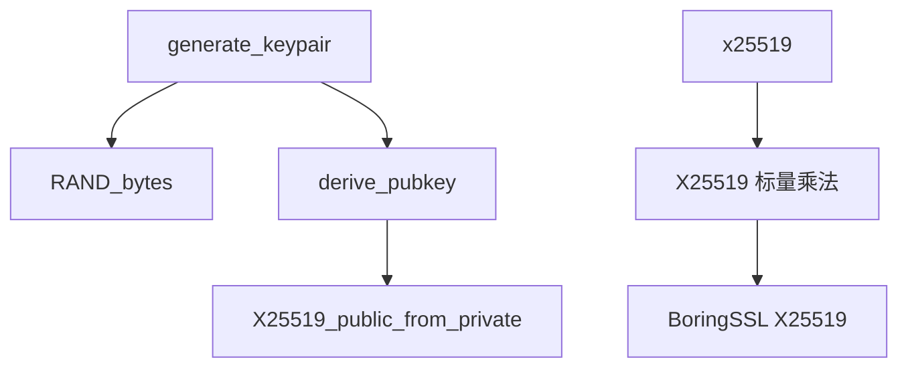

# X25519 密钥交换

X25519 是基于 Curve25519 椭圆曲线的 Diffie-Hellman 密钥交换算法，提供 128 位安全强度。本模块用于 Reality 协议的 ECDHE 密钥交换和 Ed25519 签名。

## 设计决策

### 为什么检查返回 `fault::code` 而非全零共享密钥？

BoringSSL 的 `X25519()` 函数在遇到低阶点时返回 0（计算失败），但返回的共享密钥可能是全零。本模块将 `X25519()` 返回值映射为 `fault::code::kexfail`，同时显式 `fill(0)` 共享密钥，确保调用方不会误用无效共享密钥。

**后果**: 调用方必须检查 `fault::code` 而非共享密钥是否全零。Reality 握手代码在 `x25519()` 返回非 `success` 时立即中断握手。

### 为什么私钥用 `std::array<uint8_t, 32>` 而非 `std::vector`？

X25519 密钥长度固定为 32 字节，无需动态大小。`std::array` 在栈上分配，零堆开销，且编译器可优化为寄存器操作。这对于每个连接都执行密钥交换的热路径至关重要。

**后果**: 密钥数据存储在栈上，函数返回后即失效，调用方需及时复制结果。

### 为什么使用 `X25519_public_from_private` 而非通用 EVP_PKEY API？

`X25519_public_from_private` 是 BoringSSL 提供的专用优化路径，直接从私钥计算公钥，无需创建 `EVP_PKEY` 对象。比通用的 `EVP_PKEY_keygen` 路径少两次堆分配和一次内存拷贝。

**后果**: 代码与 BoringSSL 绑定更深，不兼容 OpenSSL 1.x（需 OpenSSL 3.0+ 的等效函数）。

## 约束

### 密钥长度固定

**类型**: 调用顺序

**规则**: `private_key` 和 `peer_pubkey` 必须恰好 32 字节

**违反后果**: `derive_pubkey` 返回全零，`x25519` 返回 `fault::code::invalid_argument`

**源码依据**: `x25519.cpp:34`（derive_pubkey 长度检查），`x25519.cpp:51-60`（x25519 长度检查）

### 全零共享密钥检测

**类型**: 安全性

**规则**: 当 BoringSSL `X25519()` 返回 0 时，共享密钥被显式 `fill(0)` 并返回 `fault::code::kexfail`

**违反后果**: 若调用方忽略返回码并使用全零共享密钥，后续派生的 AEAD 密钥可被预测

**源码依据**: `x25519.cpp:63-68`

## 源码位置

- 头文件：`include/prism/crypto/x25519.hpp`

## 常量定义

```cpp
constexpr std::size_t X25519_KEY_LEN = 32;       // X25519 密钥长度
constexpr std::size_t X25519_SHARED_LEN = 32;    // X25519 共享密钥长度
constexpr std::size_t ED25519_KEY_LEN = 32;      // Ed25519 公钥长度
constexpr std::size_t ED25519_PRIVATE_KEY_LEN = 64;  // Ed25519 完整私钥长度
```

## 数据结构

### x25519_keypair

```cpp
struct x25519_keypair
{
    std::array<std::uint8_t, X25519_KEY_LEN> private_key{};  // X25519 私钥（32 字节标量）
    std::array<std::uint8_t, X25519_KEY_LEN> public_key{};   // X25519 公钥（Curve25519 上的点）
};
```

X25519 密钥对，包含私钥和对应的公钥，各 32 字节。私钥是随机生成的 32 字节标量，公钥是 Curve25519 上的点。

### ed25519_keypair

```cpp
struct ed25519_keypair
{
    std::array<std::uint8_t, ED25519_PRIVATE_KEY_LEN> private_key{};  // Ed25519 完整私钥（64 字节）
    std::array<std::uint8_t, ED25519_KEY_LEN> public_key{};           // Ed25519 公钥（32 字节）
};
```

Ed25519 密钥对，用于 Reality 协议的服务端自签名证书生成和 CertificateVerify 签名。完整私钥包含 32 字节种子和 32 字节公钥。

## 函数详解

### generate_x25519_keypair

```cpp
[[nodiscard]] auto generate_x25519_keypair() -> x25519_keypair;
```

生成随机 X25519 密钥对。

**返回值**：随机生成的 X25519 密钥对

**实现细节**：
1. 使用 BoringSSL 的随机数生成器生成 32 字节私钥
2. 调用 `derive_x25519_public_key` 计算公钥

**安全性**：使用 BoringSSL 的 `RAND_bytes` 生成密码学安全随机数。

### derive_x25519_public_key

```cpp
[[nodiscard]] auto derive_x25519_public_key(std::span<const std::uint8_t> private_key)
    -> std::array<std::uint8_t, X25519_KEY_LEN>;
```

从私钥推导公钥。

**参数**：
- `private_key`：32 字节 X25519 私钥

**返回值**：推导出的 32 字节公钥，失败时返回全零

**数学原理**：
```
公钥 = X25519(私钥, 基点G)
```

X25519 标量乘法将私钥（标量）映射为 Curve25519 上的公钥点。

### x25519

```cpp
auto x25519(std::span<const std::uint8_t> private_key,
            std::span<const std::uint8_t> peer_public_key)
    -> std::pair<fault::code, std::array<std::uint8_t, X25519_SHARED_LEN>>;
```

执行 X25519 密钥交换，计算共享密钥。

**参数**：
- `private_key`：本方 32 字节 X25519 私钥
- `peer_public_key`：对方 32 字节 X25519 公钥

**返回值**：错误码和 32 字节共享密钥的配对

**数学原理**：
```
共享密钥 = X25519(私钥, 对方公钥)
         = 私钥 * 对方公钥（椭圆曲线点乘）
```

**安全性注意**：
- 即使对方公钥是低阶点，X25519 也会成功计算（输出全零）
- 调用者应检查共享密钥是否为全零以检测此类攻击
- 返回值 `fault::code::success` 仅表示计算过程无错误

## 使用示例

### ECDHE 密钥交换

```cpp
// 服务端生成密钥对
auto server_keypair = generate_x25519_keypair();

// 客户端生成密钥对
auto client_keypair = generate_x25519_keypair();

// 服务端计算共享密钥
auto [s_code, server_shared] = x25519(server_keypair.private_key, client_keypair.public_key);

// 客户端计算共享密钥
auto [c_code, client_shared] = x25519(client_keypair.private_key, server_keypair.public_key);

// server_shared == client_shared
```

### TLS 1.3 密钥交换流程

```
Client                                          Server
  |                                               |
  |------- ClientHello + KeyShare(X25519) ------>|
  |                                               |
  |<------ ServerHello + KeyShare(X25519) -------|
  |                                               |
  |                 [双方计算共享密钥]             |
  |     shared = X25519(private, peer_public)     |
  |                                               |
  |<------ EncryptedExtensions ------------------|
  |<------ Certificate --------------------------|
  |<------ CertificateVerify --------------------|
  |<------ Finished -----------------------------|
  |                                               |
  |------ Finished ----------------------------->|
  |                                               |
```

## Curve25519 椭圆曲线

### 曲线参数

```
y² = x³ + 486662x² + x (mod p)
p = 2²⁵⁵ - 19
```

### 安全特性

| 特性 | 说明 |
|------|------|
| 安全强度 | 128 位 |
| 密钥长度 | 32 字节 |
| 公钥长度 | 32 字节 |
| 共享密钥长度 | 32 字节 |
| 抗侧信道攻击 | 常数时间实现 |
| 抗弱随机数 | 私钥经过钳位处理 |

### 私钥钳位

X25519 私钥在计算前会进行钳位处理，确保：
- 清除最低 3 位（确保是 8 的倍数）
- 清除最高位
- 设置次高位

这消除了某些类型的弱私钥攻击。

## 与其他曲线比较

| 特性 | X25519 | P-256 | P-384 |
|------|--------|-------|-------|
| 安全强度 | 128 位 | 128 位 | 192 位 |
| 密钥长度 | 32 字节 | 32 字节 | 48 字节 |
| 性能 | 快 | 中等 | 慢 |
| 抗侧信道 | 强 | 依赖实现 | 依赖实现 |
| 实现复杂度 | 低 | 高 | 高 |

## 调用链



## 故障场景

### 低阶点攻击

**触发条件**: 对方发送的公钥是 Curve25519 上的低阶点（如全零、单位元等特殊值）

**传播路径**: BoringSSL `X25519()` 返回 0 -> 共享密钥 `fill(0)` -> 返回 `fault::code::kexfail` -> Reality 握手中断

**外部表现**: 客户端连接被拒绝，Reality 握手失败

**恢复机制**: 正常拒绝连接即可，攻击者无法获得有效会话

**日志关键字**: `"X25519 密钥交换失败"`

### 无效私钥长度

**触发条件**: 调用 `derive_pubkey` 或 `x25519` 时传入非 32 字节的私钥

**传播路径**: 长度检查失败 -> `trace::error` 记录 -> 返回 `fault::code::invalid_argument`（x25519）或全零（derive_pubkey）

**外部表现**: Reality 握手中公钥推导失败，后续无法进行密钥交换

**恢复机制**: 检查私钥来源（Base64 解码是否正确）

**日志关键字**: `"私钥长度无效"`

### 无效公钥长度

**触发条件**: 对方公钥非 32 字节

**传播路径**: 长度检查失败 -> 返回 `fault::code::invalid_argument`

**外部表现**: 同低阶点攻击

**恢复机制**: 检查 ClientHello 中 KeyShare 的解析逻辑

**日志关键字**: `"对端公钥长度无效"`

### 跨模块契约

| 模块 A | 模块 B | 契约内容 |
|--------|--------|---------|
| [[core/stealth/reality/handshake\|Reality handshake]] | [[core/crypto/x25519\|x25519]] | Reality 从 Base64 解码配置中的私钥，调用 `x25519()` 与 ClientHello 中的 KeyShare 计算共享密钥 |
| [[core/stealth/reality/auth\|Reality auth]] | [[core/crypto/x25519\|x25519]] | Reality auth 使用 `x25519()` + HKDF 派生 AEAD 密钥 |
| [[core/crypto/hkdf\|hkdf]] | [[core/crypto/x25519\|x25519]] | x25519 输出的 32 字节共享密钥作为 hkdf_extract 的 IKM 输入 |

## 变更敏感度

### 对外影响

| 变更 | 影响范围 | 影响 |
|------|---------|------|
| 修改 `x25519_klen` 常量 | 全部密钥交换调用方 | 密钥长度不匹配，Reality 握手失败 |
| `generate_keypair` 改用非 `RAND_bytes` 随机源 | 全部 ECDHE 连接 | 随机数质量下降可能导致私钥泄露 |

### 对内影响

| 上游变更 | 本模块受影响 | 需要检查 |
|---------|------------|---------|
| BoringSSL 升级 | `X25519()`、`X25519_public_from_private` API | `x25519.cpp:40` 和 `x25519.cpp:63` |
| Reality 协议扩展 | 增加 Ed25519 签名功能 | `ed25519_keypair` 结构体使用方 |

## 相关文档

- [[core/crypto/hkdf|hkdf]] - HKDF 密钥派生（从共享密钥派生会话密钥）
- [[core/crypto/aead|aead]] - AEAD 认证加密（使用派生的密钥）