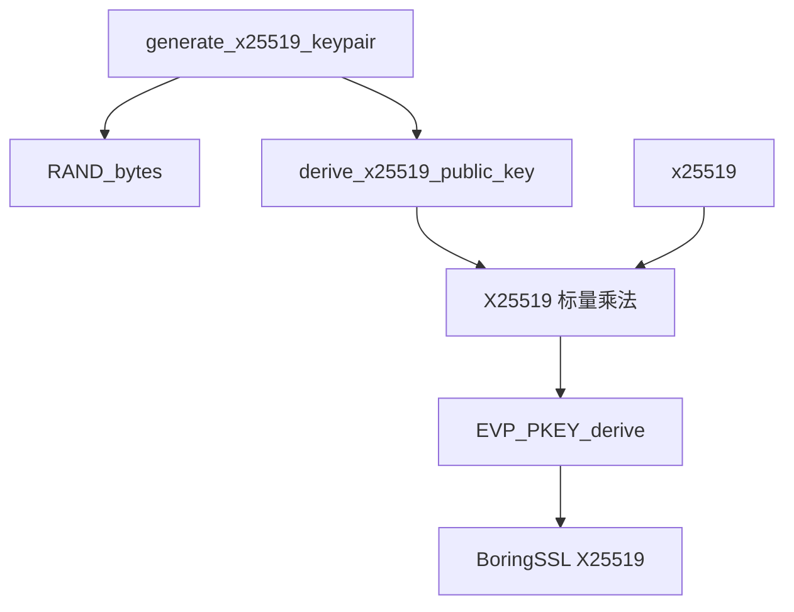

# X25519 密钥交换

X25519 是基于 Curve25519 椭圆曲线的 Diffie-Hellman 密钥交换算法，提供 128 位安全强度。本模块用于 Reality 协议的 ECDHE 密钥交换和 Ed25519 签名。

## 源码位置

- 头文件：`I:/code/Prism/include/prism/crypto/x25519.hpp`

## 常量定义

```cpp
constexpr std::size_t X25519_KEY_LEN = 32;       // X25519 密钥长度
constexpr std::size_t X25519_SHARED_LEN = 32;    // X25519 共享密钥长度
constexpr std::size_t ED25519_KEY_LEN = 32;      // Ed25519 公钥长度
constexpr std::size_t ED25519_PRIVATE_KEY_LEN = 64;  // Ed25519 完整私钥长度
```

## 数据结构

### x25519_keypair

```cpp
struct x25519_keypair
{
    std::array<std::uint8_t, X25519_KEY_LEN> private_key{};  // X25519 私钥（32 字节标量）
    std::array<std::uint8_t, X25519_KEY_LEN> public_key{};   // X25519 公钥（Curve25519 上的点）
};
```

X25519 密钥对，包含私钥和对应的公钥，各 32 字节。私钥是随机生成的 32 字节标量，公钥是 Curve25519 上的点。

### ed25519_keypair

```cpp
struct ed25519_keypair
{
    std::array<std::uint8_t, ED25519_PRIVATE_KEY_LEN> private_key{};  // Ed25519 完整私钥（64 字节）
    std::array<std::uint8_t, ED25519_KEY_LEN> public_key{};           // Ed25519 公钥（32 字节）
};
```

Ed25519 密钥对，用于 Reality 协议的服务端自签名证书生成和 CertificateVerify 签名。完整私钥包含 32 字节种子和 32 字节公钥。

## 函数详解

### generate_x25519_keypair

```cpp
[[nodiscard]] auto generate_x25519_keypair() -> x25519_keypair;
```

生成随机 X25519 密钥对。

**返回值**：随机生成的 X25519 密钥对

**实现细节**：
1. 使用 BoringSSL 的随机数生成器生成 32 字节私钥
2. 调用 `derive_x25519_public_key` 计算公钥

**安全性**：使用 BoringSSL 的 `RAND_bytes` 生成密码学安全随机数。

### derive_x25519_public_key

```cpp
[[nodiscard]] auto derive_x25519_public_key(std::span<const std::uint8_t> private_key)
    -> std::array<std::uint8_t, X25519_KEY_LEN>;
```

从私钥推导公钥。

**参数**：
- `private_key`：32 字节 X25519 私钥

**返回值**：推导出的 32 字节公钥，失败时返回全零

**数学原理**：
```
公钥 = X25519(私钥, 基点G)
```

X25519 标量乘法将私钥（标量）映射为 Curve25519 上的公钥点。

### x25519

```cpp
auto x25519(std::span<const std::uint8_t> private_key,
            std::span<const std::uint8_t> peer_public_key)
    -> std::pair<fault::code, std::array<std::uint8_t, X25519_SHARED_LEN>>;
```

执行 X25519 密钥交换，计算共享密钥。

**参数**：
- `private_key`：本方 32 字节 X25519 私钥
- `peer_public_key`：对方 32 字节 X25519 公钥

**返回值**：错误码和 32 字节共享密钥的配对

**数学原理**：
```
共享密钥 = X25519(私钥, 对方公钥)
         = 私钥 * 对方公钥（椭圆曲线点乘）
```

**安全性注意**：
- 即使对方公钥是低阶点，X25519 也会成功计算（输出全零）
- 调用者应检查共享密钥是否为全零以检测此类攻击
- 返回值 `fault::code::success` 仅表示计算过程无错误

## 使用示例

### ECDHE 密钥交换

```cpp
// 服务端生成密钥对
auto server_keypair = generate_x25519_keypair();

// 客户端生成密钥对
auto client_keypair = generate_x25519_keypair();

// 服务端计算共享密钥
auto [s_code, server_shared] = x25519(server_keypair.private_key, client_keypair.public_key);

// 客户端计算共享密钥
auto [c_code, client_shared] = x25519(client_keypair.private_key, server_keypair.public_key);

// server_shared == client_shared
```

### TLS 1.3 密钥交换流程

```
Client                                          Server
  |                                               |
  |------- ClientHello + KeyShare(X25519) ------>|
  |                                               |
  |<------ ServerHello + KeyShare(X25519) -------|
  |                                               |
  |                 [双方计算共享密钥]             |
  |     shared = X25519(private, peer_public)     |
  |                                               |
  |<------ EncryptedExtensions ------------------|
  |<------ Certificate --------------------------|
  |<------ CertificateVerify --------------------|
  |<------ Finished -----------------------------|
  |                                               |
  |------ Finished ----------------------------->|
  |                                               |
```

## Curve25519 椭圆曲线

### 曲线参数

```
y² = x³ + 486662x² + x (mod p)
p = 2²⁵⁵ - 19
```

### 安全特性

| 特性 | 说明 |
|------|------|
| 安全强度 | 128 位 |
| 密钥长度 | 32 字节 |
| 公钥长度 | 32 字节 |
| 共享密钥长度 | 32 字节 |
| 抗侧信道攻击 | 常数时间实现 |
| 抗弱随机数 | 私钥经过钳位处理 |

### 私钥钳位

X25519 私钥在计算前会进行钳位处理，确保：
- 清除最低 3 位（确保是 8 的倍数）
- 清除最高位
- 设置次高位

这消除了某些类型的弱私钥攻击。

## 与其他曲线比较

| 特性 | X25519 | P-256 | P-384 |
|------|--------|-------|-------|
| 安全强度 | 128 位 | 128 位 | 192 位 |
| 密钥长度 | 32 字节 | 32 字节 | 48 字节 |
| 性能 | 快 | 中等 | 慢 |
| 抗侧信道 | 强 | 依赖实现 | 依赖实现 |
| 实现复杂度 | 低 | 高 | 高 |

## 调用链



## 相关文档

- [[hkdf]] - HKDF 密钥派生（从共享密钥派生会话密钥）
- [[aead]] - AEAD 认证加密（使用派生的密钥）