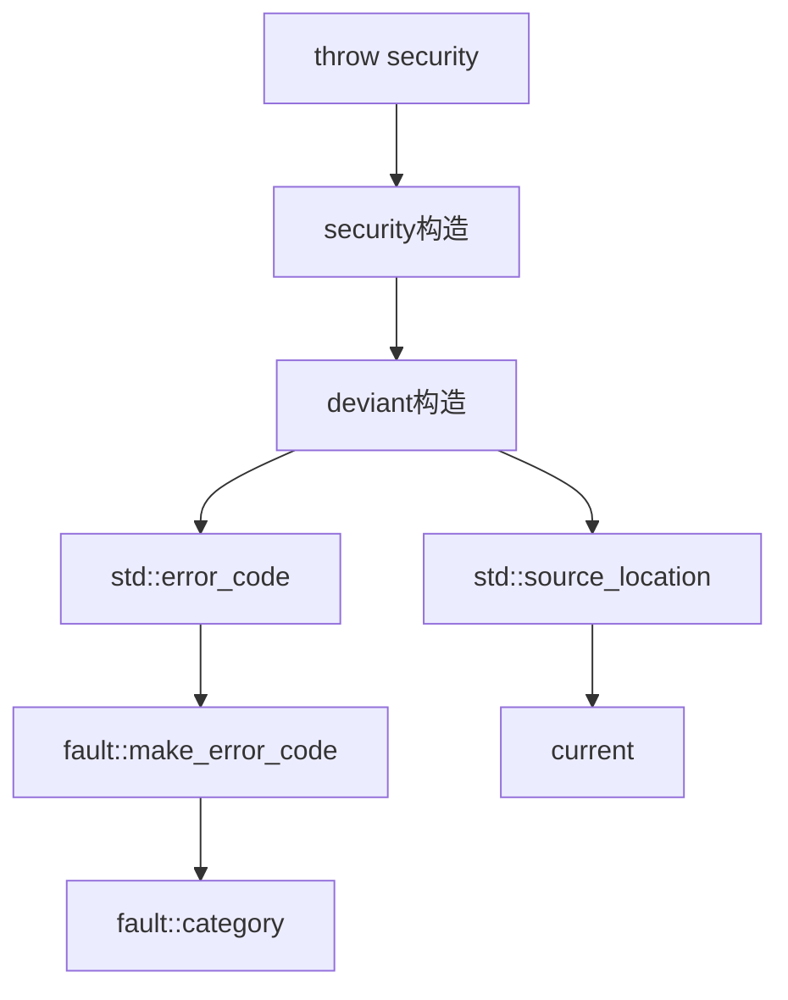

# Exception Deviant

项目异常基类，所有自定义异常的抽象基类。

## 源码位置

`I:/code/Prism/include/prism/exception/deviant.hpp`

## 设计目标

- **错误码集成**: 核心存储 `std::error_code`
- **源位置捕获**: 自动捕获抛出点位置
- **格式化消息**: 支持 `std::format` 格式化
- **类型分类**: 子类必须实现 `type_name()`

## 类定义

```cpp
class deviant : public std::runtime_error {
public:
    // 主构造函数（错误码 + 可选描述）
    explicit deviant(std::error_code ec, std::string_view desc = {},
                     const std::source_location &loc = std::source_location::current());
    
    // 向后兼容构造函数
    explicit deviant(const std::string &msg,
                     const std::source_location &loc = std::source_location::current());
    
    // 格式化构造函数
    template <typename... Args>
    explicit deviant(const std::source_location &loc,
                     std::format_string<Args...> fmt, Args &&...args);
    
    // 访问器
    const std::error_code &error_code() const noexcept;
    const std::source_location &location() const noexcept;
    std::string filename() const;
    
    // 格式化输出
    virtual std::string dump() const;
    
protected:
    // 子类必须实现
    virtual std::string_view type_name() const noexcept = 0;
    
private:
    std::error_code ec_;
    std::source_location location_;
};
```

## 构造函数

### 推荐：错误码构造

```cpp
throw deviant(
    fault::make_error_code(fault::code::parse_error),
    "额外的上下文信息"
);
```

### 向后兼容：字符串构造

```cpp
throw deviant("错误消息");  // 转换为 generic_error
```

建议迁移到错误码构造函数以保留分类信息。

### 格式化构造

```cpp
throw deviant(
    std::source_location::current(),
    "配置项 {} 无效: {}",
    name, value
);
```

## 访问器

| 方法 | 返回 | 说明 |
|------|------|------|
| `error_code()` | `std::error_code&` | 错误码对象 |
| `location()` | `source_location&` | 源码位置 |
| `filename()` | `std::string` | 文件名(不含路径) |
| `dump()` | `std::string` | 格式化信息 |

## dump 输出格式

```cpp
// [filename:line] [TYPE:value] description
// 示例: [loader.cpp:38] [SECURITY:29] file open failed: /etc/prism/config.json
```

## 子类实现

```cpp
class security : public deviant {
public:
    explicit security(fault::code err,
                      const std::source_location &loc = std::source_location::current())
        : deviant(fault::make_error_code(err), {}, loc) {}
    
protected:
    std::string_view type_name() const noexcept override { return "SECURITY"; }
};
```

## 调用链



## 相关页面

- [[core/exception/overview]] - Exception模块总览
- [[core/fault/code]] - 错误码枚举
- [[core/fault/compatible]] - 错误码兼容性