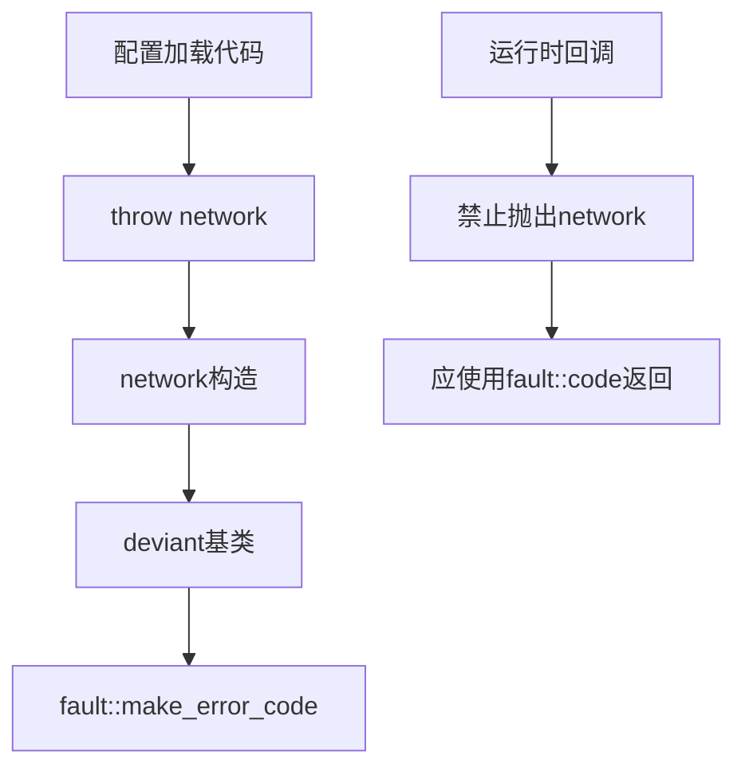

# Exception Network

网络异常类，用于处理网络配置和初始化阶段的错误。

## 源码位置

`I:/code/Prism/include/prism/exception/network.hpp`

## 适用场景

- 网络配置加载失败
- DNS解析配置错误
- 上游服务器配置无效
- 端口绑定失败

**运行时网络I/O错误应使用错误码而非异常。**

## 类定义

```cpp
class network : public deviant {
public:
    // 错误码构造
    explicit network(fault::code err,
                     const std::source_location &loc = std::source_location::current());
    
    // 错误码 + 描述
    explicit network(fault::code err, std::string_view desc,
                     const std::source_location &loc = std::source_location::current());
    
    // 向后兼容字符串构造
    explicit network(const std::string &msg,
                     const std::source_location &loc = std::source_location::current());
    
    // 格式化构造
    template <typename... Args>
    explicit network(std::format_string<Args...> fmt, Args &&...args);
    
protected:
    std::string_view type_name() const noexcept override { return "NETWORK"; }
};
```

## 相关错误码

| 错误码 | 说明 |
|--------|------|
| `dns_failed` | DNS配置错误 |
| `upstream_unreachable` | 上游服务器不可达 |
| `connection_refused` | 连接被拒绝 |
| `host_unreachable` | 主机不可达 |
| `network_unreachable` | 网络不可达 |
| `port_already_in_use` | 端口已被占用 |

## 使用示例

```cpp
// 配置加载
if (!validate_upstream_config(cfg)) {
    throw exception::network(
        fault::code::upstream_unreachable,
        "上游服务器地址无效"
    );
}

// DNS配置
if (!setup_dns_resolver(dns_config)) {
    throw exception::network(fault::code::dns_failed);
}

// 端口绑定
if (!bind_listener(port)) {
    throw exception::network(
        fault::code::port_already_in_use,
        std::format("端口 {} 已被占用", port)
    );
}
```

## 禁止用法

```cpp
// 错误！运行时网络I/O错误应使用错误码
void on_read_complete(boost::system::error_code ec) {
    if (ec) {
        // throw exception::network(...);  // 禁止
        return fault::to_code(ec);         // 正确
    }
}
```

## dump 输出

```cpp
// [listener.cpp:89] [NETWORK:31] 端口已被占用: 8080
```

## 调用链



## 相关页面

- [[core/exception/overview]] - Exception模块总览
- [[core/exception/deviant]] - 异常基类
- [[core/fault/code]] - 错误码枚举