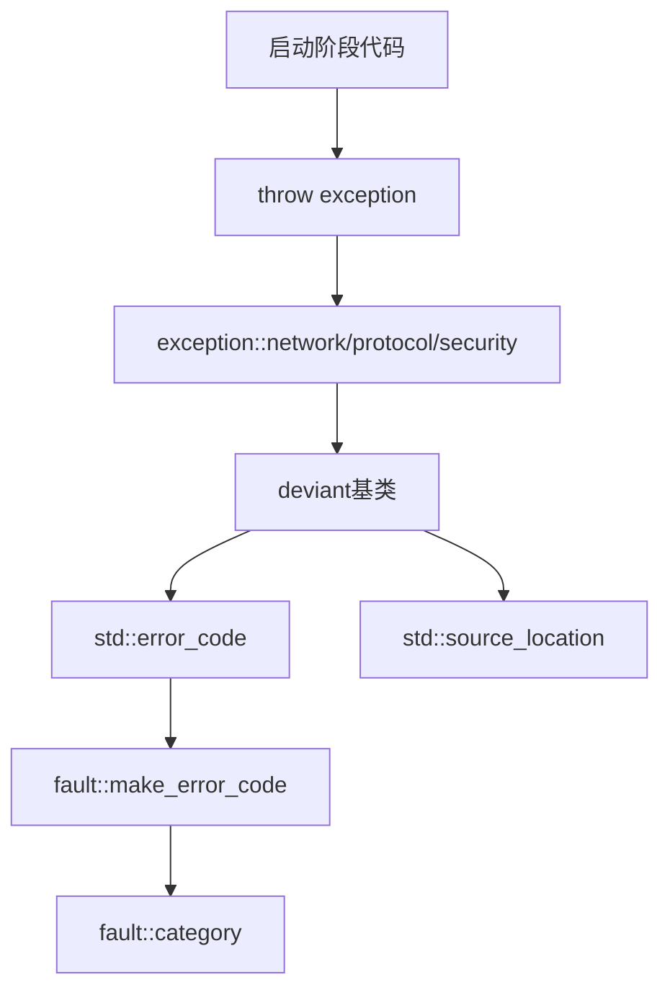

# Exception 模块

Exception 模块提供结构化异常系统，基于 `std::error_code` 架构，支持源位置捕获和格式化消息。

## 设计原则

- **热路径无异常**: 网络I/O、协议解析等高频路径使用错误码
- **启动阶段专用**: 异常仅用于配置解析、资源初始化等启动阶段
- **结构化信息**: 基于 `std::error_code`，自动捕获源码位置

## 模块组成

| 组件 | 说明 | 源码 |
|------|------|------|
| [[core/exception/deviant]] | 异常基类 | `prism/exception/deviant.hpp` |
| [[core/exception/network]] | 网络异常 | `prism/exception/network.hpp` |
| [[core/exception/protocol]] | 协议异常 | `prism/exception/protocol.hpp` |
| [[core/exception/security]] | 安全异常 | `prism/exception/security.hpp` |

## 异常分类

| 异常类型 | 用途 | type_name |
|----------|------|-----------|
| `deviant` | 基类(抽象) | 子类实现 |
| `network` | 网络配置错误 | NETWORK |
| `protocol` | 协议解析错误 | PROTOCOL |
| `security` | 安全配置错误 | SECURITY |

## 核心特性

### 错误码集成

所有异常存储 `std::error_code`，保留结构化错误信息：

```cpp
try {
    // ...
} catch (const exception::security &e) {
    auto ec = e.error_code();        // 获取错误码
    auto loc = e.location();         // 获取源码位置
    std::cout << e.dump();           // 格式化输出
}
```

### 源位置捕获

使用 `std::source_location` 自动捕获抛出点：

```cpp
throw exception::security(fault::code::ssl_cert_load_failed);
// 自动捕获文件名、行号、函数名
```

### dump 格式

```cpp
// 输出格式: [filename:line] [TYPE:value] description
// 示例: [config.cpp:42] [SECURITY:26] SSL证书加载失败
```

## 调用链



## 使用指南

### 启动阶段

```cpp
// 配置加载失败
if (!load_config(path)) {
    throw exception::security(fault::code::config_parse_error, "invalid json");
}

// 资源初始化失败
if (!init_tls(cert, key)) {
    throw exception::security(fault::code::ssl_cert_load_failed);
}
```

### 热路径

```cpp
// 禁止！运行时网络错误应使用错误码
// throw exception::network(fault::code::timeout);  // 错误

// 正确：返回错误码
return fault::code::timeout;
```

## 相关模块

- [[core/fault]] - 错误码系统
- [[core/memory]] - 内存系统