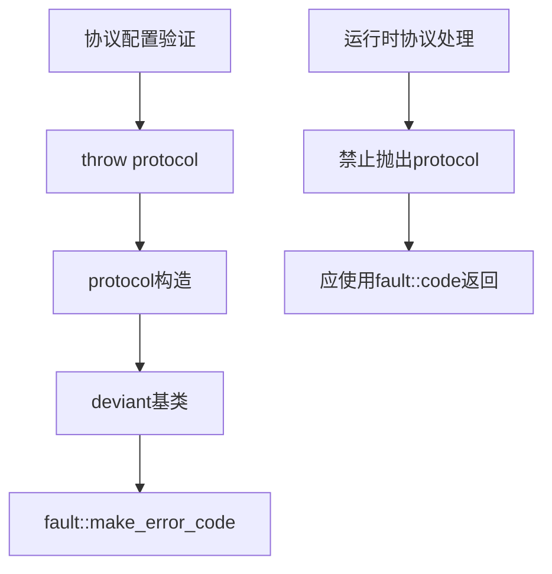

# Exception Protocol

协议异常类，用于处理协议解析、握手、格式验证等协议层错误。

## 源码位置

`I:/code/Prism/include/prism/exception/protocol.hpp`

## 适用场景

- 协议检测失败
- 握手验证失败
- 协议栈初始化错误
- 格式配置无效

**运行时协议错误应使用错误码机制。**

## 类定义

```cpp
class protocol : public deviant {
public:
    // 错误码构造
    explicit protocol(fault::code err,
                      const std::source_location &loc = std::source_location::current());
    
    // 错误码 + 描述
    explicit protocol(fault::code err, std::string_view desc,
                      const std::source_location &loc = std::source_location::current());
    
    // 向后兼容字符串构造
    explicit protocol(const std::string &msg,
                      const std::source_location &loc = std::source_location::current());
    
    // 格式化构造
    template <typename... Args>
    explicit protocol(std::format_string<Args...> fmt, Args &&...args);
    
protected:
    std::string_view type_name() const noexcept override { return "PROTOCOL"; }
};
```

## 相关错误码

| 错误码 | 说明 |
|--------|------|
| `protocol_error` | 协议错误 |
| `parse_error` | 解析错误 |
| `bad_message` | 消息格式错误 |
| `unsupported_command` | 不支持的命令 |
| `unsupported_address` | 不支持的地址类型 |
| `socks5_auth_negotiation_failed` | SOCKS5认证协商失败 |

## 使用示例

```cpp
// 协议配置验证
if (!validate_protocol_config(proto_cfg)) {
    throw exception::protocol(
        fault::code::protocol_error,
        "协议版本不兼容"
    );
}

// SOCKS5配置
if (!setup_socks5_auth(methods)) {
    throw exception::protocol(
        fault::code::socks5_auth_negotiation_failed
    );
}

// 地址类型检查
if (!is_supported_address_type(type)) {
    throw exception::protocol(
        fault::code::unsupported_address,
        std::format("地址类型 {} 不支持", type)
    );
}
```

## 错误范围

协议异常覆盖的错误类别：

| 类别 | 范围 | 说明 |
|------|------|------|
| 解析错误 | 2 | 配置/协议解析失败 |
| 协议错误 | 5, 19-25 | 协议格式/命令错误 |

## dump 输出

```cpp
// [protocol.cpp:56] [PROTOCOL:19] 不支持的命令: 0x07
```

## 调用链



## 相关页面

- [[core/exception/overview]] - Exception模块总览
- [[core/exception/deviant]] - 异常基类
- [[core/fault/code]] - 错误码枚举