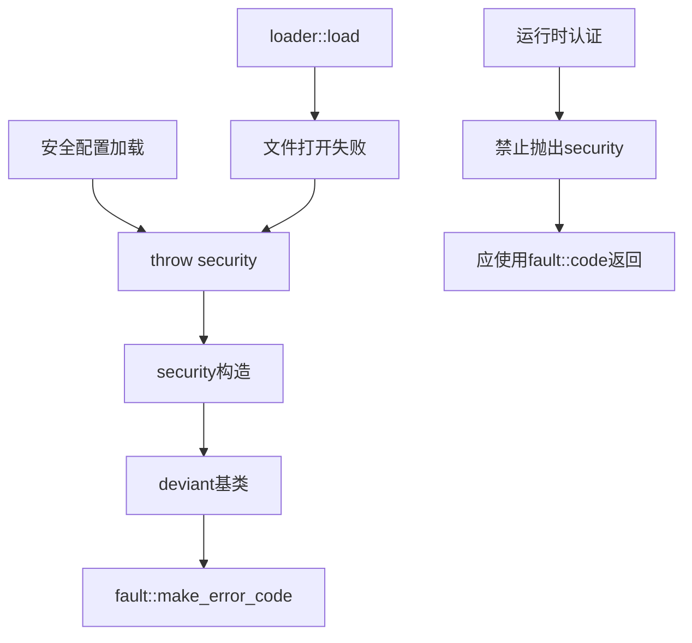

# Exception Security

安全异常类，用于处理安全配置、认证初始化等安全层错误。

## 源码位置

`I:/code/Prism/include/prism/exception/security.hpp`

## 适用场景

- SSL证书加载失败
- SSL密钥加载失败
- 证书验证失败
- 安全配置无效

**运行时认证/授权失败应使用错误码而非异常。**

## 类定义

```cpp
class security : public deviant {
public:
    // 错误码构造
    explicit security(fault::code err,
                      const std::source_location &loc = std::source_location::current());
    
    // 错误码 + 描述
    explicit security(fault::code err, std::string_view desc,
                      const std::source_location &loc = std::source_location::current());
    
    // 向后兼容字符串构造
    explicit security(const std::string &msg,
                      const std::source_location &loc = std::source_location::current());
    
    // 格式化构造
    template <typename... Args>
    explicit security(std::format_string<Args...> fmt, Args &&...args);
    
protected:
    std::string_view type_name() const noexcept override { return "SECURITY"; }
};
```

## 相关错误码

| 错误码 | 说明 |
|--------|------|
| `ssl_cert_load_failed` | SSL证书加载失败 |
| `ssl_key_load_failed` | SSL密钥加载失败 |
| `certificate_verification_failed` | 证书验证失败 |
| `auth_failed` | 认证失败 |
| `forbidden` | 禁止访问 |
| `tls_handshake_failed` | TLS握手失败 |

## 使用示例

```cpp
// 证书加载
if (!load_certificate(cert_path)) {
    throw exception::security(
        fault::code::ssl_cert_load_failed,
        std::format("证书文件不存在: {}", cert_path)
    );
}

// 密钥加载
if (!load_private_key(key_path)) {
    throw exception::security(fault::code::ssl_key_load_failed);
}

// 证书验证
if (!verify_certificate_chain()) {
    throw exception::security(
        fault::code::certificate_verification_failed,
        "证书链不完整"
    );
}

// 配置解析(loader使用)
std::ifstream file(path);
if (!file.is_open()) {
    throw exception::security("system error: {}", "file open failed");
}
```

## 禁止用法

```cpp
// 错误！运行时认证失败应使用错误码
bool authenticate_user(const Credentials &cred) {
    if (!validate(cred)) {
        // throw exception::security(fault::code::auth_failed);  // 禁止
        return false;  // 正确：通过返回值或错误码
    }
    return true;
}
```

## dump 输出

```cpp
// [tls.cpp:128] [SECURITY:26] SSL证书加载失败: /etc/prism/server.crt
```

## 调用链



## 相关页面

- [[core/exception/overview]] - Exception模块总览
- [[core/exception/deviant]] - 异常基类
- [[core/fault/code]] - 错误码枚举
- [[core/loader/load]] - 配置加载器使用security异常