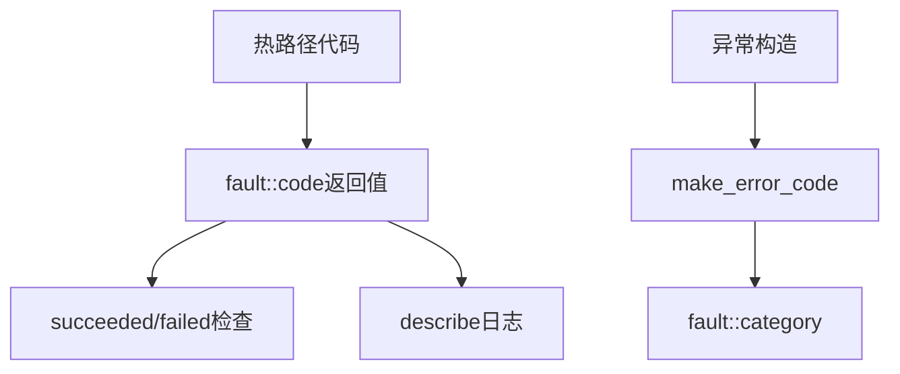

# Fault Code

全局错误码枚举定义，系统运行时所有错误情况的统一编码。

## 源码位置

`I:/code/Prism/include/prism/fault/code.hpp`

## 错误码枚举

```cpp
enum class code : int {
    // 成功
    success = 0,
    
    // 通用错误 (1-10)
    generic_error = 1,
    parse_error = 2,
    eof = 3,
    would_block = 4,
    protocol_error = 5,
    bad_message = 6,
    invalid_argument = 7,
    not_supported = 8,
    message_too_large = 9,
    io_error = 10,
    
    // 网络错误 (11-18)
    timeout = 11,
    canceled = 12,
    tls_handshake_failed = 13,
    tls_shutdown_failed = 14,
    auth_failed = 15,
    dns_failed = 16,
    upstream_unreachable = 17,
    connection_refused = 18,
    
    // 协议错误 (19-25)
    unsupported_command = 19,
    unsupported_address = 20,
    blocked = 21,
    bad_gateway = 22,
    host_unreachable = 23,
    connection_reset = 24,
    network_unreachable = 25,
    
    // 安全/系统错误 (26-36)
    ssl_cert_load_failed = 26,
    ssl_key_load_failed = 27,
    socks5_auth_negotiation_failed = 28,
    file_open_failed = 29,
    config_parse_error = 30,
    port_already_in_use = 31,
    certificate_verification_failed = 32,
    connection_aborted = 33,
    resource_unavailable = 34,
    ttl_expired = 35,
    forbidden = 36,
    ipv6_disabled = 37,
    
    // 多路复用错误 (38-44)
    mux_not_enabled = 38,
    mux_session_error = 39,
    mux_stream_error = 40,
    mux_window_exceeded = 41,
    mux_protocol_error = 42,
    mux_connection_limit = 43,
    mux_stream_limit = 44,
    
    // SS2022加密错误 (45-48)
    crypto_error = 45,
    invalid_psk = 46,
    timestamp_expired = 47,
    replay_detected = 48,
    
    // Reality错误 (49-57)
    reality_not_configured = 49,
    reality_auth_failed = 50,
    reality_sni_mismatch = 51,
    reality_key_exchange_failed = 52,
    reality_handshake_failed = 53,
    reality_dest_unreachable = 54,
    reality_certificate_error = 55,
    reality_tls_record_error = 56,
    reality_key_schedule_error = 57,
    
    // UDP错误 (58-59)
    udp_session_expired = 58,
    packet_replay_detected = 59,
    
    // ECH错误 (60-63)
    ech_payload_invalid = 60,
    ech_version_mismatch = 61,
    ech_decrypt_failed = 62,
    ech_config_mismatch = 63,
    
    // 内部统计
    _count = 64
};
```

## 辅助函数

### describe - 零分配描述

```cpp
[[nodiscard]] constexpr std::string_view describe(const code value) noexcept;
```

返回静态存储期字符串，可安全用于日志和诊断。`constexpr` 允许编译时求值。

```cpp
describe(code::timeout);  // 返回 "timeout"
describe(code::success);  // 返回 "success"
```

### succeeded/failed - 状态检查

```cpp
[[nodiscard]] constexpr bool succeeded(const code c) noexcept;
[[nodiscard]] constexpr bool failed(const code c) noexcept;
```

```cpp
if (fault::succeeded(result)) {
    // 成功处理
}
if (fault::failed(result)) {
    // 错误处理
}
```

## 调用链



## 相关页面

- [[core/fault/overview]] - Fault模块总览
- [[core/fault/handling]] - 错误检查适配层
- [[core/fault/compatible]] - 标准库兼容性
- [[core/exception/deviant]] - 异常基类使用错误码