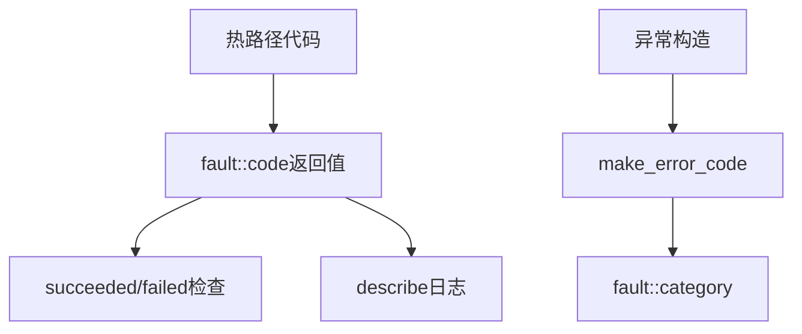

# Fault Code

全局错误码枚举定义，系统运行时所有错误情况的统一编码。

## 源码位置

`I:/code/Prism/include/prism/fault/code.hpp`

## 错误码枚举

```cpp
enum class code : int {
    // 成功
    success = 0,
    
    // 通用错误 (1-10)
    generic_error = 1,
    parse_error = 2,
    eof = 3,
    would_block = 4,
    protocol_error = 5,
    bad_message = 6,
    invalid_argument = 7,
    not_supported = 8,
    message_too_large = 9,
    io_error = 10,
    
    // 网络错误 (11-18)
    timeout = 11,
    canceled = 12,
    tls_handshake_failed = 13,
    tls_shutdown_failed = 14,
    auth_failed = 15,
    dns_failed = 16,
    upstream_unreachable = 17,
    connection_refused = 18,
    
    // 协议错误 (19-25)
    unsupported_command = 19,
    unsupported_address = 20,
    blocked = 21,
    bad_gateway = 22,
    host_unreachable = 23,
    connection_reset = 24,
    network_unreachable = 25,
    
    // 安全/系统错误 (26-36)
    ssl_cert_load_failed = 26,
    ssl_key_load_failed = 27,
    socks5_auth_negotiation_failed = 28,
    file_open_failed = 29,
    config_parse_error = 30,
    port_already_in_use = 31,
    certificate_verification_failed = 32,
    connection_aborted = 33,
    resource_unavailable = 34,
    ttl_expired = 35,
    forbidden = 36,
    ipv6_disabled = 37,
    
    // 多路复用错误 (38-44)
    mux_not_enabled = 38,
    mux_session_error = 39,
    mux_stream_error = 40,
    mux_window_exceeded = 41,
    mux_protocol_error = 42,
    mux_connection_limit = 43,
    mux_stream_limit = 44,
    
    // SS2022加密错误 (45-48)
    crypto_error = 45,
    invalid_psk = 46,
    timestamp_expired = 47,
    replay_detected = 48,
    
    // Reality错误 (49-57)
    reality_not_configured = 49,
    reality_auth_failed = 50,
    reality_sni_mismatch = 51,
    reality_key_exchange_failed = 52,
    reality_handshake_failed = 53,
    reality_dest_unreachable = 54,
    reality_certificate_error = 55,
    reality_tls_record_error = 56,
    reality_key_schedule_error = 57,
    
    // UDP错误 (58-59)
    udp_session_expired = 58,
    packet_replay_detected = 59,
    
    // ECH错误 (60-63)
    ech_payload_invalid = 60,
    ech_version_mismatch = 61,
    ech_decrypt_failed = 62,
    ech_config_mismatch = 63,
    
    // 内部统计
    _count = 64
};
```

## 辅助函数

### describe - 零分配描述

```cpp
[[nodiscard]] constexpr std::string_view describe(const code value) noexcept;
```

返回静态存储期字符串，可安全用于日志和诊断。`constexpr` 允许编译时求值。

```cpp
describe(code::timeout);  // 返回 "timeout"
describe(code::success);  // 返回 "success"
```

### succeeded/failed - 状态检查

```cpp
[[nodiscard]] constexpr bool succeeded(const code c) noexcept;
[[nodiscard]] constexpr bool failed(const code c) noexcept;
```

```cpp
if (fault::succeeded(result)) {
    // 成功处理
}
if (fault::failed(result)) {
    // 错误处理
}
```

## 调用链



## 相关页面

- [[core/fault/overview]] - Fault模块总览
- [[core/fault/handling]] - 错误检查适配层
- [[core/fault/compatible]] - 标准库兼容性
- [[core/exception/deviant]] - 异常基类使用错误码

---

## 错误码分类详解

错误码按功能域划分为 10 个类别，每个类别有独立的数值区间，便于日志分析和故障定位。

### 通用错误 (1-10)

| 错误码 | 值 | 使用场景 |
|--------|----|----------|
| `generic_error` | 1 | 无法归类到其他类别的通用错误，应尽量避免使用 |
| `parse_error` | 2 | JSON/配置/协议帧解析失败 |
| `eof` | 3 | 流意外结束或正常结束（远端关闭连接） |
| `would_block` | 4 | 非阻塞操作需要重试，资源暂时不可用 |
| `protocol_error` | 5 | 协议层违规（如帧长度不匹配、魔术字节错误） |
| `bad_message` | 6 | 消息格式不合法（长度字段超出范围、缺少必需字段） |
| `invalid_argument` | 7 | 函数参数非法（空指针、越界索引、无效枚举） |
| `not_supported` | 8 | 功能未实现或不被支持（如 IPv6 不可用时的 IPv6 请求） |
| `message_too_large` | 9 | 消息超过预设阈值（防 DoS 保护） |
| `io_error` | 10 | 底层 I/O 操作失败，未映射到更具体的网络错误码 |

### 网络错误 (11-18)

| 错误码 | 值 | 使用场景 |
|--------|----|----------|
| `timeout` | 11 | 连接超时、读/写超时、DNS 查询超时 |
| `canceled` | 12 | 操作被主动取消（用户取消、优雅关闭） |
| `tls_handshake_failed` | 13 | TLS 握手失败（证书不信任、协议版本不兼容） |
| `tls_shutdown_failed` | 14 | TLS 连接关闭时出错（通常可忽略） |
| `auth_failed` | 15 | 代理认证失败（密码错误、token 过期） |
| `dns_failed` | 16 | DNS 解析失败（无响应、NXDOMAIN、SERVFAIL） |
| `upstream_unreachable` | 17 | 上游服务器不可达（路由层拒绝） |
| `connection_refused` | 18 | TCP 连接被拒绝（目标端口未监听） |

### 协议错误 (19-25)

| 错误码 | 值 | 使用场景 |
|--------|----|----------|
| `unsupported_command` | 19 | SOCKS5 不支持的 COMMAND（如 UDP ASSOCIATE 未启用） |
| `unsupported_address` | 20 | 不支持的地址类型（如域名过长、IPv6 被禁用） |
| `blocked` | 21 | 路由规则拦截（地理封锁、域名黑名单） |
| `bad_gateway` | 22 | 网关层返回异常响应（502/503 等） |
| `host_unreachable` | 23 | 路由层无法到达目标主机 |
| `connection_reset` | 24 | 连接被对端 RST 重置 |
| `network_unreachable` | 25 | 网络层不可达（网关未配置） |

### 安全/系统错误 (26-37)

| 错误码 | 值 | 使用场景 |
|--------|----|----------|
| `ssl_cert_load_failed` | 26 | TLS 证书文件加载失败（路径不存在、格式错误） |
| `ssl_key_load_failed` | 27 | TLS 私钥文件加载失败 |
| `socks5_auth_negotiation_failed` | 28 | SOCKS5 认证协商失败 |
| `file_open_failed` | 29 | 文件打开失败（配置文件、日志文件） |
| `config_parse_error` | 30 | 配置文件格式错误（YAML/TOML 解析失败） |
| `port_already_in_use` | 31 | 监听端口已被占用 |
| `certificate_verification_failed` | 32 | 证书链验证失败 |
| `connection_aborted` | 33 | 连接被本地主动中止 |
| `resource_unavailable` | 34 | 系统资源不足（文件描述符耗尽、内存不足） |
| `ttl_expired` | 35 | DNS 记录或会话 TTL 过期 |
| `forbidden` | 36 | 权限不足（ACL 拒绝） |
| `ipv6_disabled` | 37 | IPv6 功能被禁用但收到 IPv6 请求 |

### 多路复用错误 (38-44)

| 错误码 | 值 | 使用场景 |
|--------|----|----------|
| `mux_not_enabled` | 38 | 多路复用功能未启用 |
| `mux_session_error` | 39 | mux 会话级错误（握手失败、协议不匹配） |
| `mux_stream_error` | 40 | mux 流级错误（单个子流异常） |
| `mux_window_exceeded` | 41 | 流量控制窗口超出限制 |
| `mux_protocol_error` | 42 | mux 协议帧格式错误 |
| `mux_connection_limit` | 43 | 多路复用连接数达上限 |
| `mux_stream_limit` | 44 | 单连接内子流数达上限 |

### SS2022 加密错误 (45-48)

| 错误码 | 值 | 使用场景 |
|--------|----|----------|
| `crypto_error` | 45 | 加密/解密操作失败 |
| `invalid_psk` | 46 | PSK (预共享密钥) 格式或长度不合法 |
| `timestamp_expired` | 47 | 时间戳超出允许窗口（防重放） |
| `replay_detected` | 48 | 检测到重放攻击 |

### Reality 错误 (49-57)

| 错误码 | 值 | 使用场景 |
|--------|----|----------|
| `reality_not_configured` | 49 | Reality 功能未配置 |
| `reality_auth_failed` | 50 | Reality 认证失败（public key 不匹配） |
| `reality_sni_mismatch` | 51 | SNI 与预期域名不匹配 |
| `reality_key_exchange_failed` | 52 | X25519 密钥交换失败 |
| `reality_handshake_failed` | 53 | Reality 握手失败 |
| `reality_dest_unreachable` | 54 | Reality 目标网站不可达 |
| `reality_certificate_error` | 55 | Reality 远端证书异常 |
| `reality_tls_record_error` | 56 | TLS 记录层错误 |
| `reality_key_schedule_error` | 57 | 密钥派生失败 |

### UDP 错误 (58-59)

| 错误码 | 值 | 使用场景 |
|--------|----|----------|
| `udp_session_expired` | 58 | UDP 会话超时（NAT 映射过期） |
| `packet_replay_detected` | 59 | UDP 包重放检测 |

### ECH 错误 (60-63)

| 错误码 | 值 | 使用场景 |
|--------|----|----------|
| `ech_payload_invalid` | 60 | ECH 载荷格式无效 |
| `ech_version_mismatch` | 61 | ECH 版本不兼容 |
| `ech_decrypt_failed` | 62 | ECH 解密失败（HPKE 密钥不匹配） |
| `ech_config_mismatch` | 63 | ECH 配置与服务器不匹配 |

## 与 std::error_code 映射

错误码通过 `fault_category` 映射到 `std::error_code`，使 `fault::code` 可以与标准库 API 无缝对接：

```cpp
// fault::code → std::error_code
fault::code c = fault::code::timeout;
std::error_code ec = make_error_code(c);
// ec.value() == 11
// ec.category().name() == "psm::fault"
```

所有 `fault::code` 值均属于 `psm::fault` category，因此 `ec.value()` 直接等于枚举值。

## 错误码到字符串转换

### describe() — 零分配静态字符串

```cpp
constexpr std::string_view describe(code value) noexcept;
```

使用 switch 语句映射每个错误码到字符串字面量（静态存储期），零分配、constexpr 友好：

```cpp
describe(code::success);             // "success"
describe(code::timeout);             // "timeout"
describe(code::tls_handshake_failed);// "tls_handshake_failed"
describe(code(999));                 // "unknown" (越界值)
```

### 日志中使用

```cpp
// 推荐: describe() 零分配
trace::error("connection failed: {}", fault::describe(ec));

// 避免: 使用 std::error_code 的 message() 会产生 std::string 分配
// std::error_code sec = ec;
// trace::error("failed: {}", sec.message());  // ❌ 堆分配
```