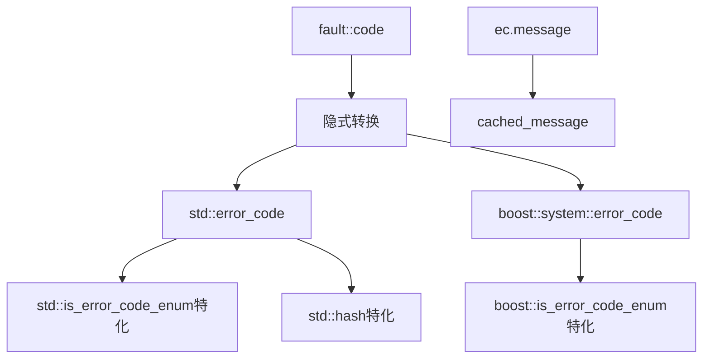

# Fault Compatible

错误码标准库兼容性支持，提供与 `std::error_code` 和 `boost::system::error_code` 的双向兼容。

## 源码位置

`I:/code/Prism/include/prism/fault/compatible.hpp`

## 设计目标

- **隐式转换**: 特化 `is_error_code_enum` 支持自动转换
- **哈希支持**: `std::hash` 特化，可用于无序容器
- **零分配消息**: 缓存错误消息，首次调用后无内存分配

## 错误消息缓存

```cpp
[[nodiscard]] inline const std::string &cached_message(code c) noexcept;
```

返回预分配的错误消息引用：
- 首次调用：分配并缓存
- 后续调用：直接返回引用，无分配

## std::error_code 支持

### fault_category

```cpp
class fault_category : public std::error_category {
public:
    const char *name() const noexcept override;     // 返回 "psm::fault"
    std::string message(int c) const override;      // 返回错误描述
};
```

### category 单例

```cpp
inline const std::error_category &category() noexcept;
```

返回全局单例引用。

### make_error_code

```cpp
inline std::error_code make_error_code(code c) noexcept;
```

配合 `is_error_code_enum` 特化，支持隐式转换：

```cpp
fault::code err = fault::code::timeout;
std::error_code ec = err;  // 隐式转换
```

### std 特化

```cpp
namespace std {
    // 启用隐式转换
    template <> struct is_error_code_enum<psm::fault::code> : std::true_type {};
    
    // 支持无序容器
    template <> struct hash<psm::fault::code> {
        size_t operator()(psm::fault::code c) const noexcept;
    };
}
```

## boost::system::error_code 支持

### boost::fault_category

```cpp
namespace boost::system {
    class fault_category final : public error_category {
        const char *name() const noexcept override;
        std::string message(int c) const override;
    };
    
    inline const error_category &category() noexcept;
    inline error_code make_error_code(psm::fault::code c) noexcept;
    
    template <> struct is_error_code_enum<psm::fault::code> : std::true_type {};
}
```

## 使用示例

```cpp
// 隐式转换为std::error_code
fault::code err = fault::code::timeout;
std::error_code ec = err;
std::cout << ec.message();  // 输出 "timeout"

// 用于无序容器
std::unordered_set<fault::code> error_set;
error_set.insert(fault::code::timeout);

// Boost错误码转换
boost::system::error_code bec = fault::code::auth_failed;
```

## 调用链



## 相关页面

- [[core/fault/overview]] - Fault模块总览
- [[core/fault/code]] - 错误码枚举
- [[core/fault/handling]] - 错误检查适配层
- [[core/exception/deviant]] - 异常基类使用错误码