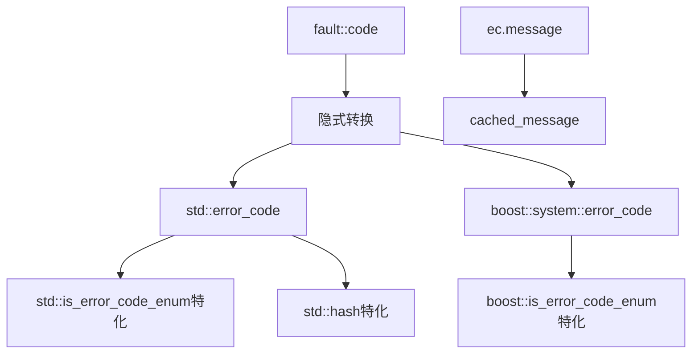

# Fault Compatible

错误码标准库兼容性支持，提供与 `std::error_code` 和 `boost::system::error_code` 的双向兼容。

## 源码位置

`I:/code/Prism/include/prism/fault/compatible.hpp`

## 设计目标

- **隐式转换**: 特化 `is_error_code_enum` 支持自动转换
- **哈希支持**: `std::hash` 特化，可用于无序容器
- **零分配消息**: 缓存错误消息，首次调用后无内存分配

## 错误消息缓存

```cpp
[[nodiscard]] inline const std::string &cached_message(code c) noexcept;
```

返回预分配的错误消息引用：
- 首次调用：分配并缓存
- 后续调用：直接返回引用，无分配

## std::error_code 支持

### fault_category

```cpp
class fault_category : public std::error_category {
public:
    const char *name() const noexcept override;     // 返回 "psm::fault"
    std::string message(int c) const override;      // 返回错误描述
};
```

### category 单例

```cpp
inline const std::error_category &category() noexcept;
```

返回全局单例引用。

### make_error_code

```cpp
inline std::error_code make_error_code(code c) noexcept;
```

配合 `is_error_code_enum` 特化，支持隐式转换：

```cpp
fault::code err = fault::code::timeout;
std::error_code ec = err;  // 隐式转换
```

### std 特化

```cpp
namespace std {
    // 启用隐式转换
    template <> struct is_error_code_enum<psm::fault::code> : std::true_type {};
    
    // 支持无序容器
    template <> struct hash<psm::fault::code> {
        size_t operator()(psm::fault::code c) const noexcept;
    };
}
```

## boost::system::error_code 支持

### boost::fault_category

```cpp
namespace boost::system {
    class fault_category final : public error_category {
        const char *name() const noexcept override;
        std::string message(int c) const override;
    };
    
    inline const error_category &category() noexcept;
    inline error_code make_error_code(psm::fault::code c) noexcept;
    
    template <> struct is_error_code_enum<psm::fault::code> : std::true_type {};
}
```

## 使用示例

```cpp
// 隐式转换为std::error_code
fault::code err = fault::code::timeout;
std::error_code ec = err;
std::cout << ec.message();  // 输出 "timeout"

// 用于无序容器
std::unordered_set<fault::code> error_set;
error_set.insert(fault::code::timeout);

// Boost错误码转换
boost::system::error_code bec = fault::code::auth_failed;
```

## 调用链



## 相关页面

- [[core/fault/overview]] - Fault模块总览
- [[core/fault/code]] - 错误码枚举
- [[core/fault/handling]] - 错误检查适配层
- [[core/exception/deviant]] - 异常基类使用错误码

---

## 与 Boost.Asio error_code 兼容层

Boost.Asio 是项目中异步 I/O 的核心依赖，其 `boost::system::error_code` 与 `fault::code` 的兼容通过以下机制实现。

### 双向转换

```
Boost.Asio 回调
    │
    ▼
boost::system::error_code (bec)
    │
    │  handling::to_code(bec)
    ▼
fault::code (内部统一错误码)
    │
    │  boost::system::make_error_code(c)
    ▼
boost::system::error_code (可返回给 Asio)
```

### 完整映射表

| Boost.Asio error | fault::code | 触发场景 |
|-----------------|-------------|----------|
| `boost::asio::error::eof` | `eof` | 连接正常关闭/远端断开 |
| `boost::asio::error::operation_aborted` | `canceled` | async 操作被取消 |
| `boost::asio::error::timed_out` | `timeout` | 操作超时 |
| `boost::asio::error::connection_refused` | `connection_refused` | TCP 连接被拒 |
| `boost::asio::error::connection_reset` | `connection_reset` | TCP RST |
| `boost::asio::error::connection_aborted` | `connection_aborted` | 连接中止 |
| `boost::asio::error::host_unreachable` | `host_unreachable` | 主机不可达 |
| `boost::asio::error::network_unreachable` | `network_unreachable` | 网络不可达 |
| `boost::asio::error::no_buffer_space` | `resource_unavailable` | 缓冲区不足 |
| `boost::asio::error::fault` | `io_error` | Asio 内部错误 |
| `boost::asio::ssl::error::stream_truncated` | `tls_handshake_failed` | TLS 流截断 |
| `boost::asio::ssl::error::handshake_failed` | `tls_handshake_failed` | TLS 握手失败 |
| 其他未映射错误 | `io_error` | fallback |

### 隐式转换

通过特化 `boost::system::is_error_code_enum<psm::fault::code>` 为 `true_type`，`fault::code` 可以直接赋值给 `boost::system::error_code`：

```cpp
// Boost.Asio handler 中直接使用 fault::code
void handle_read(boost::system::error_code ec, std::size_t len) {
    if (ec) {
        fault::code c = fault::handling::to_code(ec);
        // 统一处理...
        return;
    }
    // 成功...
}

// 向 Asio 返回 fault::code
void async_operation(Handler&& handler) {
    // ...
    if (error) {
        handler(fault::code::timeout);  // 自动转换为 boost::system::error_code
        return;
    }
    handler(boost::system::error_code{});
}
```

## 与 POSIX errno 映射

POSIX `errno` 是底层系统调用（`connect()`, `read()`, `write()`）的错误来源，通过 `std::errc` 间接映射。

### errno → fault::code 映射路径

```
POSIX 系统调用
    │
    │ errno = ECONNREFUSED (111)
    ▼
std::error_code (通过 std::make_error_code(std::errc))
    │
    │  handling::to_code(std::error_code)
    ▼
fault::code
```

### errno 映射表

| POSIX errno | std::errc | fault::code |
|------------|-----------|-------------|
| `ECONNREFUSED` (111) | `connection_refused` | `connection_refused` |
| `ECONNRESET` (104) | `connection_reset` | `connection_reset` |
| `ECONNABORTED` (103) | `connection_aborted` | `connection_aborted` |
| `ETIMEDOUT` (110) | `timed_out` | `timeout` |
| `EHOSTUNREACH` (113) | `host_unreachable` | `host_unreachable` |
| `ENETUNREACH` (101) | `network_unreachable` | `network_unreachable` |
| `ECANCELED` (125) | `operation_canceled` | `canceled` |
| `EAGAIN` / `EWOULDBLOCK` (11) | `resource_unavailable_try_again` | `would_block` |
| `EPIPE` (32) | `broken_pipe` | `connection_reset` |
| `ENOENT` (2) | `no_such_file_or_directory` | `file_open_failed` |
| `EACCES` (13) | `permission_denied` | `forbidden` |
| `EADDRINUSE` (98) | `address_in_use` | `port_already_in_use` |
| `ENOMEM` (12) | `not_enough_memory` | `resource_unavailable` |
| `EMFILE` (24) | `too_many_files_open` | `resource_unavailable` |
| `ENOTSUP` (95) | `not_supported` | `not_supported` |
| `EINVAL` (22) | `invalid_argument` | `invalid_argument` |
| 其他 | — | `io_error` |

### 直接使用 errno 的场景

```cpp
// 混合编程：系统调用 + Asio 混用
int fd = ::socket(AF_INET, SOCK_STREAM, 0);
if (fd < 0) {
    // errno 可能为 EMFILE (fd 耗尽) 或 EAFNOSUPPORT
    int saved_errno = errno;
    auto ec = std::make_error_code(static_cast<std::errc>(saved_errno));
    fault::code c = fault::handling::to_code(ec);
    trace::error("socket创建失败: {}", fault::describe(c));
    return c;
}
```

## 与 Windows GetLastError 映射

Windows API 使用 `GetLastError()` 返回错误码，通过 `std::generic_category()` 或 `std::system_category()` 映射。

### GetLastError → fault::code 映射路径

```
Windows API (WSAConnect, ReadFile, ...)
    │
    │ GetLastError() → DWORD
    ▼
std::error_code (std::system_category)
    │
    │  handling::to_code(std::error_code)
    ▼
fault::code
```

### Windows 错误码映射表

| GetLastError / WSAError | fault::code | 触发场景 |
|------------------------|-------------|----------|
| `WSAECONNREFUSED` (10061) | `connection_refused` | 连接被拒 |
| `WSAECONNRESET` (10054) | `connection_reset` | 连接重置 |
| `WSAECONNABORTED` (10053) | `connection_aborted` | 连接中止 |
| `WSAETIMEDOUT` (10060) | `timeout` | 连接超时 |
| `WSAEHOSTUNREACH` (10065) | `host_unreachable` | 主机不可达 |
| `WSAENETUNREACH` (10051) | `network_unreachable` | 网络不可达 |
| `ERROR_OPERATION_ABORTED` (995) | `canceled` | I/O 取消 |
| `WSAEWOULDBLOCK` (10035) | `would_block` | 非阻塞重试 |
| `WSAENOBUFS` (10055) | `resource_unavailable` | 缓冲区不足 |
| `WSAEADDRINUSE` (10048) | `port_already_in_use` | 端口占用 |
| `WSAEACCES` (10013) | `forbidden` | 权限拒绝 |
| `WSAEINVAL` (10022) | `invalid_argument` | 参数无效 |
| `ERROR_FILE_NOT_FOUND` (2) | `file_open_failed` | 文件不存在 |
| `ERROR_ACCESS_DENIED` (5) | `forbidden` | 访问被拒 |
| 其他 | `io_error` | fallback |

### Windows 平台注意

```cpp
#ifdef _WIN32
// Windows 下使用 std::system_category() 包装 GetLastError
DWORD last_err = ::GetLastError();
auto ec = std::error_code{static_cast<int>(last_err), std::system_category()};
fault::code c = fault::handling::to_code(ec);
#else
// POSIX 下使用 std::generic_category() 包装 errno
auto ec = std::error_code{errno, std::generic_category()};
fault::code c = fault::handling::to_code(ec);
#endif
```

**关键区别**: Windows 的 `system_category` 映射的是 Windows 错误码（如 10061），而 POSIX 的 `generic_category` 映射的是 POSIX errno（如 111）。`handling::to_code` 内部通过 `std::errc` 比较实现跨平台统一映射。

## 跨平台兼容总结

```
                    ┌─────────────────┐
                    │  fault::code    │  ← 统一错误码 (平台无关)
                    └────────┬────────┘
                             │
            ┌────────────────┼────────────────┐
            ▼                ▼                ▼
    ┌───────────────┐ ┌──────────────┐ ┌──────────────┐
    │ std::error_   │ │ boost::      │ │ POSIX/Win    │
    │ code          │ │ system::ec   │ │ system error │
    └───────┬───────┘ └──────┬───────┘ └──────┬───────┘
            │                │                │
            ▼                ▼                ▼
    ┌───────────────┐ ┌──────────────┐ ┌──────────────┐
    │ std::errc     │ │ asio::error  │ │ errno /      │
    │ (跨平台标准)  │ │ (Asio 定义)  │ │ GetLastError │
    └───────────────┘ └──────────────┘ └──────────────┘
```

核心原则：`fault::code` 是项目内部的唯一错误语言，所有外部错误系统通过兼容层单向映射到此。