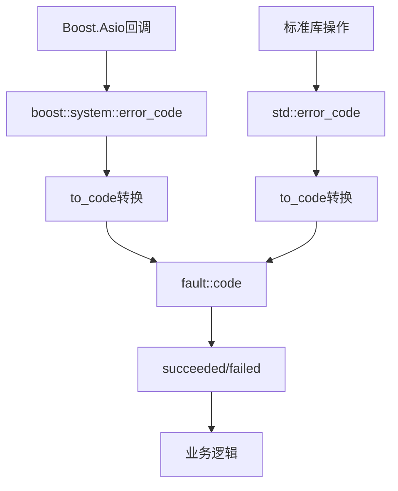

# Fault Handling

极简错误码检查适配层，提供统一的错误检查接口。

## 源码位置

`I:/code/Prism/include/prism/fault/handling.hpp`

## 设计特点

- **constexpr + noexcept**: 所有函数均为编译时可求值且无异常
- **无动态分配**: 专为热路径设计
- **类型分发**: `if constexpr` 消除运行时类型检查开销

## 统一检查接口

### succeeded - 成功检查

```cpp
template <typename ErrorCode>
[[nodiscard]] constexpr bool succeeded(const ErrorCode &ec) noexcept;
```

支持类型：
- `fault::code`: `ec == code::success`
- `std::error_code`: `!ec`
- `boost::system::error_code`: `!ec`

### failed - 失败检查

```cpp
template <typename ErrorCode>
[[nodiscard]] constexpr bool failed(const ErrorCode &ec) noexcept;
```

`succeeded()` 的互补函数，语义等价于 `!succeeded(ec)`。

## 类型转换

### boost::system::error_code → fault::code

```cpp
[[nodiscard]] inline code to_code(const boost::system::error_code &ec) noexcept;
```

映射常见 Boost.Asio 网络错误：

| Boost 错误 | fault::code |
|------------|-------------|
| `eof` | `eof` |
| `operation_aborted` | `canceled` |
| `timed_out` | `timeout` |
| `connection_refused` | `connection_refused` |
| `connection_reset` | `connection_reset` |
| `connection_aborted` | `connection_aborted` |
| `host_unreachable` | `host_unreachable` |
| `network_unreachable` | `network_unreachable` |
| `no_buffer_space` | `resource_unavailable` |

未映射错误返回 `io_error`。

### std::error_code → fault::code

```cpp
[[nodiscard]] inline code to_code(const std::error_code &ec) noexcept;
```

映射常见 `std::errc` 错误：

| std::errc | fault::code |
|-----------|-------------|
| `connection_refused` | `connection_refused` |
| `connection_reset` | `connection_reset` |
| `connection_aborted` | `connection_aborted` |
| `timed_out` | `timeout` |
| `host_unreachable` | `host_unreachable` |
| `network_unreachable` | `network_unreachable` |
| `operation_canceled` | `canceled` |

## 使用示例

```cpp
// 检查std::error_code
std::error_code ec;
if (fault::failed(ec)) {
    auto internal_code = fault::to_code(ec);
}

// 检查boost::error_code
boost::system::error_code bec;
if (fault::succeeded(bec)) {
    // 成功处理
}

// 检查fault::code
fault::code result = operation();
if (fault::failed(result)) {
    trace::error("操作失败: {}", fault::describe(result));
}
```

## 调用链



## 相关页面

- [[core/fault/overview]] - Fault模块总览
- [[core/fault/code]] - 错误码枚举
- [[core/fault/compatible]] - 标准库兼容性