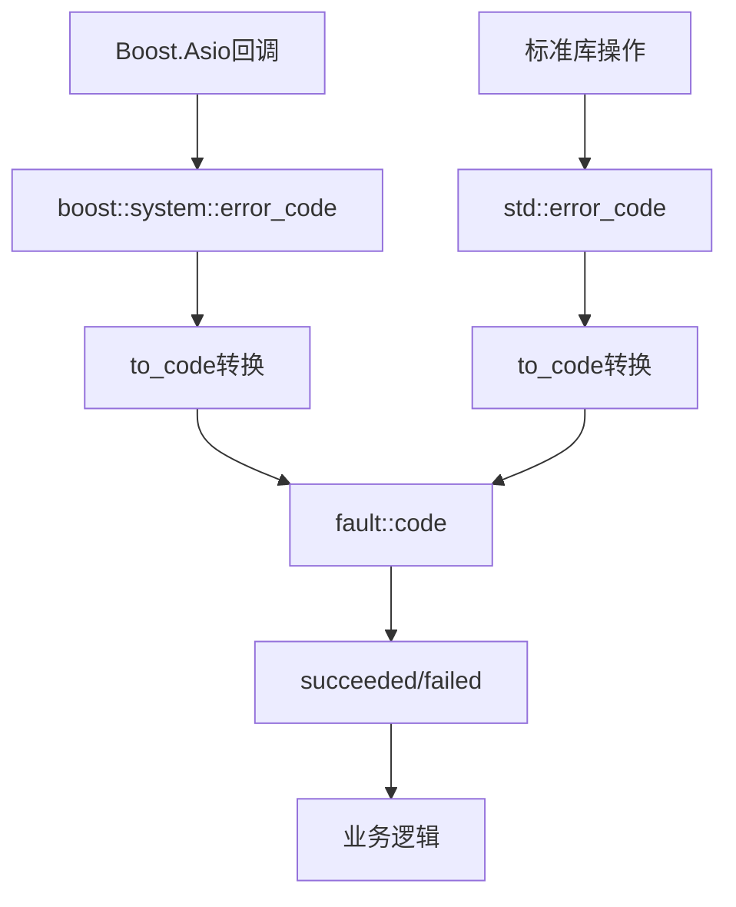

# Fault Handling

极简错误码检查适配层，提供统一的错误检查接口。

## 源码位置

`I:/code/Prism/include/prism/fault/handling.hpp`

## 设计特点

- **constexpr + noexcept**: 所有函数均为编译时可求值且无异常
- **无动态分配**: 专为热路径设计
- **类型分发**: `if constexpr` 消除运行时类型检查开销

## 统一检查接口

### succeeded - 成功检查

```cpp
template <typename ErrorCode>
[[nodiscard]] constexpr bool succeeded(const ErrorCode &ec) noexcept;
```

支持类型：
- `fault::code`: `ec == code::success`
- `std::error_code`: `!ec`
- `boost::system::error_code`: `!ec`

### failed - 失败检查

```cpp
template <typename ErrorCode>
[[nodiscard]] constexpr bool failed(const ErrorCode &ec) noexcept;
```

`succeeded()` 的互补函数，语义等价于 `!succeeded(ec)`。

## 类型转换

### boost::system::error_code → fault::code

```cpp
[[nodiscard]] inline code to_code(const boost::system::error_code &ec) noexcept;
```

映射常见 Boost.Asio 网络错误：

| Boost 错误 | fault::code |
|------------|-------------|
| `eof` | `eof` |
| `operation_aborted` | `canceled` |
| `timed_out` | `timeout` |
| `connection_refused` | `connection_refused` |
| `connection_reset` | `connection_reset` |
| `connection_aborted` | `connection_aborted` |
| `host_unreachable` | `host_unreachable` |
| `network_unreachable` | `network_unreachable` |
| `no_buffer_space` | `resource_unavailable` |

未映射错误返回 `io_error`。

### std::error_code → fault::code

```cpp
[[nodiscard]] inline code to_code(const std::error_code &ec) noexcept;
```

映射常见 `std::errc` 错误：

| std::errc | fault::code |
|-----------|-------------|
| `connection_refused` | `connection_refused` |
| `connection_reset` | `connection_reset` |
| `connection_aborted` | `connection_aborted` |
| `timed_out` | `timeout` |
| `host_unreachable` | `host_unreachable` |
| `network_unreachable` | `network_unreachable` |
| `operation_canceled` | `canceled` |

## 使用示例

```cpp
// 检查std::error_code
std::error_code ec;
if (fault::failed(ec)) {
    auto internal_code = fault::to_code(ec);
}

// 检查boost::error_code
boost::system::error_code bec;
if (fault::succeeded(bec)) {
    // 成功处理
}

// 检查fault::code
fault::code result = operation();
if (fault::failed(result)) {
    trace::error("操作失败: {}", fault::describe(result));
}
```

## 调用链



## 相关页面

- [[core/fault/overview]] - Fault模块总览
- [[core/fault/code]] - 错误码枚举
- [[core/fault/compatible]] - 标准库兼容性

---

## 错误处理策略

### 热路径：错误码 vs 冷路径：异常

```
┌──────────────────────────────────────────────────────────────────────┐
│ 热路径 (Hot Path)                                                    │
│ ─────────────────────────────────────────────────────────────────── │
│ 特征: 每秒执行 10K-1M 次, 延迟预算 < 1μs                            │
│                                                                      │
│ 包含:                                                                │
│   ├── TCP/UDP 数据读写 (async_read / async_write)                   │
│   ├── 协议帧解析 (Trojan header, VLESS, SS2022 AEAD)                │
│   ├── 多路复用帧解码 (smux/yamux frame)                             │
│   ├── DNS 响应解析                                                  │
│   └── 路由规则匹配                                                   │
│                                                                      │
│ 错误处理方式: fault::code 返回值                                     │
│   ├── 零分配: 错误码是 int 枚举, 不触发内存分配                      │
│   ├── 无展开开销: 不需要栈展开, CPU 流水线不被中断                   │
│   └── 编译器友好: constexpr 检查可在编译期优化                       │
│                                                                      │
│ 典型模式:                                                            │
│   auto code = read_frame(buf);                                      │
│   if (fault::failed(code)) { handle_error(code); return; }          │
│   // 继续处理...                                                     │
└──────────────────────────────────────────────────────────────────────┘

┌──────────────────────────────────────────────────────────────────────┐
│ 温路径 (Warm Path)                                                   │
│ ─────────────────────────────────────────────────────────────────── │
│ 特征: 每秒执行 10-1K 次, 延迟预算 < 10μs                            │
│                                                                      │
│ 包含:                                                                │
│   ├── 新连接建立 (TCP connect, TLS handshake)                       │
│   ├── 会话创建与销毁                                                 │
│   └── 配置变更处理                                                   │
│                                                                      │
│ 错误处理方式: fault::code 返回值 (与热路径一致)                      │
│   ├── 保持统一错误处理模式                                           │
│   └── 虽然频率较低，但仍属于预期内的运行时事件                       │
└──────────────────────────────────────────────────────────────────────┘

┌──────────────────────────────────────────────────────────────────────┐
│ 冷路径 (Cold Path)                                                   │
│ ─────────────────────────────────────────────────────────────────── │
│ 特征: 程序启动/关闭时执行, 或编程错误, 频率极低                     │
│                                                                      │
│ 包含:                                                                │
│   ├── 配置文件加载与解析 (YAML/TOML)                                │
│   ├── TLS 证书/私钥加载                                             │
│   ├── 参数校验 (公共 API 的前置条件)                                 │
│   ├── 内部不变量检查 (assert 失败)                                   │
│   └── 内存分配失败 (std::bad_alloc)                                  │
│                                                                      │
│ 错误处理方式: C++ 异常 (deviant 子类)                                │
│   ├── 异常路径不影响热路径性能 (零开销原则)                          │
│   ├── 携带丰富的上下文信息 (文件位置、堆栈跟踪)                      │
│   └── 强制调用者处理 (编译期警告 [[noreturn]] / no-except-spec)     │
│                                                                      │
│ 典型模式:                                                            │
│   auto config = load_config(path);  // 失败时 throw config_error    │
│   // 如果到达这里, config 一定有效                                   │
└──────────────────────────────────────────────────────────────────────┘
```

### 决策树

```
发生错误
    │
    ├── 是否在热路径/温路径?
    │   ├── 是 → 返回 fault::code
    │   └── 否 ↓
    │
    ├── 是否是预期内的运行时错误? (超时、连接断开)
    │   ├── 是 → 返回 fault::code (即使冷路径也优先用错误码)
    │   └── 否 ↓
    │
    ├── 是否是编程错误? (空指针、越界、不变量破坏)
    │   ├── 是 → 抛异常 (deviant 子类)
    │   └── 否 ↓
    │
    └── 是否是启动阶段配置错误?
        ├── 是 → 抛异常 (启动失败应终止程序)
        └── 否 → 返回 fault::code
```

## 错误传播最佳实践

### 1. 自底向上错误传播

```cpp
// 第1层: 最底层 - socket I/O
fault::code socket_read(span<std::byte> buf) {
    boost::system::error_code bec;
    auto n = socket_.read_some(boost::asio::buffer(buf), bec);
    if (bec) {
        return fault::handling::to_code(bec);
    }
    if (n == 0) {
        return fault::code::eof;
    }
    return fault::code::success;
}

// 第2层: 协议层 - 帧解析
fault::code read_protocol_frame(Frame& out) {
    std::array<std::byte, 64> header_buf;
    auto code = socket_read(header_buf);
    if (fault::failed(code)) {
        return code;  // 透传底层错误码
    }
    // 解析 header...
    if (parse_failed) {
        return fault::code::parse_error;  // 协议层自身错误
    }
    return fault::code::success;
}

// 第3层: 会话层 - 连接管理
fault::code handle_session() {
    Frame frame;
    auto code = read_protocol_frame(frame);
    if (fault::failed(code)) {
        // 记录上下文后透传
        trace::debug("[session] 读取帧失败: {}, peer={}",
            fault::describe(code), peer_);
        return code;
    }
    // 处理 frame...
    return fault::code::success;
}

// 第4层: 应用层 - 错误决策
void run_connection_loop() {
    while (running_) {
        auto code = handle_session();
        if (fault::succeeded(code)) {
            continue;
        }

        // 基于错误码做决策
        switch (code) {
            case fault::code::eof:
            case fault::code::connection_reset:
                trace::info("[session] 连接断开: {}", peer_);
                break;  // 正常断开, 不告警

            case fault::code::timeout:
                trace::warn("[session] 连接超时, 重试: {}", peer_);
                continue;  // 可重试

            case fault::code::auth_failed:
                trace::error("[session] 认证失败, 拒绝: {}", peer_);
                break;  // 不可恢复

            case fault::code::replay_detected:
                trace::alert("[session] 重放攻击检测: {}", peer_);
                break;  // 安全告警

            default:
                trace::error("[session] 未知错误: {}, peer={}",
                    fault::describe(code), peer_);
                break;
        }
        return;  // 退出连接循环
    }
}
```

### 2. 错误不应被吞

```cpp
// ❌ 错误: 将具体错误码替换为 generic_error
fault::code bad_example() {
    auto code = underlying_operation();
    if (fault::failed(code)) {
        return fault::code::generic_error;  // 丢失了具体信息
    }
    return fault::code::success;
}

// ✅ 正确: 透传具体错误码
fault::code good_example() {
    auto code = underlying_operation();
    if (fault::failed(code)) {
        return code;  // 保留原始错误码
    }
    return fault::code::success;
}
```

### 3. 添加上下文而非修改错误码

```cpp
// ✅ 正确: 日志中添加上下文, 错误码不变
fault::code with_context() {
    auto code = connect_to(host_, port_);
    if (fault::failed(code)) {
        // 日志: [conn] 连接上游失败: connection_refused, host=1.2.3.4:443
        trace::error("[conn] 连接上游失败: {}, host={}:{}",
            fault::describe(code), host_, port_);
        return code;  // 透传原始错误码
    }
    return fault::code::success;
}
```

## 错误日志格式

### 标准格式

```
[模块] 操作描述: 错误码描述, 上下文键值对
```

### 日志级别与错误码的对应

| 日志级别 | 错误码类别 | 示例 |
|---------|-----------|------|
| `trace::debug` | 预期内的瞬时错误 | `would_block`, 重试中的 `timeout` |
| `trace::info` | 正常关闭 | `eof`, `canceled` (用户主动取消) |
| `trace::warn` | 异常但可恢复 | `timeout` (超时), `connection_refused` |
| `trace::error` | 不可恢复的运行错误 | `tls_handshake_failed`, `auth_failed` |
| `trace::alert` | 安全事件 | `replay_detected`, `crypto_error` |

### 示例

```cpp
// debug: 预期内, 不需要运维关注
trace::debug("[dns] 查询超时, 重试: {}, domain={}",
    fault::describe(code), domain);

// info: 正常事件, 记录即可
trace::info("[conn] 连接关闭: {}, peer={}, duration={}",
    fault::describe(code), peer, duration);

// warn: 异常但系统可继续运行
trace::warn("[upstream] 节点不可达, 切换备用: {}, node={}",
    fault::describe(code), node_name);

// error: 需要关注的运行错误
trace::error("[tls] 证书加载失败: {}, cert_path={}",
    fault::describe(code), cert_path);

// alert: 安全事件, 需要立即响应
trace::alert("[security] 重放攻击检测: {}, src={}",
    fault::describe(code), src_addr);
```

### 结构化日志扩展

```cpp
// 如果需要结构化日志 (JSON 格式)
struct ErrorLog {
    std::string_view module;       // "conn", "tls", "dns"
    std::string_view operation;    // "connect", "read", "handshake"
    fault::code error_code;        // 错误码
    std::string_view description;  // fault::describe(code)
    std::chrono::milliseconds timestamp;
    // 可选上下文
    std::string_view peer;
    std::string_view host;
    int port;
};

// 使用:
ErrorLog log{
    .module = "conn",
    .operation = "read_frame",
    .error_code = code,
    .description = fault::describe(code),
    .timestamp = now(),
    .peer = peer_addr,
};
trace::error("[{}] {} failed: {} (peer={})",
    log.module, log.operation, log.description, log.peer);
```

### 错误码统计

建议在运维层面聚合错误码出现频率，用于容量规划和故障排查：

```
错误码聚合统计 (每小时)
┌───────────────────────────────────────┬────────┬────────┐
│ 错误码                                │  计数  │  趋势  │
├───────────────────────────────────────┼────────┼────────┤
│ eof                                   │  12340 │   →    │
│ timeout                               │   1523 │   ↑    │
│ connection_refused                    │    234 │   →    │
│ tls_handshake_failed                  │     12 │   ↓    │
│ replay_detected                       │      3 │   ↑ ⚠  │
└───────────────────────────────────────┴────────┴────────┘

timeout ↑ : 上游节点延迟增加, 考虑扩容
replay_detected ↑ ⚠ : 安全告警, 检查是否有攻击行为
```