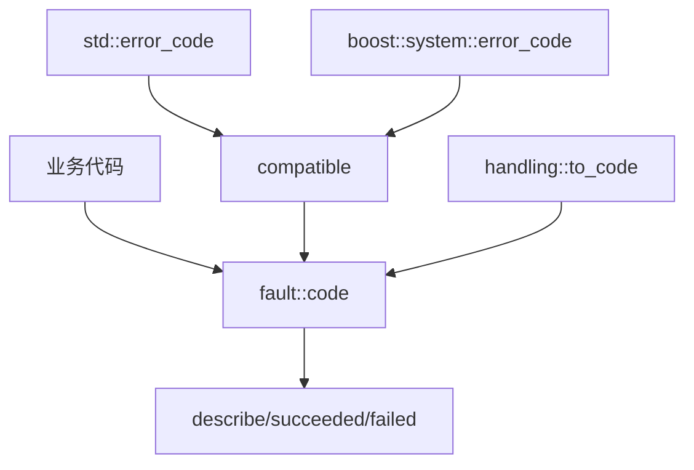

# Fault 模块

Fault 模块提供统一的错误码系统，遵循热路径无异常原则，所有网络I/O、协议解析等热路径必须使用错误码进行流控。

## 设计原则

- **热路径无异常**: 网络I/O、协议解析等高频路径使用错误码返回值
- **零分配描述**: `describe()` 返回静态字符串视图，无内存分配
- **标准库兼容**: 与 `std::error_code` 和 `boost::system::error_code` 双向兼容

## 模块组成

| 组件 | 说明 | 源码 |
|------|------|------|
| [[core/fault/code]] | 错误码枚举定义 | `prism/fault/code.hpp` |
| [[core/fault/handling]] | 错误检查适配层 | `prism/fault/handling.hpp` |
| [[core/fault/compatible]] | 标准库兼容性 | `prism/fault/compatible.hpp` |

## 错误码分组

| 范围 | 类别 | 示例 |
|------|------|------|
| 0 | 成功 | `success` |
| 1-10 | 通用 | `generic_error`, `parse_error`, `eof` |
| 11-18 | 网络 | `timeout`, `canceled`, `tls_handshake_failed` |
| 19-25 | 协议 | `unsupported_command`, `bad_gateway` |
| 26-36 | 安全/系统 | `ssl_cert_load_failed`, `file_open_failed` |
| 38-44 | 多路复用 | `mux_session_error`, `mux_stream_limit` |
| 45-48 | SS2022 | `crypto_error`, `replay_detected` |
| 49-57 | Reality | `reality_auth_failed`, `reality_key_exchange_failed` |
| 58-59 | UDP | `udp_session_expired` |
| 60-63 | ECH | `ech_decrypt_failed` |

## 核心接口

```cpp
namespace psm::fault {
    enum class code : int { ... };
    
    // 零分配描述
    constexpr std::string_view describe(code value) noexcept;
    
    // 成功/失败检查
    constexpr bool succeeded(code c) noexcept;
    constexpr bool failed(code c) noexcept;
}
```

## 调用链



## 相关模块

- [[core/exception]] - 异常系统(仅用于启动阶段)
- [[core/memory]] - 内存系统

---

## 错误系统总览

```
┌────────────────────────────────────────────────────────────────────┐
│                        应用层 (Application Layer)                   │
│  ┌──────────────┐  ┌──────────────┐  ┌─────────────────────────┐  │
│  │ 日志/告警    │  │ 重试/降级    │  │ 优雅关闭 (graceful quit)│  │
│  └──────┬───────┘  └──────┬───────┘  └────────────┬────────────┘  │
│         │                  │                       │                │
├─────────┼──────────────────┼───────────────────────┼────────────────┤
│         ▼                  ▼                       ▼                │
│  ┌──────────────────────────────────────────────────────────────┐  │
│  │              fault::code 统一错误码 (int 枚举)                │  │
│  │                                                              │  │
│  │  热路径返回: fault::code                                     │  │
│  │  冷路径返回: fault::code 或 std::exception (deviant 子类)    │  │
│  └──────────────────────┬───────────────────────────────────────┘  │
│                         │                                          │
├─────────────────────────┼──────────────────────────────────────────┤
│                         ▼                                          │
│  ┌──────────────────────────────────────────────────────────────┐  │
│  │                 handling 适配层                               │  │
│  │  ┌────────────┐  ┌────────────┐  ┌────────────────────────┐ │  │
│  │  │ succeeded()│  │ failed()   │  │ to_code(ec) 类型分发   │ │  │
│  │  └────────────┘  └────────────┘  └────────────────────────┘ │  │
│  └──────────────────────┬───────────────────────────────────────┘  │
│                         │                                          │
├─────────────────────────┼──────────────────────────────────────────┤
│                         ▼                                          │
│  ┌──────────────────────────────────────────────────────────────┐  │
│  │              compatible 兼容层                               │  │
│  │  ┌─────────────────┐  ┌─────────────────┐                   │  │
│  │  │ std::error_code │  │ boost::error_   │                   │  │
│  │  │ 双向转换        │  │ code 双向转换   │                   │  │
│  │  └────────┬────────┘  └────────┬────────┘                   │  │
│  └───────────┼───────────────────┼─────────────────────────────┘  │
│              │                   │                                 │
├──────────────┼───────────────────┼─────────────────────────────────┤
│              ▼                   ▼                                 │
│  ┌─────────────────┐  ┌─────────────────────┐                    │
│  │ POSIX errno     │  │ Boost.Asio /        │                    │
│  │ (系统调用错误)  │  │ std::system_error   │                    │
│  └─────────────────┘  └─────────────────────┘                    │
└────────────────────────────────────────────────────────────────────┘
```

### 设计要点

1. **单一事实源**: `fault::code` 枚举是所有错误的唯一来源，标准库错误码通过兼容层映射到此
2. **零分配描述**: `describe()` 返回 `std::string_view` 指向静态字符串字面量
3. **类型安全**: `enum class` 防止隐式整数比较
4. **热路径友好**: 所有检查函数均为 `constexpr` + `noexcept`

## 错误传播链（从底层到应用层）

错误传播遵循"底层返回错误码 → 中间层转换/透传 → 应用层决策"的模式。

### 传播路径示例：TCP 连接失败

```
底层 (OS 系统调用)
    │ connect() 返回 ECONNREFUSED (errno = 111)
    ▼
Boost.Asio / std::io 层
    │ → std::error_code(ec::connection_refused)
    ▼
handling 适配层
    │ → to_code(ec) → fault::code::connection_refused
    ▼
协议层 (如 Trojan 握手)
    │ 返回 fault::code::connection_refused 给调用者
    ▼
连接管理层
    │ 检查 failed(code) → true
    │ 决策: 重试? 切换备用节点? 报告用户?
    ▼
应用层
    │ trace::error("上游连接失败: {}", describe(code));
    │ 或: 触发 fallback 逻辑
```

### 传播路径示例：TLS 握手失败

```
底层 (OpenSSL / crypto 库)
    │ SSL_do_handshake() 返回 -1
    ▼
TLS 封装层
    │ → fault::code::tls_handshake_failed
    ▼
协议层 (VLESS/Trojan)
    │ 收到 tls_handshake_failed
    │ 透传给上层, 不转换为其他错误码
    ▼
连接管理层
    │ failed(code) → true
    │ 记录错误日志, 关闭连接
    ▼
应用层
    │ trace::warn("TLS握手失败: peer={}, error={}", peer, describe(code));
```

### 传播规则

| 规则 | 说明 |
|------|------|
| 不吞错误 | 所有错误码必须向上传播或处理后消费，禁止静默丢弃 |
| 不掩盖 | 中间层不应将具体错误码替换为 `generic_error` |
| 透传优先 | 除非中间层有明确的转换理由，否则直接透传底层错误码 |
| 上下文增强 | 中间层可附加上下文信息到日志，但不修改错误码本身 |
| 热路径不抛异常 | 热路径中错误码通过返回值传播，不使用异常 |

## 错误处理策略

### 错误码 vs 异常

```
┌─────────────────────────────────────────────────────────────┐
│  场景                     │ 使用         │ 原因             │
├───────────────────────────┼──────────────┼──────────────────┤
│  网络 I/O (read/write)    │ fault::code  │ 预期内, 高频     │
│  协议解析                 │ fault::code  │ 预期内, 高频     │
│  DNS 查询                 │ fault::code  │ 预期内, 中频     │
│  TLS 握手                 │ fault::code  │ 预期内, 中频     │
│  配置文件解析             │ exception    │ 启动阶段, 低频   │
│  参数校验 (公共 API)      │ exception    │ 编程错误, 极低频 │
│  不可恢复的内部状态       │ exception    │ 逻辑错误, 极低频 │
│  内存分配失败             │ exception    │ 系统级, 极低频   │
└─────────────────────────────────────────────────────────────┘
```

### 错误恢复策略

| 错误码类别 | 恢复策略 | 说明 |
|-----------|---------|------|
| `timeout`, `would_block` | 重试 (指数退避) | 临时性错误，可重试 |
| `eof` | 关闭连接, 清理状态 | 连接正常/异常关闭 |
| `connection_refused`, `connection_reset` | 切换备用节点 | 当前节点不可用 |
| `auth_failed`, `blocked` | 终止连接, 报告用户 | 不可恢复的配置/权限错误 |
| `parse_error`, `bad_message` | 关闭连接, 记录告警 | 可能对端不兼容或攻击 |
| `resource_unavailable` | 降级/告警 | 系统资源不足 |
| `crypto_error`, `replay_detected` | 关闭连接, 安全告警 | 可能的安全事件 |

## 最佳实践

### 1. 热路径函数签名

```cpp
// ✅ 推荐: 返回错误码
fault::code read_frame(span<std::byte> buf);

// ✅ 推荐: 返回 optional/error pair
std::pair<fault::code, Frame> try_read_frame();

// ❌ 避免: 热路径使用异常
Frame read_frame();  // 失败时抛异常 — 热路径禁止
```

### 2. 错误检查模式

```cpp
// ✅ 推荐: 使用 fault::succeeded/failed
auto code = do_something();
if (fault::failed(code)) {
    trace::error("操作失败: {}", fault::describe(code));
    return code;  // 透传
}

// ❌ 避免: 直接整数比较
if (code != fault::code::success) {  // 不语义化
```

### 3. 错误链式传播

```cpp
// ✅ 推荐: 透传底层错误码
fault::code connect(const endpoint& ep) {
    auto code = socket_.connect(ep);
    if (fault::failed(code)) {
        return code;  // 透传, 不转换
    }
    return fault::code::success;
}

// ❌ 避免: 将具体错误码替换为 generic_error
if (fault::failed(code)) {
    return fault::code::generic_error;  // 丢失了具体错误信息
}
```

### 4. 错误日志格式

```cpp
// 推荐格式: [模块] 操作描述: 错误码描述, 上下文信息
trace::error("[conn] 连接上游失败: {}, peer={}:{}",
    fault::describe(code), host, port);

trace::warn("[tls] TLS握手失败: {}, sni={}",
    fault::describe(code), sni_name);
```