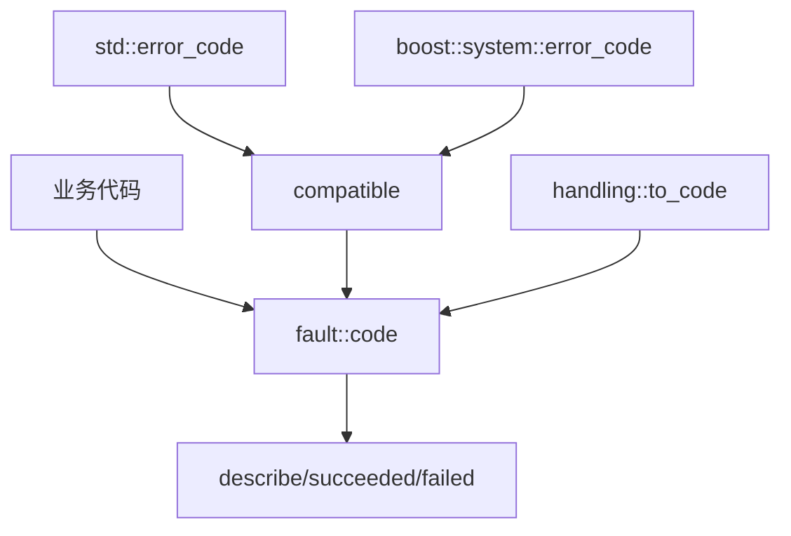

# Fault 模块

Fault 模块提供统一的错误码系统，遵循热路径无异常原则，所有网络I/O、协议解析等热路径必须使用错误码进行流控。

## 设计原则

- **热路径无异常**: 网络I/O、协议解析等高频路径使用错误码返回值
- **零分配描述**: `describe()` 返回静态字符串视图，无内存分配
- **标准库兼容**: 与 `std::error_code` 和 `boost::system::error_code` 双向兼容

## 模块组成

| 组件 | 说明 | 源码 |
|------|------|------|
| [[core/fault/code]] | 错误码枚举定义 | `prism/fault/code.hpp` |
| [[core/fault/handling]] | 错误检查适配层 | `prism/fault/handling.hpp` |
| [[core/fault/compatible]] | 标准库兼容性 | `prism/fault/compatible.hpp` |

## 错误码分组

| 范围 | 类别 | 示例 |
|------|------|------|
| 0 | 成功 | `success` |
| 1-10 | 通用 | `generic_error`, `parse_error`, `eof` |
| 11-18 | 网络 | `timeout`, `canceled`, `tls_handshake_failed` |
| 19-25 | 协议 | `unsupported_command`, `bad_gateway` |
| 26-36 | 安全/系统 | `ssl_cert_load_failed`, `file_open_failed` |
| 38-44 | 多路复用 | `mux_session_error`, `mux_stream_limit` |
| 45-48 | SS2022 | `crypto_error`, `replay_detected` |
| 49-57 | Reality | `reality_auth_failed`, `reality_key_exchange_failed` |
| 58-59 | UDP | `udp_session_expired` |
| 60-63 | ECH | `ech_decrypt_failed` |

## 核心接口

```cpp
namespace psm::fault {
    enum class code : int { ... };
    
    // 零分配描述
    constexpr std::string_view describe(code value) noexcept;
    
    // 成功/失败检查
    constexpr bool succeeded(code c) noexcept;
    constexpr bool failed(code c) noexcept;
}
```

## 调用链



## 相关模块

- [[core/exception]] - 异常系统(仅用于启动阶段)
- [[core/memory]] - 内存系统