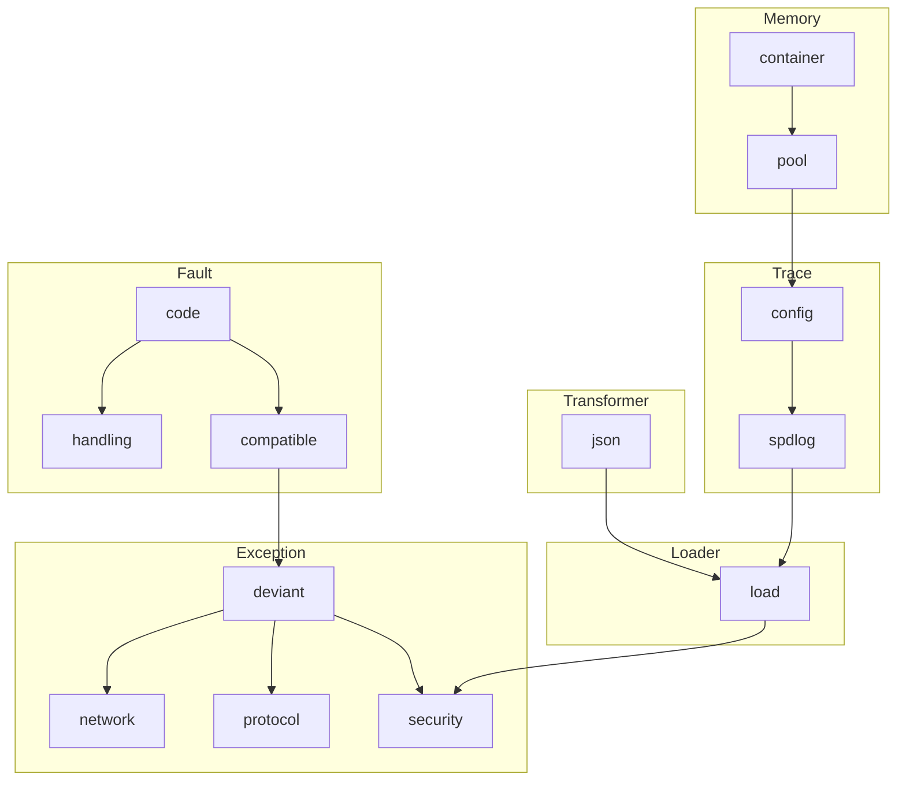
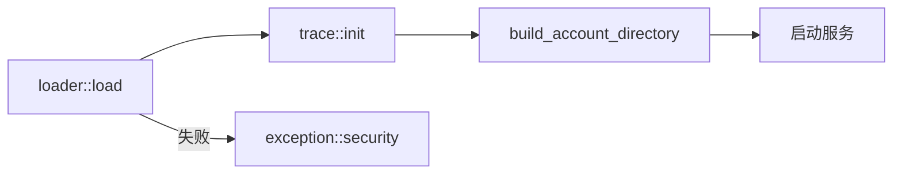
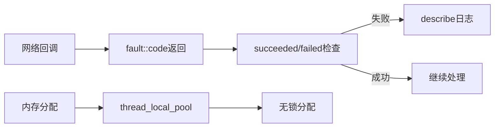

# Core 基础设施

Core 基础设施模块提供系统的底层支撑，包括内存管理、错误处理、异常系统、日志记录、序列化和配置加载。

## 模块架构



## 模块清单

| 模块 | 说明 | 页面 |
|------|------|------|
| **Memory** | PMR内存管理 | [[core/memory/overview]] |
| **Fault** | 错误码系统 | [[core/fault/overview]] |
| **Exception** | 异常系统 | [[core/exception/overview]] |
| **Trace** | 日志系统 | [[core/trace/overview]] |
| **Transformer** | 序列化 | [[core/transformer/overview]] |
| **Loader** | 配置加载 | [[core/loader/overview]] |

## 核心设计原则

### 热路径无异常

网络I/O、协议解析等高频路径使用错误码返回值：

```cpp
// 热路径正确做法
fault::code result = handle_request();
if (fault::failed(result)) {
    return result;
}

// 热路径禁止做法
// throw exception::network(...);  // 禁止
```

### 热路径无分配

使用线程局部内存池避免动态分配：

```cpp
class Session : public pooled_object<Session> { ... };
memory::vector<int> temp(memory::system::hot_path_pool());
```

### 启动阶段异常

配置加载、资源初始化等启动阶段使用异常：

```cpp
auto cfg = loader::load(path);  // 失败时抛出异常
trace::init(cfg.log_config);
```

## 启动流程



## 运行时流程



## 模块依赖关系

| 依赖方 | 提供方 | 依赖内容 |
|--------|--------|----------|
| Exception | Fault | `std::error_code` 基础 |
| Trace | Memory | PMR字符串配置 |
| Loader | Transformer | JSON反序列化 |
| Loader | Exception | 启动阶段异常 |
| Loader | Trace | 错误日志 |

## 相关页面

- [[core/memory/overview]] - Memory模块
- [[core/fault/overview]] - Fault模块
- [[core/exception/overview]] - Exception模块
- [[core/trace/overview]] - Trace模块
- [[core/transformer/overview]] - Transformer模块
- [[core/loader/overview]] - Loader模块