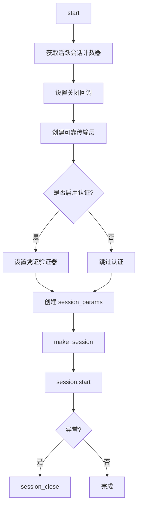
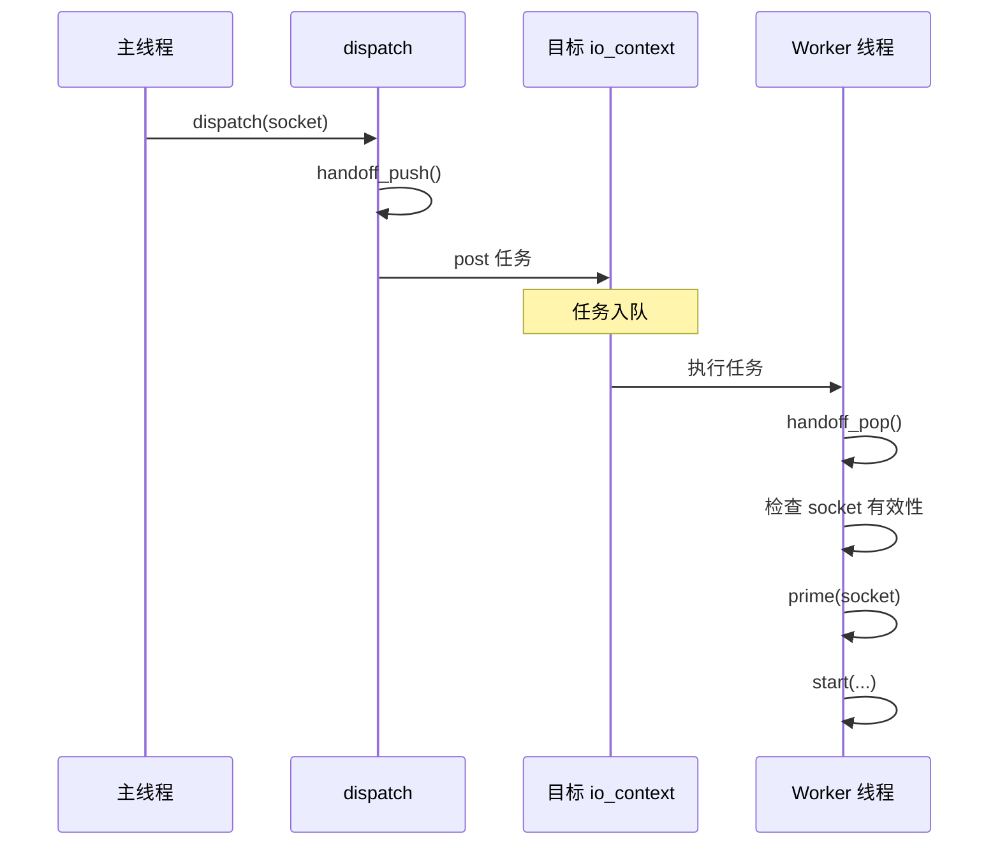
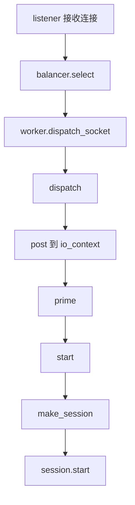

# launch 模块

## 源码位置

`I:/code/Prism/include/prism/instance/worker/launch.hpp`

## 模块职责

会话启动与连接分发模块，提供新连接的预处理和会话启动功能。当 acceptor 接收新连接后，通过本模块完成 socket 预配置、会话创建和认证设置等初始化工作。分发函数支持跨线程将 socket 投递到目标 worker 的事件循环中执行，实现负载均衡的连接分发机制。

## 主要函数

### migrate_executor

```cpp
[[nodiscard]] std::optional<tcp::socket> migrate_executor(
    tcp::socket &sock,
    net::io_context &target_ioc
) noexcept;
```

将 socket 的 executor 从当前 io_context 迁移到目标 io_context。

**问题背景**: socket 被 move 后 executor 不会改变，导致后续异步操作仍在原线程上执行。

**解决方案**: 通过释放原生句柄并重新绑定到目标 io_context。

**参数**:
| 参数 | 说明 |
|------|------|
| `sock` | 待迁移的 socket，迁移后变为空壳 |
| `target_ioc` | 目标 io_context |

**返回值**: 迁移后的新 socket，失败时为空

### prime

```cpp
void prime(tcp::socket &socket, std::uint32_t buffer_size) noexcept;
```

预配置 TCP socket 参数，对新接收的 socket 进行性能优化配置。

**配置项**:
| 配置 | 说明 |
|------|------|
| TCP_NODELAY | 禁用 Nagle 算法，降低小包延迟 |
| 接收缓冲区 | 匹配应用层吞吐需求 |
| 发送缓冲区 | 优化数据发送效率 |

**注意**: 所有操作均忽略错误，socket 配置失败不应阻断连接处理。

### start

```cpp
void start(
    server_context &server,
    worker_context &worker,
    stats::state &metrics,
    tcp::socket socket
);
```

在 worker 线程中创建并启动一个完整的会话对象。

**处理流程**:



**参数**:
| 参数 | 说明 |
|------|------|
| `server` | 服务端全局上下文 |
| `worker` | 当前 worker 的线程局部上下文 |
| `metrics` | 当前 worker 的统计状态对象 |
| `socket` | 已连接的 TCP socket |

### dispatch

```cpp
void dispatch(
    net::io_context &ioc,
    server_context &server,
    worker_context &worker,
    stats::state &metrics,
    tcp::socket socket
);
```

将 socket 分发到目标 worker 的事件循环，实现跨线程连接分发机制。

**分发流程**:



**特点**:
- 分发过程会先递增待处理计数
- 投递成功后立即递减待处理计数
- 负载均衡器可以感知各 worker 的排队压力
- 所有异常都会被捕获并记录日志

## 调用链



## 相关文档

- [[core/instance/worker/worker|Worker 模块]]
- [[core/instance/worker/stats|统计模块]]
- [[core/instance/session/session|会话模块]]
- [[core/instance/context|上下文模块]]

---

## 会话启动完整流程

从 socket 被 balancer 分发到 session 开始处理数据的完整链路：

### 跨线程分发阶段

```
Listener 线程                              Worker 线程
    │                                         │
    │ accept_loop() 接受新连接                 │
    │     │                                   │
    │     ▼                                   │
    │ socket = co_await acceptor.async_accept │
    │     │                                   │
    │     ▼                                   │
    │ affinity = make_affinity(endpoint)      │
    │     │                                   │
    │     ▼                                   │
    │ result = balancer.select(affinity)     │
    │     │                                   │
    │     ▼                                   │
    │ balancer.dispatch(result.index, sock)  │
    │     │                                   │
    │     ▼                                   │
    │ worker.dispatch_socket(std::move(sock))│
    │     │                                   │
    │     │  ioc_.post([=]() {               │
    │     │  ───────────────────────────────► │
    │     │      metrics.handoff_pop()        │
    │     │      prime(socket)                │
    │     │      launch::start(...)           │
    │     │      metrics.session_open()       │
    │     │  })                               │
    │                                         │
    │                              [任务入队] │
    │                                         │
    │                           io_context.run│
    │                              取出 handler│
    │                                         │
    │                              执行 start  │
```

### migrate_executor 详解

在跨线程分发中，socket 的 executor 迁移是关键步骤：

```cpp
[[nodiscard]] std::optional<tcp::socket> migrate_executor(
    tcp::socket &sock,
    net::io_context &target_ioc
) noexcept {
    // 1. 获取底层原生句柄
    auto native = sock.native_handle();

    // 2. 释放原 socket（不关闭连接，仅释放 Asio 包装）
    sock.release();

    // 3. 用目标 io_context 重新构造 socket
    tcp::socket new_sock{target_ioc};

    // 4. 将原生句柄重新绑定到新 socket
    new_sock.assign(tcp::v4(), native, ec);
    if (ec) return std::nullopt;

    return new_sock;
}
```

**问题背景**：`tcp::socket` 被构造时绑定了特定的 `io_context`，后续所有异步操作（`async_read`、`async_write`）都通过该 `io_context` 的 executor 调度。如果 socket 被 `std::move` 到另一个线程，其 executor 不会自动改变——异步操作仍然在原线程的队列中注册完成回调。

**解决方案**：释放原生句柄并用目标 `io_context` 重新包装。这个操作：
- 不关闭 TCP 连接（`native_handle` 保持不变）
- 仅改变 Asio 对句柄的调度路径
- 失败时返回 `std::nullopt`，调用方需要处理

### prime 预配置详解

```cpp
void prime(tcp::socket &socket, std::uint32_t buffer_size) noexcept {
    // 1. TCP_NODELAY: 禁用 Nagle 算法
    socket.set_option(tcp::no_delay(true), ec);
    // 效果: 小数据包立即发送，不等待 ACK
    // 对代理场景至关重要（避免引入额外 RTT 延迟）

    // 2. 接收缓冲区
    socket.set_option(socket_base::receive_buffer_size(buffer_size), ec);
    // 效果: 扩大内核接收缓冲区，适应突发流量

    // 3. 发送缓冲区
    socket.set_option(socket_base::send_buffer_size(buffer_size), ec);
    // 效果: 扩大内核发送缓冲区，提高吞吐

    // 所有 ec 被忽略: 配置失败不应阻断连接处理
}
```

**为什么忽略错误**：
- `setsockopt` 在某些平台（如 Windows）可能不被支持
- 即使设置失败，连接仍然可用，只是性能略有下降
- 代理服务的可用性优先级高于微优化

---

## 协程创建机制

### co_spawn 在 dispatch 中的使用

```cpp
void dispatch(
    net::io_context &ioc,
    server_context &server,
    worker_context &worker,
    stats::state &metrics,
    tcp::socket socket
) {
    metrics.handoff_push(); // 递增待处理计数

    ioc.post([=, socket = std::move(socket)]() mutable {
        try {
            metrics.handoff_pop(); // 任务开始执行

            if (!socket.is_open()) {
                return; // socket 已失效，静默丢弃
            }

            prime(socket, server.config().buffer.size);
            start(server, worker, metrics, std::move(socket));
            metrics.session_open(); // 会话启动成功

        } catch (const std::exception &e) {
            metrics.session_close(); // 异常: 补偿 session_open
            log_error("dispatch failed: {}", e.what());
        }
    });
}
```

### start 中的协程启动

```cpp
void start(
    server_context &server,
    worker_context &worker,
    stats::state &metrics,
    tcp::socket socket
) {
    // 1. 创建可靠传输层
    auto transmission = transport::make_reliable(
        std::move(socket),
        memory::system::thread_local_pool()
    );

    // 2. 构建会话参数
    session_params params{server, worker, std::move(transmission)};

    // 3. 创建会话对象
    auto session = make_session(std::move(params));

    // 4. 设置可选组件
    if (server.account_store) {
        session->set_account_directory(server.account_store);
    }

    // 5. 设置关闭回调（会话结束时更新统计）
    auto counter = metrics.session_counter();
    session->set_on_closed([counter, &metrics]() {
        // 共享计数器确保回调持有强引用
        metrics.session_close();
    });

    // 6. 启动会话（内部 co_spawn diversion 协程）
    session->start();
    // 此时 diversion 协程已入队到 worker 的 io_context
    // start 函数返回，session 由 shared_ptr 管理
}
```

### 启动模式选择

在 Prism 中有两种 `co_spawn` 使用模式：

| 模式 | 调用方式 | 适用场景 |
|------|----------|----------|
| **detached** | `co_spawn(ioc, awaitable, detached)` | 后台任务，无需等待结果（session 启动） |
| **awaitable** | `co_spawn(ioc, awaitable, use_awaitable)` | 需要 `co_await` 等待完成（内部子操作） |

Session 启动使用 `detached` 的原因：
- Session 是长时间运行的后台任务
- 生命周期由 `shared_ptr` 管理，不需要等待其完成
- 关闭通过状态机控制，而非 `awaitable` 句柄

### 传输层创建

```cpp
auto transmission = transport::make_reliable(
    std::move(socket),
    memory::system::thread_local_pool()
);
```

`make_reliable` 创建一个可靠传输层对象：
- 封装 TCP socket 为统一的传输接口
- 提供 `async_read_some`/`async_write_some` 等异步方法
- 使用 PMR 内存池分配读写缓冲区
- 传输层持有 socket 所有权，session 通过传输层间接操作 socket

---

## 错误处理与资源回滚

### dispatch 阶段错误处理

```
dispatch() 中的异常处理链:

dispatch(socket)
    │
    ├── handoff_push()           // 递增待处理计数
    │
    ├── ioc.post([=]() mutable {
    │       │
    │       ├── handoff_pop()    // 任务开始执行
    │       │
    │       ├── 检查 socket.is_open()
    │       │   └── 失败: return（静默丢弃，不增加 session 计数）
    │       │
    │       ├── prime(socket)    // 忽略错误（noexcept）
    │       │
    │       ├── start(...)       // 可能抛出异常
    │       │   ├── make_reliable 失败 → bad_alloc
    │       │   ├── make_session 失败 → 构造函数异常
    │       │   └── session->start 失败 → 内部异常
    │       │
    │       └── session_open()   // 仅在 start 成功后调用
    │
    │   }) catch (exception) {
    │       │
    │       ├── session_close()  // 补偿: 如果 session_open 已调用
    │       │   或: 如果 session_open 未调用，则无需补偿
    │       └── log_error()
    │   }
    │
    └── post 失败（极罕见）:
        handoff_push 已调用但任务未入队
        → 计数泄漏（需要额外的补偿机制）
```

### start 阶段资源回滚

```cpp
void start(...) {
    // ===== 资源获取 =====

    // R1: 创建传输层
    auto transmission = make_reliable(...);
    // 如果失败: bad_alloc 抛出，无资源泄漏

    // R2: 构建 session_params
    session_params params{server, worker, std::move(transmission)};
    // 如果失败: transmission 被 params 析构释放

    // R3: 创建 session
    auto session = make_session(std::move(params));
    // 如果失败: session 构造函数可能抛出
    // params 被销毁 → inbound 传输层被销毁 → socket 关闭

    // ===== 资源配置 =====

    // R4: 设置账户目录
    session->set_account_directory(store);
    // 不会失败（仅设置指针）

    // R5: 设置关闭回调
    session->set_on_closed(callback);
    // 不会失败（仅设置 function）

    // ===== 启动 =====

    // R6: 启动会话
    session->start();
    // co_spawn diversion 协程
    // 如果 co_spawn 内部异常: 需要手动清理

    // 成功后，session_open() 由调用方调用
}
```

### 回滚矩阵

| 失败点 | 已获取资源 | 回滚动作 | 统计影响 |
|--------|-----------|----------|----------|
| `make_reliable` | 无 | 无 | 无（handoff_push/pop 已抵消） |
| `make_session` 构造 | 传输层 | 传输层析构 → socket 关闭 | 无（session_open 未调用） |
| `set_account_directory` | session + 传输层 | session 析构 → 全部释放 | 无（session_open 未调用） |
| `session->start` | session + 传输层 + 回调 | session 析构 → 全部释放 | 无（session_open 未调用） |
| `session_open` 后异常 | session + 协程 + 传输层 | `session_close()` 补偿 + session 析构 | 已补偿 |

### 最坏情况处理

如果 `post()` 成功但 `handoff_pop()` 之前线程崩溃：

```
handoff_push() 执行了
    │
    ▼
任务已入队但未执行
    │
    ▼
进程崩溃/重启
    │
    ▼
handoff_pop() 和 session_open() 都未执行
    │
    ▼
结果: pending_handoffs 计数 +1（泄漏）
```

**恢复策略**：
- 进程重启后所有 worker 重新创建，计数归零
- 运行时泄漏被限定在单次事件（影响微小）
- balancer 仅使用近似值，单次泄漏不影响决策

### 优雅关闭

Worker 停止时的会话清理：

```cpp
void worker::stop() {
    // 1. 停止 work_guard，允许 io_context 退出
    work_guard_.reset();

    // 2. 取消所有挂起的 I/O 操作
    ioc_.stop();
    // 效果: 所有 async_wait/async_read/async_write 立即完成（operation_aborted）

    // 3. 等待 run() 返回
    // 所有会话协程退出 → shared_ptr 引用计数归零 → session 析构
    // session 析构 → session_close() → 活跃会话计数归零
}
```
