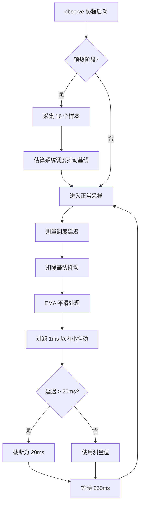
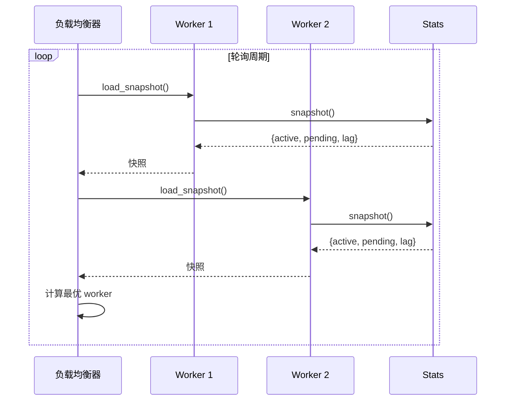
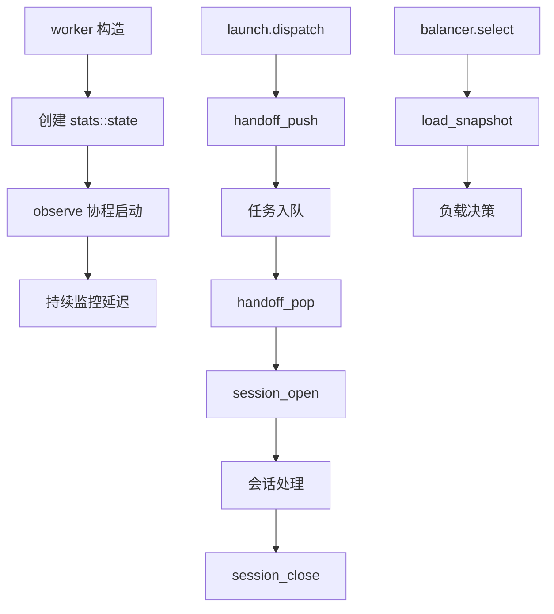

# stats 模块

## 源码位置

`include/prism/instance/worker/stats.hpp`

## 模块职责

Worker 负载统计模块，提供单个 worker 线程的运行状态统计功能。统计数据包括活跃会话数、待处理连接数和事件循环延迟三项核心指标。这些指标被负载均衡器用于决策新连接应该分发到哪个 worker，实现基于实际负载的动态调度。

## 主要组件

### state 类

单个 worker 的运行负载统计状态，维护三项核心指标。

#### 核心指标

| 指标 | 说明 |
|------|------|
| 活跃会话数 | 当前正在处理的连接数量 |
| 待处理连接数 | 已投递但尚未开始处理的连接数量 |
| 事件循环延迟 | 反映 worker 的处理压力 |

#### 公共方法

| 方法 | 说明 |
|------|------|
| `state()` | 创建空的统计状态 |
| `session_open()` | 会话开始时调用，递增活跃会话计数器 |
| `session_close()` | 会话结束时调用，递减活跃会话计数器 |
| `handoff_push()` | 有新 socket 等待投递时调用 |
| `handoff_pop()` | 等待投递的 socket 被消费后调用 |
| `session_counter()` | 获取活跃会话计数器共享指针 |
| `snapshot()` | 读取当前负载快照 |
| `observe(ioc)` | 周期性采样事件循环延迟（协程） |

#### 成员变量

| 变量 | 类型 | 说明 |
|------|------|------|
| `active_sessions_` | `shared_ptr<atomic<uint32_t>>` | 活跃会话数，共享指针包装支持跨线程访问 |
| `pending_handoffs_` | `atomic<uint32_t>` | 等待投递到 worker 的 socket 数 |
| `event_loop_lag_us_` | `atomic<uint64_t>` | 平滑后的事件循环延迟（微秒） |

## 延迟测量机制

### observe 协程

周期性采样事件循环延迟，在 worker 事件循环中持续运行。

**采样周期**: 250 毫秒

**测量流程**:



### EMA 平滑算法

使用指数移动平均过滤短期抖动，提供稳定的负载评估依据。

**特点**:
- 过滤 1ms 以内的小抖动
- 延迟上限 20ms，防止单次异常值污染统计数据
- 使用 relaxed 内存序，负载均衡器仅需要近似值

## 负载均衡集成



### 快照结构

```cpp
struct worker_load_snapshot {
    std::uint32_t active_sessions;  // 活跃会话数
    std::uint32_t pending_handoffs;  // 待处理连接数
    std::uint64_t event_loop_lag_us; // 事件循环延迟（微秒）
};
```

## 线程安全

所有计数器均使用原子操作，支持无锁并发访问。

| 方法 | 线程安全 |
|------|----------|
| `session_open()` | 是 |
| `session_close()` | 是 |
| `handoff_push()` | 是 |
| `handoff_pop()` | 是 |
| `session_counter()` | 是 |
| `snapshot()` | 是 |
| `observe()` | 否，必须在 worker 事件循环中运行 |

## 调用链



## 相关文档

- [[core/instance/worker/worker|Worker 模块]]
- [[core/instance/worker/launch|启动模块]]
- [[core/instance/front/balancer|负载均衡器]]

---

## 统计指标详解

### 活跃会话数 (active_sessions)

| 属性 | 描述 |
|------|------|
| 类型 | `std::shared_ptr<std::atomic<std::uint32_t>>` |
| 单位 | 计数（个） |
| 范围 | 0 ~ 2^32 - 1 |
| 递增时机 | `session_open()` 被调用（会话创建成功） |
| 递减时机 | `session_close()` 被调用（会话完全关闭） |
| 内存序 | `std::memory_order_relaxed` |

**计算方式**：

```cpp
void session_open() noexcept {
    active_sessions_->fetch_add(1, std::memory_order_relaxed);
}

void session_close() noexcept {
    active_sessions_->fetch_sub(1, std::memory_order_relaxed);
}
```

**为什么使用 shared_ptr**：
- 共享计数器允许 session 的关闭回调持有强引用
- 回调可能在 session 对象析构后才执行（通过 `set_on_closed`）
- 回调捕获 `shared_ptr<atomic<uint32_t>>` 确保即使 worker 已部分销毁，计数器仍然有效

**语义含义**：
- 反映 worker 当前正在处理的连接数量
- 是 balancer 评分中权重最高的指标（60%）
- 长连接场景下该值相对稳定，短连接场景下波动较大

### 待处理连接数 (pending_handoffs)

| 属性 | 描述 |
|------|------|
| 类型 | `std::atomic<std::uint32_t>` |
| 单位 | 计数（个） |
| 范围 | 0 ~ 2^32 - 1 |
| 递增时机 | `handoff_push()` 被调用（socket 投递到 io_context） |
| 递减时机 | `handoff_pop()` 被调用（投递任务开始执行） |
| 内存序 | `std::memory_order_relaxed` |

**计算方式**：

```cpp
void handoff_push() noexcept {
    pending_handoffs_.fetch_add(1, std::memory_order_relaxed);
}

void handoff_pop() noexcept {
    pending_handoffs_.fetch_sub(1, std::memory_order_relaxed);
}
```

**语义含义**：
- 反映 worker 的排队压力
- 表示已从 listener 接收但尚未开始处理的连接数量
- 该值越高，说明 worker 处理速度跟不上接收速度
- 在 balancer 评分中权重较低（10%），因为它是瞬时值

**时序图**：

```
listener.accept() ──► balancer.dispatch()
                          │
                          ▼
                     handoff_push()     ← pending = 1
                          │
                          ▼
                     ioc.post(task)     ← 任务在队列中等待
                          │
                          ▼ (worker 线程取出任务)
                     handoff_pop()      ← pending = 0
                          │
                          ▼
                     session_open()     ← active = 1
```

### 事件循环延迟 (event_loop_lag_us)

| 属性 | 描述 |
|------|------|
| 类型 | `std::atomic<std::uint64_t>` |
| 单位 | 微秒（μs） |
| 范围 | 0 ~ 20000（20ms 上限截断） |
| 更新时机 | `observe()` 协程每 250ms 采样一次 |
| 内存序 | `std::memory_order_relaxed` |

**测量原理**：

```cpp
auto observe(net::io_context &ioc) -> net::awaitable<void> {
    steady_timer timer{ioc};
    std::uint64_t lag_samples[16];  // 预热缓冲区
    std::size_t sample_idx = 0;

    // --- 预热阶段 ---
    for (int i = 0; i < 16; ++i) {
        auto send_time = steady_clock::now();
        timer.expires_after(250ms);
        co_await timer.async_wait();
        auto recv_time = steady_clock::now();
        lag_samples[i] = duration_cast<microseconds>(recv_time - send_time).count();
    }
    // 计算预热阶段的抖动基线
    uint64_t jitter_baseline = percentile_95(lag_samples);

    // --- 正常采样 ---
    while (true) {
        auto send_time = steady_clock::now();
        timer.expires_after(250ms);
        co_await timer.async_wait();
        auto recv_time = steady_clock::now();

        uint64_t raw_lag = duration_cast<microseconds>(recv_time - send_time).count();
        uint64_t corrected_lag = raw_lag - jitter_baseline;  // 扣除基线抖动

        // EMA 平滑
        uint64_t current = event_loop_lag_us_.load(std::memory_order_relaxed);
        uint64_t smoothed = static_cast<uint64_t>(current * 0.8 + corrected_lag * 0.2);

        // 过滤小抖动
        if (smoothed < 1000) {  // < 1ms 视为无延迟
            smoothed = 0;
        }

        // 上限截断
        if (smoothed > 20000) {
            smoothed = 20000;  // 20ms 上限
        }

        event_loop_lag_us_.store(smoothed, std::memory_order_relaxed);
    }
}
```

**关键参数**：

| 参数 | 值 | 作用 |
|------|-----|------|
| 采样间隔 | 250ms | 平衡精度和开销 |
| 预热样本数 | 16 | 估算系统调度抖动基线 |
| EMA 系数 | α = 0.2 | 新样本权重 20%，历史权重 80% |
| 小抖动阈值 | 1ms | 低于此值视为零延迟 |
| 上限截断 | 20ms | 防止单次异常值污染统计 |

**为什么需要抖动基线**：
- 即使在完全空闲状态下，`co_await timer.async_wait()` 也有微小的调度延迟
- 这个延迟来自操作系统定时器精度、Asio 内部队列处理时间等
- 不扣除基线会导致空闲 worker 也有非零延迟读数
- 预热阶段采集 16 个样本，取 P95 作为基线

---

## 快照格式

### worker_load_snapshot 结构体

```cpp
struct worker_load_snapshot {
    std::uint32_t active_sessions;   // 活跃会话数
    std::uint32_t pending_handoffs;  // 待处理连接数
    std::uint64_t event_loop_lag_us; // 事件循环延迟（微秒）
};
```

### 快照获取

```cpp
auto state::snapshot() const noexcept -> worker_load_snapshot {
    return worker_load_snapshot{
        .active_sessions = active_sessions_->load(std::memory_order_relaxed),
        .pending_handoffs = pending_handoffs_.load(std::memory_order_relaxed),
        .event_loop_lag_us = event_loop_lag_us_.load(std::memory_order_relaxed)
    };
}
```

**一致性保证**：
- 三个字段的读取不是原子的（分别读取）
- 在两次读取之间字段值可能变化
- 但 balancer 仅需要近似值，不要求严格一致性快照
- 使用 `relaxed` 内存序，允许 CPU 缓存读取，减少内存屏障开销

### 序列化格式

当需要将快照导出到日志或监控系统时：

```cpp
// JSON 序列化示例
{
    "active_sessions": 312,
    "pending_handoffs": 5,
    "event_loop_lag_us": 1200
}
```

**字段大小**：

| 字段 | 大小（字节） |
|------|-------------|
| `active_sessions` | 4 |
| `pending_handoffs` | 4 |
| `event_loop_lag_us` | 8 |
| **总计** | **16** |

快照结构体非常紧凑（仅 16 字节），适合高频采集。

---

## 性能影响分析

### 统计开销概览

| 操作 | 开销类型 | 时间复杂度 | 实际耗时估算 |
|------|----------|-----------|-------------|
| `session_open()` | 原子 fetch_add | O(1) | < 5ns |
| `session_close()` | 原子 fetch_sub | O(1) | < 5ns |
| `handoff_push()` | 原子 fetch_add | O(1) | < 5ns |
| `handoff_pop()` | 原子 fetch_sub | O(1) | < 5ns |
| `snapshot()` | 3 次原子 load | O(1) | < 15ns |
| `observe()` 单次采样 | 定时器 + 时钟 + EMA | O(1) | 分摊到 250ms |

### 对热路径的影响

Session 创建/关闭的热路径上，统计操作的开销占比：

```
session 创建热路径:
    dispatch() ──► handoff_pop()     < 5ns
                   prime()           ~ 100ns (setsockopt 调用)
                   start()           ~ 1-5 μs (对象构造 + co_spawn)
                   session_open()    < 5ns
    ─────────────────────────────────────
    统计操作占比: < 0.5%

session 关闭热路径:
    close() ──► state CAS            ~ 10ns
                cancel()             ~ 100ns
    session_close() ─► fetch_sub     < 5ns
    ─────────────────────────────────────
    统计操作占比: < 1%
```

**结论**：统计操作的开销在热路径中可忽略不计。

### observe 协程开销

`observe()` 协程每 250ms 唤醒一次：

```
单次 observe 采样开销:
    steady_clock::now() × 2    ~ 20ns (RDTSC 指令)
    timer.async_wait()          由定时器驱动（无 CPU 开销）
    EMA 计算                    ~ 10ns (浮点乘加)
    atomic store                < 5ns
    ─────────────────────────────────────
    总计（CPU 时间）:            ~ 55ns
    分摊到每秒:                  55ns / 0.25s = 220ns/s ≈ 0.00002%
```

**结论**：`observe()` 的 CPU 开销几乎为零，定时器等待期间不消耗 CPU。

### 内存开销

| 组件 | 大小 | 说明 |
|------|------|------|
| `active_sessions_` (shared_ptr + atomic) | 16 字节（指针）+ 4 字节（原子值） |
| `pending_handoffs_` | 4 字节 |
| `event_loop_lag_us_` | 8 字节 |
| `state` 对象总计 | < 64 字节（含虚函数表对齐） |
| 每个 worker 的统计内存 | < 128 字节 |

**结论**：内存开销可忽略不计。

### 对 balancer 决策精度的影响

由于使用 `memory_order_relaxed`：

| 场景 | 影响 | 后果 |
|------|------|------|
| 快照读取不是原子操作 | 三个字段的值可能不在同一时间点 | balancer 评分偏差 < 1% |
| relaxed 内存序允许缓存读取 | 可能读到几纳秒前的旧值 | 在 250ms 采样周期内影响可忽略 |
| EMA 平滑过滤小抖动 | 1ms 以下延迟被视为 0 | 避免空闲 worker 被误判为有负载 |

**结论**：近似值对调度决策的影响完全可接受。Balancer 的滞后机制（0.80/0.90 阈值）本身就是为了容忍短期波动。
