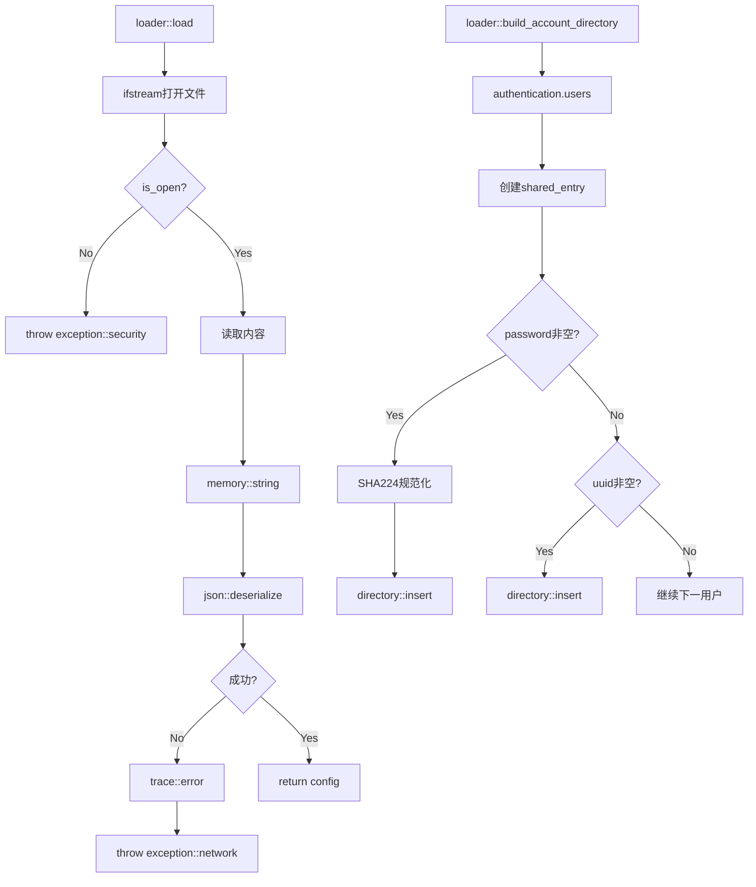

# Loader Load

配置加载适配器，将外部配置转换为内部结构。

## 源码位置

`I:/code/Prism/include/prism/loader/load.hpp`

## load - 加载配置

```cpp
inline auto load(const std::string_view path) -> config;
```

### 执行流程

1. 打开文件（失败抛 `exception::security`）
2. 读取全部内容
3. JSON反序列化
4. 返回配置对象

### 异常处理

| 情况 | 异常类型 |
|------|----------|
| 文件打开失败 | `exception::security` |
| JSON解析失败 | `exception::network(fault::code::parse_error)` |

```cpp
std::ifstream file(path.data(), std::ios::binary);
if (!file.is_open()) {
    throw exception::security("system error: {}", "file open failed");
}
```

### 使用示例

```cpp
try {
    auto cfg = loader::load("/etc/prism/config.json");
    trace::info("配置加载成功，端口: {}", cfg.port);
} catch (const exception::security &e) {
    trace::error("配置加载失败: {}", e.dump());
}
```

## build_account_directory - 构建账户目录

```cpp
inline auto build_account_directory(const agent::authentication &auth)
    -> std::shared_ptr<agent::account::directory>;
```

### 设计思路

统一用户表：`password` 和 `uuid` 共享同一个 `entry`，从而共享连接数配额。

### 执行流程

1. 创建 `account::directory`
2. 预估条目数并预留空间
3. 遍历用户：
   - `password` → SHA224规范化 → 注册
   - `uuid` → 直接注册
   - 两者共享 `shared_entry`

### SHA224规范化

```cpp
const auto normalized = crypto::normalize_credential(std::string_view(user.password));
dir->insert(normalized, shared_entry);
```

### 使用示例

```cpp
auto cfg = loader::load(path);
auto account_dir = loader::build_account_directory(cfg.authentication);

// 查询账户
if (account_dir->lookup(password)) {
    // 认证成功
}
```

## 调用链



## 依赖关系

```cpp
#include <prism/config.hpp>
#include <prism/exception.hpp>
#include <prism/transformer.hpp>
#include <prism/trace.hpp>
#include <prism/agent/account/directory.hpp>
#include <prism/crypto/sha224.hpp>
```

## 相关页面

- [[core/loader/overview]] - Loader模块总览
- [[core/transformer/json]] - JSON反序列化
- [[core/exception/security]] - 安全异常
- [[core/agent/account/directory]] - 账户目录