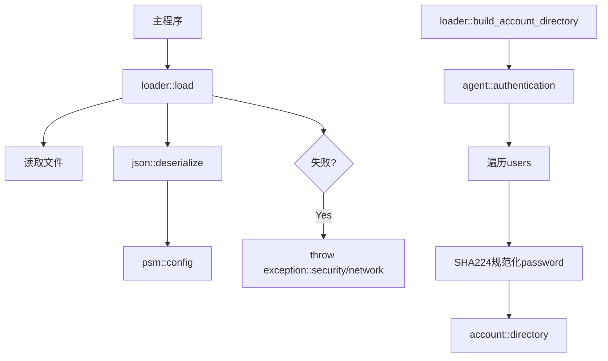

# Loader 模块

Loader 模块提供配置加载功能，将外部配置文件转换为内部配置结构。

## 设计目标

- **防腐层**: 隔离外部格式与内部结构
- **统一账户**: password和uuid共享配额
- **错误处理**: 启动阶段使用异常

## 模块组成

| 组件 | 说明 | 源码 |
|------|------|------|
| [[core/loader/load]] | 配置加载器 | `prism/loader/load.hpp` |

## 核心接口

```cpp
namespace psm::loader {
    // 加载配置文件
    config load(std::string_view path);
    
    // 构建账户目录
    std::shared_ptr<agent::account::directory> 
        build_account_directory(const agent::authentication &auth);
}
```

## 调用链



## 相关模块

- [[core/transformer/json]] - JSON反序列化
- [[core/exception]] - 异常处理
- [[core/instance/account/directory]] - 账户目录