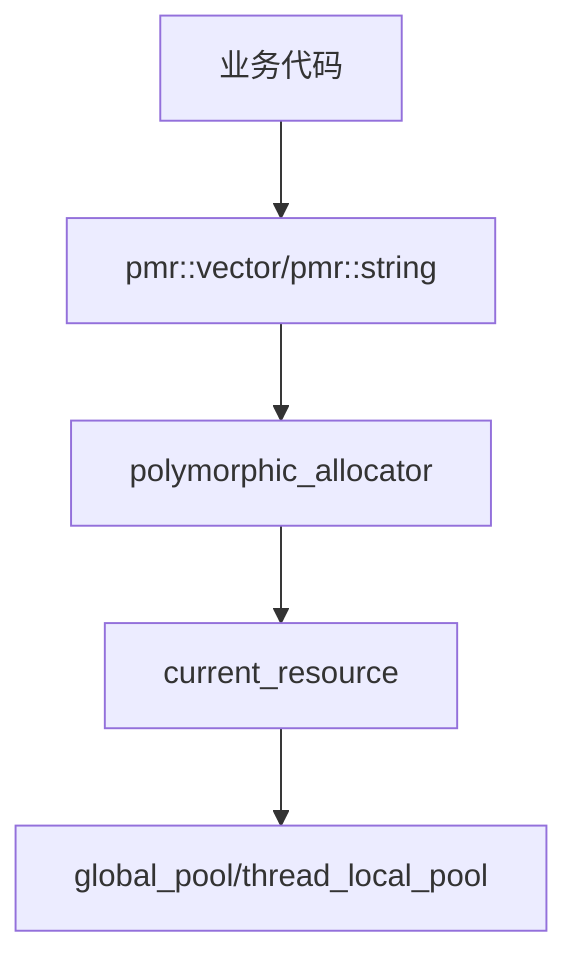

# Memory Container

内存容器别名定义，提供统一的 PMR (Polymorphic Memory Resource) 容器类型。

## 源码位置

`I:/code/Prism/include/prism/memory/container.hpp`

## 设计目标

为项目提供统一的内存管理基础设施，所有容器类型均使用 `polymorphic_allocator` 分配器，支持运行时切换内存资源。

## 核心定义

### 内存资源类型

```cpp
namespace psm::memory {
    using resource = std::pmr::memory_resource;
    using resource_pointer = std::add_pointer_t<resource>;
}
```

### 默认资源获取

```cpp
inline auto current_resource() -> resource_pointer {
    return std::pmr::get_default_resource();
}
```

返回当前默认内存资源。若调用了 `system::enable_global_pooling()`，则返回 `global_pool()`。

### 分配器模板

```cpp
template <typename Type>
using allocator = std::pmr::polymorphic_allocator<Type>;
```

### 池资源类型

| 类型 | 说明 | 使用场景 |
|------|------|----------|
| `synchronized_pool` | 线程安全池 | 跨线程传递对象 |
| `unsynchronized_pool` | 非线程安全池 | 单线程热路径 |
| `monotonic_buffer` | 单调缓冲区 | 短生命周期高频分配 |

### 容器别名

```cpp
using string = std::pmr::string;

template <typename Value>
using vector = std::pmr::vector<Value>;

template <typename Value>
using list = std::pmr::list<Value>;

template <typename Key, typename Value, typename Compare = std::less<Key>>
using map = std::pmr::map<Key, Value, Compare>;

template <typename Key, typename Value, typename Hash = std::hash<Key>>
using unordered_map = std::pmr::unordered_map<Key, Value, Hash>;

template <typename Key, typename Hash = std::hash<Key>>
using unordered_set = std::pmr::unordered_set<Key, Hash>;
```

## 调用链



## 使用示例

```cpp
// 使用默认内存资源创建vector
memory::vector<int> nums;

// 显式指定内存资源
memory::vector<int> nums(memory::system::thread_local_pool());

// PMR字符串
memory::string str(memory::system::global_pool());
```

## 相关页面

- [[core/memory/overview]] - Memory模块总览
- [[core/memory/pool]] - 内存池系统

---

## PMR 容器类型详解

所有 PMR 容器均通过 `polymorphic_allocator` 在运行时绑定到具体的 `memory_resource`，区别于标准容器的编译期 allocator 模板参数。

### pmr::string

```cpp
using string = std::pmr::string;
// 等价于: std::basic_string<char, std::char_traits<char>, std::pmr::polymorphic_allocator<char>>
```

- **容量增长策略**: 同 `std::string`（C++11 起为 1.5x 或 2x）
- **SSO 优化**: 短字符串（通常 ≤15 字符）使用内部缓冲区，不触发 allocator 调用
- **传播行为**: `polymorphic_allocator` 在拷贝构造/赋值时传播 allocator（`propagate_on_container_copy_assignment` / `propagate_on_container_move_assignment` 为 `true_type`）

### pmr::vector

```cpp
template <typename Value>
using vector = std::pmr::vector<Value>;
```

- **容量增长**: 倍增策略，扩容时从新 allocator 重新分配
- **适用场景**: 帧缓冲解析、消息体暂存、列表型数据结构
- **传播行为**: 同 `pmr::string`，拷贝/移动时传播 allocator

### pmr::list

```cpp
template <typename Value>
using list = std::pmr::list<Value>;
```

- **每节点一次分配**: 每个链表节点独立调用 allocator，不适合高频创建/销毁
- **适用场景**: 需要 O(1) 中间插入/删除且总量可控的场景
- **注意**: 代理服务器热路径中优先使用 `vector` + 索引，避免 `list` 的碎片化

### pmr::map

```cpp
template <typename Key, typename Value, typename Compare = std::less<Key>>
using map = std::pmr::map<Key, Value, Compare>;
```

- **红黑树实现**: 每个节点一次分配，支持有序遍历
- **适用场景**: 路由表、配置映射等需要有序性的场景
- **注意**: 热路径中可考虑用排序 `vector` + 二分查找替代

### pmr::unordered_map

```cpp
template <typename Key, typename Value, typename Hash = std::hash<Key>>
using unordered_map = std::pmr::unordered_map<Key, Value, Hash>;
```

- **哈希表实现**: bucket 数组 + 节点链表，均使用 PMR allocator
- **适用场景**: 连接池索引、会话管理、快速查找表
- **传播行为**: bucket 数组和节点分配均使用同一 allocator

### pmr::unordered_set

```cpp
template <typename Key, typename Hash = std::hash<Key>>
using unordered_set = std::pmr::unordered_set<Key, Hash>;
```

- 与 `unordered_map` 结构相同，仅存储 Key
- **适用场景**: 黑名单/白名单集合、去重集合

## 容器传播规则

PMR 容器的 allocator 传播行为由 `allocator_traits` 中的三个类型控制：

| 传播类型别名 | 值 | 含义 |
|-------------|-----|------|
| `propagate_on_container_copy_assignment` | `std::true_type` | 拷贝赋值时，目标容器替换为源的 allocator |
| `propagate_on_container_move_assignment` | `std::true_type` | 移动赋值时，目标容器替换为源的 allocator |
| `propagate_on_container_swap` | `std::true_type` | swap 时交换 allocator |

### 传播行为示例

```cpp
// 场景1: 拷贝构造 — allocator 传播
memory::vector<int> src(pool);
src.push_back(42);
memory::vector<int> dst = src;  // dst 也使用 pool

// 场景2: 拷贝赋值 — allocator 被替换
memory::vector<int> a(pool_a);
memory::vector<int> b(pool_b);
a.push_back(1);
b.push_back(2);
a = b;  // a 现在使用 pool_b，且原 pool_a 中的数据被释放

// 场景3: 移动赋值 — allocator 传播且无重新分配
memory::vector<int> c(pool_c);
c.push_back(100);
memory::vector<int> d(pool_d);
d = std::move(c);  // d 使用 pool_c，c 变为空
```

### 何时传播 / 何时不传播

```
┌─────────────────────────────────────────────────────────────┐
│  操作              │ 传播 Allocator?  │ 重新分配?           │
├────────────────────┼──────────────────┼─────────────────────┤
│  默认构造          │ 使用默认资源     │ 否                  │
│  传入resource构造  │ 使用指定资源     │ 否                  │
│  拷贝构造          │ 是(传播源)       │ 是(数据从源拷贝)    │
│  移动构造          │ 是(传播源)       │ 否(窃取内部指针)    │
│  拷贝赋值          │ 是(替换为源的)   │ 是                  │
│  移动赋值          │ 是(替换为源的)   │ 否                  │
│  swap              │ 是(互换)         │ 否                  │
│  clear()           │ 否               │ 否(但释放元素)      │
│  shrink_to_fit()   │ 否               │ 可能(新分配+移动)   │
└─────────────────────────────────────────────────────────────┘
```

**关键规则**: PMR 容器的 allocator 几乎总是传播的。这意味着当容器被拷贝/移动/赋值时，allocator 随数据一起迁移，确保后续分配仍使用正确的内存资源。

## 使用示例

```cpp
// === 基础用法 ===

// 使用默认资源（自动跟随 system::enable_global_pooling() 的设置）
memory::string msg;

// 显式指定资源
memory::vector<connection> conns{memory::system::thread_local_pool()};

// === 帧解析场景 ===
void parse_frame(frame_arena& arena, const std::byte* data, std::size_t len) {
    // 使用 arena 的单调缓冲区，避免热路径穿透到上游池
    memory::vector<std::byte> buffer(arena.get());
    buffer.assign(data, data + len);
    // ... 解析逻辑 ...
    arena.reset();  // 帧处理完毕，一次性释放
}

// === 会话管理场景 ===
class SessionManager {
    // 会话索引使用全局池，支持跨线程访问
    memory::unordered_map<std::string, session_ptr> sessions_{
        memory::system::global_pool()
    };

    // 临时解析缓冲区使用线程局部池
    void handle_message(const message& msg) {
        memory::vector<std::byte> tmp{
            memory::system::thread_local_pool()
        };
        tmp.assign(msg.data.begin(), msg.data.end());
        // ...
    }
};

// === 容器间资源迁移 ===
void transfer_data() {
    memory::vector<int> src{pool_a};
    src.push_back(42);

    // 移动后，src 变为空，dst 持有数据和 pool_a 的引用
    memory::vector<int> dst{std::move(src)};
}
```

## 性能对比

| 容器 | 标准容器 (std::) | PMR 容器 (std::pmr::) | 差异来源 |
|------|-----------------|----------------------|----------|
| `vector<int>` push_back | ~5ns (内联 new) | ~3ns (池分配) | 消除锁竞争(线程局部池) |
| `string` 构造(SSO内) | ~2ns | ~2ns | SSO 不触发 allocator |
| `string` 构造(>15B) | ~40ns (含堆分配) | ~8ns (池分配) | 避免堆碎片化 |
| `unordered_map` insert | ~80ns (含2次堆分配) | ~15ns (池分配) | 节点+bucket 均池化 |
| `list` push_back | ~60ns | ~12ns | 单节点池化 |

> 以上数据基于 `unsynchronized_pool` 预填充场景测量。首次使用 `synchronized_pool` 时需额外支付互斥锁开销（~20-50ns，取决于竞争程度）。

### 选择指南

```
高频热路径(每请求多次)
    → 线程局部 unsynchronized_pool + pmr::vector
    → 短生命周期对象 → monotonic_buffer (frame_arena)

跨线程共享数据
    → synchronized_pool + pmr::unordered_map
    → 注意: 同步池内部有锁，QPS 极高时考虑分片

配置/启动阶段(低频)
    → 默认资源即可，性能差异可忽略

大对象(>16KB)
    → 自动穿透到系统堆，PMR 开销可忽略
```