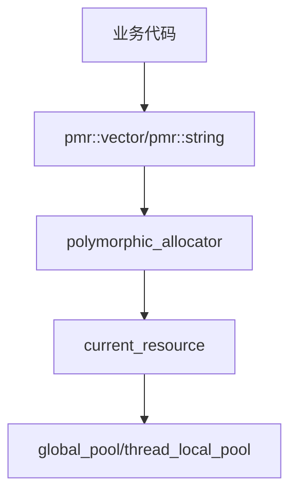

# Memory Container

内存容器别名定义，提供统一的 PMR (Polymorphic Memory Resource) 容器类型。

## 源码位置

`I:/code/Prism/include/prism/memory/container.hpp`

## 设计目标

为项目提供统一的内存管理基础设施，所有容器类型均使用 `polymorphic_allocator` 分配器，支持运行时切换内存资源。

## 核心定义

### 内存资源类型

```cpp
namespace psm::memory {
    using resource = std::pmr::memory_resource;
    using resource_pointer = std::add_pointer_t<resource>;
}
```

### 默认资源获取

```cpp
inline auto current_resource() -> resource_pointer {
    return std::pmr::get_default_resource();
}
```

返回当前默认内存资源。若调用了 `system::enable_global_pooling()`，则返回 `global_pool()`。

### 分配器模板

```cpp
template <typename Type>
using allocator = std::pmr::polymorphic_allocator<Type>;
```

### 池资源类型

| 类型 | 说明 | 使用场景 |
|------|------|----------|
| `synchronized_pool` | 线程安全池 | 跨线程传递对象 |
| `unsynchronized_pool` | 非线程安全池 | 单线程热路径 |
| `monotonic_buffer` | 单调缓冲区 | 短生命周期高频分配 |

### 容器别名

```cpp
using string = std::pmr::string;

template <typename Value>
using vector = std::pmr::vector<Value>;

template <typename Value>
using list = std::pmr::list<Value>;

template <typename Key, typename Value, typename Compare = std::less<Key>>
using map = std::pmr::map<Key, Value, Compare>;

template <typename Key, typename Value, typename Hash = std::hash<Key>>
using unordered_map = std::pmr::unordered_map<Key, Value, Hash>;

template <typename Key, typename Hash = std::hash<Key>>
using unordered_set = std::pmr::unordered_set<Key, Hash>;
```

## 调用链



## 使用示例

```cpp
// 使用默认内存资源创建vector
memory::vector<int> nums;

// 显式指定内存资源
memory::vector<int> nums(memory::system::thread_local_pool());

// PMR字符串
memory::string str(memory::system::global_pool());
```

## 相关页面

- [[core/memory/overview]] - Memory模块总览
- [[core/memory/pool]] - 内存池系统