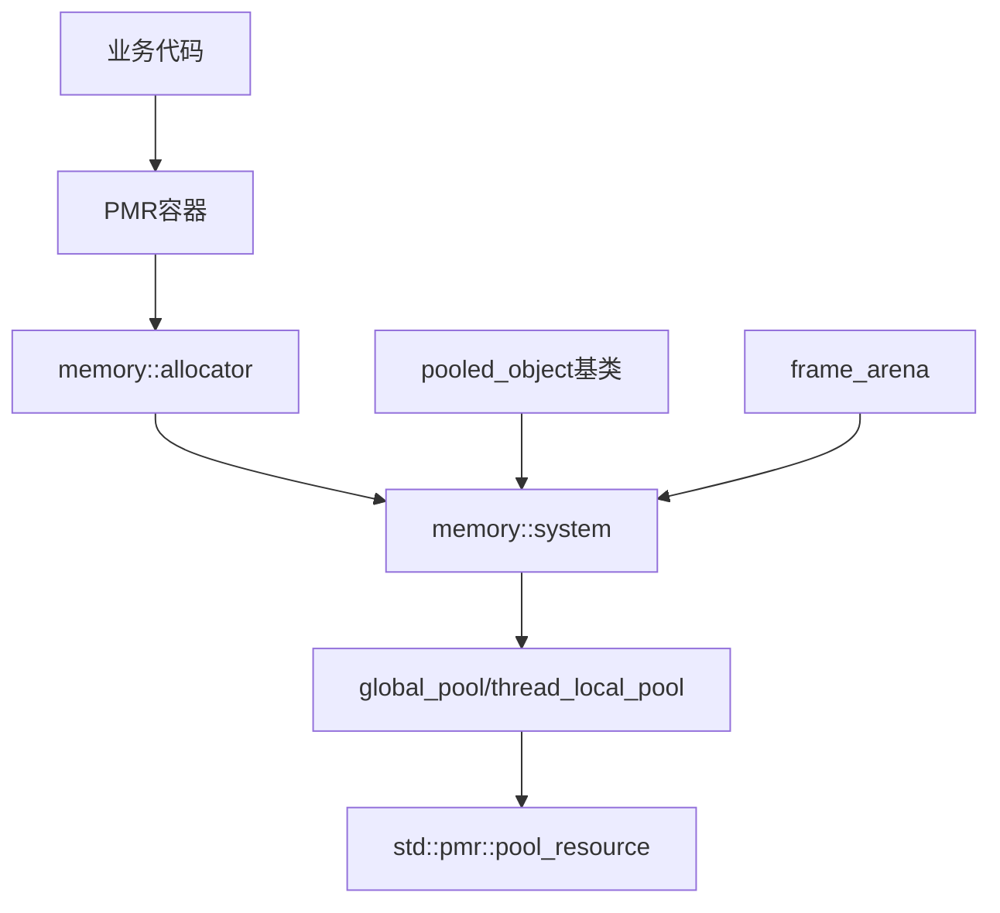

# Memory 模块

Memory 模块提供基于 C++17 PMR (Polymorphic Memory Resource) 的内存管理基础设施，为整个系统提供统一的内存分配策略。

## 设计原则

- **热路径无分配**: 网络I/O、协议解析等高频执行路径避免动态内存分配
- **线程封闭**: 线程局部池消除多线程竞争，实现无锁分配
- **大小分类**: 小对象池化，大对象直通系统堆

## 模块组成

| 组件 | 说明 | 源码 |
|------|------|------|
| [[core/memory/container]] | PMR容器别名定义 | `prism/memory/container.hpp` |
| [[core/memory/pool]] | 内存池系统 | `prism/memory/pool.hpp` |

## 核心类型

### 内存资源

```cpp
namespace psm::memory {
    using resource = std::pmr::memory_resource;
    using resource_pointer = std::add_pointer_t<resource>;
}
```

### 池类型

- `synchronized_pool`: 线程安全的池资源，内部使用互斥锁保护
- `unsynchronized_pool`: 非线程安全的池资源，仅限单线程使用
- `monotonic_buffer`: 单调增长缓冲区资源，仅分配不释放

### PMR 容器别名

```cpp
using string = std::pmr::string;
template <typename Value> using vector = std::pmr::vector<Value>;
template <typename Value> using list = std::pmr::list<Value>;
template <typename Key, typename Value> using map = std::pmr::map<Key, Value>;
template <typename Key, typename Value> using unordered_map = std::pmr::unordered_map<Key, Value>;
```

## 调用链



## 相关模块

- [[core/fault]] - 错误码系统
- [[core/exception]] - 异常系统
- [[core/trace]] - 日志系统使用PMR字符串