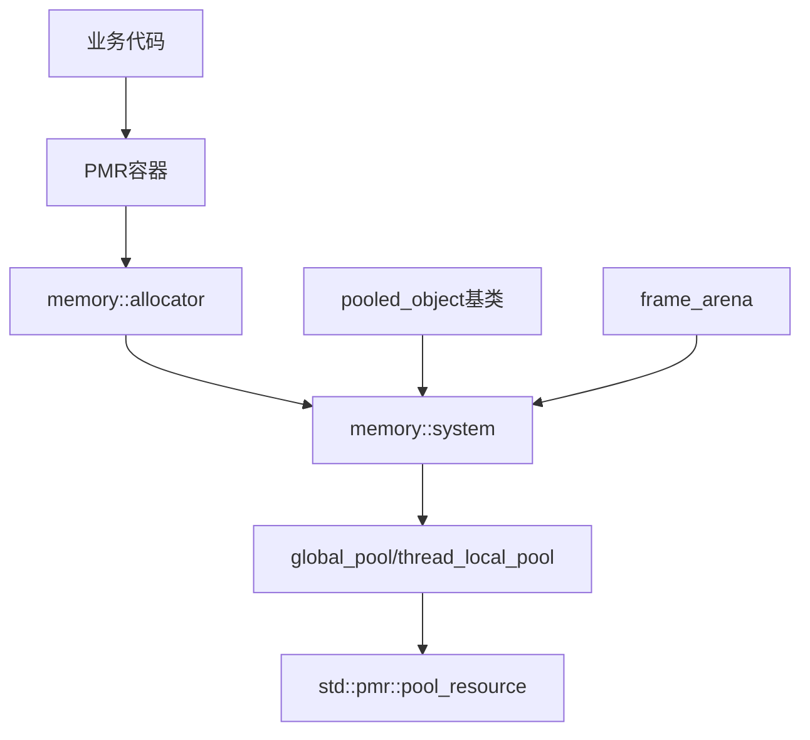

# Memory 模块

Memory 模块提供基于 C++17 PMR (Polymorphic Memory Resource) 的内存管理基础设施，为整个系统提供统一的内存分配策略。

## 设计原则

- **热路径无分配**: 网络I/O、协议解析等高频执行路径避免动态内存分配
- **线程封闭**: 线程局部池消除多线程竞争，实现无锁分配
- **大小分类**: 小对象池化，大对象直通系统堆

## 模块组成

| 组件 | 说明 | 源码 |
|------|------|------|
| [[core/memory/container]] | PMR容器别名定义 | `prism/memory/container.hpp` |
| [[core/memory/pool]] | 内存池系统 | `prism/memory/pool.hpp` |

## 核心类型

### 内存资源

```cpp
namespace psm::memory {
    using resource = std::pmr::memory_resource;
    using resource_pointer = std::add_pointer_t<resource>;
}
```

### 池类型

- `synchronized_pool`: 线程安全的池资源，内部使用互斥锁保护
- `unsynchronized_pool`: 非线程安全的池资源，仅限单线程使用
- `monotonic_buffer`: 单调增长缓冲区资源，仅分配不释放

### PMR 容器别名

```cpp
using string = std::pmr::string;
template <typename Value> using vector = std::pmr::vector<Value>;
template <typename Value> using list = std::pmr::list<Value>;
template <typename Key, typename Value> using map = std::pmr::map<Key, Value>;
template <typename Key, typename Value> using unordered_map = std::pmr::unordered_map<Key, Value>;
```

## 调用链



## 相关模块

- [[core/fault]] - 错误码系统
- [[core/exception]] - 异常系统
- [[core/trace]] - 日志系统使用PMR字符串

---

## 内存系统架构总览

```
┌──────────────────────────────────────────────────────────────────────┐
│                        业务代码层 (Business Layer)                    │
│  ┌──────────┐  ┌──────────┐  ┌──────────┐  ┌──────────┐             │
│  │pooled_   │  │frame_    │  │PMR       │  │直接使用  │             │
│  │object子类│  │arena     │  │容器别名  │  │pool API  │             │
│  └────┬─────┘  └────┬─────┘  └────┬─────┘  └────┬─────┘             │
│       │              │             │              │                    │
├───────┼──────────────┼─────────────┼──────────────┼────────────────────┤
│       │         memory::system::  │              │                    │
│       ▼              ▼             ▼              ▼                    │
│  ┌──────────────────────────────────────────────────────────────┐    │
│  │                    Allocator 分发层                           │    │
│  │  ┌─────────────────┐  ┌─────────────────┐                   │    │
│  │  │ pooled_object   │  │ polymorphic     │                   │    │
│  │  │ ::operator new  │  │ allocator<T>    │                   │    │
│  │  └────────┬────────┘  └────────┬────────┘                   │    │
│  └───────────┼───────────────────┼─────────────────────────────┘    │
│              │                   │                                   │
├──────────────┼───────────────────┼───────────────────────────────────┤
│              ▼                   ▼                                   │
│  ┌─────────────────────┐  ┌─────────────────────────────────┐      │
│  │  target_resource()  │  │  current_resource()             │      │
│  │  (global or local)  │  │  → global_pool() if enabled     │      │
│  └──────────┬──────────┘  └───────────────┬─────────────────┘      │
│             │                             │                         │
├─────────────┼─────────────────────────────┼─────────────────────────┤
│             ▼                             ▼                         │
│  ┌─────────────────────────────────────────────────────────────┐   │
│  │                    memory_resource 层                        │   │
│  │  ┌─────────────────────┐  ┌──────────────────────────────┐  │   │
│  │  │ synchronized_pool   │  │ unsynchronized_pool          │  │   │
│  │  │ (线程安全, 有锁)    │  │ (线程局部, 无锁)             │  │   │
│  │  └──────────┬──────────┘  └──────────────┬───────────────┘  │   │
│  │             │                             │                  │   │
│  │  ┌──────────▼──────────┐                  │                  │   │
│  │  │ monotonic_buffer    │                  │                  │   │
│  │  │ (帧分配器, 栈缓冲)  │                  │                  │   │
│  │  └──────────┬──────────┘                  │                  │   │
│  └─────────────┼─────────────────────────────┼──────────────────┘   │
│                │                             │                       │
├────────────────┼─────────────────────────────┼───────────────────────┤
│                ▼                             ▼                       │
│         ┌──────────────────────────────────────────────┐            │
│         │           std::pmr::pool_resource            │            │
│         │   (C++ 标准库内部实现, 大小分类分配)         │            │
│         └──────────────────────┬───────────────────────┘            │
│                                │                                     │
├────────────────────────────────┼─────────────────────────────────────┤
│                                ▼                                     │
│                      ┌──────────────────┐                           │
│                      │  系统堆 (new/    │                           │
│                      │  malloc / >16KB) │                           │
│                      └──────────────────┘                           │
└──────────────────────────────────────────────────────────────────────┘
```

## 设计原则详解

### 热路径无分配

网络代理服务器的热路径包括：协议解析、数据转发、连接管理。这些路径每秒执行数千至数十万次。

```
热路径 (必须避免动态分配)
    ├── TCP/UDP 数据接收与转发
    ├── 协议帧解析 (Trojan/VLESS/SS2022)
    ├── DNS 查询与响应解析
    └── 多路复用帧编解码

温路径 (可使用池分配)
    ├── 新连接建立
    ├── 路由规则匹配
    └── 会话创建与销毁

冷路径 (可自由分配)
    ├── 配置文件解析
    ├── 日志输出
    └── 管理接口响应
```

**实现策略**:
- 热路径使用 `frame_arena`（栈上 512B 缓冲区 + 单调分配器），零穿透率
- 温路径使用 `thread_local_pool`（无锁池分配），避免全局竞争
- 冷路径使用默认资源，无特殊约束

### 线程封闭

```
Thread A                          Thread B
┌────────────────────┐           ┌────────────────────┐
│ thread_local_pool  │           │ thread_local_pool  │
│ (无锁, 独立)       │           │ (无锁, 独立)       │
│                    │           │                    │
│ session_A → local  │           │ session_B → local  │
│ frame_arena_A      │           │ frame_arena_B      │
└────────┬───────────┘           └────────┬───────────┘
         │                                │
         │        ┌────────────┐          │
         └───────▶│ global_pool│◀─────────┘
                  │ (有锁, 共享)│
                  │ config     │
                  │ shared_obj │
                  └────────────┘
```

**核心思想**: 每个线程拥有独立的内存池实例，消除多线程分配时的互斥竞争。仅当对象需要跨线程传递时，才使用 `global_pool`（线程安全，有锁）。

### 大小分类

```
分配请求
    │
    ├── size ≤ 16KB
    │   │
    │   ├── ≤ 1520 bytes (典型网络帧)
    │   │   → pool chunk 内小块分配, O(1)
    │   │
    │   └── 1521 - 16384 bytes
    │       → pool chunk 内大块分配, O(1)
    │
    └── size > 16KB
        → 直通系统堆 (new/malloc), 不影响池性能
```

`pool_resource` 内部维护多个大小级别的 free list，分配时直接链表摘取，释放时归还对应级别。超过 `max_pool_size`（16KB）的请求绕过池机制。

## 各组件职责

| 组件 | 职责 | 谁使用它 |
|------|------|----------|
| `current_resource()` | 统一入口，返回当前线程应使用的内存资源 | PMR 容器默认构造、allocator 默认参数 |
| `system::global_pool()` | 提供全局共享的线程安全内存池 | 跨线程传递的对象、全局配置缓存 |
| `system::thread_local_pool()` | 提供每线程独立的无锁内存池 | 热路径/温路径的临时对象 |
| `system::hot_path_pool()` | `thread_local_pool()` 的语义别名 | 强调"仅限热路径使用"的场景 |
| `pooled_object<T>` | CRTP 基类，自动重载 new/delete 使用内存池 | Session、Connection 等频繁创建的生命周期对象 |
| `frame_arena` | 栈上单调分配器，512B 内置缓冲区 | 协议帧解析、mux 地址头解析 |
| `pmr::string/vector/...` | 容器别名，绑定到 `polymorphic_allocator` | 全系统统一使用，替代 std:: 容器 |

## 性能指标

| 指标 | 目标值 | 说明 |
|------|--------|------|
| 热路径分配延迟 (无锁) | < 5ns | `unsynchronized_pool` 预填充场景 |
| 热路径分配延迟 (有锁, 无竞争) | < 25ns | `synchronized_pool` 单线程场景 |
| 热路径分配延迟 (有锁, 竞争) | < 50ns | `synchronized_pool` 多线程竞争场景 |
| frame_arena 分配延迟 | < 2ns | 栈上指针 bump 分配 |
| 小对象池内存开销 | < 10% | 相比直接堆分配 |
| frame_arena 穿透率 | 0% | 典型 mux 帧 < 512B |
| 大对象 (>16KB) 穿透 | 自动 | 不进入池，直通系统堆 |

## 初始化流程

```
程序启动
    │
    ▼
1. 静态初始化阶段
    ├── pool_resource 内部数据结构初始化 (延迟首次使用时)
    └── global_pool() 通过 new 分配, 确保生命周期覆盖全程
    │
    ▼
2. system::enable_global_pooling() 调用
    ├── 将 current_resource() 重定向到 global_pool()
    ├── 此后所有 PMR 容器默认使用全局池
    └── 通常在 main() 早期调用
    │
    ▼
3. 线程启动
    ├── 每个线程首次访问 thread_local_pool() 时
    │   初始化线程局部的 unsynchronized_pool 实例
    │
    ├── 线程内热路径对象使用 local pool
    │   (pooled_object<Session> → local)
    │
    └── 需要跨线程的对象显式使用 global pool
        (pooled_object<Config, pool_type::global>)
    │
    ▼
4. 运行期间
    ├── 小对象(≤16KB): 从 pool 分配/回收
    ├── 大对象(>16KB): 直通系统堆
    └── frame_arena: 栈上分配, reset() 一次性回收
    │
    ▼
5. 程序关闭
    ├── 各线程的 thread_local_pool 随线程销毁自动析构
    ├── global_pool 在静态析构阶段仍然可用
    └── 池内所有未释放内存在池析构时统一回收
```

### enable_global_pooling 时机

```cpp
// 错误: 在容器已创建后调用, 已创建的容器不受影响
memory::vector<int> v1;  // 使用默认堆资源
memory::system::enable_global_pooling();
memory::vector<int> v2;  // 使用全局池 ✅
// v1 仍然使用默认堆资源 ❌

// 正确: 在 main() 最开始调用
int main() {
    memory::system::enable_global_pooling();  // ✅ 最先调用
    // 此后所有 PMR 容器默认使用全局池
    memory::vector<int> v;  // 使用全局池 ✅
}
```