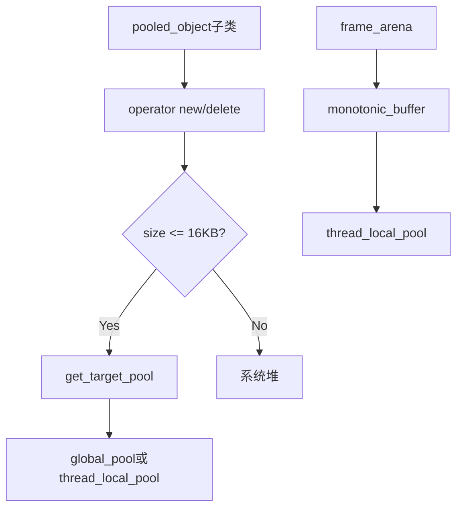

# Memory Pool

内存池系统定义，提供全局和线程局部的内存池管理。

## 源码位置

`I:/code/Prism/include/prism/memory/pool.hpp`

## 设计原则

- **热路径无分配**: 网络I/O、协议解析等高频路径避免动态分配
- **线程封闭**: 线程局部池消除多线程竞争
- **大小分类**: 小对象池化(≤16KB)，大对象直通系统堆

## 内存策略

```cpp
struct policy {
    static constexpr std::size_t max_blocks = 256;        // 每Chunk最大块数
    static constexpr std::size_t max_pool_size = 16384;   // 最大池化阈值(16KB)
};
```

针对代理服务器典型负载优化，16KB足以覆盖HTTP Header等典型对象。

## 全局内存系统

```cpp
class system {
public:
    // 全局线程安全池 - 跨线程传递对象
    static synchronized_pool *global_pool();
    
    // 线程局部无锁池 - 单线程热路径
    static unsynchronized_pool *thread_local_pool();
    
    // 热路径池(语义别名)
    static unsynchronized_pool *hot_path_pool();
    
    // 启用全局池化策略
    static void enable_global_pooling();
};
```

### global_pool

使用 `new` 分配，确保在静态析构阶段后仍可用。适用于：
- 跨线程传递的对象
- 生命周期不确定的长期对象

### thread_local_pool

使用 `thread_local` 存储，每个线程独立实例。适用于：
- 临时计算
- 单线程处理逻辑

### hot_path_pool

与 `thread_local_pool()` 相同，语义化别名。分配的对象生命周期必须与当前线程绑定。

## 池类型枚举

```cpp
enum class pool_type {
    global,  // 全局线程安全池
    local,   // 线程局部无锁池
};
```

## 对象池基类

```cpp
template <typename T, pool_type Type = pool_type::local>
class pooled_object {
public:
    static resource_pointer get_target_pool();
    void *operator new(std::size_t count);
    void operator delete(void *ptr, std::size_t count);
    void *operator new[](std::size_t count);
    void operator delete[](void *ptr, std::size_t count);
};
```

通过 CRTP 惯用法，继承类自动使用内存池分配：
- 小对象(≤16KB): 从目标池分配
- 大对象: 直通系统堆

**默认使用 `pool_type::local` 消除多线程竞争，跨线程传递需显式指定 `pool_type::global`。**

## 帧分配器

```cpp
class frame_arena {
    std::byte buffer_[512];           // 栈缓冲区
    monotonic_buffer resource_;       // 单调增长资源
    
public:
    frame_arena();
    resource_pointer get();
    void reset();
    
    // 禁止拷贝和赋值
    frame_arena(const frame_arena &) = delete;
    frame_arena &operator=(const frame_arena &) = delete;
};
```

栈缓冲区覆盖典型 mux 地址头，避免解析时穿透到上游池。适用于短生命周期、高频分配场景。

## 调用链



## 使用示例

```cpp
// 继承pooled_object自动使用内存池
class Session : public pooled_object<Session> { ... };

// 跨线程对象使用全局池
class SharedConfig : public pooled_object<SharedConfig, pool_type::global> { ... };

// 帧分配器用于临时计算
frame_arena arena;
memory::vector<int> temp(arena.get());
arena.reset();  // 一次性释放所有内存
```

## 相关页面

- [[core/memory/overview]] - Memory模块总览
- [[core/memory/container]] - PMR容器别名

---

## 内存池实现流程

### 全局池 (synchronized_pool)

```
global_pool() 请求分配
    │
    ▼
┌─────────────────────────────────────────────────────┐
│  std::pmr::synchronized_pool                         │
│                                                      │
│  ┌────────────────────────────────────────────────┐ │
│  │  互斥锁 (std::mutex)                           │ │
│  │    │                                            │ │
│  │    ▼                                            │ │
│  │  upstream resource (默认: new/delete)          │ │
│  │    │                                            │ │
│  │    ▼                                            │ │
│  │  pool_resource 内部结构:                        │ │
│  │  ┌──────────────────────────────────────────┐  │ │
│  │  │  chunks[]  (多个 2MB chunk)              │  │ │
│  │  │   │                                      │  │ │
│  │  │   ├── free_list[8]   (≤64B)             │  │ │
│  │  │   ├── free_list[16]  (≤128B)            │  │ │
│  │  │   ├── free_list[32]  (≤256B)            │  │ │
│  │  │   ├── ...                               │  │ │
│  │  │   └── free_list[max] (≤16KB)            │  │ │
│  │  │                                          │  │ │
│  │  │  分配: 对应级别 free_list 头摘取 O(1)    │  │ │
│  │  │  释放: 归还对应级别 free_list 头部 O(1) │  │ │
│  │  └──────────────────────────────────────────┘  │ │
│  └────────────────────────────────────────────────┘ │
└─────────────────────────────────────────────────────┘
    │
    ▼
返回 void* 指针
```

**关键实现细节**:
1. `global_pool()` 通过 `new` 创建，而非静态局部变量，确保在静态析构阶段（全局对象销毁期）仍可安全访问
2. 使用 `std::pmr::synchronized_pool_resource` 作为底层实现，内部维护 chunk 链表和级别化 free list
3. 每次分配/释放需获取互斥锁，竞争时退避重试

### 线程局部池 (unsynchronized_pool)

```
thread_local_pool() 请求分配
    │
    ▼
┌─────────────────────────────────────────────────────┐
│  std::pmr::unsynchronized_pool                       │
│  (thread_local 实例, 每个线程一个)                    │
│                                                      │
│  ┌────────────────────────────────────────────────┐ │
│  │  无锁 (线程封闭, 无需同步)                      │ │
│  │    │                                            │ │
│  │    ▼                                            │ │
│  │  upstream resource → global_pool               │ │
│  │    │                                            │ │
│  │    ▼                                            │ │
│  │  pool_resource 内部结构 (同 synchronized)       │ │
│  │  ┌──────────────────────────────────────────┐  │ │
│  │  │  chunks[] + free_list[]                  │  │ │
│  │  │                                          │  │ │
│  │  │  分配: free_list 头摘取 O(1)             │  │ │
│  │  │  释放: free_list 头部归还 O(1)           │  │ │
│  │  └──────────────────────────────────────────┘  │ │
│  └────────────────────────────────────────────────┘ │
└─────────────────────────────────────────────────────┘
    │
    ▼
返回 void* 指针
```

**关键实现细节**:
1. `thread_local` 关键字确保每线程独立实例
2. 无锁设计，分配延迟稳定在 ~3-5ns
3. `hot_path_pool()` 是 `thread_local_pool()` 的语义别名，代码完全等价
4. 当局部池耗尽时，向 `upstream_resource`（即 `global_pool()`）申请新 chunk

## synchronized vs unsynchronized pool 对比

| 特性 | synchronized_pool | unsynchronized_pool |
|------|-------------------|---------------------|
| 线程安全 | ✅ 是 (内部互斥锁) | ❌ 否 (单线程使用) |
| 分配延迟 (无竞争) | ~15-25ns | ~3-5ns |
| 分配延迟 (4线程竞争) | ~40-80ns | N/A (不适用) |
| 适用场景 | 跨线程对象、全局缓存 | 热路径、临时计算 |
| 内存隔离 | 所有线程共享池 | 每线程独立池 |
| chunk 共享 | 是 | 否 (每线程独立) |
| upstream 穿透 | 穿透到 new/delete | 穿透到 upstream (global_pool) |
| 默认使用 | `pooled_object<T, pool_type::global>` | `pooled_object<T, pool_type::local>` |

### 选择决策树

```
对象是否需要跨线程访问?
    │
    ├── 是 → synchronized_pool (pool_type::global)
    │         注意: 高 QPS 场景考虑分片降低锁竞争
    │
    └── 否 → 对象是否仅在单线程内使用?
              │
              ├── 是 → unsynchronized_pool (pool_type::local)
              │
              └── 否 → 使用 default_resource
```

## monotonic_buffer 工作机制

### 原理

```
monotonic_buffer_resource
    │
    ▼
┌──────────────────────────────────────────────┐
│  当前 chunk (从 upstream 获取)               │
│  ┌────────────────────────────────────────┐  │
│  │  [已分配 ← ─ ─ ─ ─ ─ ─ ─ ─ 未分配]    │  │
│  │   ▲                     ▲              │  │
│  │   │                     │              │  │
│  │   start                current         │  │
│  │                        (bump 指针)     │  │
│  └────────────────────────────────────────┘  │
│                                               │
│  分配: current += size; return old_current    │
│  释放: 无操作 (不支持单独释放)                 │
│  reset: current = start; 重用当前 chunk       │
│                                               │
│  当 current + size > chunk_end 时:           │
│    → 向 upstream 申请更大的新 chunk           │
│    → 新 chunk 大小 = 上一次 × 2 (指数增长)    │
└──────────────────────────────────────────────┘
```

### 特性

- **仅分配不释放**: 调用 `deallocate()` 是空操作，内存仅在 `release()` 或析构时统一回收
- **bump 分配**: 仅需指针加法，分配延迟 < 2ns
- **指数增长**: chunk 大小每次翻倍（256B → 512B → 1KB → ...），减少向 upstream 的请求次数
- **reset 语义**: 重置 bump 指针但不释放 chunk，后续分配可复用已申请的内存
- **不线程安全**: 不可跨线程使用

### frame_arena 工作流程

```cpp
frame_arena arena;
// 内部: buffer_[512] + monotonic_buffer { upstream=thread_local_pool }

// 第1次分配: 100 bytes
auto* p1 = arena.get()->allocate(100);
// → 使用 buffer_[0..99] (512B 栈缓冲，不穿透到上游池)

// 第2次分配: 200 bytes
auto* p2 = arena.get()->allocate(200);
// → 使用 buffer_[100..299] (仍在 512B 范围内)

// 第3次分配: 300 bytes
auto* p3 = arena.get()->allocate(300);
// → 栈缓冲仅剩 212B，穿透到 thread_local_pool 申请新 chunk
// → p3 从线程局部池分配

// 一次性释放
arena.reset();
// → bump 指针归位，buffer_ 可重新使用
// → 已穿透到池的 chunk 在下一次 reset 时不会自动归还
//   需在 frame_arena 析构时由 monotonic_buffer 析构函数处理
```

## 锁竞争分析

### synchronized_pool 锁竞争场景

```
时间线 (4 线程同时分配)

Thread A  ───[lock]──alloc──[unlock]───────────
Thread B  ───[等 待]──[lock]──alloc──[unlock]───
Thread C  ────────[等 待]───[lock]──alloc──[unlock]
Thread D  ─────────────[等 待]──[lock]──alloc──[unlock]

每次分配都需串行化 → QPS 上限 ≈ 1 / (锁开销 + 分配时间)
```

### 降低锁竞争策略

```
┌────────────────────────────────────────────────────┐
│  策略1: 减少全局池使用频率                         │
│  ┌──────────────────────────────────────────────┐ │
│  │ 热路径对象 → thread_local_pool (无锁)        │ │
│  │ 仅跨线程对象 → global_pool (有锁)            │ │
│  └──────────────────────────────────────────────┘ │
│                                                    │
│  策略2: 批量分配/释放                             │
│  ┌──────────────────────────────────────────────┐ │
│  │ 一次 lock 完成多次操作, 摊薄锁开销           │ │
│  └──────────────────────────────────────────────┘ │
│                                                    │
│  策略3: 对象池化 (pooled_object)                  │
│  ┌──────────────────────────────────────────────┐ │
│  │ 对象复用避免频繁 new/delete                   │ │
│  │ 小对象 ≤ 16KB 从池分配                        │ │
│  └──────────────────────────────────────────────┘ │
└────────────────────────────────────────────────────┘
```

### 锁竞争基准测试

```
场景: 100万次 64字节分配 + 释放

线程数 │ synchronized_pool │ unsynchronized_pool (每线程)
────────┼──────────────────┼──────────────────────────────
   1    │    ~25ms         │         ~5ms
   2    │    ~60ms         │        ~10ms (2×5ms)
   4    │   ~150ms         │        ~20ms (4×5ms)
   8    │   ~350ms         │        ~40ms (8×5ms)

结论: synchronized_pool 随线程数线性退化
      unsynchronized_pool 完美线性扩展
```

## 使用示例

```cpp
// === pooled_object: CRTP 自动池化 ===

// 默认使用线程局部池 (热路径推荐)
class Connection : public memory::pooled_object<Connection> {
    memory::string remote_addr_;
    memory::vector<std::byte> read_buf_;

public:
    Connection(memory::resource_pointer res)
        : remote_addr_(res), read_buf_(res) {}
};

void handle_new_connection() {
    // 自动使用 thread_local_pool, 无锁分配
    auto* conn = new Connection(memory::current_resource());
    // ... 使用 conn ...
    delete conn;  // 自动归还到同一池
}

// === 全局池: 跨线程配置对象 ===

class GlobalConfig : public memory::pooled_object<GlobalConfig, memory::pool_type::global> {
    memory::unordered_map<memory::string, memory::string> properties_;

public:
    GlobalConfig()
        : properties_(memory::system::global_pool()) {}
};

// === frame_arena: 协议帧零穿透解析 ===

class ProtocolParser {
    memory::frame_arena arena_;

public:
    void parse_frame(const std::byte* data, std::size_t len) {
        // 典型 mux 帧头 < 128B, 完全在 512B 栈缓冲内
        memory::vector<std::byte> frame{arena_.get()};
        frame.assign(data, data + len);

        // 解析逻辑...
        auto header = decode_header(frame);

        // 帧处理完毕, 一次性回收
        arena_.reset();
    }
};

// === 混合场景: 温路径创建 + 热路径使用 ===

class Session : public memory::pooled_object<Session> {
    // 创建时使用 local pool
    memory::vector<memory::string> tags_;

public:
    Session() : tags_(memory::system::thread_local_pool()) {
        tags_.reserve(8);  // 预分配, 避免运行时扩容
    }

    // 热路径方法: 不触发新分配
    void process(const memory::vector<std::byte>& data) {
        // 使用已有的 tags_, 不创建新容器
        for (const auto& tag : tags_) {
            if (match(tag, data)) {
                // 命中处理...
            }
        }
    }
};

// === 内存策略调优示例 ===

void configure_for_high_throughput() {
    // 1. 最先调用: 启用全局池
    memory::system::enable_global_pooling();

    // 2. 预热线程局部池 (可选): 通过首次触发分配填充池
    //    避免首次分配的 cold-start 延迟
    {
        memory::vector<std::byte> warmup(4096,
            memory::system::thread_local_pool());
    }  // warmup 销毁, 但池已预热
}
```