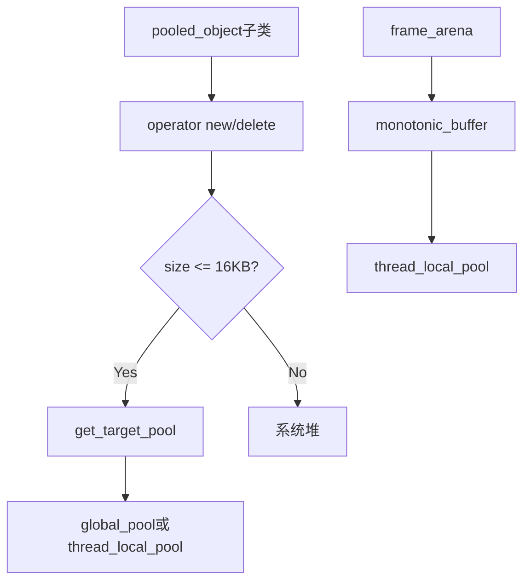

# Memory Pool

内存池系统定义，提供全局和线程局部的内存池管理。

## 源码位置

`I:/code/Prism/include/prism/memory/pool.hpp`

## 设计原则

- **热路径无分配**: 网络I/O、协议解析等高频路径避免动态分配
- **线程封闭**: 线程局部池消除多线程竞争
- **大小分类**: 小对象池化(≤16KB)，大对象直通系统堆

## 内存策略

```cpp
struct policy {
    static constexpr std::size_t max_blocks = 256;        // 每Chunk最大块数
    static constexpr std::size_t max_pool_size = 16384;   // 最大池化阈值(16KB)
};
```

针对代理服务器典型负载优化，16KB足以覆盖HTTP Header等典型对象。

## 全局内存系统

```cpp
class system {
public:
    // 全局线程安全池 - 跨线程传递对象
    static synchronized_pool *global_pool();
    
    // 线程局部无锁池 - 单线程热路径
    static unsynchronized_pool *thread_local_pool();
    
    // 热路径池(语义别名)
    static unsynchronized_pool *hot_path_pool();
    
    // 启用全局池化策略
    static void enable_global_pooling();
};
```

### global_pool

使用 `new` 分配，确保在静态析构阶段后仍可用。适用于：
- 跨线程传递的对象
- 生命周期不确定的长期对象

### thread_local_pool

使用 `thread_local` 存储，每个线程独立实例。适用于：
- 临时计算
- 单线程处理逻辑

### hot_path_pool

与 `thread_local_pool()` 相同，语义化别名。分配的对象生命周期必须与当前线程绑定。

## 池类型枚举

```cpp
enum class pool_type {
    global,  // 全局线程安全池
    local,   // 线程局部无锁池
};
```

## 对象池基类

```cpp
template <typename T, pool_type Type = pool_type::local>
class pooled_object {
public:
    static resource_pointer get_target_pool();
    void *operator new(std::size_t count);
    void operator delete(void *ptr, std::size_t count);
    void *operator new[](std::size_t count);
    void operator delete[](void *ptr, std::size_t count);
};
```

通过 CRTP 惯用法，继承类自动使用内存池分配：
- 小对象(≤16KB): 从目标池分配
- 大对象: 直通系统堆

**默认使用 `pool_type::local` 消除多线程竞争，跨线程传递需显式指定 `pool_type::global`。**

## 帧分配器

```cpp
class frame_arena {
    std::byte buffer_[512];           // 栈缓冲区
    monotonic_buffer resource_;       // 单调增长资源
    
public:
    frame_arena();
    resource_pointer get();
    void reset();
    
    // 禁止拷贝和赋值
    frame_arena(const frame_arena &) = delete;
    frame_arena &operator=(const frame_arena &) = delete;
};
```

栈缓冲区覆盖典型 mux 地址头，避免解析时穿透到上游池。适用于短生命周期、高频分配场景。

## 调用链



## 使用示例

```cpp
// 继承pooled_object自动使用内存池
class Session : public pooled_object<Session> { ... };

// 跨线程对象使用全局池
class SharedConfig : public pooled_object<SharedConfig, pool_type::global> { ... };

// 帧分配器用于临时计算
frame_arena arena;
memory::vector<int> temp(arena.get());
arena.reset();  // 一次性释放所有内存
```

## 相关页面

- [[core/memory/overview]] - Memory模块总览
- [[core/memory/container]] - PMR容器别名