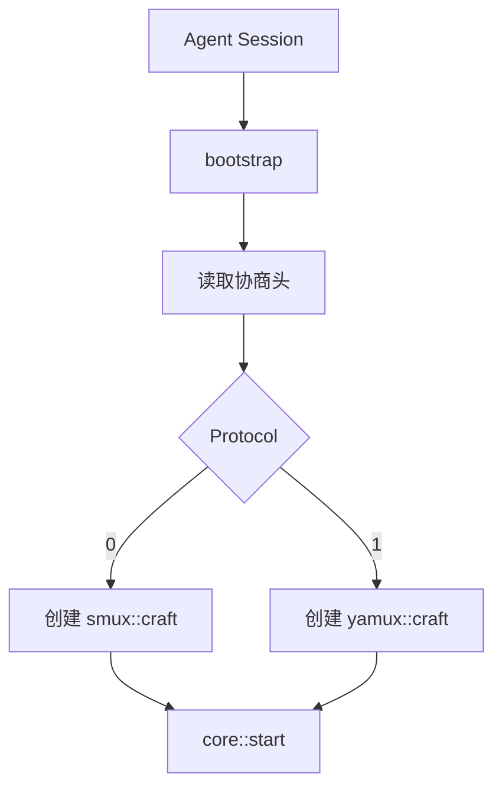

# multiplex::bootstrap - 多路复用会话引导

## 源码位置

`I:/code/Prism/include/prism/multiplex/bootstrap.hpp`

## 概述

`bootstrap` 函数是多路复用会话的统一入口，完成 sing-mux 协议协商后根据客户端选择的协议类型创建对应的 [[core/multiplex/core|core]] 子类实例。

## sing-mux 协议协商格式

### 基本格式（Version==0）

```
[Version 1B][Protocol 1B]
```

### 扩展格式（Version>0）

```
[Version 1B][Protocol 1B][PaddingLen 2B BE][Padding N bytes]
```

### Protocol 字段含义

| Protocol 值 | 协议类型 |
|-------------|----------|
| 0 | [[core/multiplex/smux/craft|smux]] |
| 1 | [[core/multiplex/yamux/craft|yamux]] |

## 函数签名

```cpp
[[nodiscard]] auto bootstrap(
    channel::transport::shared_transmission transport,
    resolve::router &router,
    const config &cfg,
    memory::resource_pointer mr = memory::current_resource()
) -> net::awaitable<std::shared_ptr<core>>;
```

## 参数说明

| 参数 | 类型 | 说明 |
|------|------|------|
| transport | shared_transmission | 已建立的传输层连接 |
| router | resolve::router& | 路由器引用，用于解析地址并连接目标 |
| cfg | const config& | 多路复用配置 |
| mr | memory::resource_pointer | 内存资源，为空时使用默认资源 |

## 返回值

- 成功：mux 会话实例的共享指针（指向具体子类）
- 失败：nullptr

## 工作流程

```
bootstrap()
    ↓
读取 sing-mux 协商头 [Version][Protocol]
    ↓
根据 Protocol 选择协议
    ↓
┌────────────┬────────────┐
│ Protocol=0 │ Protocol=1 │
│   smux     │   yamux    │
└────────────┴────────────┘
    ↓            ↓
smux::craft  yamux::craft
    ↓            ↓
返回 shared_ptr<core>
```

## 调用链



## 关联文档

- [[core/multiplex/core|core]] - 多路复用核心抽象基类
- [[core/multiplex/config|config]] - 多路复用配置
- [[core/multiplex/smux/craft|smux::craft]] - smux 协议实现
- [[core/multiplex/yamux/craft|yamux::craft]] - yamux 协议实现