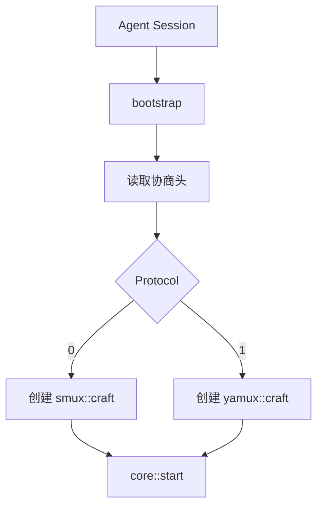

# multiplex::bootstrap - 多路复用会话引导

## 源码位置

`I:/code/Prism/include/prism/multiplex/bootstrap.hpp`

## 概述

`bootstrap` 函数是多路复用会话的统一入口，完成 sing-mux 协议协商后根据客户端选择的协议类型创建对应的 [[core/multiplex/core|core]] 子类实例。

## sing-mux 协议协商格式

### 基本格式（Version==0）

```
[Version 1B][Protocol 1B]
```

### 扩展格式（Version>0）

```
[Version 1B][Protocol 1B][PaddingLen 2B BE][Padding N bytes]
```

### Protocol 字段含义

| Protocol 值 | 协议类型 |
|-------------|----------|
| 0 | [[core/multiplex/smux/craft|smux]] |
| 1 | [[core/multiplex/yamux/craft|yamux]] |

## 函数签名

```cpp
[[nodiscard]] auto bootstrap(
    transport::shared_transmission transport,
    resolve::router &router,
    const config &cfg,
    memory::resource_pointer mr = memory::current_resource()
) -> net::awaitable<std::shared_ptr<core>>;
```

## 参数说明

| 参数 | 类型 | 说明 |
|------|------|------|
| transport | shared_transmission | 已建立的传输层连接 |
| router | resolve::router& | 路由器引用，用于解析地址并连接目标 |
| cfg | const config& | 多路复用配置 |
| mr | memory::resource_pointer | 内存资源，为空时使用默认资源 |

## 返回值

- 成功：mux 会话实例的共享指针（指向具体子类）
- 失败：nullptr

## 工作流程

```
bootstrap()
    ↓
读取 sing-mux 协商头 [Version][Protocol]
    ↓
根据 Protocol 选择协议
    ↓
┌────────────┬────────────┐
│ Protocol=0 │ Protocol=1 │
│   smux     │   yamux    │
└────────────┴────────────┘
    ↓            ↓
smux::craft  yamux::craft
    ↓            ↓
返回 shared_ptr<core>
```

## 调用链



## 关联文档

- [[core/multiplex/core|core]] - 多路复用核心抽象基类
- [[core/multiplex/config|config]] - 多路复用配置
- [[core/multiplex/smux/craft|smux::craft]] - smux 协议实现
- [[core/multiplex/yamux/craft|yamux::craft]] - yamux 协议实现

---

## 多路复用初始化流程

### 完整引导流程

```
┌──────────────────────────────────────────────────────────────┐
│                    bootstrap()                                 │
│                                                              │
│  输入: shared_transmission, router, config, memory_resource  │
│                                                              │
│  Step 1: 读取协商头                                           │
│  ┌─────────────────────────────────────────┐                │
│  │ co_await transport->async_read(2-4 B)  │                │
│  │                                         │                │
│  │ Version 1B: 协商版本                    │                │
│  │ Protocol 1B: 协议选择                  │                │
│  │ [PaddingLen 2B + Padding N bytes] 可选  │                │
│  └────────────────┬────────────────────────┘                │
│                   │                                         │
│  Step 2: 版本验证  │                                         │
│  ┌────────────────┴────────────────────────┐                │
│  │ if Version > 0:                         │                │
│  │     读取 PaddingLen (2B 大端)            │                │
│  │     读取并丢弃 Padding (PaddingLen B)    │                │
│  │                                         │                │
│  │ Version=0: 基本格式                      │                │
│  │ Version>0: 扩展格式（预留未来兼容性）     │                │
│  └────────────────┬────────────────────────┘                │
│                   │                                         │
│  Step 3: 协议选择   │                                         │
│  ┌────────────────┴────────────────────────┐                │
│  │ switch (Protocol):                      │                │
│  │     case 0 → 创建 smux::craft           │                │
│  │     case 1 → 创建 yamux::craft          │                │
│  │     default → 返回 nullptr (不支持)      │                │
│  └────────────────┬────────────────────────┘                │
│                   │                                         │
│  Step 4: 实例初始化  │                                         │
│  ┌────────────────┴────────────────────────┐                │
│  │ craft 构造函数:                         │                │
│  │   - 持有 transport                      │                │
│  │   - 绑定 router                         │                │
│  │   - 应用 config                         │                │
│  │   - 分配内存资源                        │                │
│  └────────────────┬────────────────────────┘                │
│                   │                                         │
│  Step 5: 启动会话  │                                         │
│  ┌────────────────┴────────────────────────┐                │
│  │ core->start():                          │                │
│  │   - 设置 active 标志                    │                │
│  │   - co_spawn run() 协程                 │                │
│  │   - 开始帧读取循环                      │                │
│  └────────────────┬────────────────────────┘                │
│                   │                                         │
│  输出: shared_ptr<core> 或 nullptr                           │
└──────────────────────────────────────────────────────────────┘
```

### 协商头读取详解

```cpp
auto bootstrap(
    transport::shared_transmission transport,
    resolve::router &router,
    const config &cfg,
    memory::resource_pointer mr)
    -> net::awaitable<std::shared_ptr<core>>
{
    // 固定头: Version + Protocol
    std::array<std::byte, 2> header;
    auto n = co_await transport->async_read(
        boost::asio::buffer(header));
    if (n != 2) co_return nullptr;

    auto version = static_cast<std::uint8_t>(header[0]);
    auto protocol = static_cast<std::uint8_t>(header[1]);

    // 扩展头: Padding
    if (version > 0) {
        std::array<std::byte, 2> padding_len_buf;
        n = co_await transport->async_read(
            boost::asio::buffer(padding_len_buf));
        auto padding_len = static_cast<std::uint16_t>(
            (static_cast<std::uint16_t>(padding_len_buf[0]) << 8) |
            static_cast<std::uint16_t>(padding_len_buf[1]));

        // 读取并丢弃 padding 数据
        if (padding_len > 0) {
            std::vector<std::byte> padding(padding_len);
            n = co_await transport->async_read(
                boost::asio::buffer(padding));
        }
    }

    // 根据 protocol 创建对应实例
    // ...
}
```

**Padding 用途**: 对齐协商头到特定字节边界，避免流量分析识别 mux 协议。

## smux/yamux 选择逻辑

### 协议对比

| 特性 | smux (Protocol=0) | yamux (Protocol=1) |
|------|-------------------|-------------------|
| 来源 | xtaci/smux v1 + sing-mux | Hashicorp/yamux |
| 帧大小 | 固定头部 12 字节 | 固定头部 12 字节 |
| 流控 | 窗口通告机制 | 增量窗口更新 |
| 心跳 | Keepalive 间隔 | Ping/Pong 机制 |
| 最大流数 | 配置限定 | 配置限定 |
| UDP 支持 | 是 (via sing-mux) | 是 (via sing-mux) |
| 性能 | 低延迟，适合小帧 | 高吞吐，适合大帧 |

### 选择决策树

```
客户端发送 sing-mux 协商头
    ↓
读取 Protocol 字段
    ↓
    ├── Protocol == 0 → smux
    │     适用场景:
    │     - 延迟敏感型应用
    │     - 小数据包频繁传输
    │     - 与 sing-box 生态兼容
    │
    └── Protocol == 1 → yamux
          适用场景:
          - 吞吐敏感型应用
          - 大数据块传输
          - 需要精确流量控制
```

### 选择影响因素

1. **客户端决定**: 服务端不主动选择，由客户端在协商头中指定
2. **配置无关**: `multiplex::config` 中的 `smux` 和 `yamux` 子配置仅用于已选定协议的行为参数
3. **运行时绑定**: 一旦选定，整个会话生命周期内不可切换

### 兼容性说明

```
sing-mux 协商协议版本:
  Version=0: 最小协商头 [Version][Protocol]
  Version=1: 扩展协商头 [Version][Protocol][PaddingLen][Padding]

向后兼容:
  - Version=0 的客户端可以被 Version>0 的服务端正确解析
  - Version>0 的客户端向 Version=0 服务端发送 padding 时
    服务端可能将 padding 误认为协议数据（不兼容）
```

## 错误处理

| 错误场景 | 返回值 | 说明 |
|----------|--------|------|
| 读取协商头失败 | `nullptr` | 传输层关闭或超时 |
| 不支持的 Protocol | `nullptr` | 返回值指示客户端 |
| craft 构造失败 | `nullptr` | 内存分配失败 |
| core->start() 失败 | 异常传播 | 调用方捕获处理 |