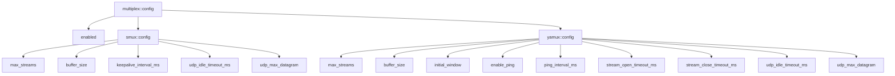

# multiplex::config - 多路复用通用配置

## 源码位置

`I:/code/Prism/include/prism/multiplex/config.hpp`

## 概述

`multiplex::config` 定义多路复用层的协议选择和全局开关。各协议的完整配置参数分别定义在对应子目录的 config.hpp 中。

## 配置结构

```cpp
struct config
{
    bool enabled = false;  // 是否启用多路复用服务端

    smux::config smux;    // smux 协议配置
    yamux::config yamux;  // yamux 协议配置
};
```

## 协议类型枚举

```cpp
enum class protocol_type : std::uint8_t
{
    smux = 0,  // xtaci/smux v1 + sing-mux 协商
    yamux = 1  // Hashicorp/yamux + sing-mux 协商
};
```

协议类型由 sing-mux 协商动态决定，无需在配置中预设。

## 配置层级



## 子配置引用

| 子配置 | 文档 |
|--------|------|
| smux::config | [[core/multiplex/smux/config|smux::config]] |
| yamux::config | [[core/multiplex/yamux/config|yamux::config]] |

## 配置加载

配置由 agent 配置统一加载，通过 [[core/multiplex/bootstrap|bootstrap]] 传递给具体的 mux 会话。

## 关联文档

- [[core/multiplex/bootstrap|bootstrap]] - 多路复用会话引导
- [[core/multiplex/core|core]] - 多路复用核心抽象基类
- [[core/multiplex/smux/config|smux::config]] - smux 协议配置
- [[core/multiplex/yamux/config|yamux::config]] - yamux 协议配置